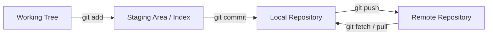
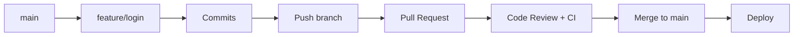
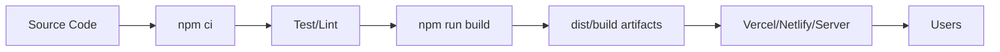
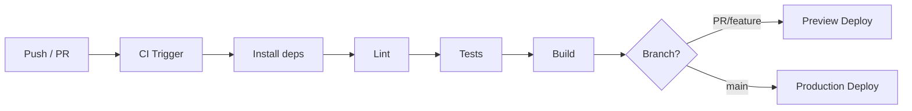
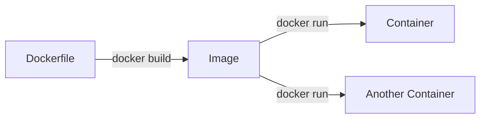
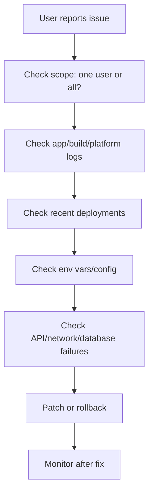

# Git / Deployment / DevOps Basics Interview Cheat Sheet

For a 2-3 year Software Developer / Full-Stack Developer interview. This is practical developer-level prep, not a DevOps engineer guide.

## 1. Priority Map

| Level | Topics |
| --- | --- |
| MUST KNOW | Git basics, staging/commits/remotes, fetch vs pull, merge vs rebase, reset vs revert, conflicts, PR workflow, env vars, secrets, frontend build, deployment flow, CI/CD basics, GitHub Actions basics, Docker image/container, logs/debugging |
| SHOULD KNOW | cherry-pick, stash, branch strategy, preview deployments, rollback basics, Docker Compose, build-time vs runtime config, deployment troubleshooting |
| BASIC | HEAD, `.gitignore`, custom domains, Docker networking, HEAD/remote/origin terminology, Netlify/Vercel differences |

## 2. Git in One Picture



**Interview answer:** "Git tracks snapshots. I edit files in the working tree, stage selected changes, commit them locally, then push commits to a remote like GitHub."

## 3. What Is Git?

**MUST KNOW**

**Definition:** Git is a distributed version control system for tracking source code history.

**Why used:** It lets teams collaborate, branch safely, review changes, and recover previous versions.

**Interview-ready answer:** "Git stores project history as commits. Each developer has a local repository and syncs changes with a remote repository."

```bash
git status
git log --oneline
```

**Trap:** Git is not GitHub. Git is the tool; GitHub hosts repositories and collaboration features.

## 4. Git vs GitHub

**MUST KNOW**

| Git | GitHub |
| --- | --- |
| Version control tool | Cloud platform for Git repositories |
| Runs locally | Hosted remote collaboration |
| Commits, branches, merges | Pull requests, issues, reviews, Actions |
| Can work offline | Needs network for remote operations |

**Example:** You use Git commands locally, then push to GitHub.

```bash
git commit -m "Add login form"
git push origin feature/login
```

**Trap:** Saying "I committed to GitHub" is imprecise. You commit locally, then push to GitHub.

## 5. Working Tree, Staging Area, Repository

**MUST KNOW**

**Definition:** The working tree contains files you edit. The staging area holds the next commit's selected changes. The repository stores committed history.

**Why used:** Staging lets you commit only related changes.

```bash
git status
git add src/Login.tsx
git commit -m "Add login component"
```

**Interview-ready answer:** "Git has three practical states: modified, staged, and committed. `git add` stages changes; `git commit` stores staged changes as a snapshot."

**Trap:** `git commit` does not automatically include every modified file unless already staged.

## 6. Everyday Git Commands

**MUST KNOW**

| Command | Use |
| --- | --- |
| `git clone <url>` | Copy remote repo locally |
| `git status` | Show changed/staged files and branch status |
| `git add <file>` | Stage file changes |
| `git commit -m "msg"` | Create local commit |
| `git push` | Upload local commits to remote |
| `git branch` | List/create branches |
| `git switch <branch>` | Switch branches |
| `git checkout <branch>` | Older/common switch command |

```bash
git clone https://github.com/org/app.git
git switch -c feature/cart
git add .
git commit -m "Add cart summary"
git push -u origin feature/cart
```

**Trap:** `git add .` may stage unrelated files. Check `git status` first.

## 7. Remote / Origin

**BASIC**

**Definition:** A remote is a named reference to another repository. `origin` is the default remote name created by `git clone`.

**Why used:** It lets you push/pull/fetch from shared repositories.

```bash
git remote -v
git push origin main
git fetch origin
```

**Interview-ready answer:** "`origin` usually points to the main remote repository, often on GitHub."

**Trap:** `origin` is just a name, not a special server.

## 8. Fetch vs Pull

**MUST KNOW**

| `git fetch` | `git pull` |
| --- | --- |
| Downloads remote changes | Fetches and integrates changes |
| Does not change current branch files | May merge/rebase into current branch |
| Safer for inspection | Convenient for updating |

```bash
git fetch origin
git log --oneline main..origin/main

git pull
```

**Interview-ready answer:** "`fetch` only downloads remote refs. `pull` is fetch plus merge or rebase into the current branch."

**Trap:** Pull can create merge commits or conflicts; fetch lets you inspect first.

## 9. Merge vs Rebase

**MUST KNOW**

| Merge | Rebase |
| --- | --- |
| Combines histories with a merge commit | Replays commits on top of another base |
| Preserves true branch history | Creates linear history |
| Safe for shared branches | Avoid rebasing public/shared commits |
| Good for PR merge commits | Good for updating local feature branch |

```bash
git switch feature/cart
git merge main

git switch feature/cart
git rebase main
```

**Interview-ready answer:** "Merge preserves history and creates a merge commit. Rebase rewrites my branch commits on top of the latest base for a cleaner linear history."

**Trap:** Do not rebase commits that others are already using unless the team agrees.

## 10. Branch, Switch, Checkout

**MUST KNOW**

**Definition:** A branch is a movable pointer to commits. `switch` changes branches; `checkout` is older and can also restore files.

**Why used:** Branches isolate feature work.

```bash
git branch
git switch -c feature/profile
git switch main
```

**Interview-ready answer:** "I create a feature branch from the latest main, commit work there, push it, and open a PR."

**Trap:** Starting a branch from outdated `main` causes avoidable conflicts.

## 11. Git Branch / PR Flow



**Interview answer:** "A typical team flow is feature branch, PR, review, CI checks, merge to main, then deploy."

## 12. Merge Conflict Resolution

**MUST KNOW**

**Definition:** A merge conflict happens when Git cannot automatically combine changes.

**Why used:** You must manually choose the correct final code.

```bash
git status
# open conflicted files and fix <<<<<<< ======= >>>>>>>
git add src/App.tsx
git commit
```

**Interview-ready answer:** "I inspect conflicted files, keep the correct combined changes, run tests, stage resolved files, then continue the merge or rebase."

```bash
git merge --abort
git rebase --abort
```

**Trap:** Do not blindly choose "ours" or "theirs" without understanding the code.

## 13. Stash

**SHOULD KNOW**

**Definition:** `git stash` temporarily shelves uncommitted changes.

**Why used:** Useful when switching branches or pulling urgent fixes without committing unfinished work.

```bash
git stash push -m "WIP login form"
git switch main
git stash list
git stash pop
```

**Interview-ready answer:** "I use stash for temporary local work, not as a long-term storage system."

**Trap:** `stash pop` applies and removes the stash; conflicts can happen.

## 14. Reset vs Revert

**MUST KNOW**

| `git reset` | `git revert` |
| --- | --- |
| Moves branch pointer/history | Creates a new commit that undoes changes |
| Can rewrite history | Does not rewrite history |
| Good for local/private cleanup | Good for shared/public branches |
| Risky with pushed commits | Safer for team history |

```bash
git reset --soft HEAD~1
git reset --mixed HEAD~1
git reset --hard HEAD~1

git revert abc123
```

**Interview-ready answer:** "`reset` changes where my branch points, so I use it mostly before pushing. `revert` adds a new undo commit, so it is safer after pushing."

**Trap:** `reset --hard` discards working tree changes.

## 15. Undo and Recovery Scenarios

**MUST KNOW**

| Situation | Command |
| --- | --- |
| Undo last local commit but keep changes staged | `git reset --soft HEAD~1` |
| Undo last local commit and unstage changes | `git reset HEAD~1` |
| Undo pushed commit safely | `git revert <commit>` |
| Restore file from last commit | `git restore <file>` |
| Recover lost commit | `git reflog` then inspect/reset/cherry-pick |

```bash
git reset --soft HEAD~1
git revert HEAD
git reflog
```

**Trap:** If the commit is already pushed and shared, prefer `revert`.

## 16. Cherry-Pick Basics

**SHOULD KNOW**

**Definition:** `git cherry-pick` applies changes from a specific commit onto the current branch.

**Why used:** Useful for moving a hotfix or one selected commit without merging the whole branch.

```bash
git switch release
git cherry-pick abc123
```

**Interview-ready answer:** "Cherry-pick copies a commit's changes onto another branch as a new commit."

**Trap:** Cherry-picking many commits can create messy duplicated history.

## 17. HEAD and `.gitignore`

**BASIC**

**Definition:** `HEAD` points to the current checked-out commit or branch. `.gitignore` tells Git which untracked files to ignore.

```gitignore
node_modules/
.env
dist/
coverage/
```

```bash
git rev-parse --short HEAD
```

**Interview-ready answer:** "`HEAD` is where I currently am in history. `.gitignore` prevents generated files, dependencies, and secrets from being tracked."

**Trap:** `.gitignore` does not stop tracking a file already committed; remove it from the index first.

```bash
git rm --cached .env
```

## 18. Branch Strategies, Feature Branches, PRs

**MUST KNOW**

**Definition:** A branch strategy defines how teams organize work and releases.

**Why used:** It reduces conflicts and makes releases/reviews predictable.

| Strategy | Practical use |
| --- | --- |
| Feature branches | Common for small/medium teams |
| Trunk-based | Short-lived branches, frequent merge to main |
| GitFlow | More release structure; often heavier |

**Interview-ready answer:** "For a typical product team, I use short-lived feature branches from main, PR reviews, CI checks, and merge after approval."

**Before PR checklist:**

- Pull/fetch latest main and resolve conflicts.
- Run tests/lint/build.
- Review own diff.
- Keep PR small and focused.
- Add clear description/screenshots if UI.

**Trap:** Large long-lived branches create painful conflicts.

## 19. Code Review

**MUST KNOW**

**Definition:** Code review is team review of proposed changes before merge.

**Why used:** It catches bugs, improves maintainability, and spreads context.

**Interview-ready answer:** "In PRs, I explain the change, keep diffs focused, respond to comments, and ensure CI passes before merge."

**Trap:** Treating review as personal criticism instead of quality control.

## 20. Common Git Mistakes

**MUST KNOW**

| Mistake | Better approach |
| --- | --- |
| Commit secrets | Remove, rotate secret, add `.gitignore` |
| Work directly on main | Use feature branches |
| Force push shared branch | Coordinate or avoid |
| Pull without checking local changes | `git status` first |
| Huge PRs | Small focused PRs |
| Bad commit messages | Explain what/why |
| Resolve conflicts blindly | Understand both changes |
| Rebase public history | Rebase local/private only |

## 21. Environment Variables / Configuration

**MUST KNOW**

**Definition:** Environment variables are key-value config values provided outside source code.

**Why used:** They separate code from environment-specific settings like API URLs, modes, and secrets.

```env
API_URL=https://api.example.com
DATABASE_URL=postgres://...
JWT_SECRET=super-secret
```

**Interview-ready answer:** "I use environment variables for configuration that changes between dev, preview, and production. Secrets should never be committed."

**Trap:** Frontend environment variables bundled into client code are visible to users unless handled server-side.

## 22. Development vs Production Environment

**MUST KNOW**

| Development | Production |
| --- | --- |
| Local machine | Live user-facing environment |
| Debug logs allowed | Safe structured logs |
| Test/local APIs | Real services |
| `.env.local` often used | Platform secrets/config |
| Fast feedback | Stability and security |

**Interview-ready answer:** "Development is optimized for local feedback. Production is optimized for reliability, security, and real user traffic."

**Trap:** Using production secrets in local development increases blast radius.

## 23. `.env`, Frontend Vars, Backend Secrets

**MUST KNOW**

**Definition:** `.env` files store local environment variables. Backend secrets must stay on the server. Frontend variables may be exposed in built assets depending on the framework.

```env
# frontend, public by design in many frameworks if exposed
VITE_API_URL=https://api.example.com

# backend only
DATABASE_PASSWORD=secret
STRIPE_SECRET_KEY=sk_live_...
```

**Interview-ready answer:** "I commit `.env.example`, not `.env`. Public frontend config is okay, but backend secrets must be stored in deployment platform secrets or secret managers."

**Trap:** Prefixes like `VITE_`, `NEXT_PUBLIC_`, or `REACT_APP_` usually mean the value can end up in browser code.

## 24. Build-Time vs Runtime Configuration

**SHOULD KNOW**

| Build-time config | Runtime config |
| --- | --- |
| Read while creating build artifacts | Read when app/server runs |
| Common in static frontend builds | Common in backend/container apps |
| Changing it needs rebuild/redeploy | Can change without rebuilding image in many setups |

**Interview-ready answer:** "Frontend static builds often bake variables at build time. Backend apps usually read environment variables at runtime."

**Trap:** Changing a Vercel/Netlify env var usually affects new deployments, not old already-built deployments.

## 25. Frontend Build

**MUST KNOW**

**Definition:** A frontend build compiles/transpiles, bundles, minifies, and outputs deployable static assets.

**Why used:** Production builds are optimized for browser delivery.

```bash
npm run build
```

```text
src/ -> build tool -> dist/ or build/
```

**Interview-ready answer:** "A build converts source code into optimized assets like HTML, JS, CSS, images, and sometimes serverless functions depending on the framework."

**Trap:** Dev server output is not the same as a production build.

## 26. npm install vs npm ci

**MUST KNOW**

| `npm install` | `npm ci` |
| --- | --- |
| Local development | CI/deployment |
| Can update lockfile | Requires lockfile in sync |
| Can install individual packages | Installs whole project |
| May modify package files | Does not write package files |
| Uses existing `node_modules` | Removes `node_modules` first |

```bash
npm install
npm ci
```

**Interview-ready answer:** "`npm ci` is preferred in CI because it gives clean, reproducible installs from the lockfile."

**Trap:** `npm ci` fails if `package.json` and lockfile do not match.

## 27. Build Artifacts and Deployment Flow

**MUST KNOW**

**Definition:** Build artifacts are generated files deployed to hosting, such as `dist/`, `build/`, or container images.



**Interview-ready answer:** "Deployment usually installs dependencies, runs checks, builds artifacts, uploads them, sets environment variables, and serves the new version."

**Trap:** A build can pass locally but fail in deployment because env vars, Node version, or case-sensitive paths differ.

## 28. Vercel and Netlify

**MUST KNOW**

**Definition:** Vercel and Netlify are hosting platforms commonly used for frontend apps, static sites, serverless functions, preview deployments, and production deployments.

**Why used:** They connect to Git, build on push/PR, provide preview URLs, env vars, domains, logs, and rollback/deploy management.

```bash
vercel
vercel --prod

netlify deploy
netlify deploy --prod
```

**Interview-ready answer:** "They automate frontend deployment. A PR gets a preview deployment, and merging to the production branch creates a production deployment."

**Trap:** Preview and production may use different environment variables.

## 29. Vercel / Netlify Practical Concepts

**MUST KNOW**

| Concept | Meaning |
| --- | --- |
| Build command | Command like `npm run build` |
| Output directory | Folder like `dist` or `build` |
| Preview deployment | Temporary/live URL for PR or branch testing |
| Production deployment | Live user-facing deployment |
| Custom domain | Domain pointed to deployment platform |
| Deployment logs | Build/runtime output used for debugging |

```text
Build command: npm run build
Output directory: dist
Production branch: main
```

**Common failures:** Missing env var, wrong output directory, build script missing, dependency lockfile issue, Node version mismatch, case-sensitive import path, API URL wrong.

**Trap:** "Works locally" does not prove it will deploy; deployment environment may be different.

## 30. CI/CD Basics

**MUST KNOW**

| CI | CD |
| --- | --- |
| Continuous Integration | Continuous Delivery/Deployment |
| Runs checks on changes | Ships changes to environments |
| Build, test, lint | Deploy preview/staging/prod |
| Protects code quality | Automates release flow |

**Definition:** CI/CD automates build, test, and deployment steps.

**Interview-ready answer:** "CI checks every PR or push with build/test/lint. CD deploys approved changes to preview, staging, or production."

**Trap:** CI passing does not guarantee production is healthy; deployment monitoring still matters.

## 31. CI/CD Pipeline



## 32. GitHub Actions Basics

**MUST KNOW**

**Definition:** GitHub Actions automates workflows using YAML files in `.github/workflows`.

**Why used:** It runs CI/CD tasks on events like push, pull request, schedule, or manual trigger.

| Term | Meaning |
| --- | --- |
| Workflow | Whole automation file |
| Trigger | Event that starts workflow |
| Job | Group of steps on a runner |
| Step | Command or action |
| Secret | Encrypted sensitive value |

```yaml
name: CI

on:
  pull_request:
  push:
    branches: [main]

jobs:
  build:
    runs-on: ubuntu-latest
    steps:
      - uses: actions/checkout@v4
      - uses: actions/setup-node@v4
        with:
          node-version: 22
      - run: npm ci
      - run: npm test
      - run: npm run build
```

**Interview-ready answer:** "A workflow has triggers, jobs, and steps. Secrets are referenced through GitHub's secrets context instead of hardcoding them."

**Trap:** Never echo secrets in logs.

## 33. Branch-Based Deployment

**SHOULD KNOW**

**Definition:** Different branches deploy to different environments.

```text
feature/* -> preview
develop   -> staging
main      -> production
```

**Interview-ready answer:** "A common setup is PR/feature branches deploy to preview, staging branch deploys to staging, and main deploys to production."

**Trap:** Branch protection and required checks should prevent broken code from reaching production.

## 34. Docker Basics

**MUST KNOW**

**Definition:** Docker packages an app and its dependencies into an image that can run as a container.

**Why used:** It makes environments more consistent across local, CI, and production.



**Interview-ready answer:** "An image is the packaged template. A container is a running instance of that image."

**Trap:** Containers share the host OS kernel; they are not full virtual machines.

## 35. Docker Image vs Container

**MUST KNOW**

| Image | Container |
| --- | --- |
| Blueprint/package | Running instance |
| Immutable-ish build output | Has runtime state |
| Created with `docker build` | Created with `docker run` |
| Can be pushed to registry | Can be started/stopped/removed |

```bash
docker build -t my-app .
docker run -p 8080:8080 my-app
```

**Trap:** Rebuilding an image does not automatically update already-running containers.

## 36. Dockerfile and Commands

**MUST KNOW**

**Definition:** A Dockerfile contains instructions to build an image.

```dockerfile
FROM node:22-alpine
WORKDIR /app
COPY package*.json ./
RUN npm ci
COPY . .
RUN npm run build
CMD ["npm", "start"]
```

```bash
docker build -t web-app .
docker run -p 3000:3000 --env API_URL=https://api.example.com web-app
docker ps
docker stop <container_id>
```

**Interview-ready answer:** "Dockerfile defines the image. `docker build` builds it, `docker run` starts a container, `docker ps` lists running containers, and `docker stop` stops one."

**Trap:** `EXPOSE` documents a port; `-p host:container` publishes it.

## 37. Docker Ports, Env Vars, Networking, Compose

**SHOULD KNOW**

**Definition:** Ports expose container services; env vars configure containers; Docker networking lets containers communicate; Compose runs multi-container apps.

```bash
docker run -p 8080:80 -e NODE_ENV=production nginx
```

```yaml
services:
  api:
    build: .
    ports:
      - "8080:8080"
    environment:
      DATABASE_URL: postgres://postgres:postgres@db:5432/app
  db:
    image: postgres:16
```

**Interview-ready answer:** "Compose is useful when an app needs multiple services locally, like API plus database."

**Trap:** Inside a Compose network, services talk by service name, not `localhost`.

## 38. Container vs VM

**BASIC**

| Container | Virtual Machine |
| --- | --- |
| Shares host OS kernel | Has full guest OS |
| Lightweight and fast startup | Heavier |
| Packages app dependencies | Emulates full machine |
| Good for app deployment | Good for full OS isolation |

**Interview-ready answer:** "Containers are lighter than VMs because they share the host kernel. VMs include a full guest OS."

## 39. Logs and Production Debugging

**MUST KNOW**

**Definition:** Production debugging is the process of using logs, metrics, deploy history, and configuration checks to identify failures.



**Interview-ready answer:** "I check logs, reproduce if possible, inspect recent deployments, verify env vars, check API/database errors, and rollback if the latest deployment caused the issue."

**Trap:** Do not debug production by guessing; use logs and recent changes.

## 40. Deployment Troubleshooting

**MUST KNOW**

| Symptom | Check |
| --- | --- |
| Build fails | Build logs, Node version, dependency lockfile |
| Blank frontend page | Console errors, asset paths, routing config |
| API calls fail | API URL env var, CORS, auth token, network tab |
| Works locally only | Env differences, case-sensitive paths, build command |
| Database connection fails | Secret value, network access, connection string |
| 500 after deploy | Runtime logs, recent code/config changes |
| Old behavior still visible | CDN/cache, wrong deployment, stale browser cache |

**Rollback basics:** Redeploy previous successful deployment or revert the bad commit and redeploy.

**Trap:** Env var changes often require a new deployment/build to take effect on frontend platforms.

## 41. Most-Asked Git Interview Questions

### A. `git pull` vs `git fetch`?

`fetch` downloads remote changes without modifying your current branch. `pull` fetches and then merges or rebases.

### B. Merge vs rebase?

Merge preserves branch history with a merge commit. Rebase replays commits for linear history and rewrites local branch history.

### C. Reset vs revert?

Reset moves history and is best for local/private commits. Revert creates a new undo commit and is safer for pushed commits.

### D. How resolve a merge conflict?

Open conflicted files, choose/combine correct changes, run tests, `git add` resolved files, then continue merge/rebase.

### E. What happens when you commit?

Git stores a snapshot of staged changes as a new commit in the local repository.

### F. How undo last commit?

If local: `git reset --soft HEAD~1`. If pushed/shared: `git revert HEAD`.

### G. What check before PR?

`git status`, review diff, pull/fetch latest main, run tests/lint/build, ensure no secrets or unrelated files.

## 42. Most-Asked CI/CD Questions

### A. What is CI?

Continuous Integration automatically builds and tests changes, usually on PRs and pushes.

### B. What is CD?

Continuous Delivery/Deployment automates releasing changes to environments.

### C. What are workflow, job, step?

Workflow is the automation file, job is a group of steps on a runner, step is one command/action.

### D. What are secrets?

Encrypted values used by CI/deployments for tokens, API keys, and credentials.

### E. Why run tests before deploy?

To catch broken changes before users get them.

## 43. Most-Asked Docker Basics Questions

### A. What is Docker?

Docker packages apps with dependencies into images that run as containers.

### B. Image vs container?

Image is the blueprint. Container is the running instance.

### C. Dockerfile?

A file of instructions used to build an image.

### D. Why use Docker?

Consistent environments, easier local setup, repeatable deployments.

### E. Container vs VM?

Containers are lighter and share the host kernel; VMs run a full guest OS.

## 44. Team Workflow Scenarios

### A. Another developer changed the same file.

Fetch latest changes, merge/rebase your branch, resolve conflicts carefully, run tests, push updated branch.

### B. You accidentally committed `.env`.

Remove it from Git, add to `.gitignore`, rotate the leaked secret, and consider history cleanup if required by team/security.

```bash
git rm --cached .env
git commit -m "Stop tracking env file"
```

### C. Production deploy broke the site.

Check deployment logs and recent commits, rollback to previous successful deployment if needed, then fix forward with a small patch.

### D. PR has too many unrelated changes.

Split into smaller PRs or use interactive staging/new branch to separate focused changes.

### E. CI fails but local passes.

Check Node/package manager versions, env vars, lockfile, case sensitivity, missing files, and CI logs.

## 45. Common Interview Traps

| Trap | Better answer |
| --- | --- |
| Git equals GitHub | Git is VCS; GitHub hosts/collaborates |
| Pull is always safe | Pull integrates and can conflict |
| Rebase shared branches casually | Rebase local/private branches |
| Reset pushed commits | Revert shared commits |
| Commit secrets | Never commit; rotate if leaked |
| `npm install` in CI | Prefer `npm ci` |
| Frontend env vars are secret | Browser-exposed vars are public |
| CORS fixes all API auth issues | CORS is not authorization |
| Docker container is a VM | Container shares host kernel |
| Logs are optional | Logs are first-class debugging tool |

## 46. Final Rapid Revision

| Topic | One-line answer |
| --- | --- |
| Git | Distributed version control |
| GitHub | Hosted Git collaboration platform |
| Working tree | Files you edit |
| Staging | Next commit selection |
| Commit | Local snapshot |
| Push | Upload commits |
| Fetch | Download remote refs |
| Pull | Fetch + merge/rebase |
| Merge | Combine histories |
| Rebase | Replay commits on new base |
| Reset | Move branch pointer |
| Revert | New commit that undoes old commit |
| Stash | Temporary shelf for local changes |
| Origin | Default remote name |
| PR | Review before merge |
| Env var | Config outside code |
| Secret | Sensitive config, never commit |
| Build | Generate production artifacts |
| `npm ci` | Clean reproducible install |
| Preview deploy | Test PR/branch live URL |
| Production deploy | User-facing release |
| CI | Build/test/lint automation |
| CD | Automated delivery/deployment |
| Workflow | GitHub Actions YAML automation |
| Job | Steps on a runner |
| Docker image | App package/blueprint |
| Container | Running image instance |
| Compose | Multi-container local setup |
| Rollback | Return to previous good deployment |

## 47. References

- Git Book: What is Git? - https://git-scm.com/book/en/v2/Getting-Started-What-is-Git
- Git Reference - https://git-scm.com/docs
- Git Pull docs - https://git-scm.com/docs/git-pull
- Git User Manual - https://git-scm.com/docs/user-manual
- npm install docs - https://docs.npmjs.com/cli/install/
- npm ci docs - https://docs.npmjs.com/cli/v11/commands/npm-ci/
- GitHub Actions workflows - https://docs.github.com/en/actions/concepts/workflows-and-actions/workflows
- GitHub Actions workflow syntax - https://docs.github.com/en/actions/reference/workflows-and-actions/workflow-syntax
- Dockerfile reference - https://docs.docker.com/reference/dockerfile
- Dockerfile overview - https://docs.docker.com/build/concepts/dockerfile/
- Docker run docs - https://docs.docker.com/engine/containers/run/
- Docker CLI reference - https://docs.docker.com/reference/cli/docker/
- Vercel Environments - https://vercel.com/docs/deployments/environments
- Vercel Environment Variables - https://vercel.com/docs/environment-variables
- Vercel CLI deploy - https://vercel.com/docs/cli/deploy
- Netlify deploy overview - https://docs.netlify.com/deploy/deploy-overview/
- Netlify deploy previews - https://docs.netlify.com/deploy/deploy-types/deploy-previews/
- Netlify environment variables - https://docs.netlify.com/build/environment-variables/overview/
- Netlify CLI deploy command - https://cli.netlify.com/commands/deploy/
- Recent interview cross-checks: practical Git, Docker, CI/CD, and frontend deployment interview guides from 2025-2026 developer prep resources.
