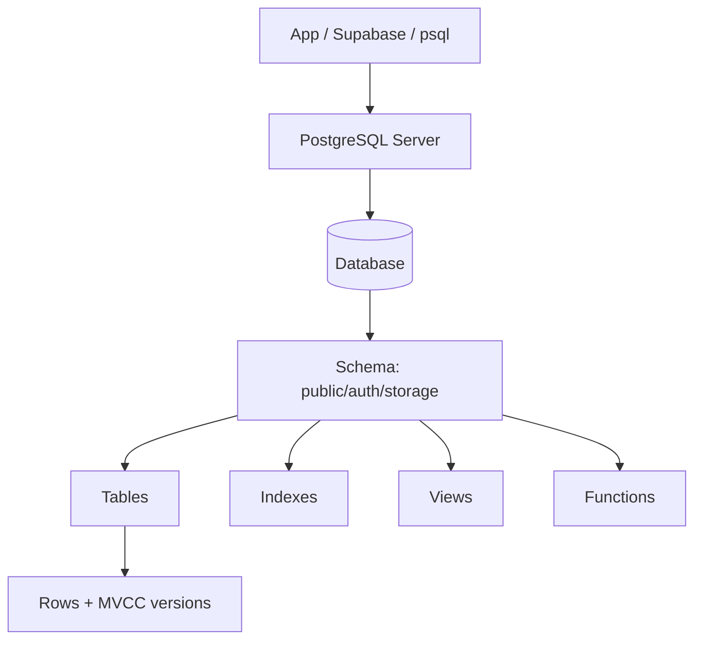
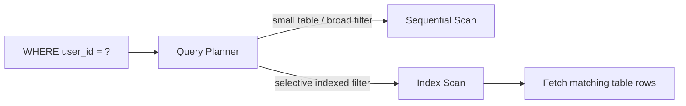
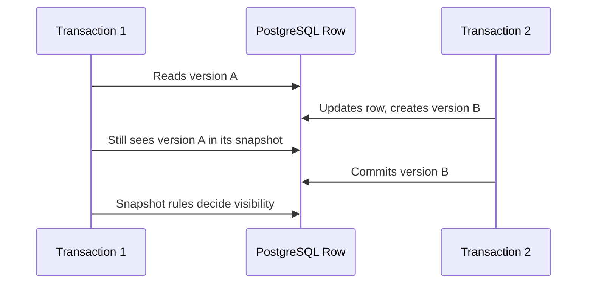
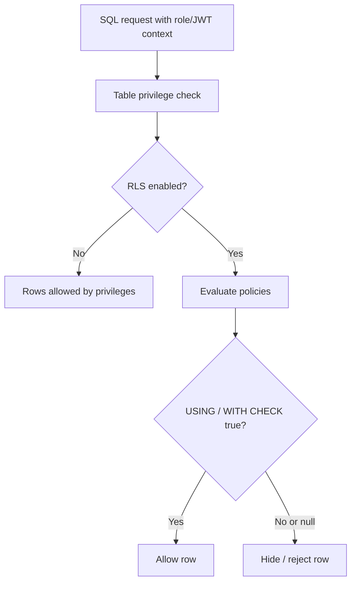

# PostgreSQL Interview Cheat Sheet

For a 2-3 year React / Full-Stack Developer interview. This sheet is PostgreSQL-specific and avoids repeating general SQL topics like joins, grouping, normalization basics, and basic transactions already covered elsewhere.

## 1. Priority Map

| Level | Topics |
| --- | --- |
| MUST KNOW | Architecture basics, database/schema/table/sequence, data types, UUID, identity columns, `text`, `timestamptz`, JSONB, `RETURNING`, `ON CONFLICT`, B-tree/GIN indexes, composite/partial indexes, `EXPLAIN ANALYZE`, MVCC, `SELECT FOR UPDATE`, constraints, roles/grants, RLS, Supabase RLS |
| SHOULD KNOW | Arrays, enums, `FILTER`, `DISTINCT ON`, `generate_series`, hash/GiST/BRIN indexes, expression indexes, isolation levels, deadlocks, cascading behavior, views/materialized views, functions/triggers |
| BASIC | Boolean/date/time types, schemas, sequences, simple PostgreSQL operators, CTEs, recursive CTE idea, PostgreSQL vs MySQL practical differences |

## 2. PostgreSQL Architecture / Basic Concepts

**MUST KNOW**

**Definition:** PostgreSQL is an open-source object-relational database. A server contains databases; each database contains schemas; schemas contain tables, views, functions, sequences, indexes, and other objects.

**Why useful:** Understanding the object hierarchy helps with Supabase, migrations, permissions, search paths, and schema design.

**Interview-ready answer:** "PostgreSQL stores data in databases and organizes objects inside schemas like `public`. A table stores rows, indexes speed lookup, sequences generate numbers, and the planner chooses how to run SQL."



```sql
create schema app;

create table app.projects (
  id bigint generated always as identity primary key,
  name text not null
);
```

**Trap:** A schema is not the same as a database. In PostgreSQL, `public` is just a schema.

**When use it?** When organizing app tables, Supabase schemas, migrations, and permissions.

## 3. Database, Schema, Table, Sequence

**BASIC**

| Object | Meaning |
| --- | --- |
| Database | Isolated data container inside a PostgreSQL server |
| Schema | Namespace inside a database |
| Table | Stores rows and columns |
| Sequence | Object that generates incrementing numbers |

**Interview-ready answer:** "A schema namespaces objects; a sequence generates values, often for integer IDs. Identity columns use sequences behind the scenes."

```sql
create schema billing;

create sequence billing.invoice_no_seq;

create table billing.invoices (
  id bigint primary key default nextval('billing.invoice_no_seq'),
  amount_cents integer not null
);
```

**Trap:** Sequence values are not gapless. Rollbacks and `ON CONFLICT` can still consume sequence numbers.

## 4. PostgreSQL Data Types

**MUST KNOW**

**Definition:** PostgreSQL has rich built-in types: numeric, text, boolean, date/time, UUID, JSON/JSONB, arrays, enums, network, range, and more.

**Why useful:** Choosing the right type improves correctness, indexing, and query performance.

**Interview-ready answer:** "I use native types instead of storing everything as text: `uuid` for UUIDs, `timestamptz` for app timestamps, `jsonb` for flexible metadata, arrays only when relational modeling is not better."

```sql
create table app_events (
  id uuid primary key default gen_random_uuid(),
  user_id uuid not null,
  event_name text not null,
  is_active boolean not null default true,
  metadata jsonb not null default '{}',
  tags text[] not null default '{}',
  created_at timestamptz not null default now()
);
```

**Trap:** Wrong type choices become hard to migrate later, especially timestamps, JSONB, and IDs.

## 5. UUID

**MUST KNOW**

**Definition:** `uuid` stores a 128-bit universally unique identifier.

**Why useful:** UUIDs are good for distributed systems, public URLs, Supabase Auth IDs, and avoiding guessable sequential IDs.

**Interview-ready answer:** "In PostgreSQL, I can use native `uuid` and generate values with `gen_random_uuid()`. In Supabase, user IDs from `auth.users.id` are UUIDs, so app tables often reference UUID user IDs."

```sql
create table profiles (
  id uuid primary key references auth.users(id) on delete cascade,
  display_name text not null,
  created_at timestamptz not null default now()
);

create table posts (
  id uuid primary key default gen_random_uuid(),
  user_id uuid not null references profiles(id),
  title text not null
);
```

**Trap:** Random UUIDs can make indexes larger and less locality-friendly than integer IDs. Use them intentionally.

**When use it?** Supabase user-linked data, public identifiers, distributed inserts, multi-service systems.

## 6. SERIAL vs GENERATED AS IDENTITY

**MUST KNOW**

| Feature | `SERIAL` | `GENERATED AS IDENTITY` |
| --- | --- | --- |
| Standard SQL | No, PostgreSQL shorthand | Yes |
| Implementation | Creates integer column + sequence default | SQL-standard identity column |
| Modern recommendation | Legacy/common | Prefer for new PostgreSQL schemas |
| Control | Sequence manually visible | Better column-level identity semantics |
| Gaps possible | Yes | Yes |

**Definition:** Both create auto-incrementing integer values backed by sequences.

**Why useful:** Interviewers often check if you know `SERIAL` is older shorthand and identity is the modern choice.

**Interview-ready answer:** "`SERIAL` is a PostgreSQL convenience shorthand. For new schemas, I prefer `generated always/by default as identity` because it is SQL-standard and clearer."

```sql
create table old_style (
  id serial primary key,
  name text not null
);

create table new_style (
  id bigint generated always as identity primary key,
  name text not null
);
```

**Trap:** Auto-increment IDs are not gapless and should not be used as invoice numbers if gaps are illegal.

## 7. UUID vs Integer ID

**MUST KNOW**

| Choice | Pros | Cons |
| --- | --- | --- |
| Integer/identity | Small, fast indexes, readable | Guessable, database-local generation |
| UUID | Globally unique, good public IDs, Supabase Auth compatible | Larger indexes, less human-readable |

```sql
create table teams (
  id uuid primary key default gen_random_uuid(),
  name text not null
);
```

**Interview-ready answer:** "I use integer IDs for internal high-write tables when simple and UUIDs for public IDs, distributed systems, and Supabase Auth-related tables."

**Trap:** UUID does not replace access control. You still need permissions/RLS.

## 8. TEXT vs VARCHAR

**MUST KNOW**

| Type | Meaning | Practical choice |
| --- | --- | --- |
| `text` | Unlimited variable-length string | Default choice in PostgreSQL |
| `varchar(n)` | Variable-length string with max length | Use when length is a real rule |
| `char(n)` | Fixed-length padded string | Rare in app schemas |

**Definition:** `text` and unlimited `varchar` behave similarly in PostgreSQL.

**Why useful:** PostgreSQL developers commonly prefer `text` unless a constraint is meaningful.

**Interview-ready answer:** "I use `text` by default. If the business rule requires max length, I add `varchar(n)` or a `check` constraint."

```sql
create table users (
  id uuid primary key default gen_random_uuid(),
  name text not null,
  country_code varchar(2) not null,
  check (length(country_code) = 2)
);
```

**Trap:** Choosing `varchar(255)` out of habit from older MySQL patterns.

## 9. BOOLEAN

**BASIC**

**Definition:** `boolean` stores `true`, `false`, or `null` if nullable.

**Why useful:** Clearer than using `0/1` or text flags.

**Interview-ready answer:** "I use `boolean not null default false` when the field should always be true/false."

```sql
create table todos (
  id uuid primary key default gen_random_uuid(),
  title text not null,
  completed boolean not null default false
);
```

**Trap:** Nullable booleans create three states: true, false, unknown.

## 10. TIMESTAMP / TIMESTAMPTZ

**MUST KNOW**

**Definition:** `timestamp` stores date-time without time zone. `timestamptz` stores an absolute instant and displays it in the session time zone.

**Why useful:** Most apps need correct global time handling.

**Interview-ready answer:** "For app events like `created_at`, I use `timestamptz not null default now()`. It avoids ambiguity across user time zones."

```sql
create table audit_logs (
  id uuid primary key default gen_random_uuid(),
  action text not null,
  created_at timestamptz not null default now()
);
```

**Trap:** `timestamptz` does not store the original timezone label; it stores the instant.

**When use it?** Audit logs, created/updated timestamps, scheduled events stored as instants.

## 11. DATE / TIME

**BASIC**

**Definition:** `date` stores a calendar date. `time` stores time of day without a date.

**Why useful:** Use them when you do not need a full timestamp.

**Interview-ready answer:** "I use `date` for birthdays or due dates, and `timestamptz` for real events that happen at a moment in time."

```sql
create table employee_profiles (
  id uuid primary key default gen_random_uuid(),
  birth_date date,
  daily_standup_time time
);
```

**Trap:** Storing deadlines as `date` when exact timezone-aware time matters.

## 12. JSON vs JSONB

**MUST KNOW**

| Feature | `json` | `jsonb` |
| --- | --- | --- |
| Storage | Text JSON | Binary/decomposed format |
| Preserves whitespace/key order | Yes | No |
| Operators/indexing | Limited | Rich operators + GIN indexing |
| Read/query performance | Usually worse | Usually better |
| Common app choice | Rare | Preferred |

**Definition:** `json` stores exact JSON text; `jsonb` stores parsed binary JSON.

**Why useful:** JSONB is useful for flexible metadata while still allowing queries and indexes.

**Interview-ready answer:** "In PostgreSQL apps I usually choose `jsonb` because it supports efficient querying, containment operators, and GIN indexes. I use relational columns for frequently filtered important fields."

```sql
create table events (
  id uuid primary key default gen_random_uuid(),
  name text not null,
  properties jsonb not null default '{}'
);

select *
from events
where properties @> '{"plan": "pro"}';
```

**Trap:** Using JSONB for everything. Important searchable fields often belong in normal columns.

## 13. JSONB vs Relational Columns

**MUST KNOW**

| Use JSONB | Use relational columns |
| --- | --- |
| Flexible metadata | Core business fields |
| Sparse optional attributes | Frequently filtered/sorted fields |
| Event payloads | Foreign keys and relationships |
| Provider-specific data | Data needing constraints |

```sql
create table subscriptions (
  id uuid primary key default gen_random_uuid(),
  user_id uuid not null,
  plan text not null,
  provider_payload jsonb not null default '{}'
);
```

**Interview-ready answer:** "JSONB is for flexibility, not for avoiding schema design."

**Trap:** You cannot enforce relational integrity inside arbitrary JSONB as cleanly as normal columns.

## 14. JSONB Operators and Common Queries

**MUST KNOW**

**Definition:** PostgreSQL has operators for JSON extraction, containment, key existence, and JSON path queries.

**Why useful:** React/Supabase apps often store settings, metadata, event payloads, and external API payloads in JSONB.

**Interview-ready answer:** "I use `->` for JSON, `->>` for text extraction, `@>` for containment, and `?` for key existence. For performance, I add a GIN index or expression index based on query patterns."

```sql
select
  id,
  metadata ->> 'browser' as browser
from app_events
where metadata @> '{"source": "web"}'
  and metadata ? 'browser';

create index app_events_metadata_gin
on app_events using gin (metadata);

create index app_events_browser_idx
on app_events ((metadata ->> 'browser'));
```

**Trap:** `->` returns JSON/JSONB; `->>` returns text. Comparing the wrong type causes awkward bugs.

## 15. ARRAY Basics

**SHOULD KNOW**

**Definition:** PostgreSQL arrays store multiple values of the same type in one column.

**Why useful:** Useful for small lists like tags, flags, or cached values where full normalization is unnecessary.

**Interview-ready answer:** "Arrays are convenient for small simple lists, but if each item needs relationships, permissions, or frequent joins, I use a separate table."

```sql
create table articles (
  id uuid primary key default gen_random_uuid(),
  title text not null,
  tags text[] not null default '{}'
);

select *
from articles
where tags @> array['postgresql'];
```

**Trap:** Arrays can hide many-to-many relationships that should be modeled with a join table.

## 16. ENUM Basics

**SHOULD KNOW**

**Definition:** PostgreSQL enums define a fixed ordered set of values.

**Why useful:** They prevent invalid status values at the database level.

**Interview-ready answer:** "Enums are good for stable sets like order status. If values change often or need metadata, I prefer a lookup table."

```sql
create type order_status as enum ('pending', 'paid', 'cancelled');

create table orders (
  id uuid primary key default gen_random_uuid(),
  status order_status not null default 'pending'
);
```

**Trap:** Changing enum values in production is more rigid than changing rows in a lookup table.

## 17. RETURNING

**MUST KNOW - PostgreSQL-specific**

**Definition:** `RETURNING` returns rows from `insert`, `update`, `delete`, and `merge`.

**Why useful:** Avoids an extra query to fetch generated IDs/defaults or updated rows.

**Interview-ready answer:** "`RETURNING` is a PostgreSQL feature I use after inserts/updates to get the affected row immediately."

```sql
insert into todos (title)
values ('Revise PostgreSQL')
returning id, title, created_at;

update todos
set completed = true
where id = '...'
returning *;
```

**Trap:** `RETURNING *` can expose columns you did not intend to return from APIs.

## 18. ON CONFLICT / UPSERT

**MUST KNOW - PostgreSQL-specific**

**Definition:** `ON CONFLICT` handles unique/exclusion conflicts during insert.

**Why useful:** It implements safe upsert behavior without race-prone "select then insert" code.

**Interview-ready answer:** "`INSERT ... ON CONFLICT` either does nothing or updates the conflicting row based on a unique constraint or index."

```sql
create table user_settings (
  user_id uuid primary key,
  theme text not null default 'system'
);

insert into user_settings (user_id, theme)
values ('00000000-0000-0000-0000-000000000001', 'dark')
on conflict (user_id)
do update set theme = excluded.theme
returning *;
```

**Trap:** `ON CONFLICT` needs a unique constraint/index target. `excluded` means the row you tried to insert.

**When use it?** Settings, counters, idempotent imports, sync jobs, user profiles.

## 19. PostgreSQL-Specific Operators

**BASIC**

**Definition:** PostgreSQL includes useful operators beyond basic SQL, especially for JSONB, arrays, text search, ranges, and pattern matching.

**Why useful:** They make complex filtering concise and indexable.

**Interview-ready answer:** "Common PostgreSQL operators I use are `ILIKE` for case-insensitive search, `@>` for containment, `?` for JSONB key existence, and array containment/overlap operators."

```sql
select *
from products
where name ilike '%keyboard%';

select *
from articles
where tags && array['postgresql', 'supabase'];
```

**Trap:** Powerful operators need matching index types to stay fast at scale.

## 20. FILTER with Aggregate Functions

**SHOULD KNOW - PostgreSQL-specific**

**Definition:** `FILTER` applies a condition to an aggregate function.

**Why useful:** It avoids multiple subqueries or verbose `case` expressions for conditional counts/sums.

**Interview-ready answer:** "`FILTER` lets me compute multiple conditional aggregates in one grouped query."

```sql
select
  user_id,
  count(*) as total_orders,
  count(*) filter (where status = 'paid') as paid_orders,
  count(*) filter (where status = 'cancelled') as cancelled_orders
from orders
group by user_id;
```

**Trap:** `FILTER` filters rows for that aggregate only, not the whole query.

## 21. DISTINCT ON

**SHOULD KNOW - PostgreSQL-specific**

**Definition:** `DISTINCT ON` returns the first row for each distinct group based on the `ORDER BY`.

**Why useful:** Very handy for "latest row per user/project" queries.

**Interview-ready answer:** "`DISTINCT ON` is PostgreSQL-specific. I pair it with `ORDER BY` so PostgreSQL knows which row to keep per group."

```sql
select distinct on (user_id)
  user_id, status, created_at
from login_events
order by user_id, created_at desc;
```

**Trap:** Without correct `ORDER BY`, the selected row per group may not be the one you expect.

## 22. generate_series Basics

**BASIC - PostgreSQL-specific**

**Definition:** `generate_series` returns a set of numbers or timestamps.

**Why useful:** Great for test data, reports, date ranges, and filling missing periods.

**Interview-ready answer:** "`generate_series` is a PostgreSQL set-returning function commonly used to generate date ranges or sample rows."

```sql
select day::date
from generate_series(
  date '2026-08-01',
  date '2026-08-07',
  interval '1 day'
) as day;
```

**Trap:** It creates rows; be careful with large ranges.

## 23. Indexes Overview

**MUST KNOW**

**Definition:** An index is a data structure PostgreSQL can use to find rows faster.

**Why useful:** Correct indexes are one of the biggest practical performance tools.

**Interview-ready answer:** "Indexes speed reads but slow writes and take storage. I add them based on real query filters, joins, sorting, uniqueness, and `EXPLAIN ANALYZE` evidence."



```sql
create index todos_user_id_idx on todos(user_id);
```

**Trap:** More indexes are not always better. They add write overhead and maintenance cost.

## 24. B-tree, Hash, GIN, GiST, BRIN

**MUST KNOW**

| Index type | Best for | Example |
| --- | --- | --- |
| B-tree | Equality, ranges, sorting, most normal columns | `email`, `created_at`, `user_id` |
| Hash | Equality only | Rare; B-tree often enough |
| GIN | Composite values, JSONB, arrays, full-text | `metadata jsonb`, `tags text[]` |
| GiST | Geometric/range/full-text patterns | ranges, PostGIS-style cases |
| BRIN | Very large naturally ordered tables | huge logs ordered by timestamp |

**Interview-ready answer:** "B-tree is the default and handles most app queries. GIN is common for JSONB and arrays. BRIN is useful for huge append-only time-series tables. GiST is for special data types like ranges/geospatial."

```sql
create index users_email_idx on users(email);
create index events_metadata_gin on events using gin(metadata);
create index logs_created_at_brin on logs using brin(created_at);
```

**Trap:** A GIN index is not a general replacement for B-tree; index type must match operators and query shape.

## 25. Composite Indexes

**MUST KNOW**

**Definition:** A composite index covers multiple columns in a defined order.

**Why useful:** Useful when queries filter/sort by multiple columns together.

**Interview-ready answer:** "Column order matters. A B-tree index on `(user_id, created_at)` helps queries by `user_id` and by `user_id + created_at`, but not usually by `created_at` alone."

```sql
create index todos_user_created_idx
on todos(user_id, created_at desc);

select *
from todos
where user_id = '...'
order by created_at desc
limit 20;
```

**Trap:** Putting the less useful column first can make the index miss common queries.

## 26. Partial Indexes

**MUST KNOW**

**Definition:** A partial index indexes only rows matching a predicate.

**Why useful:** Smaller and faster when queries repeatedly target a subset of rows.

**Interview-ready answer:** "I use partial indexes for common filters like active rows, unpaid invoices, or non-deleted records."

```sql
create index active_projects_owner_idx
on projects(owner_id)
where archived_at is null;

select *
from projects
where owner_id = '...'
  and archived_at is null;
```

**Trap:** The query predicate must match the partial index condition closely enough for the planner to use it.

## 27. Expression Indexes

**SHOULD KNOW**

**Definition:** An expression index indexes the result of an expression, not just a raw column.

**Why useful:** Speeds queries that filter by computed values like `lower(email)` or JSONB text extraction.

**Interview-ready answer:** "If my query filters on an expression, I can index that expression."

```sql
create index users_lower_email_idx
on users (lower(email));

select *
from users
where lower(email) = lower('Asha@Example.com');
```

**Trap:** Indexing `email` alone will not speed `where lower(email) = ...` as well as an expression index.

## 28. EXPLAIN / EXPLAIN ANALYZE

**MUST KNOW**

**Definition:** `EXPLAIN` shows the query plan. `EXPLAIN ANALYZE` executes the query and shows actual timing/rows.

**Why useful:** It is the main way to investigate slow PostgreSQL queries.

**Interview-ready answer:** "`EXPLAIN` shows what PostgreSQL plans to do. `EXPLAIN ANALYZE` runs the query and compares estimated vs actual rows/time, which helps find missing indexes, bad joins, or stale statistics."

```sql
explain analyze
select *
from todos
where user_id = '...'
order by created_at desc
limit 20;
```

**Trap:** `EXPLAIN ANALYZE` actually runs the query. Be careful with writes unless wrapped safely.

**When investigating slow queries:** Check sequential scans on large tables, wrong row estimates, high sort cost, missing indexes, unused indexes, and slow nested loops.

## 29. Basic PostgreSQL Query Optimization

**MUST KNOW**

**Definition:** Query optimization means shaping queries/indexes so PostgreSQL reads less data and avoids expensive work.

**Why useful:** Full-stack apps often slow down from missing indexes, broad filters, large payloads, and JSONB misuse.

**Interview-ready answer:** "I start with `EXPLAIN ANALYZE`, confirm the filter/sort pattern, add the right index, avoid selecting unnecessary columns, paginate, and keep statistics healthy."

```sql
create index orders_user_status_created_idx
on orders(user_id, status, created_at desc);
```

**Trap:** Adding indexes blindly can slow writes without fixing the actual slow query.

## 30. Transaction Behavior and MVCC

**MUST KNOW**

**Definition:** MVCC means Multi-Version Concurrency Control. PostgreSQL keeps row versions so readers and writers can work concurrently.

**Why useful:** Explains why reads do not usually block writes and why transaction isolation matters.

**Interview-ready answer:** "PostgreSQL MVCC lets each transaction see a snapshot of committed data. Updates create new row versions, and old versions are cleaned later by vacuum."



```sql
begin;
update accounts set balance = balance - 100 where id = 1;
commit;
```

**Trap:** MVCC does not mean no locking. Updates still lock affected rows.

## 31. Isolation Levels

**SHOULD KNOW**

**Definition:** Isolation controls how much one transaction can see effects from other concurrent transactions.

**Why useful:** Prevents bugs in payments, inventory, counters, and concurrent updates.

**Interview-ready answer:** "PostgreSQL supports Read Committed, Repeatable Read, and Serializable. Read Committed is default. For strict correctness, Serializable may require retrying failed transactions."

```sql
begin transaction isolation level repeatable read;
select * from accounts where id = 1;
commit;
```

**Trap:** In PostgreSQL, Read Uncommitted behaves like Read Committed.

## 32. Row-Level Locking and SELECT FOR UPDATE

**MUST KNOW**

**Definition:** `SELECT ... FOR UPDATE` locks selected rows so other transactions cannot update/delete them until the transaction ends.

**Why useful:** Prevents race conditions in read-modify-write flows.

**Interview-ready answer:** "I use `SELECT FOR UPDATE` when I must read a row, decide based on its current value, then update it safely inside the same transaction."

```sql
begin;

select stock
from products
where id = 10
for update;

update products
set stock = stock - 1
where id = 10
  and stock > 0;

commit;
```

**Trap:** Keeping transactions open too long holds locks and can block other users.

**When use it?** Inventory, wallet balance, booking systems, job queues.

## 33. Deadlock Basics

**SHOULD KNOW**

**Definition:** A deadlock happens when transactions wait on each other in a cycle.

**Why useful:** It appears in concurrent updates when rows are locked in inconsistent order.

**Interview-ready answer:** "PostgreSQL detects deadlocks and aborts one transaction. To reduce them, lock rows in a consistent order and keep transactions short."

```sql
-- Good habit: lock rows in stable order
select *
from accounts
where id in (1, 2)
order by id
for update;
```

**Trap:** Retrying failed transactions is often required in real apps.

## 34. Constraints and Cascading Behavior

**MUST KNOW**

**Definition:** Constraints enforce rules: `not null`, `unique`, `primary key`, `foreign key`, and `check`.

**Why useful:** They keep data valid even if multiple clients or APIs write to the database.

**Interview-ready answer:** "I enforce important business invariants in PostgreSQL with constraints, not only in React or backend validation."

```sql
create table order_items (
  id uuid primary key default gen_random_uuid(),
  order_id uuid not null references orders(id) on delete cascade,
  quantity integer not null check (quantity > 0),
  sku text not null,
  unique (order_id, sku)
);
```

**Trap:** `on delete cascade` is powerful. Use it only when child rows should truly disappear with the parent.

## 35. Schemas and PostgreSQL Design Considerations

**SHOULD KNOW**

**Definition:** Schemas are namespaces used to organize database objects and permissions.

**Why useful:** Supabase uses schemas like `public`, `auth`, and `storage`; production apps may use schemas for app modules or private internals.

**Interview-ready answer:** "I keep client-exposed tables in expected schemas like `public` in Supabase, avoid touching managed schemas like `auth`, and use schema-qualified names in policies/functions when clarity matters."

```sql
create schema private;

create table private.audit_events (
  id uuid primary key default gen_random_uuid(),
  payload jsonb not null,
  created_at timestamptz not null default now()
);
```

**Trap:** Search path surprises can make functions use the wrong object. Schema-qualify security-sensitive SQL.

## 36. Roles, Users, GRANT / REVOKE

**MUST KNOW**

**Definition:** PostgreSQL uses roles for users and groups. `GRANT` gives privileges; `REVOKE` removes them.

**Why useful:** Permissions work together with RLS. A role still needs table privileges before RLS policies matter.

**Interview-ready answer:** "PostgreSQL authorization has two layers: object privileges through roles/grants, and row filtering through RLS."

```sql
create role app_reader;

grant usage on schema public to app_reader;
grant select on public.products to app_reader;

revoke insert, update, delete on public.products from app_reader;
```

**Trap:** RLS does not replace `GRANT`; it adds row-level checks after privileges allow the operation.

## 37. PostgreSQL Row Level Security

**MUST KNOW**

**Definition:** RLS restricts which rows a role can select, insert, update, or delete.

**Why useful:** It is central to secure Supabase apps and any multi-tenant PostgreSQL setup.

**Interview-ready answer:** "RLS applies policy expressions inside PostgreSQL. `USING` filters existing rows, and `WITH CHECK` validates rows being inserted or updated."



```sql
alter table todos enable row level security;

create policy "Users read own todos"
on todos
for select
to authenticated
using ((select auth.uid()) = user_id);

create policy "Users insert own todos"
on todos
for insert
to authenticated
with check ((select auth.uid()) = user_id);
```

**Trap:** Table owners and superusers can bypass RLS unless forced/configured. In Supabase, do not expose privileged keys to clients.

## 38. RLS with Supabase

**MUST KNOW**

**Definition:** Supabase uses PostgreSQL RLS to authorize direct client requests. Authenticated Supabase requests carry a JWT; helper functions like `auth.uid()` expose the user ID to policies.

**Why useful:** This is the security backbone of React + Supabase apps.

**Interview-ready answer:** "In Supabase, the React client can query tables directly, but RLS policies compare row ownership to `auth.uid()`. That keeps authorization in the database."

```mermaid
flowchart LR
  React[React app] --> Client[supabase-js]
  Client --> API[Supabase API]
  API --> JWT[JWT claims]
  JWT --> PG[(PostgreSQL)]
  PG --> RLS[RLS policy using auth.uid()]
  RLS --> Rows[Allowed rows only]
```

```sql
create table public.notes (
  id uuid primary key default gen_random_uuid(),
  user_id uuid not null references auth.users(id) on delete cascade,
  body text not null
);

alter table public.notes enable row level security;

create policy "Users manage own notes"
on public.notes
for all
to authenticated
using ((select auth.uid()) = user_id)
with check ((select auth.uid()) = user_id);
```

**Trap:** Frontend checks are not security. A user can call the API directly, so RLS must enforce access.

## 39. PostgreSQL Functions

**SHOULD KNOW**

**Definition:** Functions are reusable database routines that return a value or table.

**Why useful:** In Supabase, PostgreSQL functions can expose reusable logic through RPC and keep logic close to data.

**Interview-ready answer:** "I use functions for reusable database logic, computed reads, and sometimes secure operations. I keep security-definer functions small and carefully permissioned."

```sql
create function public.completed_todo_count(target_user uuid)
returns integer
language sql
stable
as $$
  select count(*)::integer
  from public.todos
  where user_id = target_user
    and completed = true;
$$;
```

**Trap:** `security definer` functions can accidentally bypass intended permissions if written carelessly.

## 40. Functions vs Procedures

**SHOULD KNOW**

| Feature | Function | Procedure |
| --- | --- | --- |
| Called with | `select func()` | `call proc()` |
| Returns value | Yes | Not like functions |
| Use in queries | Yes | No |
| Transaction control | Limited | Procedures can manage transactions in some contexts |
| Common app use | Computed logic/RPC | Administrative operations |

```sql
create procedure archive_old_logs()
language sql
as $$
  delete from logs where created_at < now() - interval '90 days';
$$;

call archive_old_logs();
```

**Trap:** If you need to use the result in a `select`, use a function, not a procedure.

## 41. Triggers

**SHOULD KNOW**

**Definition:** A trigger automatically runs a function when rows are inserted, updated, deleted, or truncated.

**Why useful:** Common for `updated_at`, audit logs, denormalized counters, and Supabase profile creation after signup.

**Interview-ready answer:** "Triggers are useful for database-side automation, but I avoid hiding too much business logic in them."

```sql
create function set_updated_at()
returns trigger
language plpgsql
as $$
begin
  new.updated_at = now();
  return new;
end;
$$;

create trigger todos_set_updated_at
before update on todos
for each row
execute function set_updated_at();
```

**Trap:** Triggers can make writes harder to reason about and debug.

## 42. CTE / WITH

**BASIC**

**Definition:** A CTE names a subquery using `WITH`.

**Why useful:** It makes complex PostgreSQL queries more readable and can chain modifying statements with `RETURNING`.

**Interview-ready answer:** "I use CTEs to break complex queries into named steps, especially when combining inserts/updates with `RETURNING`."

```sql
with new_project as (
  insert into projects (owner_id, name)
  values ('...', 'Interview Prep')
  returning id
)
insert into tasks (project_id, title)
select id, 'Revise PostgreSQL'
from new_project;
```

**Trap:** CTEs are for clarity, not automatically faster.

## 43. Recursive CTE Basics

**SHOULD KNOW**

**Definition:** A recursive CTE repeatedly refers to its own result.

**Why useful:** Useful for trees like categories, org charts, comment threads, and folder structures.

**Interview-ready answer:** "Recursive CTEs let PostgreSQL traverse hierarchical data without pulling everything into application code."

```sql
with recursive category_tree as (
  select id, parent_id, name, 1 as depth
  from categories
  where parent_id is null

  union all

  select c.id, c.parent_id, c.name, ct.depth + 1
  from categories c
  join category_tree ct on c.parent_id = ct.id
)
select * from category_tree;
```

**Trap:** Missing a stop condition can create runaway recursion.

## 44. Window Functions from a PostgreSQL Perspective

**SHOULD KNOW**

**Definition:** Window functions calculate values across related rows while keeping individual rows.

**Why useful:** PostgreSQL supports rich ranking, running totals, pagination helpers, and analytics queries.

**Interview-ready answer:** "Window functions are useful when I need per-row results plus aggregate-like context, such as row numbers or rankings."

```sql
select
  user_id,
  created_at,
  row_number() over (
    partition by user_id
    order by created_at desc
  ) as login_rank
from login_events;
```

**Trap:** Window functions do not reduce rows like `group by`.

## 45. Views vs Materialized Views

**SHOULD KNOW**

| Feature | View | Materialized view |
| --- | --- | --- |
| Stores data | No | Yes |
| Freshness | Always based on underlying query | Stale until refreshed |
| Performance | Re-runs query | Fast reads after refresh |
| Update behavior | Some simple views are updatable | Not directly updated |
| Use case | Simplify access/query | Cached reports/dashboards |

**Definition:** A view is a stored query; a materialized view stores query results physically.

**Why useful:** Views simplify complex reads. Materialized views speed expensive reports.

```sql
create view active_projects as
select *
from projects
where archived_at is null;

create materialized view daily_order_totals as
select date_trunc('day', created_at) as day, count(*) as orders
from orders
group by 1;

refresh materialized view daily_order_totals;
```

**Trap:** Materialized views are not automatically fresh.

## 46. Common PostgreSQL Performance Issues

**MUST KNOW**

| Issue | Symptom | Fix direction |
| --- | --- | --- |
| Missing index | Sequential scan on large table | Add targeted index |
| Wrong index | Index exists but unused | Match query predicate/order/operator |
| Over-indexing | Slow inserts/updates | Remove unused indexes |
| Large offset pagination | Slow deep pages | Use keyset pagination |
| JSONB overuse | Complex slow filters | Promote important fields to columns |
| Long transactions | Bloat/locks | Keep transactions short |
| N+1 queries | Many repeated queries | Batch, join, or use nested select carefully |
| Stale stats | Bad planner estimates | Analyze/autovacuum health |

**Interview-ready answer:** "I investigate with `EXPLAIN ANALYZE`, look for row estimate mismatches, scans, sorts, loops, and then tune query shape or indexes based on the actual plan."

```sql
explain analyze
select id, title
from posts
where author_id = '...'
order by created_at desc
limit 20;
```

**Trap:** Query optimization starts with measurement, not guessing.

## 47. PostgreSQL vs MySQL Practical Differences

**BASIC**

| Area | PostgreSQL | MySQL |
| --- | --- | --- |
| Philosophy | Feature-rich, standards-oriented, extensible | Widely used, simple operational path |
| JSON | Strong JSONB operators/indexing | JSON support, different operators/indexing |
| Index types | B-tree, Hash, GIN, GiST, SP-GiST, BRIN | Mainly B-tree/hash depending on engine |
| Extensions | Very strong extension ecosystem | More engine/product dependent |
| RLS | Built-in row-level security | Not equivalent built-in common feature |
| SQL features | Strong CTE/window/returning support | Many supported, syntax/behavior differs |
| Supabase | Built on PostgreSQL | Not applicable |

**Interview-ready answer:** "For app work, PostgreSQL stands out for JSONB, extensions, advanced indexing, `RETURNING`, RLS, and strong SQL features. MySQL is also common, but the syntax and feature tradeoffs differ."

**Trap:** Avoid saying one is always better. Choice depends on team, workload, hosting, and existing systems.

## 48. Practical Interview Questions

### A. How would you generate UUID primary keys?

Use native `uuid` with `default gen_random_uuid()`.

```sql
create table messages (
  id uuid primary key default gen_random_uuid(),
  body text not null
);
```

### B. How does `ON CONFLICT` work?

It handles unique conflicts during insert with `do nothing` or `do update`, using the conflicting target.

```sql
insert into profiles (id, display_name)
values ('...', 'Asha')
on conflict (id)
do update set display_name = excluded.display_name;
```

### C. When would you use JSONB?

For flexible metadata, event payloads, external provider data, or sparse attributes. Do not use it for core relational fields.

### D. How would you query JSONB data?

Use extraction, containment, or key operators.

```sql
select *
from events
where metadata ->> 'source' = 'web'
  and metadata @> '{"plan": "pro"}';
```

### E. How would you create a partial/composite index?

```sql
create index orders_user_created_idx
on orders(user_id, created_at desc);

create index unpaid_orders_idx
on orders(user_id)
where paid_at is null;
```

### F. How do you investigate a slow PostgreSQL query?

Run `EXPLAIN ANALYZE`, check actual vs estimated rows, scans, joins, sorts, filters, and whether the right indexes are used.

### G. What does `EXPLAIN ANALYZE` show?

It executes the query and shows the actual execution plan, timings, row counts, loops, and planner estimates.

### H. What is MVCC?

MVCC lets transactions see consistent snapshots using row versions, so readers and writers can work concurrently.

### I. What is `SELECT FOR UPDATE`?

It locks selected rows for update inside a transaction to prevent concurrent modifications.

### J. How does PostgreSQL RLS work?

RLS evaluates policies per row after privileges. `USING` controls visible/affected rows; `WITH CHECK` controls inserted/updated row values.

### K. How would you implement user-specific access with Supabase RLS?

Store `user_id uuid`, enable RLS, and compare it to `auth.uid()` in policies.

```sql
alter table notes enable row level security;

create policy "own notes"
on notes
for all
to authenticated
using ((select auth.uid()) = user_id)
with check ((select auth.uid()) = user_id);
```

## 49. Final Rapid Revision

| Topic | One-line answer |
| --- | --- |
| PostgreSQL architecture | Server > database > schema > objects |
| Schema | Namespace, not a database |
| Sequence | Generates numbers; gaps are normal |
| UUID | Native 128-bit ID; common in Supabase |
| Identity | Modern SQL-standard auto-increment |
| `text` | Default string type in PostgreSQL apps |
| `timestamptz` | Best default for real app timestamps |
| JSONB | Queryable/indexable binary JSON |
| Array | Small same-type list, not full relationship replacement |
| Enum | Stable fixed values |
| `RETURNING` | Get changed rows without extra query |
| `ON CONFLICT` | PostgreSQL upsert |
| `DISTINCT ON` | First row per group using order |
| `FILTER` | Conditional aggregate |
| `generate_series` | Generate rows for ranges/test data |
| B-tree | Default index for equality/range/sort |
| GIN | JSONB/array/full-text indexing |
| BRIN | Huge ordered append-only tables |
| Composite index | Multi-column index; order matters |
| Partial index | Index subset of rows |
| Expression index | Index computed expression |
| `EXPLAIN ANALYZE` | Runs query and shows actual plan |
| MVCC | Row versions and transaction snapshots |
| `FOR UPDATE` | Row lock for safe read-modify-write |
| Deadlock | Lock cycle; PostgreSQL aborts one transaction |
| Constraint | Database-enforced rule |
| RLS | Row-level authorization |
| `USING` | Existing rows allowed |
| `WITH CHECK` | New/updated rows allowed |
| Supabase RLS | Policies use JWT helpers like `auth.uid()` |
| View | Stored query |
| Materialized view | Stored query result, needs refresh |
| Trigger | Automatic function on data change |

## 50. References

- PostgreSQL 18 Documentation: Data Types - https://www.postgresql.org/docs/current/datatype.htm
- PostgreSQL 18 Documentation: UUID Type - https://www.postgresql.org/docs/current/datatype-uuid.html
- PostgreSQL 18 Documentation: Date/Time Types - https://www.postgresql.org/docs/current/datatype-datetime.html
- PostgreSQL 18 Documentation: JSON Functions and Operators - https://www.postgresql.org/docs/current/functions-json.html
- PostgreSQL 18 Documentation: Indexes - https://www.postgresql.org/docs/current/indexes.html
- PostgreSQL 18 Documentation: Index Types - https://www.postgresql.org/docs/current/indexes-types.html
- PostgreSQL 18 Documentation: GIN Indexes - https://www.postgresql.org/docs/current/gin.html
- PostgreSQL 18 Documentation: Returning Data from Modified Rows - https://www.postgresql.org/docs/current/dml-returning.html
- PostgreSQL 18 Documentation: INSERT / ON CONFLICT - https://www.postgresql.org/docs/current/sql-insert.html
- PostgreSQL 18 Documentation: Concurrency Control / MVCC - https://www.postgresql.org/docs/current/mvcc.html
- PostgreSQL 18 Documentation: Transaction Isolation - https://www.postgresql.org/docs/current/transaction-iso.html
- PostgreSQL 18 Documentation: Explicit Locking - https://www.postgresql.org/docs/current/explicit-locking.html
- PostgreSQL 18 Documentation: Row Security Policies - https://www.postgresql.org/docs/current/ddl-rowsecurity.html
- PostgreSQL 18 Documentation: CREATE POLICY - https://www.postgresql.org/docs/current/sql-createpolicy.html
- PostgreSQL 18 Documentation: GRANT / REVOKE - https://www.postgresql.org/docs/current/sql-grant.html and https://www.postgresql.org/docs/current/sql-revoke.html
- PostgreSQL 18 Documentation: Set Returning Functions / `generate_series` - https://www.postgresql.org/docs/current/functions-srf.html
- PostgreSQL 18 Documentation: Window Functions - https://www.postgresql.org/docs/current/functions-window.html
- PostgreSQL 18 Documentation: Views - https://www.postgresql.org/docs/current/sql-createview.html
- PostgreSQL 18 Documentation: Materialized Views - https://www.postgresql.org/docs/current/rules-materializedviews.html
- Supabase Row Level Security guide - https://supabase.com/docs/guides/database/postgres/row-level-security
- Supabase Auth architecture - https://supabase.com/docs/guides/auth/architecture
- Recent interview cross-checks: PostgreSQL interview guides from DataCamp, StrataScratch, InterviewQuery, and recent full-stack PostgreSQL/Supabase prep articles.
