# React Interview Cheat Sheet

## 1. How To Use This Sheet

- **Must Know**: concepts that commonly appear in React interviews for 2-3 years experience.
- **Should Know**: concepts that improve answers and help in practical scenarios.
- **Know If Asked**: useful, but usually not the first thing to explain.

Good React interview answers usually follow this pattern:

1. Define the concept simply.
2. Explain why it exists.
3. Mention when to use it.
4. Mention one common mistake.
5. Give a small practical example.

## 2. React Fundamentals

### A. What Is React?

**Must Know**

React is a JavaScript library for building user interfaces. It helps create UI using reusable components and updates the page efficiently when data changes.

Why it exists:

- To make complex UI easier to build and maintain.
- To break screens into reusable components.
- To keep UI in sync with application state.
- To avoid manual DOM manipulation for most application code.

How it works:

- You describe what the UI should look like for a given state.
- React renders components into a virtual representation.
- When state or props change, React compares the new result with the previous result.
- React updates only the required parts of the real DOM.

Interview-ready answer:

> React is a JavaScript library for building UI using components. Instead of manually changing the DOM, we describe the UI based on state, and React updates the DOM when that state changes. It is useful because it makes large interactive interfaces easier to organize, reuse, and reason about.

Common mistakes:

- Calling React a complete backend/frontend framework.
- Thinking React automatically manages routing, API calls, forms, and global state.
- Mutating state directly.

Likely follow-ups:

- Why is React called declarative?
- How is React different from Angular?
- What problem does React solve?

### B. Why React?

React is popular because it gives a simple mental model:

```text
state + components = UI
```

Benefits:

- Reusable components.
- One-way data flow.
- Strong ecosystem.
- Declarative rendering.
- Good performance for most apps.
- Works with TypeScript, routing, testing, SSR frameworks, and state libraries.

When to use React:

- Interactive dashboards.
- Forms-heavy apps.
- Admin panels.
- E-commerce frontends.
- Large UI with reusable parts.
- Apps where UI changes often based on state.

When not to use React:

- Simple static pages with almost no interactivity.
- Small pages where plain HTML/CSS/JS is easier.
- When the team needs a full opinionated framework and does not want to choose routing, data fetching, and build tools separately.

### C. Library vs Framework

| Point | Library | Framework |
|---|---|---|
| Control | You call the library | Framework calls your code |
| Scope | Solves a focused problem | Provides full structure |
| React | UI library | Not a full framework by itself |
| Example | React | Angular, Next.js as a React framework |

Interview-ready answer:

> React is a library because it mainly focuses on rendering UI. It does not force one built-in solution for routing, data fetching, state management, or project structure. A framework usually gives a more complete opinionated structure.

### D. Components

**Must Know**

A component is a reusable piece of UI. It can receive input through props and can manage its own state.

```tsx
function WelcomeCard({ name }: { name: string }) {
    return <h2>Welcome, {name}</h2>;
}
```

Why components exist:

- To split UI into small maintainable parts.
- To reuse UI.
- To isolate responsibility.
- To make testing easier.

Good component responsibilities:

- Render a specific part of UI.
- Own only the state it truly needs.
- Receive data through clear props.
- Avoid knowing too much about unrelated business logic.

Common mistakes:

- Creating very large components.
- Mixing API calls, formatting, validation, and complex UI in one component.
- Creating overly generic components too early.

Interview-ready answer:

> A component is a reusable function that returns UI. It can receive props from its parent and can use state to manage data that changes over time. Good components have clear responsibility and are easy to compose.

### E. Functional Components

Modern React primarily uses functional components with hooks.

```tsx
function Counter() {
    const [count, setCount] = useState(0);

    return (
        <button onClick={() => setCount(count + 1)}>
            Count: {count}
        </button>
    );
}
```

Why functional components are preferred:

- Simpler syntax.
- Hooks allow state and side effects.
- Easier to reuse logic through custom hooks.
- Less boilerplate than class components.

### F. JSX

JSX is a syntax extension that lets you write UI-like markup inside JavaScript.

```tsx
const element = <h1 className="title">Hello React</h1>;
```

JSX is transformed into JavaScript function calls.

```tsx
const element = React.createElement("h1", { className: "title" }, "Hello React");
```

Why JSX exists:

- UI structure stays close to UI logic.
- Components are easier to read.
- JavaScript expressions can be embedded using `{}`.

JSX vs HTML:

| HTML | JSX |
|---|---|
| `class` | `className` |
| `for` | `htmlFor` |
| Inline style string | Style object |
| Some attributes lowercase | Many DOM props camelCase |
| Allows invalid nested tags in browser parsing | React warns more strictly |

Example:

```tsx
function UserStatus({ isOnline }: { isOnline: boolean }) {
    return (
        <p className={isOnline ? "online" : "offline"}>
            {isOnline ? "Online" : "Offline"}
        </p>
    );
}
```

Common mistakes:

- Using `class` instead of `className`.
- Returning multiple sibling elements without a wrapper or fragment.
- Putting statements directly inside JSX instead of expressions.

### G. Props

Props are inputs passed from a parent component to a child component.

```tsx
function UserCard({ name, role }: { name: string; role: string }) {
    return (
        <article>
            <h3>{name}</h3>
            <p>{role}</p>
        </article>
    );
}

function Page() {
    return <UserCard name="Asha" role="Frontend Developer" />;
}
```

Important points:

- Props are read-only.
- Parent owns the values.
- Child should not mutate props.
- Props can be strings, numbers, booleans, arrays, objects, functions, or React nodes.

Interview-ready answer:

> Props are data passed from a parent to a child component. They make components reusable and configurable. Props should be treated as immutable inside the child.

### H. State

State is data owned by a component that can change over time and cause the UI to re-render.

```tsx
function SearchBox() {
    const [query, setQuery] = useState("");

    return (
        <input
            value={query}
            onChange={(event) => setQuery(event.target.value)}
        />
    );
}
```

Use state for:

- User input.
- UI toggles.
- Selected item.
- Form values.
- Data that changes and must affect rendering.

Do not use state for:

- Values that can be calculated during render.
- Constants.
- Mutable values that should not cause re-render; use `useRef` for those.

### I. Props vs State

| Point | Props | State |
|---|---|---|
| Owner | Parent component | Current component |
| Mutability | Read-only in child | Updated with setter |
| Purpose | Configure child | Track changing data |
| Re-render | New props can re-render child | State update re-renders owner |
| Example | `name`, `items`, `onSave` | `isOpen`, `count`, `formData` |

Short answer:

> Props are inputs received from a parent. State is data managed inside a component. Props make components reusable; state makes components interactive.

### J. One-Way Data Flow

React data usually flows from parent to child through props.

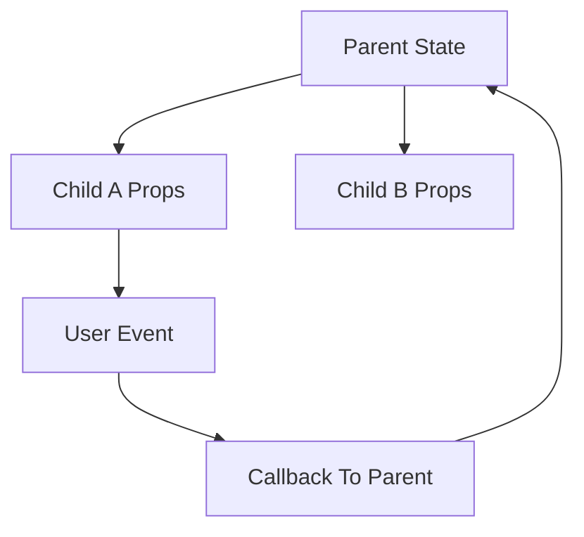
```mermaid
flowchart TD
    Parent[Parent State]
    Parent --> ChildA[Child A Props]
    Parent --> ChildB[Child B Props]
    ChildA --> Event[User Event]
    Event --> Callback[Callback To Parent]
    Callback --> Parent
```

Why it exists:

- Easier debugging.
- Predictable updates.
- Clear data ownership.

Pattern:

```tsx
function Parent() {
    const [selectedId, setSelectedId] = useState<number | null>(null);

    return <UserList selectedId={selectedId} onSelect={setSelectedId} />;
}
```

### K. Component Composition

Composition means building bigger UI by combining smaller components.

```tsx
function Card({ children }: { children: React.ReactNode }) {
    return <section className="card">{children}</section>;
}

function Profile() {
    return (
        <Card>
            <h2>Profile</h2>
            <p>Account details</p>
        </Card>
    );
}
```

Use composition when:

- You want flexible layouts.
- You want to avoid too many configuration props.
- Parent should decide what content appears inside child.

Avoid excessive prop configuration:

```tsx
// Hard to maintain when it grows
<Modal title="Delete" showFooter showCancel danger primaryText="Delete" />

// More flexible
<Modal>
    <Modal.Header>Delete user</Modal.Header>
    <Modal.Body>Are you sure?</Modal.Body>
    <Modal.Footer>
        <Button>Cancel</Button>
        <Button variant="danger">Delete</Button>
    </Modal.Footer>
</Modal>
```

### L. Children Prop

`children` is a special prop that contains elements placed between opening and closing component tags.

```tsx
function Layout({ children }: { children: React.ReactNode }) {
    return <main>{children}</main>;
}
```

Interview-ready answer:

> The `children` prop allows a component to wrap or arrange content without knowing exactly what that content is. It is useful for layout components, modals, cards, and reusable containers.

### M. Conditional Rendering

Render UI based on conditions.

```tsx
function UserPanel({ user }: { user: User | null }) {
    if (!user) {
        return <p>Please log in.</p>;
    }

    return <h2>{user.name}</h2>;
}
```

Common patterns:

```tsx
{isLoading && <Spinner />}
{error ? <ErrorMessage error={error} /> : <UserList users={users} />}
```

Common mistakes:

- Rendering `0` accidentally with `items.length && <List />`.
- Nesting too many ternaries.
- Forgetting loading and error states.

### N. Lists And Keys

React uses keys to identify items between renders.

```tsx
function TodoList({ todos }: { todos: Todo[] }) {
    return (
        <ul>
            {todos.map((todo) => (
                <li key={todo.id}>{todo.title}</li>
            ))}
        </ul>
    );
}
```

Why keys are important:

- Help React match old and new list items.
- Preserve state correctly.
- Improve reconciliation accuracy.

When array index is risky:

- Items can be inserted.
- Items can be removed.
- Items can be reordered.
- List items have local state.

When index can be acceptable:

- Static list.
- Never reordered.
- Never filtered.
- No item-local state.

Interview-ready answer:

> Keys help React identify which list item changed, moved, or was removed. A stable unique ID is best. Using the array index can create bugs when the list order changes because React may reuse the wrong component state.

### O. Fragment

Fragments let you return multiple elements without adding an extra DOM node.

```tsx
function UserInfo() {
    return (
        <>
            <h2>Name</h2>
            <p>Role</p>
        </>
    );
}
```

Use `<React.Fragment key={id}>` when a fragment inside a list needs a key.

### P. Event Handling

React uses camelCase event names.

```tsx
function SaveButton() {
    function handleClick() {
        console.log("Saved");
    }

    return <button onClick={handleClick}>Save</button>;
}
```

Passing arguments:

```tsx
<button onClick={() => deleteUser(user.id)}>Delete</button>
```

Common mistake:

```tsx
// Wrong: runs immediately during render
<button onClick={deleteUser(user.id)}>Delete</button>
```

### Q. Synthetic Events

React wraps browser events in a consistent event system called synthetic events.

Why it exists:

- Cross-browser consistency.
- Consistent event behavior across React.
- Event delegation under the hood.

Modern note:

- Older React versions pooled synthetic events.
- Modern React no longer pools them in the same problematic way, so accessing event values asynchronously is less surprising than before.

### R. Controlled vs Uncontrolled Components

Controlled input:

```tsx
function ControlledInput() {
    const [email, setEmail] = useState("");

    return (
        <input value={email} onChange={(event) => setEmail(event.target.value)} />
    );
}
```

Uncontrolled input:

```tsx
function UncontrolledInput() {
    const inputRef = useRef<HTMLInputElement | null>(null);

    function handleSubmit() {
        console.log(inputRef.current?.value);
    }

    return <input ref={inputRef} />;
}
```

| Point | Controlled | Uncontrolled |
|---|---|---|
| Source of truth | React state | DOM |
| Validation | Easier live validation | Easier simple forms |
| Performance | Can re-render often | Fewer React updates |
| Example | Search box, dynamic form | File input, simple form |

### S. Lifting State Up

When multiple components need the same state, move the state to their closest common parent.

```tsx
function TemperatureCalculator() {
    const [celsius, setCelsius] = useState(0);

    return (
        <>
            <TemperatureInput value={celsius} onChange={setCelsius} />
            <BoilingVerdict celsius={celsius} />
        </>
    );
}
```

Common mistake:

- Duplicating the same state in siblings and trying to sync them manually.

### T. Prop Drilling

Prop drilling means passing props through components that do not directly use them.

```text
App -> Layout -> Sidebar -> UserMenu -> Avatar
```

Solutions:

- Component composition.
- Context for truly shared data.
- State management library for complex global state.
- Move state closer to where it is used.

Do not solve every prop chain with Context. A few levels of props is often fine.

### U. Component Reusability

Reusable components should have:

- Clear purpose.
- Simple props.
- Predictable behavior.
- Good defaults.
- Composition support.

Avoid:

- Too many boolean props.
- Combining unrelated features.
- Making one component handle every possible design.

## 3. Virtual DOM And React Rendering

### A. Real DOM

The real DOM is the browser's tree representation of HTML elements. Direct DOM updates can be expensive when done frequently or in a messy way.

### B. Virtual DOM

The virtual DOM is React's in-memory description of UI. It is not faster than the DOM by magic. The benefit is that React can calculate what changed and apply updates in an organized way.

Interview-ready answer:

> The virtual DOM is a lightweight representation of the UI. When state or props change, React creates a new virtual tree, compares it with the previous one, and commits the necessary DOM updates. The main value is predictable rendering and efficient updates, not avoiding the real DOM completely.

### C. Rendering Flow

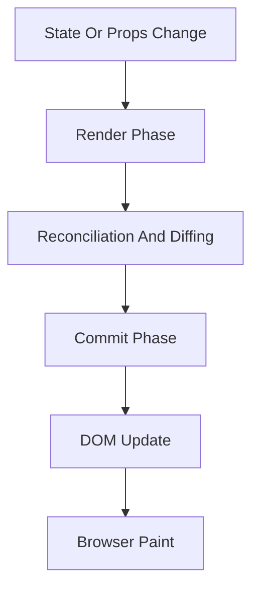
```mermaid
flowchart TD
    A[State Or Props Change] --> B[Render Phase]
    B --> C[Reconciliation And Diffing]
    C --> D[Commit Phase]
    D --> E[DOM Update]
    E --> F[Browser Paint]
```

### D. Reconciliation

Reconciliation is the process React uses to compare the previous rendered tree with the new rendered tree.

React checks:

- Element type.
- Props.
- Keys in lists.
- Component boundaries.

Important rules:

- Different component type usually means unmount old tree and mount new tree.
- Same component type usually means update props and continue diffing.
- Keys help React match list items correctly.

### E. Diffing

Diffing is the comparison step during reconciliation.

React does not compare every possible tree transformation because that would be expensive. It uses practical assumptions:

- Different element types produce different trees.
- Stable keys tell React which child is which.

### F. Fiber

**Should Know**

Fiber is React's internal architecture for rendering work. It lets React split rendering work into units, prioritize updates, pause work, resume work, and support concurrent rendering features.

Interview-safe answer:

> Fiber is React's internal rendering architecture. For daily development, I do not directly interact with it, but it enables React to schedule work, prioritize updates, and support modern features like concurrent rendering.

Avoid going too deep unless asked. Most interviews expect conceptual understanding, not React source-code details.

### G. Render Phase

In the render phase, React calls components and calculates what the UI should look like.

Important:

- Should be pure.
- No DOM mutations.
- No subscriptions.
- No API calls directly in render.
- May be paused or restarted in concurrent rendering.

### H. Commit Phase

In the commit phase, React applies changes to the real DOM and runs certain effects.

Commit phase includes:

- DOM mutations.
- Ref updates.
- `useLayoutEffect` cleanup and setup.
- Browser paint.
- `useEffect` cleanup and setup after paint.

### I. Browser Paint

Browser paint is when the browser visually updates the screen. React's DOM commit and the browser's paint are related but not the same thing.

### J. What Causes A Component To Re-render?

A component can re-render when:

- Its state changes.
- Its parent re-renders.
- Its props change.
- A context value it reads changes.
- A subscribed external store changes.

Important trap:

> Re-render does not always mean DOM update. React can re-render components, compare output, and decide the real DOM does not need to change.

### K. Parent And Child Re-renders

When a parent re-renders, React will normally call its child components too.

```tsx
function Parent() {
    const [count, setCount] = useState(0);

    return (
        <>
            <button onClick={() => setCount(count + 1)}>+</button>
            <Child />
        </>
    );
}
```

`Child` is called again when `Parent` re-renders. But the DOM may not change if the output is the same.

If `Child` is wrapped with `React.memo`, React may skip rendering it when its props are shallowly equal.

### L. Component Re-render Decision Concept

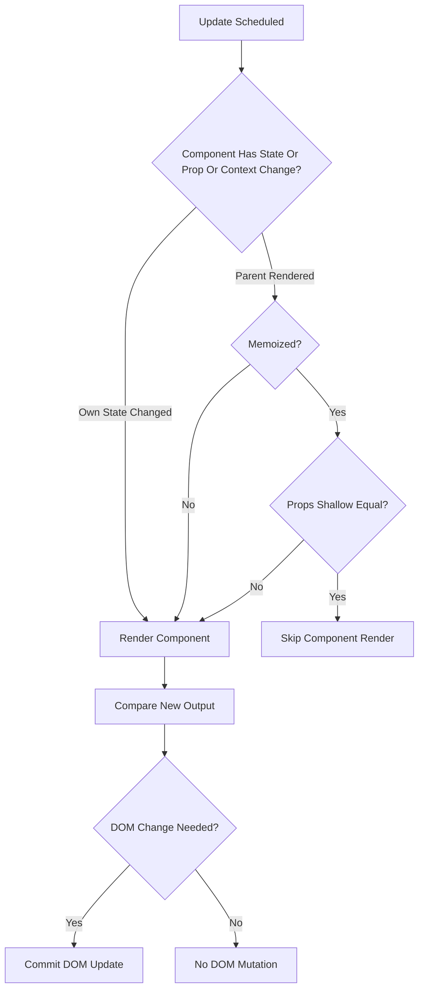
```mermaid
flowchart TD
    A[Update Scheduled] --> B{Component Has State Or Prop Or Context Change?}
    B -->|Own State Changed| C[Render Component]
    B -->|Parent Rendered| D{Memoized?}
    D -->|No| C
    D -->|Yes| E{Props Shallow Equal?}
    E -->|Yes| F[Skip Component Render]
    E -->|No| C
    C --> G[Compare New Output]
    G --> H{DOM Change Needed?}
    H -->|Yes| I[Commit DOM Update]
    H -->|No| J[No DOM Mutation]
```

### M. Referential Equality

JavaScript compares objects, arrays, and functions by reference.

```tsx
{} === {} // false
[] === [] // false
(() => {}) === (() => {}) // false
```

This matters in React because:

- Dependency arrays use comparison.
- `React.memo` uses shallow prop comparison.
- New object/function props can break memoization.

Example:

```tsx
// New object on every render
<UserCard filters={{ active: true }} />
```

Better when needed:

```tsx
const filters = useMemo(() => ({ active: true }), []);
<UserCard filters={filters} />;
```

### N. State Updates And Batching

React batches multiple state updates to reduce unnecessary renders.

```tsx
function handleClick() {
    setCount((count) => count + 1);
    setIsOpen(true);
    setMessage("Saved");
}
```

In modern React, automatic batching applies in more cases, including promises, timeouts, and native event handlers when using modern roots.

State updates can appear asynchronous because React schedules updates and applies them during rendering.

### O. Functional State Updates

Use functional updates when the next state depends on the previous state.

```tsx
setCount((previousCount) => previousCount + 1);
```

Common bug:

```tsx
setCount(count + 1);
setCount(count + 1); // Still based on same old count
```

Correct:

```tsx
setCount((count) => count + 1);
setCount((count) => count + 1);
```

### P. Stale State And Stale Closures

A stale closure happens when a function captures an old value from a previous render.

```tsx
function Timer() {
    const [count, setCount] = useState(0);

    useEffect(() => {
        const id = setInterval(() => {
            setCount(count + 1); // stale count
        }, 1000);

        return () => clearInterval(id);
    }, []);
}
```

Fix:

```tsx
useEffect(() => {
    const id = setInterval(() => {
        setCount((count) => count + 1);
    }, 1000);

    return () => clearInterval(id);
}, []);
```

### Q. What Happens When...

| Situation | What React Does |
|---|---|
| Parent re-renders | Child functions are usually called again unless memoization skips them |
| State changes | Component owning that state re-renders |
| Props change | Child receives new props and re-renders |
| Context changes | Consumers of that context value re-render |
| Memoized component receives same props | `React.memo` can skip rendering |
| Render output is same | React may skip real DOM mutation |

## 4. Hooks

### A. Rules Of Hooks

**Must Know**

Rules:

- Call hooks only at the top level of React components or custom hooks.
- Do not call hooks inside loops, conditions, or nested functions.
- Call hooks only from React functions, not normal utility functions.

Why:

- React relies on the order of hook calls to associate state/effects with the correct component instance.

Wrong:

```tsx
if (isLoggedIn) {
    const [user, setUser] = useState(null);
}
```

Correct:

```tsx
const [user, setUser] = useState(null);

if (!isLoggedIn) {
    return null;
}
```

### B. useState

**Must Know**

`useState` stores component-local state.

```tsx
const [count, setCount] = useState(0);
```

Functional updates:

```tsx
setCount((count) => count + 1);
```

Objects and arrays:

```tsx
const [user, setUser] = useState({ name: "", age: 0 });

setUser((user) => ({
    ...user,
    name: "Riya",
}));
```

State immutability:

- Do not mutate existing state.
- Create a new object/array.
- React uses references to detect changes.

Wrong:

```tsx
items.push(newItem);
setItems(items);
```

Correct:

```tsx
setItems((items) => [...items, newItem]);
```

Lazy initial state:

```tsx
const [settings, setSettings] = useState(() => loadSettingsFromStorage());
```

Use lazy initial state when initial calculation is expensive and only needed on first render.

Common mistakes:

- Expecting state to update immediately after calling setter.
- Mutating objects/arrays.
- Storing derived values unnecessarily.
- Using old state directly for multiple updates.

Interview-ready answer:

> `useState` lets a functional component store local state. Calling the setter schedules a re-render with the new value. When the next value depends on the previous value, I use the functional update form.

### C. useEffect

**Must Know**

`useEffect` runs side effects after React renders and commits the UI.

A side effect is work that interacts with something outside the render calculation:

- API requests.
- Subscriptions.
- Timers.
- Logging.
- Manually touching browser APIs.
- Event listeners.

Basic example:

```tsx
useEffect(() => {
    document.title = `Cart (${items.length})`;
}, [items.length]);
```

Dependency array behavior:

| Dependency Array | Behavior |
|---|---|
| No array | Runs after every render |
| `[]` | Runs after initial mount, plus dev-only remount behavior in StrictMode |
| `[value]` | Runs when `value` changes |

Cleanup:

```tsx
useEffect(() => {
    const id = setInterval(() => {
        console.log("tick");
    }, 1000);

    return () => clearInterval(id);
}, []);
```

Effect lifecycle:

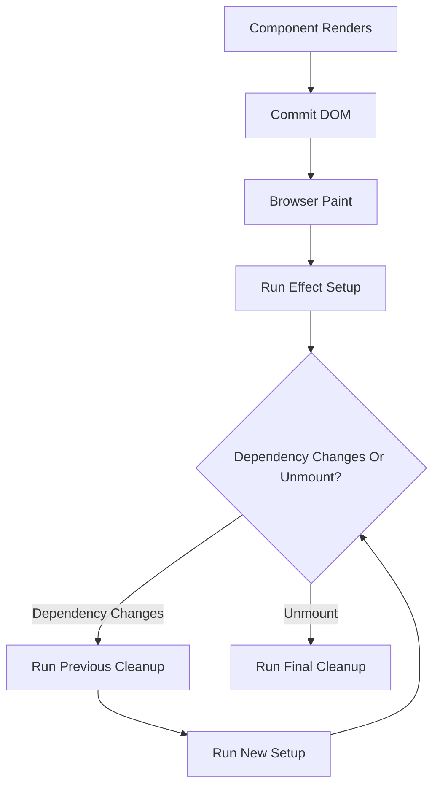
```mermaid
flowchart TD
    A[Component Renders] --> B[Commit DOM]
    B --> C[Browser Paint]
    C --> D[Run Effect Setup]
    D --> E{Dependency Changes Or Unmount?}
    E -->|Dependency Changes| F[Run Previous Cleanup]
    F --> G[Run New Setup]
    G --> E
    E -->|Unmount| H[Run Final Cleanup]
```

API call with race condition handling:

```tsx
function UserDetails({ userId }: { userId: string }) {
    const [user, setUser] = useState<User | null>(null);
    const [error, setError] = useState<string | null>(null);
    const [isLoading, setIsLoading] = useState(false);

    useEffect(() => {
        const controller = new AbortController();

        async function loadUser() {
            try {
                setIsLoading(true);
                setError(null);

                const response = await fetch(`/api/users/${userId}`, {
                    signal: controller.signal,
                });

                if (!response.ok) {
                    throw new Error("Failed to load user");
                }

                const data: User = await response.json();
                setUser(data);
            } catch (error) {
                if (error instanceof DOMException && error.name === "AbortError") {
                    return;
                }

                setError("Could not load user");
            } finally {
                setIsLoading(false);
            }
        }

        loadUser();

        return () => controller.abort();
    }, [userId]);

    if (isLoading) return <p>Loading...</p>;
    if (error) return <p>{error}</p>;
    if (!user) return null;

    return <h2>{user.name}</h2>;
}
```

When not to use `useEffect`:

- To calculate derived data from props/state.
- To handle user events that can run directly in event handlers.
- To reset state when a `key` or controlled state design is cleaner.
- To synchronize two pieces of state that should be one source of truth.

Derived state mistake:

```tsx
// Avoid
const [fullName, setFullName] = useState("");

useEffect(() => {
    setFullName(`${firstName} ${lastName}`);
}, [firstName, lastName]);
```

Better:

```tsx
const fullName = `${firstName} ${lastName}`;
```

Infinite loop:

```tsx
const filters = { active: true };

useEffect(() => {
    fetchUsers(filters);
}, [filters]); // new object every render
```

Fix:

```tsx
const filters = useMemo(() => ({ active: true }), []);

useEffect(() => {
    fetchUsers(filters);
}, [filters]);
```

Common mistakes:

- Missing dependencies.
- Adding unstable objects/functions as dependencies without understanding why.
- Doing event-specific logic in effects.
- Forgetting cleanup.
- Creating infinite loops.
- Treating `useEffect` as only a lifecycle replacement.

Interview-ready answer:

> `useEffect` is for synchronizing a component with external systems after rendering, such as APIs, subscriptions, timers, or browser APIs. The dependency array tells React when the synchronization needs to re-run. Cleanup prevents leaks and removes previous subscriptions before the next effect or unmount.

### D. useRef

**Must Know**

`useRef` stores a mutable value that persists across renders without causing a re-render when it changes.

DOM reference:

```tsx
function SearchInput() {
    const inputRef = useRef<HTMLInputElement | null>(null);

    return (
        <>
            <input ref={inputRef} />
            <button onClick={() => inputRef.current?.focus()}>Focus</button>
        </>
    );
}
```

Mutable value:

```tsx
const timerRef = useRef<number | null>(null);
```

Previous value:

```tsx
function usePrevious<T>(value: T) {
    const ref = useRef<T | undefined>(undefined);

    useEffect(() => {
        ref.current = value;
    }, [value]);

    return ref.current;
}
```

useRef vs useState:

| Point | useRef | useState |
|---|---|---|
| Causes re-render on change | No | Yes |
| Stores DOM node | Yes | Usually no |
| Stores render-affecting data | No | Yes |
| Good for | Timer IDs, previous values, DOM refs | UI state |

Trap:

> Changing a ref does not cause a re-render.

### E. useMemo

**Should Know**

`useMemo` memoizes a calculated value between renders.

```tsx
const filteredUsers = useMemo(() => {
    return users.filter((user) => user.name.includes(search));
}, [users, search]);
```

Use it when:

- Calculation is expensive.
- Stable object/array reference is needed for memoized children.
- Derived data is costly and dependencies change less often.

Do not use it when:

- Calculation is cheap.
- You are guessing performance issues.
- It makes code harder to read without measurable benefit.

### F. useCallback

**Should Know**

`useCallback` memoizes a function reference.

```tsx
const handleSelect = useCallback((id: string) => {
    setSelectedId(id);
}, []);
```

Use it when:

- Passing callbacks to `React.memo` children.
- Function is used in another dependency array.
- Stable function identity matters.

Do not use it everywhere. The function is still created during render; React may return the previous stored function if dependencies did not change.

### G. React.memo

**Should Know**

`React.memo` memoizes component rendering based on props.

```tsx
const UserRow = React.memo(function UserRow({ user }: { user: User }) {
    return <li>{user.name}</li>;
});
```

How it works:

- Performs shallow comparison of props.
- Skips render if props are shallowly equal.
- New object/function props can cause render anyway.

Custom comparison:

```tsx
const UserRow = React.memo(
    function UserRow({ user }: { user: User }) {
        return <li>{user.name}</li>;
    },
    (previous, next) => previous.user.id === next.user.id && previous.user.name === next.user.name
);
```

Limitations:

- Does not stop re-render caused by consumed context changes.
- Comparison itself has a cost.
- Can hide bad state placement.

### H. useContext

**Must Know**

Context lets data be passed through the component tree without manually passing props at every level.

```tsx
const ThemeContext = createContext<"light" | "dark">("light");

function App() {
    return (
        <ThemeContext.Provider value="dark">
            <Toolbar />
        </ThemeContext.Provider>
    );
}

function Toolbar() {
    const theme = useContext(ThemeContext);
    return <button className={theme}>Save</button>;
}
```

Use Context for:

- Theme.
- Auth user/session info.
- Locale.
- Feature flags.
- App-level settings.

Avoid Context for:

- Frequently changing large state used by many components.
- Server cache.
- State that only belongs to one small subtree.

Re-render behavior:

- When provider value changes, components reading that context re-render.
- Passing a new object every render can cause unnecessary context updates.

Context vs Redux:

> Context is a dependency injection mechanism for passing values. Redux is a state management pattern/library with predictable updates, middleware, devtools, and selector-based subscriptions.

### I. useReducer

**Should Know**

`useReducer` manages state with a reducer function and dispatched actions.

```tsx
type State = { count: number };
type Action = { type: "increment" } | { type: "reset" };

function reducer(state: State, action: Action): State {
    switch (action.type) {
        case "increment":
            return { count: state.count + 1 };
        case "reset":
            return { count: 0 };
        default:
            return state;
    }
}

function Counter() {
    const [state, dispatch] = useReducer(reducer, { count: 0 });

    return (
        <>
            <p>{state.count}</p>
            <button onClick={() => dispatch({ type: "increment" })}>+</button>
        </>
    );
}
```

Use `useReducer` when:

- State transitions are complex.
- Next state depends on action type.
- Multiple fields change together.
- You want more predictable state updates.

useState vs useReducer:

| Point | useState | useReducer |
|---|---|---|
| Best for | Simple state | Complex transitions |
| Update style | Direct setter | Dispatch actions |
| Logic location | Component or handler | Reducer function |
| Debuggability | Fine for small state | Better for complex flows |

### J. Other Important Hooks

| Hook | Priority | What It Does | Interview Note |
|---|---|---|---|
| `useLayoutEffect` | Should Know | Runs synchronously after DOM mutation before paint | Use for layout measurements that must happen before paint |
| `useId` | Should Know | Generates stable unique IDs for accessibility | Useful for input/label IDs, not list keys |
| `useTransition` | Know If Asked | Marks updates as non-urgent | Helps keep UI responsive during expensive updates |
| `useDeferredValue` | Know If Asked | Defers updating a value | Useful for search/list filtering UI responsiveness |
| `useImperativeHandle` | Know If Asked | Customizes ref exposed by child | Used with `forwardRef` for imperative APIs |
| `useSyncExternalStore` | Know If Asked | Subscribes safely to external stores | Mainly used by library authors |

`useLayoutEffect` example:

```tsx
useLayoutEffect(() => {
    const height = elementRef.current?.getBoundingClientRect().height;
    setHeight(height ?? 0);
}, []);
```

`useId` example:

```tsx
function EmailField() {
    const id = useId();

    return (
        <>
            <label htmlFor={id}>Email</label>
            <input id={id} />
        </>
    );
}
```

`useTransition` example:

```tsx
const [isPending, startTransition] = useTransition();

function handleSearch(value: string) {
    setInput(value);
    startTransition(() => {
        setQuery(value);
    });
}
```

## 5. useMemo vs useCallback vs React.memo

| Feature | What It Memoizes | Used For | Common Mistake |
|---|---|---|---|
| `useMemo` | Calculated value | Expensive calculations, stable object references | Using it for cheap calculations |
| `useCallback` | Function reference | Stable callbacks for memoized children/effects | Thinking it prevents function creation entirely |
| `React.memo` | Component render result decision | Skipping child render when props are same | Passing unstable object/function props |

Practical example:

```tsx
const ProductList = React.memo(function ProductList({
    products,
    onSelect,
}: {
    products: Product[];
    onSelect: (id: string) => void;
}) {
    return (
        <ul>
            {products.map((product) => (
                <li key={product.id}>
                    <button onClick={() => onSelect(product.id)}>{product.name}</button>
                </li>
            ))}
        </ul>
    );
});

function ProductsPage({ products }: { products: Product[] }) {
    const [query, setQuery] = useState("");

    const filteredProducts = useMemo(() => {
        return products.filter((product) =>
            product.name.toLowerCase().includes(query.toLowerCase())
        );
    }, [products, query]);

    const handleSelect = useCallback((id: string) => {
        console.log(id);
    }, []);

    return (
        <>
            <input value={query} onChange={(event) => setQuery(event.target.value)} />
            <ProductList products={filteredProducts} onSelect={handleSelect} />
        </>
    );
}
```

Why blind memoization can be harmful:

- Adds memory overhead.
- Adds comparison overhead.
- Makes code harder to understand.
- Often solves no real problem.
- Can hide poor state placement.

When memoization is actually useful:

- Large lists.
- Expensive derived data.
- Components that re-render often with same props.
- Stable references needed for memoized children.
- Profiling shows a real bottleneck.

## 6. Custom Hooks

### A. What Is A Custom Hook?

**Must Know**

A custom hook is a function that starts with `use` and uses React hooks to share stateful logic.

Why create one:

- Reuse logic across components.
- Keep components focused on UI.
- Encapsulate API, browser, form, or subscription logic.
- Improve testing and readability.

Custom hook vs utility function:

| Point | Custom Hook | Utility Function |
|---|---|---|
| Can use hooks | Yes | No |
| Has React lifecycle | Yes | No |
| Name starts with `use` | Yes | No |
| Example | `useFetch`, `useDebounce` | `formatDate`, `sum` |

Rules:

- Name starts with `use`.
- Follow Rules of Hooks.
- Return clear state and actions.
- Keep responsibilities narrow.

### B. useFetch

```tsx
function useFetch<T>(url: string) {
    const [data, setData] = useState<T | null>(null);
    const [error, setError] = useState<string | null>(null);
    const [isLoading, setIsLoading] = useState(false);

    useEffect(() => {
        const controller = new AbortController();

        async function load() {
            try {
                setIsLoading(true);
                setError(null);

                const response = await fetch(url, { signal: controller.signal });
                if (!response.ok) throw new Error("Request failed");

                setData(await response.json());
            } catch (error) {
                if (error instanceof DOMException && error.name === "AbortError") return;
                setError("Something went wrong");
            } finally {
                setIsLoading(false);
            }
        }

        load();
        return () => controller.abort();
    }, [url]);

    return { data, error, isLoading };
}
```

### C. useDebounce

```tsx
function useDebounce<T>(value: T, delay: number) {
    const [debouncedValue, setDebouncedValue] = useState(value);

    useEffect(() => {
        const id = setTimeout(() => setDebouncedValue(value), delay);
        return () => clearTimeout(id);
    }, [value, delay]);

    return debouncedValue;
}
```

### D. useLocalStorage

```tsx
function useLocalStorage<T>(key: string, initialValue: T) {
    const [value, setValue] = useState<T>(() => {
        const storedValue = localStorage.getItem(key);
        return storedValue ? JSON.parse(storedValue) : initialValue;
    });

    useEffect(() => {
        localStorage.setItem(key, JSON.stringify(value));
    }, [key, value]);

    return [value, setValue] as const;
}
```

### E. usePrevious

```tsx
function usePrevious<T>(value: T) {
    const ref = useRef<T | undefined>(undefined);

    useEffect(() => {
        ref.current = value;
    }, [value]);

    return ref.current;
}
```

### F. useAuth

```tsx
function useAuth() {
    const context = useContext(AuthContext);

    if (!context) {
        throw new Error("useAuth must be used inside AuthProvider");
    }

    return context;
}
```

Common mistakes:

- Creating a custom hook for logic used only once and still simple.
- Returning too many unrelated things.
- Hiding important dependencies.
- Ignoring loading/error states.
- Naming a normal function `useSomething` even though it does not use hooks.

Interview-ready answer:

> A custom hook extracts reusable stateful logic from components. Unlike a utility function, it can call React hooks and participate in React's lifecycle. I would create one when multiple components need the same behavior or when a component has too much non-UI logic.

## 7. Component Design And Architecture

### A. Single Responsibility Principle

A component should have one main reason to change.

Good split:

- Page component: route-level orchestration.
- Container component or hook: data fetching and state.
- Presentational component: UI.
- Service module: API calls.
- Utility module: pure helpers.

### B. Presentational vs Container Components

| Type | Responsibility |
|---|---|
| Presentational | Receives props and renders UI |
| Container | Fetches data, handles state, passes props |

Modern React often uses custom hooks instead of strict container components.

### C. Smart vs Dumb Components

- **Smart component**: knows about data, state, API, or routing.
- **Dumb component**: receives props and renders UI.

This is a pattern, not a strict rule.

### D. Feature-Based Architecture

Example:

```text
src/
|-- app/
|   |-- router.tsx
|   `-- providers.tsx
|-- features/
|   |-- auth/
|   |   |-- components/
|   |   |-- hooks/
|   |   |-- services/
|   |   `-- types.ts
|   `-- products/
|       |-- components/
|       |-- hooks/
|       |-- services/
|       `-- types.ts
|-- shared/
|   |-- components/
|   |-- hooks/
|   |-- utils/
|   `-- api/
`-- main.tsx
```

Architecture diagram:

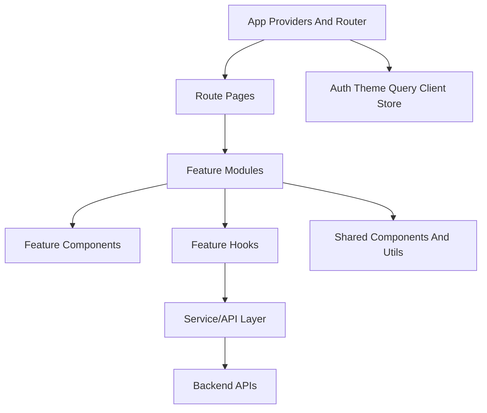
```mermaid
flowchart TD
    App[App Providers And Router] --> Routes[Route Pages]
    Routes --> Feature[Feature Modules]
    Feature --> UI[Feature Components]
    Feature --> Hooks[Feature Hooks]
    Hooks --> Services[Service/API Layer]
    Services --> Backend[Backend APIs]
    Feature --> Shared[Shared Components And Utils]
    App --> Global[Auth Theme Query Client Store]
```

How to design a large React application:

1. Start with feature modules.
2. Keep route pages thin.
3. Use shared components only for truly reusable UI.
4. Extract business logic into hooks/services.
5. Separate server state from client UI state.
6. Add global state only when multiple distant areas need it.
7. Keep components small but avoid premature abstraction.

Prop design:

- Prefer clear names.
- Prefer composition for flexible content.
- Avoid many boolean flags.
- Avoid passing huge objects if only a few fields are needed.
- Keep callback names action-oriented, such as `onSave`, `onSelect`, `onClose`.

## 8. State Management

### A. Types Of State

| Type | Meaning | Example |
|---|---|---|
| Local state | Used by one component or small subtree | Modal open, input value |
| Lifted state | Shared by nearby siblings | Selected tab |
| Context state | Shared across many components | Theme, current user |
| Redux/global state | Complex shared client state | Cart, multi-step workflow |
| Server state | Data from backend | Users, orders |
| Derived state | Calculated from existing state | Filtered list |
| URL state | Stored in route/query params | Page number, filters |
| Form state | Input values and validation | Signup form |

### B. State Management Decision Tree

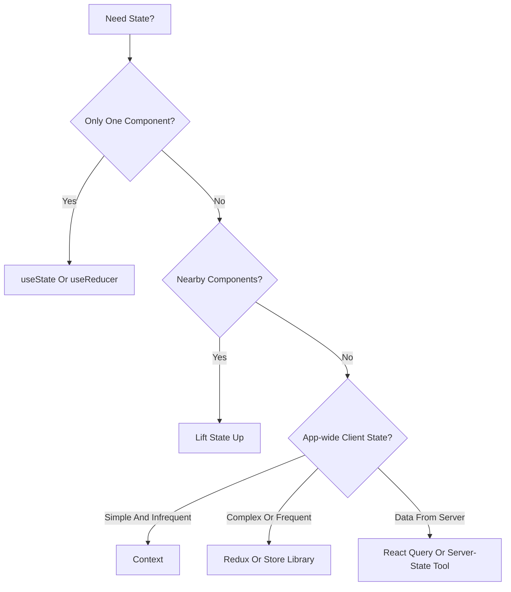
```mermaid
flowchart TD
    A[Need State?] --> B{Only One Component?}
    B -->|Yes| C[useState Or useReducer]
    B -->|No| D{Nearby Components?}
    D -->|Yes| E[Lift State Up]
    D -->|No| F{App-wide Client State?}
    F -->|Simple And Infrequent| G[Context]
    F -->|Complex Or Frequent| H[Redux Or Store Library]
    F -->|Data From Server| I[React Query Or Server-State Tool]
```

Local State vs Context vs Redux vs React Query:

| Tool | Best For | Avoid For |
|---|---|---|
| Local state | Component-specific UI | App-wide shared data |
| Context | Low-frequency app-wide values | Large frequently changing data |
| Redux | Complex shared client state | Simple local state or server cache |
| React Query | Server state, caching, refetching | Pure UI state like modal open |

Why not put everything in Redux?

- Adds boilerplate and complexity.
- Makes local UI state harder to reason about.
- Server state needs caching/refetch/invalidation, which Redux does not solve automatically.
- Can cause unnecessary global coupling.

Why server state is different:

- Owned by backend.
- Can become stale.
- Needs caching, refetching, invalidation, retries, pagination, and optimistic updates.

Why derived state should usually not be stored:

- It can get out of sync.
- It creates duplicate sources of truth.
- It often can be computed during render or memoized if expensive.

## 9. React Query / Server State

**Should Know**

React Query, now commonly known as TanStack Query, is a library for managing server state.

Server state:

- Lives on the server.
- Is fetched asynchronously.
- Can become stale.
- May be shared across screens.
- Needs loading, error, cache, and refetch handling.

Core ideas:

| Concept | Meaning |
|---|---|
| Query | Read/fetch data |
| Mutation | Create/update/delete data |
| Query key | Unique cache identity |
| Cache | Stored fetched result |
| Stale data | Data that may need refetching |
| Fresh data | Data considered up to date |
| Invalidation | Marking data stale after a change |
| Refetching | Fetching again |
| Optimistic update | Updating UI before server confirms |

Example:

```tsx
function UsersPage() {
    const usersQuery = useQuery({
        queryKey: ["users"],
        queryFn: fetchUsers,
    });

    if (usersQuery.isLoading) return <p>Loading...</p>;
    if (usersQuery.isError) return <p>Failed to load users</p>;

    return (
        <ul>
            {usersQuery.data.map((user) => (
                <li key={user.id}>{user.name}</li>
            ))}
        </ul>
    );
}
```

Mutation and invalidation:

```tsx
function AddUserButton() {
    const queryClient = useQueryClient();

    const mutation = useMutation({
        mutationFn: createUser,
        onSuccess: () => {
            queryClient.invalidateQueries({ queryKey: ["users"] });
        },
    });

    return <button onClick={() => mutation.mutate({ name: "New User" })}>Add</button>;
}
```

Redux vs React Query:

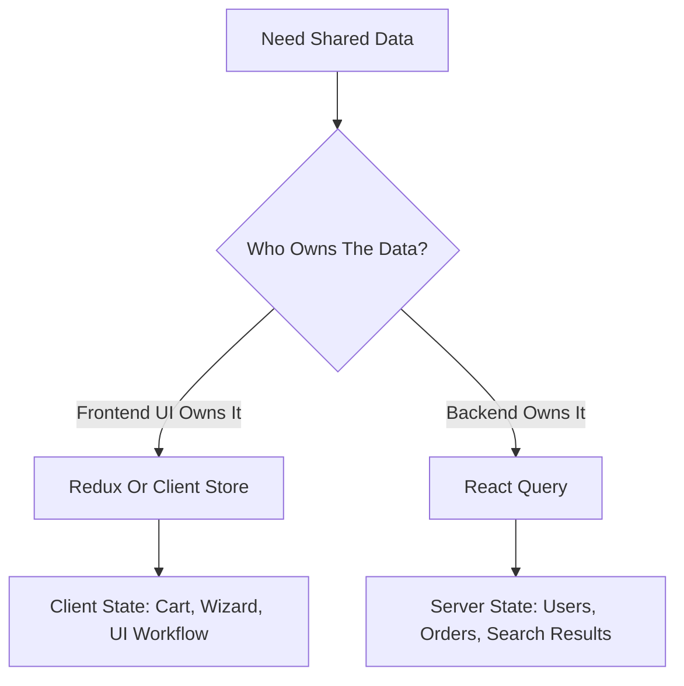
```mermaid
flowchart TD
    A[Need Shared Data] --> B{Who Owns The Data?}
    B -->|Frontend UI Owns It| C[Redux Or Client Store]
    B -->|Backend Owns It| D[React Query]
    C --> E[Client State: Cart, Wizard, UI Workflow]
    D --> F[Server State: Users, Orders, Search Results]
```

| Point | Redux | React Query |
|---|---|---|
| Main purpose | Client state | Server state |
| Cache | Manual | Built in |
| Refetch | Manual | Built in |
| Invalidation | Manual patterns | Built in |
| Good for | Complex UI workflows | API data |

Interview-safe wording:

> Conceptually, React Query is useful when data comes from the server and needs caching, loading/error handling, refetching, and invalidation. Redux can manage this manually, but React Query is designed specifically for server state.

## 10. Forms

### A. Controlled Forms

```tsx
function LoginForm() {
    const [email, setEmail] = useState("");
    const [password, setPassword] = useState("");
    const [error, setError] = useState<string | null>(null);

    async function handleSubmit(event: React.FormEvent<HTMLFormElement>) {
        event.preventDefault();

        if (!email.includes("@")) {
            setError("Enter a valid email");
            return;
        }

        setError(null);
        await login({ email, password });
    }

    return (
        <form onSubmit={handleSubmit}>
            <input value={email} onChange={(event) => setEmail(event.target.value)} />
            <input
                type="password"
                value={password}
                onChange={(event) => setPassword(event.target.value)}
            />
            {error && <p>{error}</p>}
            <button type="submit">Login</button>
        </form>
    );
}
```

### B. Validation

Validation types:

- Client-side validation: fast feedback.
- Server-side validation: source of truth.
- Schema validation: consistent rules using tools such as Zod.

Zod-style example:

```tsx
const loginSchema = z.object({
    email: z.string().email(),
    password: z.string().min(8),
});
```

### C. React Hook Form

React Hook Form is useful for:

- Large forms.
- Better performance with fewer controlled re-renders.
- Field registration.
- Validation integration.
- Cleaner error handling.

Common form performance issues:

- Controlled input re-rendering a large parent.
- Validating the whole form on every keystroke.
- Storing every field in global state.
- Rendering all fields even in multi-step forms.

Interview-ready answer:

> Controlled components keep input values in React state, which makes validation and conditional UI straightforward. Uncontrolled components keep values in the DOM and can be useful for simpler or performance-sensitive forms. For larger forms, React Hook Form helps manage fields, validation, and performance more cleanly.

## 11. Error Handling And Loading States

UI should handle:

- Loading state.
- Error state.
- Empty state.
- Success state.
- Retry state.

API request lifecycle:

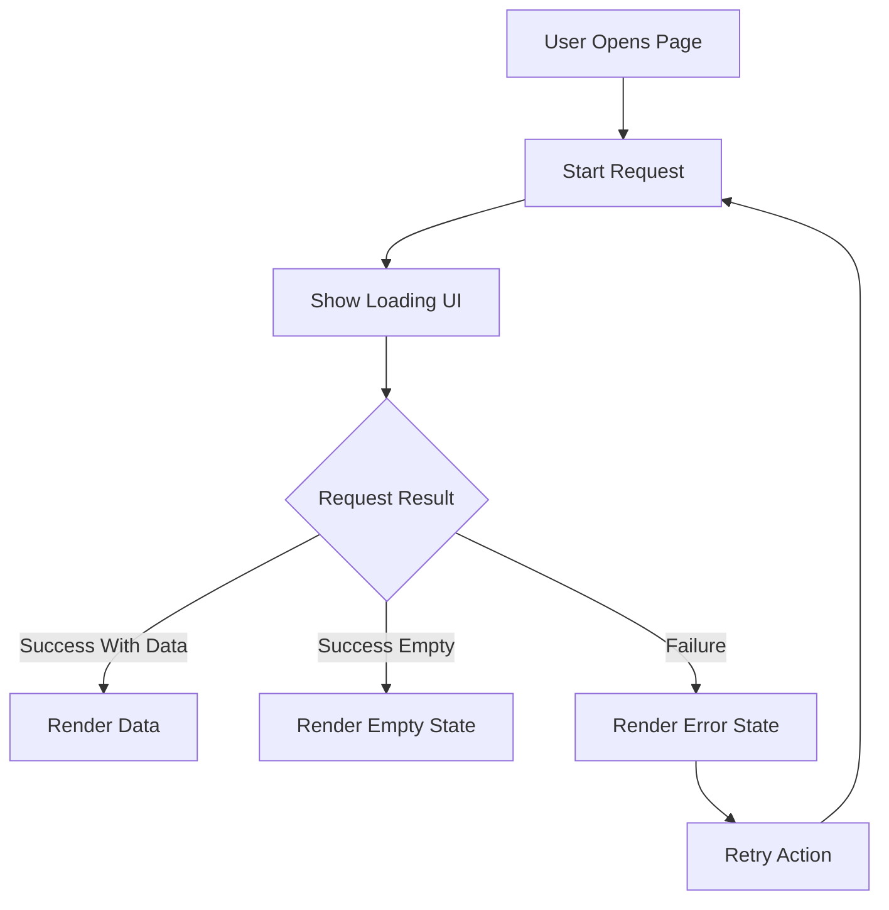
```mermaid
flowchart TD
    A[User Opens Page] --> B[Start Request]
    B --> C[Show Loading UI]
    C --> D{Request Result}
    D -->|Success With Data| E[Render Data]
    D -->|Success Empty| F[Render Empty State]
    D -->|Failure| G[Render Error State]
    G --> H[Retry Action]
    H --> B
```

Error categories:

| Error Type | Example | Handling |
|---|---|---|
| Rendering error | Component throws while rendering | Error boundary |
| Event handler error | Button click logic throws | Try/catch or local error state |
| Async error | Promise rejection | Try/catch, query error state |
| API error | 400/500/network failure | Error UI, retry, validation messages |

Error boundaries:

- Catch rendering errors in child component tree.
- Show fallback UI instead of breaking the whole app.
- Do not catch event handler errors.
- Do not catch async errors automatically.
- Do not catch errors on the server in the same way.

Graceful fallback UI:

- Tell user what happened.
- Keep layout stable.
- Offer retry if possible.
- Avoid exposing raw technical errors.

## 12. Routing

**Must Know**

Modern React Router uses route elements and hooks.

```tsx
function AppRouter() {
    return (
        <BrowserRouter>
            <Routes>
                <Route path="/" element={<HomePage />} />
                <Route path="/users/:userId" element={<UserPage />} />
                <Route path="/dashboard" element={<ProtectedRoute><Dashboard /></ProtectedRoute>} />
                <Route path="*" element={<NotFoundPage />} />
            </Routes>
        </BrowserRouter>
    );
}
```

Common APIs:

| API | Use |
|---|---|
| `BrowserRouter` | Enables browser history routing |
| `Routes` | Contains route definitions |
| `Route` | Defines path and element |
| `Link` | Navigation without full page reload |
| `NavLink` | Link with active state |
| `useNavigate` | Programmatic navigation |
| `useParams` | Read dynamic route params |
| `useLocation` | Read current location |
| `Outlet` | Render nested child routes |

Nested routes:

```tsx
<Route path="/settings" element={<SettingsLayout />}>
    <Route path="profile" element={<ProfileSettings />} />
    <Route path="security" element={<SecuritySettings />} />
</Route>
```

Layout:

```tsx
function SettingsLayout() {
    return (
        <>
            <SettingsNav />
            <Outlet />
        </>
    );
}
```

Protected route:

```tsx
function ProtectedRoute({ children }: { children: React.ReactNode }) {
    const { user, isLoading } = useAuth();
    const location = useLocation();

    if (isLoading) return <p>Checking session...</p>;

    if (!user) {
        return <Navigate to="/login" replace state={{ from: location }} />;
    }

    return <>{children}</>;
}
```

Authentication/protected-route flow:

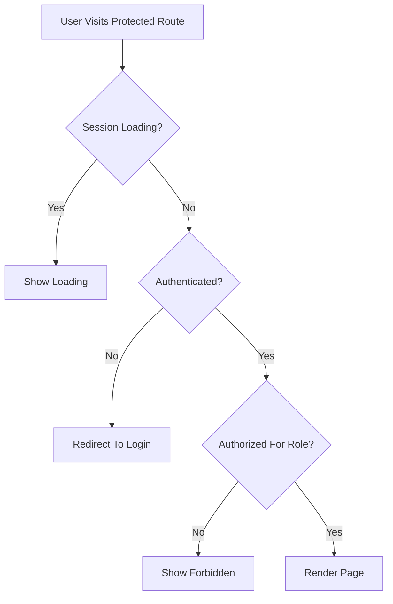
```mermaid
flowchart TD
    A[User Visits Protected Route] --> B{Session Loading?}
    B -->|Yes| C[Show Loading]
    B -->|No| D{Authenticated?}
    D -->|No| E[Redirect To Login]
    D -->|Yes| F{Authorized For Role?}
    F -->|No| G[Show Forbidden]
    F -->|Yes| H[Render Page]
```

Authentication vs authorization:

- Authentication: who are you?
- Authorization: what are you allowed to do?

Important security note:

> Frontend route protection improves user experience, but it is not real security by itself. Backend APIs must enforce authorization.

Avoid old primary APIs:

- Do not use `Switch` as the main modern example.
- Do not use `Redirect` as the main modern example.
- Do not use `useHistory` as the main modern example.

## 13. Authentication And Authorization

| Concept | Meaning |
|---|---|
| Authentication | Verifying user identity |
| Authorization | Checking permissions |
| Session | Server/client record of logged-in state |
| JWT | Token containing signed claims |
| Access token | Short-lived token for API access |
| Refresh token | Used to get a new access token |
| Role-based access | Access based on role like admin/user |
| Permission-based access | Access based on fine-grained permissions |

Secure token handling:

- Prefer secure, httpOnly cookies when possible for sensitive tokens.
- Avoid storing highly sensitive tokens in localStorage if XSS risk is high.
- Keep access tokens short-lived.
- Refresh tokens require careful backend handling.
- Always validate permissions on the backend.

Common security mistakes:

- Relying only on hidden buttons.
- Relying only on protected frontend routes.
- Storing tokens carelessly.
- Not handling token expiry.
- Not clearing auth state on logout.
- Trusting role values sent from the frontend.

Interview-ready answer:

> Authentication confirms the user's identity, while authorization decides what that user can access. The frontend can hide routes and UI for better experience, but real authorization must happen on the backend because users can bypass frontend checks.

## 14. Performance Optimization

### A. Common Causes Of Poor Performance

- Unnecessary re-renders.
- Large lists without virtualization.
- Expensive calculations during render.
- Large bundle size.
- Too much global state.
- Context value changing too often.
- Slow network requests.
- Unoptimized images.
- Heavy third-party libraries.

### B. Practical Debugging Process

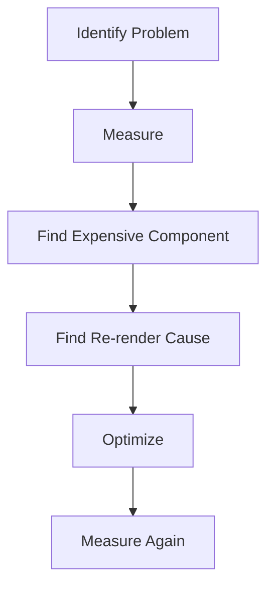
```mermaid
flowchart TD
    A[Identify Problem] --> B[Measure]
    B --> C[Find Expensive Component]
    C --> D[Find Re-render Cause]
    D --> E[Optimize]
    E --> F[Measure Again]
```

Process:

1. Reproduce the issue.
2. Use React DevTools Profiler.
3. Find which components render often or take long.
4. Check state placement and prop identity.
5. Apply targeted optimization.
6. Measure again.

Optimization tools:

| Problem | Possible Solution |
|---|---|
| Expensive calculation | `useMemo` |
| Child re-renders with same props | `React.memo` |
| Function prop changes | `useCallback` |
| Huge list | Virtualization |
| Large route bundle | Lazy route/code splitting |
| API data refetches too often | Server-state cache |
| Input triggers heavy work | Debounce or transition |
| Context causes many renders | Split context or use selectors/store |

Large lists:

- Use pagination.
- Use virtualization.
- Avoid rendering thousands of rows at once.
- Keep row components focused.
- Use stable keys.

State placement:

- Put state as low as possible.
- Lift only when sharing is needed.
- Avoid making a whole page re-render for one small input.

Context performance:

- Split contexts by update frequency.
- Memoize provider value when useful.
- Avoid placing fast-changing state in one huge provider.

Interview-ready answer:

> I do not start with memoization blindly. I first reproduce and measure with the Profiler, then identify which component is expensive or rendering too often. After that I check state placement, prop identity, list size, bundle size, and network behavior, then apply the smallest optimization and measure again.

## 15. Code Splitting And Lazy Loading

Code splitting means splitting JavaScript into smaller chunks instead of sending the whole app at once.

Lazy loading means loading a chunk only when needed.

```tsx
const SettingsPage = React.lazy(() => import("./SettingsPage"));

function App() {
    return (
        <Suspense fallback={<p>Loading page...</p>}>
            <SettingsPage />
        </Suspense>
    );
}
```

Flow:

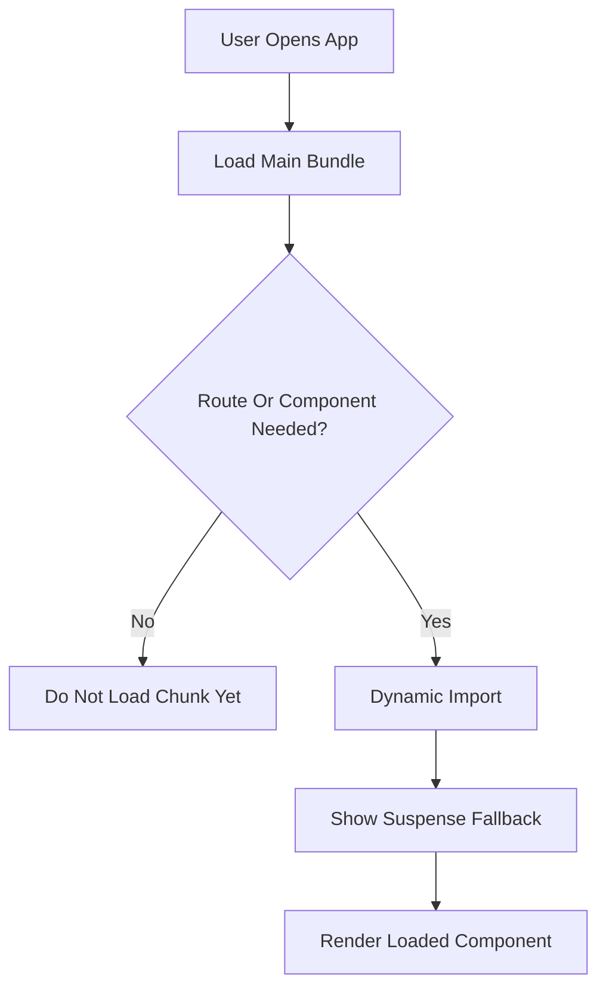
```mermaid
flowchart TD
    A[User Opens App] --> B[Load Main Bundle]
    B --> C{Route Or Component Needed?}
    C -->|No| D[Do Not Load Chunk Yet]
    C -->|Yes| E[Dynamic Import]
    E --> F[Show Suspense Fallback]
    F --> G[Render Loaded Component]
```

Route-level splitting:

- Good for pages.
- Usually high impact.
- Keeps initial bundle smaller.

Component-level splitting:

- Good for heavy modals, editors, charts, maps.
- Avoid splitting tiny components.

Bundle impact:

- Smaller initial load.
- More network requests.
- Better when chunks match user navigation patterns.

## 16. React Strict Mode

`StrictMode` is a development-only helper that highlights potential problems.

It can:

- Run certain render/effect flows more than once in development.
- Help detect unsafe side effects.
- Help find missing cleanup.
- Warn about deprecated patterns.

Important:

> Effects may appear to run twice in development under StrictMode. That does not mean production runs the same effect twice. It helps reveal effects that are not resilient to mount/unmount behavior.

Interview-ready answer:

> StrictMode is a development tool. It intentionally double-invokes some behavior to expose bugs like missing cleanup or impure rendering. It does not change production behavior.

## 17. Error Boundaries

Error boundaries catch rendering errors in their child tree and show fallback UI.

Class-based example:

```tsx
type Props = { children: React.ReactNode };
type State = { hasError: boolean };

class ErrorBoundary extends React.Component<Props, State> {
    state: State = { hasError: false };

    static getDerivedStateFromError() {
        return { hasError: true };
    }

    componentDidCatch(error: Error) {
        console.error(error);
    }

    render() {
        if (this.state.hasError) {
            return <p>Something went wrong.</p>;
        }

        return this.props.children;
    }
}
```

Caught:

- Errors during rendering.
- Errors in lifecycle methods.
- Errors in constructors below the boundary.

Not caught:

- Event handler errors.
- Async errors.
- Server-side errors.
- Errors thrown inside the boundary itself.

Modern ecosystem:

- Libraries provide function-friendly wrappers.
- Frameworks often provide route-level error boundaries.
- React Router data routers support route error elements.

## 18. JavaScript Required For React

### A. Variables, Scope, Hoisting

| Concept | React Relevance |
|---|---|
| `let` | Block-scoped mutable variable |
| `const` | Block-scoped binding, preferred by default |
| `var` | Function-scoped, avoid in modern React |
| Scope | Important for closures in handlers/effects |
| Hoisting | Explains why declarations behave differently |

### B. Closures

Closures allow functions to remember variables from the scope where they were created.

React relevance:

- Event handlers capture render values.
- Effects can capture stale values.
- Functional state updates help avoid stale state.

### C. this And Arrow Functions

Functional components rarely use `this`.

Arrow functions:

- Do not have their own `this`.
- Useful for callbacks.
- Common in event handlers.

### D. call, apply, bind

Mostly asked as JavaScript fundamentals. In React class components, `bind` was used to bind methods, but modern functional components avoid this pattern.

### E. Higher-Order Functions

Functions that receive or return functions.

React relevance:

- `map`, `filter`, `reduce`.
- Event handler factories.
- Higher-order components, though hooks are often preferred now.

### F. map/filter/reduce

```tsx
const activeUsers = users.filter((user) => user.active);
const names = activeUsers.map((user) => user.name);
const total = cartItems.reduce((sum, item) => sum + item.price, 0);
```

React list rendering commonly uses `map`.

### G. Destructuring, Spread, Rest

```tsx
const { name, email } = user;
const updatedUser = { ...user, name: "New Name" };
const updatedItems = [...items, newItem];
```

React relevance:

- Props destructuring.
- Immutable state updates.
- Passing remaining props.

### H. Shallow vs Deep Copy

Spread creates a shallow copy.

```tsx
const nextUser = {
    ...user,
    address: {
        ...user.address,
        city: "Pune",
    },
};
```

### I. Reference vs Value

Primitives compare by value. Objects, arrays, and functions compare by reference.

React relevance:

- Dependency arrays.
- `React.memo`.
- Context values.
- State immutability.

### J. Optional Chaining And Nullish Coalescing

```tsx
const city = user.address?.city ?? "Unknown";
```

### K. Promises And async/await

```tsx
async function loadUsers() {
    const response = await fetch("/api/users");
    return response.json();
}
```

Use `try/catch` for errors.

### L. Promise.all And Promise.allSettled

```tsx
const [users, roles] = await Promise.all([fetchUsers(), fetchRoles()]);
```

`Promise.all` fails fast if one promise rejects.

```tsx
const results = await Promise.allSettled([fetchUsers(), fetchRoles()]);
```

`Promise.allSettled` waits for all promises and gives success/failure for each.

### M. Event Loop, Microtasks, Macrotasks

React relevance:

- Helps understand async behavior.
- Promises run in microtasks.
- Timers run in macrotasks.
- State updates are scheduled and batched by React.

### N. Debouncing And Throttling

Debouncing waits until user stops triggering events.

```tsx
function debounce<TArgs extends unknown[]>(fn: (...args: TArgs) => void, delay: number) {
    let id: ReturnType<typeof window.setTimeout> | undefined;

    return (...args: TArgs) => {
        window.clearTimeout(id);
        id = window.setTimeout(() => fn(...args), delay);
    };
}
```

Throttling runs at most once per interval.

Use cases:

- Debounce search input.
- Throttle scroll/resize handling.

### O. Event Delegation

Event delegation handles events at a parent level instead of adding listeners to many children. React's event system uses delegation concepts internally.

## 19. TypeScript With React

### A. Component Props

```tsx
type ButtonProps = {
    label: string;
    disabled?: boolean;
    onClick: () => void;
};

function Button({ label, disabled = false, onClick }: ButtonProps) {
    return (
        <button disabled={disabled} onClick={onClick}>
            {label}
        </button>
    );
}
```

### B. Children Typing

```tsx
type CardProps = {
    children: React.ReactNode;
};
```

### C. Event Typing

```tsx
function handleChange(event: React.ChangeEvent<HTMLInputElement>) {
    setEmail(event.target.value);
}

function handleSubmit(event: React.FormEvent<HTMLFormElement>) {
    event.preventDefault();
}
```

### D. useState Typing

```tsx
const [user, setUser] = useState<User | null>(null);
const [status, setStatus] = useState<"idle" | "loading" | "success" | "error">("idle");
```

### E. useRef Typing

```tsx
const inputRef = useRef<HTMLInputElement | null>(null);
```

### F. useReducer Typing

```tsx
type State = { status: "idle" | "loading" | "success" | "error" };
type Action = { type: "submit" } | { type: "success" } | { type: "fail" };
```

### G. API Response Typing

```tsx
type UserResponse = {
    id: string;
    name: string;
    email: string;
};
```

### H. Generic Components

```tsx
type SelectProps<T> = {
    items: T[];
    getLabel: (item: T) => string;
    onSelect: (item: T) => void;
};

function Select<T>({ items, getLabel, onSelect }: SelectProps<T>) {
    return (
        <ul>
            {items.map((item) => (
                <li key={getLabel(item)}>
                    <button onClick={() => onSelect(item)}>{getLabel(item)}</button>
                </li>
            ))}
        </ul>
    );
}
```

### I. Custom Hook Typing

```tsx
function useToggle(initialValue = false) {
    const [value, setValue] = useState(initialValue);
    const toggle = () => setValue((value) => !value);

    return { value, toggle, setValue };
}
```

### J. Discriminated Unions For Component States

```tsx
type AsyncState<T> =
    | { status: "idle" }
    | { status: "loading" }
    | { status: "success"; data: T }
    | { status: "error"; error: string };
```

Why useful:

- Prevents invalid combinations like `isLoading: true` with `data` and `error`.
- Makes rendering states explicit.

Strict TypeScript:

- Avoid `any`.
- Type API boundaries.
- Prefer unions for fixed states.
- Let TypeScript infer obvious local variables.
- Use generics only when they add real type safety.

## 20. Testing

React interview-level testing focuses on user behavior.

Types:

- Unit testing: test one function/component in isolation.
- Integration testing: test multiple pieces working together.
- End-to-end testing: test complete user flows in a browser.

React Testing Library principle:

> Test what the user sees and does, not implementation details.

Example:

```tsx
test("submits login form", async () => {
    render(<LoginForm onSubmit={mockSubmit} />);

    await userEvent.type(screen.getByLabelText(/email/i), "a@test.com");
    await userEvent.type(screen.getByLabelText(/password/i), "password123");
    await userEvent.click(screen.getByRole("button", { name: /login/i }));

    expect(mockSubmit).toHaveBeenCalledWith({
        email: "a@test.com",
        password: "password123",
    });
});
```

What to test:

- Rendering important UI.
- User interactions.
- Loading/error/success states.
- Form validation.
- Conditional rendering.
- Routing behavior if important.

What not to test:

- Internal state directly.
- Implementation details.
- Third-party library internals.
- Simple styles unless they affect behavior.

Async testing:

```tsx
expect(await screen.findByText(/loaded/i)).toBeInTheDocument();
```

Mocking APIs:

- Mock network layer or use tools like MSW.
- Prefer realistic request/response behavior.
- Test error and loading states too.

## 21. Common React Design Problems

| Problem | Practical Solution |
|---|---|
| Component too large | Split UI, move logic to hooks, move API to services |
| Too many props | Use composition, group related props, split component |
| Prop drilling | Lift less, compose, or use Context for shared data |
| Too many `useEffect`s | Separate events from effects, derive during render, create hooks |
| Infinite effect loop | Check dependency references and state updates inside effect |
| Unnecessary re-renders | Measure, fix state placement, memoize carefully |
| Slow list rendering | Virtualize, paginate, memoize rows if needed |
| Duplicated state | Choose one source of truth |
| API data in Redux unnecessarily | Use server-state cache like React Query |
| Context excessive re-renders | Split context, memoize value, use store/selectors |
| Complex forms | Use form library, schema validation, split sections |
| Authentication flow | Central auth provider, loading state, protected route, backend checks |
| Role-based UI | Use permissions from trusted backend, hide UI, enforce on API |
| API failure handling | Show error, retry, preserve useful previous data |
| Reusable component design | Keep core API small, use composition |
| Large app architecture | Feature folders, service layer, shared UI, clear state strategy |

## 22. Comparison Tables

### A. Props vs State

| Props | State |
|---|---|
| Passed from parent | Owned by component |
| Read-only in child | Updated by setter/dispatch |
| Makes component configurable | Makes component interactive |
| Changes when parent passes new values | Changes when component updates it |

### B. State vs Ref

| State | Ref |
|---|---|
| Causes re-render | Does not cause re-render |
| Used for UI data | Used for mutable non-render data |
| Updated with setter | Updated through `.current` |
| Example: input value | Example: timer ID |

### C. useState vs useReducer

| useState | useReducer |
|---|---|
| Simple independent state | Complex related state |
| Direct updates | Action-based updates |
| Less boilerplate | More predictable transitions |
| Good default | Good when logic grows |

### D. useEffect vs useMemo

| useEffect | useMemo |
|---|---|
| Runs side effects | Calculates memoized value |
| Runs after render/commit | Runs during render |
| Used for external sync | Used for expensive pure calculations |
| Can return cleanup | Should be pure |

### E. useMemo vs useCallback

| useMemo | useCallback |
|---|---|
| Memoizes value | Memoizes function reference |
| Returns result of function | Returns function itself |
| Good for expensive calculation | Good for stable callback props |

### F. useMemo vs React.memo

| useMemo | React.memo |
|---|---|
| Hook inside component | Wrapper around component |
| Memoizes calculated value | Skips component render when props are same |
| Dependency array controls recalculation | Shallow prop comparison controls skip |

### G. Context vs Redux

| Context | Redux |
|---|---|
| Passes values through tree | Predictable global state management |
| Good for theme/auth/locale | Good for complex shared client state |
| No built-in reducers/devtools middleware by default | Has ecosystem for debugging and middleware |
| Can cause broad re-renders | Selector-based updates can be more targeted |

### H. Redux vs React Query

| Redux | React Query |
|---|---|
| Client state | Server state |
| Manual async/cache patterns | Built-in cache/refetch/invalidation |
| Good for complex UI workflows | Good for API data |
| Data owned by frontend | Data owned by backend |

### I. Local State vs Global State vs Server State

| State Type | Use For |
|---|---|
| Local | Component-specific UI |
| Global | Shared client-side app state |
| Server | Remote data fetched from APIs |

### J. Controlled vs Uncontrolled Components

| Controlled | Uncontrolled |
|---|---|
| React state is source | DOM is source |
| Easier validation | Less React state |
| More re-renders | Useful for simple/file inputs |

### K. Custom Hook vs Utility Function

| Custom Hook | Utility Function |
|---|---|
| Can use hooks | Cannot use hooks |
| React lifecycle aware | Pure/general helper |
| Shares stateful logic | Shares stateless logic |

### L. useEffect vs useLayoutEffect

| useEffect | useLayoutEffect |
|---|---|
| Runs after paint | Runs before paint |
| Better default | Can block painting |
| API calls, subscriptions | Layout measurement |

### M. Authentication vs Authorization

| Authentication | Authorization |
|---|---|
| Verifies identity | Checks access |
| Login/session | Roles/permissions |
| "Who are you?" | "What can you do?" |

### N. CSR vs SSR

| CSR | SSR |
|---|---|
| Browser renders app after JS loads | Server sends rendered HTML |
| Good for highly interactive apps | Good for SEO and faster first content |
| Initial load may be slower | More server complexity |

### O. Lazy Loading vs Code Splitting

| Code Splitting | Lazy Loading |
|---|---|
| Dividing bundle into chunks | Loading chunk only when needed |
| Build strategy | Runtime loading strategy |
| Can be route/component based | Often implemented with dynamic import |

## 23. Mermaid Diagrams

### A. React Rendering Flow

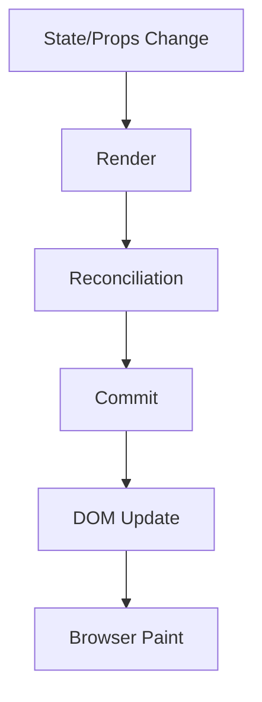
```mermaid
flowchart TD
    A[State/Props Change] --> B[Render]
    B --> C[Reconciliation]
    C --> D[Commit]
    D --> E[DOM Update]
    E --> F[Browser Paint]
```

### B. Component/Data Flow

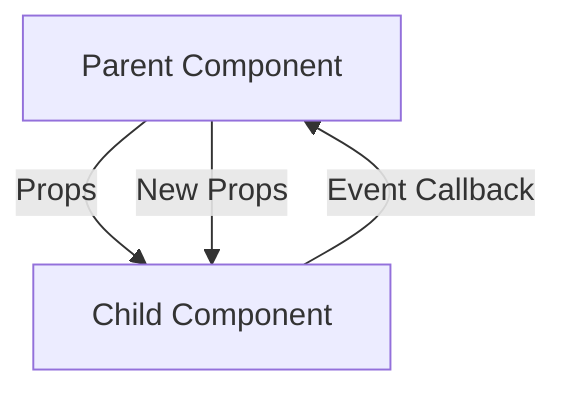
```mermaid
flowchart TD
    Parent[Parent Component] -->|Props| Child[Child Component]
    Child -->|Event Callback| Parent
    Parent -->|New Props| Child
```

### C. useEffect Cleanup Flow

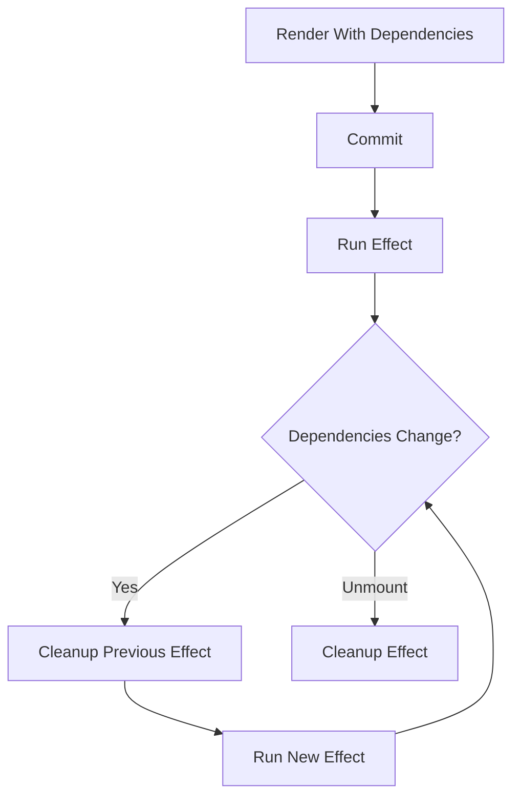
```mermaid
flowchart TD
    A[Render With Dependencies] --> B[Commit]
    B --> C[Run Effect]
    C --> D{Dependencies Change?}
    D -->|Yes| E[Cleanup Previous Effect]
    E --> F[Run New Effect]
    F --> D
    D -->|Unmount| G[Cleanup Effect]
```

### D. State Management Decision Tree

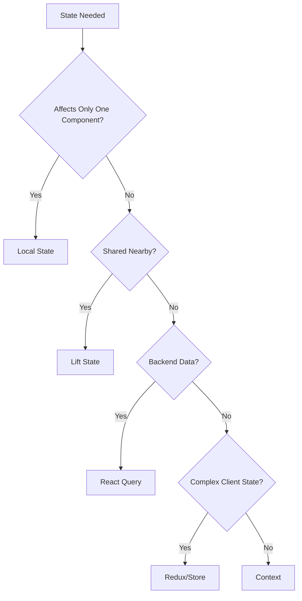
```mermaid
flowchart TD
    A[State Needed] --> B{Affects Only One Component?}
    B -->|Yes| C[Local State]
    B -->|No| D{Shared Nearby?}
    D -->|Yes| E[Lift State]
    D -->|No| F{Backend Data?}
    F -->|Yes| G[React Query]
    F -->|No| H{Complex Client State?}
    H -->|Yes| I[Redux/Store]
    H -->|No| J[Context]
```

### E. Redux vs Server-State Decision

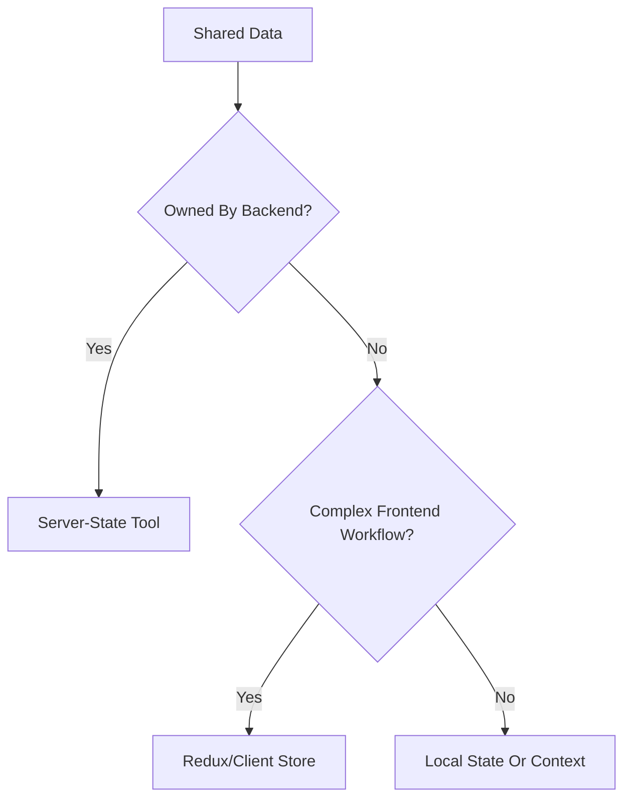
```mermaid
flowchart TD
    A[Shared Data] --> B{Owned By Backend?}
    B -->|Yes| C[Server-State Tool]
    B -->|No| D{Complex Frontend Workflow?}
    D -->|Yes| E[Redux/Client Store]
    D -->|No| F[Local State Or Context]
```

### F. Authentication/Protected Route Flow

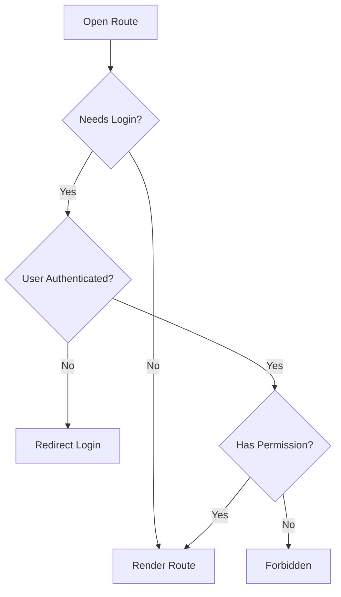
```mermaid
flowchart TD
    A[Open Route] --> B{Needs Login?}
    B -->|No| C[Render Route]
    B -->|Yes| D{User Authenticated?}
    D -->|No| E[Redirect Login]
    D -->|Yes| F{Has Permission?}
    F -->|No| G[Forbidden]
    F -->|Yes| C
```

### G. React Application Architecture

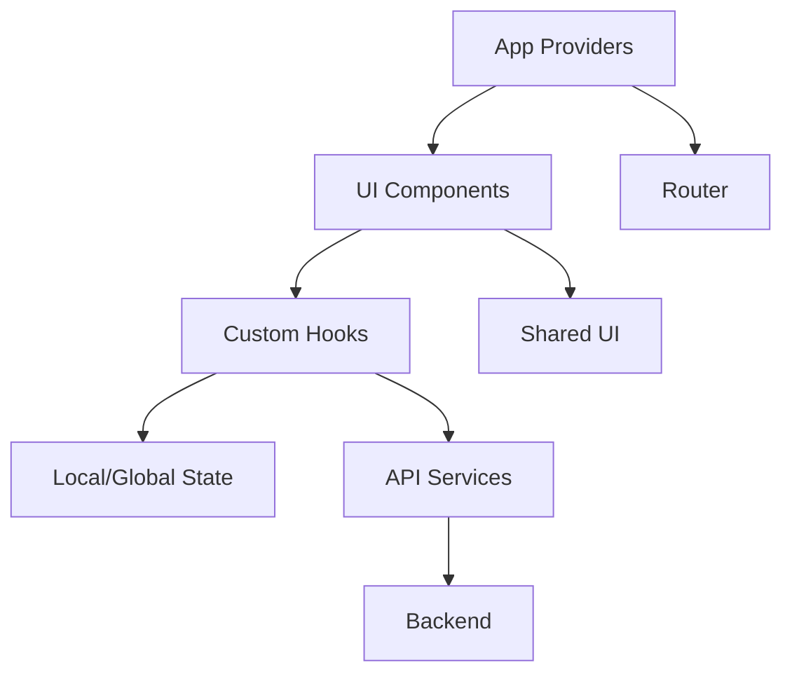
```mermaid
flowchart TD
    UI[UI Components] --> Hooks[Custom Hooks]
    Hooks --> State[Local/Global State]
    Hooks --> API[API Services]
    API --> Server[Backend]
    UI --> Shared[Shared UI]
    App[App Providers] --> UI
    App --> Router[Router]
```

### H. Code Splitting/Lazy Loading

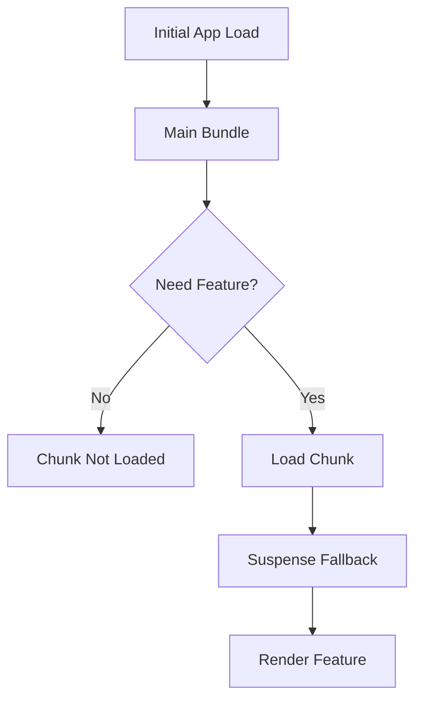
```mermaid
flowchart TD
    A[Initial App Load] --> B[Main Bundle]
    B --> C{Need Feature?}
    C -->|No| D[Chunk Not Loaded]
    C -->|Yes| E[Load Chunk]
    E --> F[Suspense Fallback]
    F --> G[Render Feature]
```

### I. API Request Lifecycle

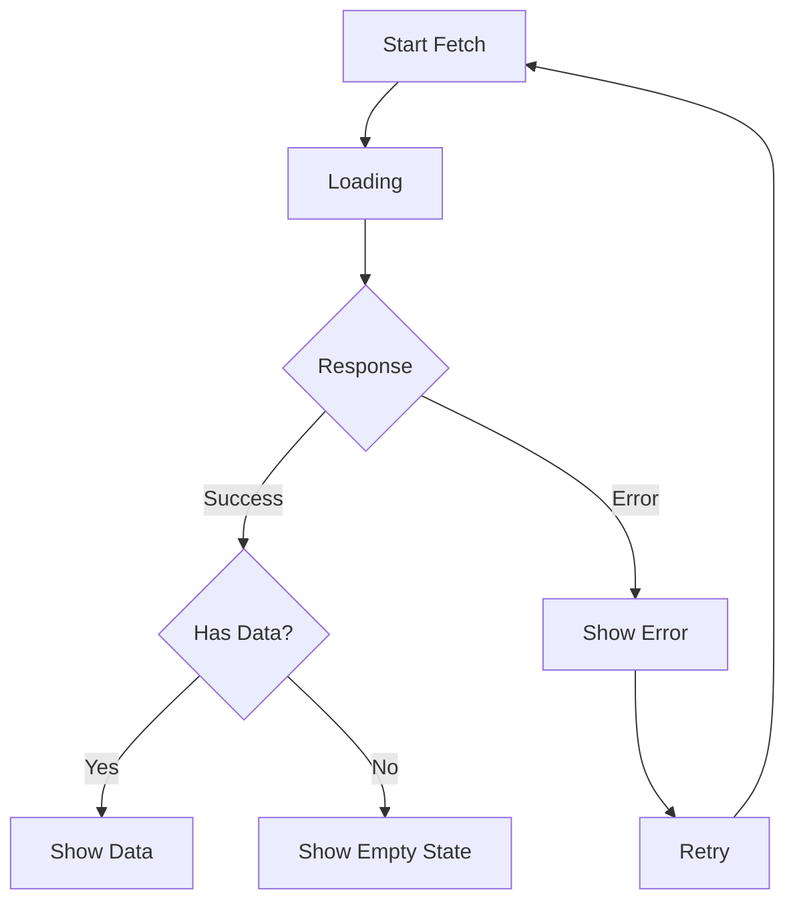
```mermaid
flowchart TD
    A[Start Fetch] --> B[Loading]
    B --> C{Response}
    C -->|Success| D{Has Data?}
    D -->|Yes| E[Show Data]
    D -->|No| F[Show Empty State]
    C -->|Error| G[Show Error]
    G --> H[Retry]
    H --> A
```

### J. Component Re-render Decision Concept

```mermaid
flowchart TD
    A[Update] --> B{State Props Or Context Changed?}
    B -->|Yes| C[Render]
    B -->|Parent Rendered| D{React.memo?}
    D -->|No| C
    D -->|Yes| E{Props Equal?}
    E -->|Yes| F[Skip Render]
    E -->|No| C
    C --> G{Output Changed?}
    G -->|Yes| H[Commit DOM]
    G -->|No| I[No DOM Change]
```

## 24. Interview Questions

### A. Beginner/Foundation

1. What is React?
2. Why do we use React?
3. Is React a library or framework?
4. What is a component?
5. What is JSX?
6. How is JSX different from HTML?
7. What are props?
8. What is state?
9. What is the difference between props and state?
10. What is one-way data flow?
11. What is component composition?
12. What is the `children` prop?
13. How do you render conditionally in React?
14. How do you render a list in React?
15. Why are keys important?
16. Why is array index as key sometimes bad?
17. What is a Fragment?
18. How do events work in React?
19. What are synthetic events?
20. What is a controlled component?
21. What is an uncontrolled component?
22. What is lifting state up?
23. What is prop drilling?
24. How do you make components reusable?
25. What should a component be responsible for?

### B. Intermediate

1. What causes a component to re-render?
2. Does parent re-render always mean child DOM changes?
3. What is `useState`?
4. Why should state not be mutated directly?
5. What is a functional state update?
6. What is batching?
7. Why can state updates appear asynchronous?
8. What is `useEffect`?
9. What is a side effect?
10. How does the dependency array work?
11. What happens with no dependency array?
12. What happens with an empty dependency array?
13. Why do we need cleanup in effects?
14. How do you handle API race conditions?
15. What is a stale closure?
16. What causes infinite effect loops?
17. When should you not use `useEffect`?
18. What is `useRef`?
19. How is `useRef` different from `useState`?
20. What is `useMemo`?
21. What is `useCallback`?
22. What is `React.memo`?
23. How does shallow comparison work?
24. What is Context?
25. When would you use Context?
26. Is Context a replacement for Redux?
27. What is `useReducer`?
28. When would you use `useReducer` over `useState`?
29. What is a custom hook?
30. How is a custom hook different from a utility function?
31. How do you handle routing in React Router v6+?
32. What is a protected route?
33. What is lazy loading?
34. What is code splitting?
35. What is an error boundary?
36. What do error boundaries not catch?
37. How do you test React components?
38. What should you test in React?
39. How do you optimize React performance?
40. How do you debug unnecessary re-renders?

### C. Advanced

1. What is reconciliation?
2. What is diffing?
3. What is Fiber?
4. What is the render phase?
5. What is the commit phase?
6. Can React start rendering and throw away the result?
7. What is referential equality?
8. Why do object dependencies cause effects to re-run?
9. How do keys affect reconciliation?
10. How can wrong keys cause state bugs?
11. What is concurrent rendering conceptually?
12. What is Suspense used for?
13. What does `useTransition` do?
14. What does `useDeferredValue` do?
15. How does context affect re-renders?
16. How can you optimize context performance?
17. How do you design state architecture for a large app?
18. How do you separate server state and client state?
19. How do optimistic updates work?
20. How do you handle stale server data?
21. How do you design reusable components without overengineering?
22. How would you design a large form?
23. How would you design role-based access?
24. How would you reduce bundle size?
25. How would you profile a slow React page?

### D. Scenario-Based

1. Why is this component re-rendering?
2. How would you optimize a slow React page?
3. When would you use Redux?
4. When would you not use Redux?
5. How would you design authentication?
6. How would you protect routes?
7. How would you handle API failures?
8. How would you design a reusable table component?
9. How would you design a large React application?
10. How would you avoid unnecessary API calls?
11. How would you handle a large list?
12. How would you debug a performance issue?
13. How would you structure state?
14. How would you handle a complex form?
15. How would you prevent stale data?
16. How would you share logic between components?
17. How would you fix too many props?
18. How would you fix too many effects?
19. How would you handle token expiry?
20. How would you design loading, error, and empty states?

### E. Tricky Interview Questions

1. Does changing a ref cause a re-render?
2. Does every parent re-render always mean DOM changes?
3. Does `useMemo` always improve performance?
4. Does `useCallback` prevent a function from being recreated?
5. Does `useEffect` run after every render?
6. Why can `useEffect` run twice in development?
7. Why is using array index as a key problematic?
8. Why does an object in a dependency array cause effects to re-run?
9. Why should derived values usually not be stored in state?
10. Is Context a replacement for Redux?
11. Is Redux suitable for server state?
12. Can error boundaries catch async errors?
13. Is frontend authorization enough for security?
14. Does virtual DOM mean React never touches the real DOM?
15. Does `React.memo` stop all re-renders?
16. Can missing dependencies in `useEffect` cause stale bugs?
17. Is `useEffect` needed for every state change?
18. Should all API data go into global state?
19. Is a custom hook the same as a helper function?
20. Are hidden buttons enough for authorization?

## 25. Interview-Ready Answers

### A. What is React?

Question:
What is React?

Short Answer:
React is a JavaScript library for building user interfaces using reusable components. We describe the UI based on state, and React updates the DOM when that state changes. It helps keep complex UI predictable and maintainable.

If interviewer asks deeper:
React uses reconciliation to compare the previous and next UI representation and commits necessary DOM changes.

Deep Explanation:
React encourages declarative UI. Instead of manually selecting DOM nodes and updating them, we write components that return UI for the current state.

Example:

```tsx
function Greeting({ name }: { name: string }) {
    return <h1>Hello, {name}</h1>;
}
```

### B. Props vs State

Question:
What is the difference between props and state?

Short Answer:
Props are inputs passed from a parent component, while state is data managed inside a component. Props should be treated as read-only. State changes over time and causes the component to re-render.

If interviewer asks deeper:
If multiple components need the same state, lift it to their closest common parent or use a shared state solution if it is widely needed.

Deep Explanation:
Props configure a component. State represents information the component owns, such as form input, selected tab, or open/closed status.

Example:

```tsx
function Counter({ step }: { step: number }) {
    const [count, setCount] = useState(0);
    return <button onClick={() => setCount(count + step)}>{count}</button>;
}
```

### C. Why Are Keys Important?

Question:
Why are keys important in React lists?

Short Answer:
Keys help React identify which list item changed, moved, or was removed. Stable keys allow React to preserve the correct component state. Using array index can cause bugs when items are reordered, inserted, or deleted.

If interviewer asks deeper:
Keys are used during reconciliation to match previous children with next children.

Deep Explanation:
Without stable keys, React may reuse the wrong component instance. This is especially dangerous when list items contain inputs or local state.

Example:

```tsx
items.map((item) => <Row key={item.id} item={item} />);
```

### D. What Causes Re-render?

Question:
What causes a component to re-render?

Short Answer:
A component re-renders when its own state changes, when its parent re-renders, when its props change, or when a context value it reads changes. But re-rendering does not always mean the DOM changes. React still compares the output before committing DOM updates.

If interviewer asks deeper:
`React.memo` can skip child rendering if props are shallowly equal, but it does not help with every situation.

Deep Explanation:
Rendering means React calls the component function again to calculate UI. Committing is the step where React applies actual DOM changes.

Example:

```tsx
const Child = React.memo(function Child({ name }: { name: string }) {
    return <p>{name}</p>;
});
```

### E. What Is useEffect?

Question:
What is `useEffect` used for?

Short Answer:
`useEffect` is used to synchronize a component with external systems after rendering. Examples include API calls, subscriptions, timers, and browser APIs. The dependency array controls when the effect runs again.

If interviewer asks deeper:
Cleanup runs before the next effect setup when dependencies change and when the component unmounts.

Deep Explanation:
Effects should not be used for simple derived calculations or event-specific logic. They are for side effects outside the normal render calculation.

Example:

```tsx
useEffect(() => {
    const id = setInterval(tick, 1000);
    return () => clearInterval(id);
}, []);
```

### F. What Is A Stale Closure?

Question:
What is a stale closure in React?

Short Answer:
A stale closure happens when a function captures an old value from a previous render. This often appears in effects, timers, or callbacks. Functional state updates or correct dependencies usually fix it.

If interviewer asks deeper:
Each render has its own values. Functions created during that render close over those values.

Deep Explanation:
If an effect has an empty dependency array but uses changing state, it may keep using the initial value.

Example:

```tsx
setCount((count) => count + 1);
```

### G. useMemo vs useCallback vs React.memo

Question:
What is the difference between `useMemo`, `useCallback`, and `React.memo`?

Short Answer:
`useMemo` memoizes a calculated value. `useCallback` memoizes a function reference. `React.memo` memoizes a component render decision based on props.

If interviewer asks deeper:
All three are useful only when referential equality or expensive rendering/calculation matters. They should not be used blindly.

Deep Explanation:
Memoization has cost. Use it after measuring or when there is a clear reason, such as a memoized child receiving stable props.

Example:

```tsx
const value = useMemo(() => expensive(items), [items]);
const onSelect = useCallback((id: string) => setId(id), []);
const Row = React.memo(RowComponent);
```

### H. Context vs Redux

Question:
Is Context a replacement for Redux?

Short Answer:
Not exactly. Context is mainly for passing values through the component tree without prop drilling. Redux is a state management solution with predictable updates, selectors, middleware, and devtools.

If interviewer asks deeper:
Context can be enough for simple app-wide values like theme or auth. Redux is more useful for complex shared client state.

Deep Explanation:
Putting frequently changing large data into Context can cause many consumers to re-render. Redux-style stores can provide more controlled subscriptions.

Example:

```tsx
const ThemeContext = createContext("light");
```

### I. Redux vs React Query

Question:
What is the difference between Redux and React Query?

Short Answer:
Redux is mainly for client state owned by the frontend. React Query is for server state owned by the backend, with caching, refetching, invalidation, and loading/error handling built in.

If interviewer asks deeper:
API data can be stored in Redux, but then caching and invalidation often become manual.

Deep Explanation:
Server state has different problems: stale data, background refetch, retries, pagination, and optimistic updates.

Example:

```tsx
useQuery({ queryKey: ["users"], queryFn: fetchUsers });
```

### J. Protected Routes

Question:
How do protected routes work?

Short Answer:
A protected route checks whether the user is authenticated before rendering a page. If the user is not logged in, it redirects to login or shows an appropriate state. But backend APIs must still enforce authorization.

If interviewer asks deeper:
Authentication and authorization are different. A user may be logged in but not allowed to access a specific page.

Deep Explanation:
The frontend route guard is for UX. Security must be enforced by the server.

Example:

```tsx
return user ? <Dashboard /> : <Navigate to="/login" replace />;
```

### K. Error Boundaries

Question:
What do error boundaries catch?

Short Answer:
Error boundaries catch rendering errors in their child component tree and show fallback UI. They do not automatically catch async errors, event handler errors, or API failures.

If interviewer asks deeper:
For event handlers and async code, use `try/catch`, promise error handling, or server-state error states.

Deep Explanation:
Error boundaries prevent one broken part of the UI from crashing the whole app.

Example:

```tsx
<ErrorBoundary>
    <UserProfile />
</ErrorBoundary>
```

### L. How Would You Optimize A Slow React Page?

Question:
How would you optimize a slow React page?

Short Answer:
First I would reproduce and measure the problem using the React Profiler and browser tools. Then I would identify whether the issue is re-rendering, expensive computation, large lists, network delay, or bundle size. After that I would apply targeted fixes like better state placement, virtualization, memoization, code splitting, or caching.

If interviewer asks deeper:
I would measure again after each change to make sure the optimization actually helped.

Deep Explanation:
Performance work should be evidence-based. Blind memoization can add complexity without improving the user experience.

Example:

```tsx
const visibleRows = useMemo(() => filterRows(rows, query), [rows, query]);
```

## 26. Common Interview Traps

- `useEffect` is not needed for every state-related calculation.
- Missing dependencies can create stale closures.
- Adding unstable objects to dependency arrays can create loops.
- `useMemo` does not always improve performance.
- `useCallback` does not stop a function from being created during render.
- `React.memo` uses shallow prop comparison.
- New object and function props can break memoization.
- Changing a ref does not cause re-render.
- Re-render does not always mean DOM update.
- Mutating state can prevent correct updates.
- Array index keys can break state when lists reorder.
- Derived values should usually be calculated, not stored.
- Context is not automatically a Redux replacement.
- Redux is not ideal for server cache by default.
- Frontend authorization is not real security.
- Error boundaries do not catch async errors automatically.
- Loading, error, and empty states are part of real UI.
- Overly generic components become hard to use.
- Very large components hide responsibilities.
- Putting every state globally creates coupling.

## 27. React Interview Quick Notes

- React is a UI library based on components.
- UI is a function of state.
- Props are parent-owned inputs.
- State is component-owned changing data.
- Re-render is not the same as DOM update.
- Keys must be stable and unique among siblings.
- Effects synchronize with external systems.
- Cleanup prevents leaks and stale subscriptions.
- Functional state updates avoid stale state.
- Refs persist values without re-rendering.
- Memoization should be targeted.
- Context is best for low-frequency shared values.
- Server state is different from client state.
- Backend must enforce authorization.
- Test user behavior, not implementation details.

## 28. React Decision Guide

- If data affects only one component, use local state.
- If siblings need state, lift state up.
- If many components need low-frequency app data, use Context.
- If client state is complex and shared, use Redux or another store.
- If data comes from backend, use React Query/server-state patterns.
- If a value can be calculated from props/state, derive it during render.
- If calculation is expensive, consider `useMemo`.
- If a memoized child needs a stable callback, consider `useCallback`.
- If a child renders often with same props, consider `React.memo`.
- If a list is huge, use virtualization or pagination.
- If a route is heavy, use lazy loading.
- If logic is reused and uses hooks, create a custom hook.
- If logic is pure and does not use hooks, create a utility function.
- If auth is required, protect route in UI and verify on backend.

## 29. React Interview Traps

- `useEffect(() => {}, [])` can run twice in development StrictMode.
- Array index keys are unsafe for changing lists.
- Objects in dependency arrays compare by reference.
- `useMemo` is not a performance guarantee.
- `useCallback` helps only when function identity matters.
- Context updates re-render consumers.
- Frontend route guards are not security.
- Error boundaries do not handle failed API promises by themselves.
- Derived state can go stale.
- Mutated state may keep the same reference.

## 30. Most Important 50 Questions

1. What is React?
2. Why use React?
3. Is React a library or framework?
4. What is JSX?
5. What is a component?
6. What are props?
7. What is state?
8. Props vs state?
9. What is one-way data flow?
10. What is component composition?
11. What is the `children` prop?
12. How does conditional rendering work?
13. Why are keys important?
14. Why is index as key risky?
15. Controlled vs uncontrolled components?
16. What is lifting state up?
17. What is prop drilling?
18. What causes re-render?
19. Re-render vs DOM update?
20. What is reconciliation?
21. What is the virtual DOM?
22. What is Fiber?
23. Render phase vs commit phase?
24. What is batching?
25. Why can state updates seem async?
26. What is a functional state update?
27. What is `useEffect`?
28. How does dependency array work?
29. What is effect cleanup?
30. What is a stale closure?
31. How do you avoid infinite effects?
32. When should you not use `useEffect`?
33. What is `useRef`?
34. State vs ref?
35. What is `useMemo`?
36. What is `useCallback`?
37. What is `React.memo`?
38. `useMemo` vs `useCallback` vs `React.memo`?
39. What is Context?
40. Context vs Redux?
41. What is `useReducer`?
42. `useState` vs `useReducer`?
43. What is a custom hook?
44. Custom hook vs utility function?
45. Redux vs React Query?
46. How do protected routes work?
47. Authentication vs authorization?
48. What are error boundaries?
49. How do you optimize a slow React page?
50. How do you design a large React app?

## 31. Rapid Revision

React builds UI with components. Components receive props and manage state. Props are read-only inputs from parents; state is local changing data. React follows one-way data flow, so child events usually call parent callbacks to update parent state.

Rendering means React calls components to calculate UI. Reconciliation compares the previous and next output. Commit applies necessary DOM changes. A re-render does not always mean the DOM changed.

Use stable keys for lists. Avoid index keys when items can reorder, insert, or delete. Keys help React preserve the correct component identity.

`useState` handles local state. Use functional updates when next state depends on previous state. Never mutate state directly.

`useEffect` is for synchronizing with external systems: APIs, timers, subscriptions, event listeners, and browser APIs. Use cleanup for timers, subscriptions, and requests. Do not use effects for simple derived values.

`useRef` stores mutable values without causing re-render. Use it for DOM nodes, timer IDs, and previous values.

`useMemo` memoizes calculated values. `useCallback` memoizes function references. `React.memo` skips component rendering when props are shallowly equal. Use them for measured or clear performance reasons.

Context avoids prop drilling for app-wide values like theme, auth, and locale. It is not automatically a replacement for Redux. Redux is better for complex shared client state. React Query is better for server state.

Forms can be controlled or uncontrolled. Controlled forms are easier for validation and dynamic UI. React Hook Form helps with large forms and performance.

Protected routes improve UX, but backend authorization is required for security. Authentication verifies identity; authorization checks permission.

Performance optimization starts with measuring. Use the Profiler, find expensive renders, fix state placement, use virtualization for large lists, split code for heavy routes, cache server data, and memoize only when useful.

Testing should focus on user behavior: render UI, click/type, wait for async results, and verify loading/error/success states.
