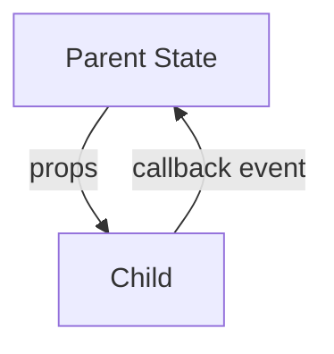
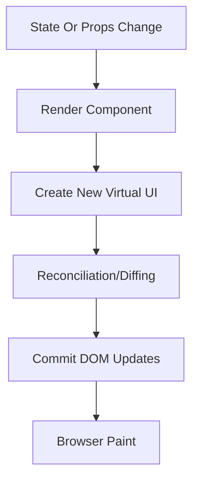
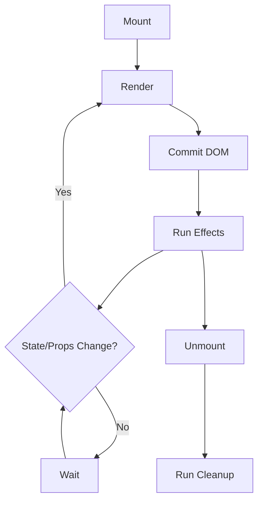
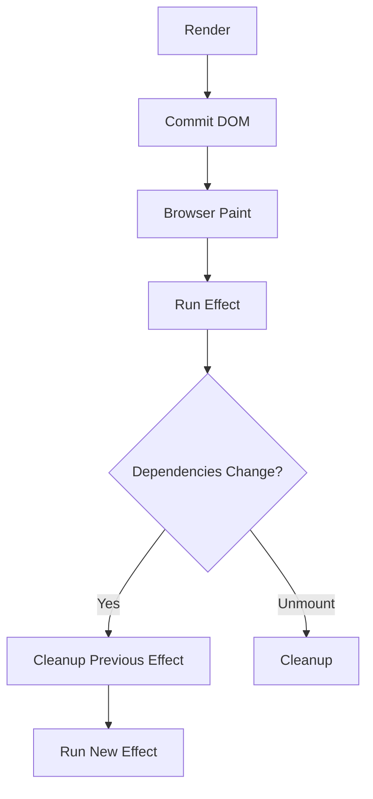
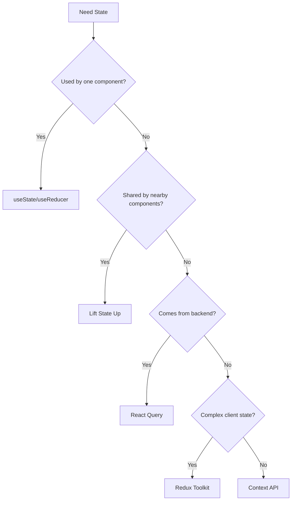
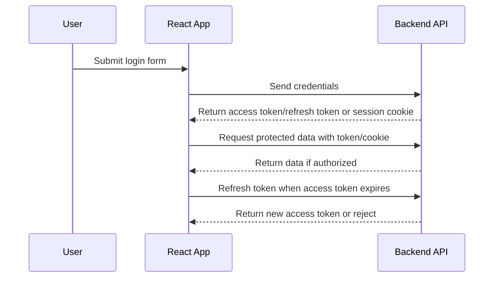
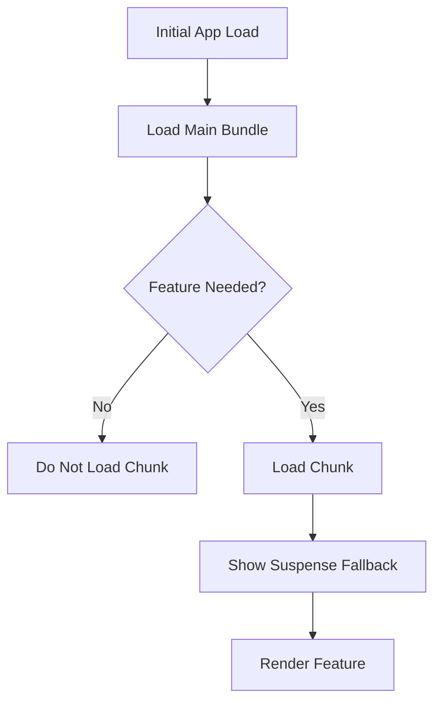
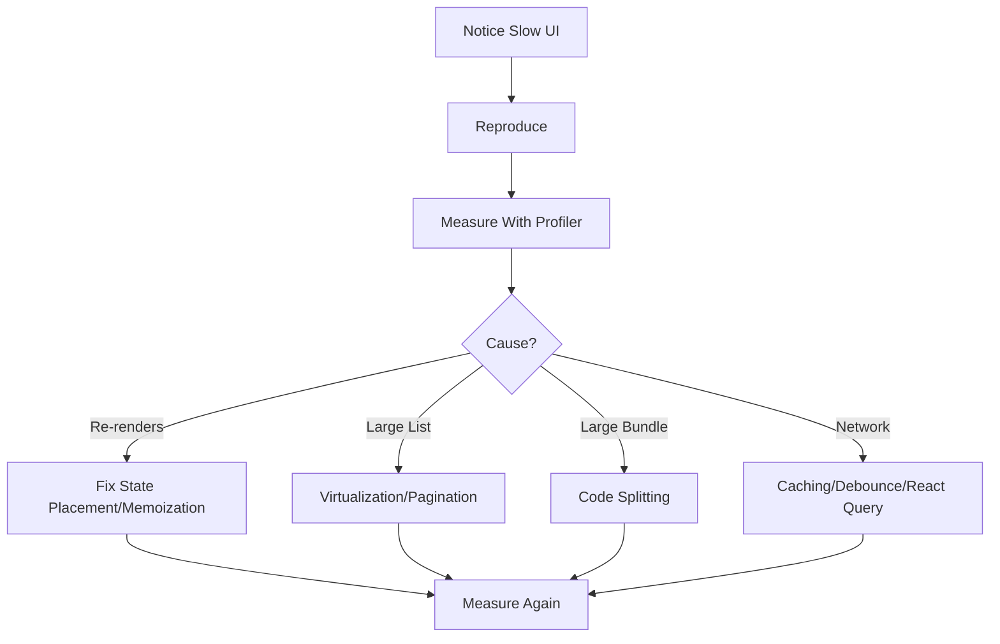
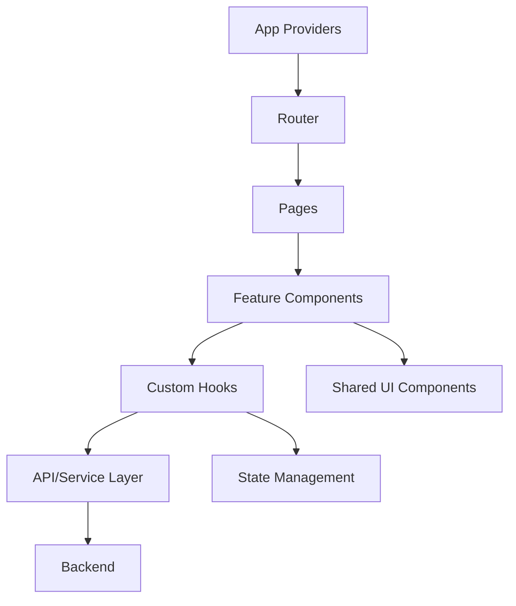

# React Interview Cheat Sheet

For Software Developers with around 2-3 years of experience.

Use this for quick revision, spoken interview answers, and practical scenario questions.

## 1. React Fundamentals

### A. What is React?

React is a JavaScript library for building user interfaces using reusable components.

Short answer:

> React lets us build UI as a tree of components. Each component returns UI based on props and state. When data changes, React re-renders the affected parts and updates the DOM efficiently.

Example:

```tsx
function Welcome({ name }: { name: string }) {
    return <h1>Hello, {name}</h1>;
}
```

When would you use it?

- Interactive web apps.
- Dashboards.
- Forms-heavy apps.
- Reusable UI systems.

Common trap:

- React is a UI library, not a complete framework by itself.

### B. Why React?

- Component-based UI.
- Declarative rendering.
- Strong ecosystem.
- One-way data flow.
- Works well with TypeScript.
- Efficient UI updates through reconciliation.

Interview answer:

> React is useful because it lets us split UI into reusable components and keep the UI in sync with state. Instead of manually updating the DOM, we describe what the UI should look like, and React handles updates.

### C. Library vs Framework

| Point | Library | Framework |
|---|---|---|
| Control | Developer decides structure | Framework gives structure |
| Scope | Usually solves one major problem | Solves many app-level problems |
| React | UI library | Not a full framework |
| Example | React | Angular, Next.js |

## 2. JSX

JSX is a syntax that lets us write HTML-like UI inside JavaScript.

```tsx
const title = <h1 className="heading">React</h1>;
```

JSX is converted to JavaScript:

```tsx
React.createElement("h1", { className: "heading" }, "React");
```

### A. JSX vs HTML

| HTML | JSX |
|---|---|
| `class` | `className` |
| `for` | `htmlFor` |
| Inline style string | Style object |
| JavaScript not directly inside markup | JavaScript expressions with `{}` |

Example:

```tsx
function Status({ isOnline }: { isOnline: boolean }) {
    return <p>{isOnline ? "Online" : "Offline"}</p>;
}
```

Common mistakes:

- Using `class` instead of `className`.
- Returning multiple elements without a wrapper or fragment.
- Putting statements directly inside JSX.

## 3. Components

A component is a reusable UI unit.

```tsx
function Button({ label, onClick }: { label: string; onClick: () => void }) {
    return <button onClick={onClick}>{label}</button>;
}
```

Good components:

- Have one clear responsibility.
- Receive clear props.
- Avoid too much business logic inside UI.
- Are easy to reuse and test.

## 4. Props vs State

| Point | Props | State |
|---|---|---|
| Owner | Parent component | Current component |
| Mutability | Read-only | Updated with setter |
| Purpose | Configure component | Track changing data |
| Re-render | New props can re-render child | State update re-renders owner |

Example:

```tsx
function Counter({ step }: { step: number }) {
    const [count, setCount] = useState(0);

    return <button onClick={() => setCount(count + step)}>{count}</button>;
}
```

Interview answer:

> Props are inputs passed from parent to child. State is data owned by a component that changes over time. Props make components reusable; state makes components interactive.

## 5. One-Way Data Flow

Data flows from parent to child through props. Child components communicate upward using callback props.

```tsx
function Parent() {
    const [selectedId, setSelectedId] = useState<string | null>(null);

    return <UserList selectedId={selectedId} onSelect={setSelectedId} />;
}
```



## 6. Virtual DOM And Reconciliation

### A. Virtual DOM

The Virtual DOM is React's in-memory representation of the UI.

Short answer:

> React creates a virtual representation of the UI, compares it with the previous version, and then updates only the needed parts of the real DOM.

### B. Reconciliation

Reconciliation is React's process of comparing the previous UI tree with the new UI tree.

React checks:

- Element type.
- Props.
- Children.
- Keys in lists.

Rendering flow:



Important trap:

> Re-render does not always mean DOM update. React may re-run the component but skip DOM changes if the output is the same.

## 7. Component Lifecycle

Functional components use hooks to handle lifecycle-like behavior.

| Class Lifecycle Idea | Functional Component Equivalent |
|---|---|
| Mount | `useEffect(..., [])` |
| Update | `useEffect(..., [deps])` |
| Unmount | Cleanup function |

Lifecycle flow:



Interview answer:

> In functional React, lifecycle behavior is usually handled with hooks. Rendering calculates UI, commit updates the DOM, and effects run after commit. Cleanup runs before the effect re-runs or when the component unmounts.

## 8. Hooks

## 9. useState

`useState` stores local component state.

```tsx
function Counter() {
    const [count, setCount] = useState(0);

    return <button onClick={() => setCount(count + 1)}>{count}</button>;
}
```

Use functional updates when the next value depends on the previous value:

```tsx
setCount((count) => count + 1);
```

Object/array update:

```tsx
setUser((user) => ({ ...user, name: "Asha" }));
setItems((items) => [...items, newItem]);
```

Common mistakes:

- Mutating state directly.
- Expecting updated state immediately after setter.
- Storing derived values unnecessarily.

## 10. useEffect

`useEffect` runs side effects after render and commit.

Side effects:

- API calls.
- Timers.
- Subscriptions.
- Event listeners.
- Browser APIs.

Dependency behavior:

| Code | Meaning |
|---|---|
| `useEffect(fn)` | Runs after every render |
| `useEffect(fn, [])` | Runs after mount, with StrictMode dev behavior |
| `useEffect(fn, [id])` | Runs when `id` changes |

Example:

```tsx
useEffect(() => {
    const id = setInterval(() => {
        console.log("tick");
    }, 1000);

    return () => clearInterval(id);
}, []);
```

useEffect flow:



When not to use `useEffect`:

- To calculate derived data.
- For logic that belongs directly in an event handler.
- To sync two states that should be one state.

Common trap:

```tsx
const user = { id: 1 };

useEffect(() => {
    fetchUser(user);
}, [user]); // new object every render
```

## 11. useRef

`useRef` stores a mutable value that does not cause a re-render.

DOM ref:

```tsx
function SearchBox() {
    const inputRef = useRef<HTMLInputElement | null>(null);

    return (
        <>
            <input ref={inputRef} />
            <button onClick={() => inputRef.current?.focus()}>Focus</button>
        </>
    );
}
```

Mutable value:

```tsx
const timerRef = useRef<number | null>(null);
```

State vs ref:

| State | Ref |
|---|---|
| Causes re-render | Does not cause re-render |
| Used for UI data | Used for mutable non-UI data |
| Updated with setter | Updated with `.current` |

Interview trap:

> Changing a ref does not re-render the component.

## 12. useMemo vs useCallback vs React.memo

| Feature | What it memoizes | Use when |
|---|---|---|
| `useMemo` | Calculated value | Expensive calculation or stable object/array needed |
| `useCallback` | Function reference | Stable callback needed |
| `React.memo` | Component render decision | Child receives same props often |

Example:

```tsx
const filteredUsers = useMemo(() => {
    return users.filter((user) => user.name.includes(search));
}, [users, search]);

const handleSelect = useCallback((id: string) => {
    setSelectedId(id);
}, []);

const UserRow = React.memo(function UserRow({ user }: { user: User }) {
    return <li>{user.name}</li>;
});
```

Short answer:

> `useMemo` memoizes a value, `useCallback` memoizes a function reference, and `React.memo` skips a component render when props are shallowly equal.

Common traps:

- `useMemo` does not always improve performance.
- `useCallback` does not stop a function from being created; it can return a cached reference.
- `React.memo` can fail to help if props are new objects/functions every render.

## 13. Controlled vs Uncontrolled Components

Controlled input:

```tsx
function EmailInput() {
    const [email, setEmail] = useState("");

    return <input value={email} onChange={(event) => setEmail(event.target.value)} />;
}
```

Uncontrolled input:

```tsx
function EmailInput() {
    const inputRef = useRef<HTMLInputElement | null>(null);

    function handleSubmit() {
        console.log(inputRef.current?.value);
    }

    return <input ref={inputRef} />;
}
```

| Controlled | Uncontrolled |
|---|---|
| React state is source of truth | DOM is source of truth |
| Easier validation | Less React state |
| More re-renders | Useful for simple forms/file input |

## 14. Event Handling

React events use camelCase.

```tsx
function SaveButton() {
    function handleClick() {
        console.log("saved");
    }

    return <button onClick={handleClick}>Save</button>;
}
```

Passing arguments:

```tsx
<button onClick={() => deleteUser(user.id)}>Delete</button>
```

Common mistake:

```tsx
<button onClick={deleteUser(user.id)}>Delete</button>
```

This calls the function during render instead of on click.

## 15. Conditional Rendering

```tsx
function Profile({ user }: { user: User | null }) {
    if (!user) {
        return <p>Please login</p>;
    }

    return <h2>{user.name}</h2>;
}
```

Common patterns:

```tsx
{isLoading && <Spinner />}
{error ? <ErrorMessage /> : <UserList users={users} />}
```

Trap:

```tsx
{items.length && <List items={items} />}
```

This can render `0`. Prefer:

```tsx
{items.length > 0 && <List items={items} />}
```

## 16. Lists And Keys

```tsx
function TodoList({ todos }: { todos: Todo[] }) {
    return (
        <ul>
            {todos.map((todo) => (
                <li key={todo.id}>{todo.title}</li>
            ))}
        </ul>
    );
}
```

Why keys matter:

- Help React match list items.
- Preserve correct component state.
- Improve reconciliation.

Interview answer:

> Keys give list items stable identity. Using array index as key can cause bugs when items are inserted, removed, or reordered.

## 17. Forms

Form basics:

- Store values.
- Validate input.
- Show errors.
- Handle submit.
- Handle loading and API failure.

Example:

```tsx
function LoginForm() {
    const [email, setEmail] = useState("");
    const [password, setPassword] = useState("");
    const [error, setError] = useState<string | null>(null);

    async function handleSubmit(event: React.FormEvent<HTMLFormElement>) {
        event.preventDefault();

        if (!email.includes("@")) {
            setError("Enter a valid email");
            return;
        }

        setError(null);
        await login({ email, password });
    }

    return (
        <form onSubmit={handleSubmit}>
            <input value={email} onChange={(event) => setEmail(event.target.value)} />
            <input
                type="password"
                value={password}
                onChange={(event) => setPassword(event.target.value)}
            />
            {error && <p>{error}</p>}
            <button type="submit">Login</button>
        </form>
    );
}
```

When to use React Hook Form:

- Large forms.
- Many fields.
- Validation rules.
- Better performance with fewer controlled re-renders.

## 18. API Calls And Async Handling

Basic API call:

```tsx
function UsersPage() {
    const [users, setUsers] = useState<User[]>([]);
    const [isLoading, setIsLoading] = useState(false);
    const [error, setError] = useState<string | null>(null);

    useEffect(() => {
        const controller = new AbortController();

        async function loadUsers() {
            try {
                setIsLoading(true);
                setError(null);

                const response = await fetch("/api/users", {
                    signal: controller.signal,
                });

                if (!response.ok) {
                    throw new Error("Failed request");
                }

                setUsers(await response.json());
            } catch (error) {
                if (error instanceof DOMException && error.name === "AbortError") {
                    return;
                }

                setError("Could not load users");
            } finally {
                setIsLoading(false);
            }
        }

        loadUsers();

        return () => controller.abort();
    }, []);

    if (isLoading) return <p>Loading...</p>;
    if (error) return <p>{error}</p>;
    if (users.length === 0) return <p>No users found</p>;

    return <UserList users={users} />;
}
```

Interview points:

- Always handle loading, error, empty, and success states.
- Use cleanup or abort logic to avoid race conditions.
- Do not ignore failed HTTP statuses.

## 19. Context API vs Redux/Redux Toolkit

### A. Context API

Context passes data through the tree without prop drilling.

```tsx
const ThemeContext = createContext<"light" | "dark">("light");

function App() {
    return (
        <ThemeContext.Provider value="dark">
            <Toolbar />
        </ThemeContext.Provider>
    );
}

function Toolbar() {
    const theme = useContext(ThemeContext);
    return <button className={theme}>Save</button>;
}
```

Use Context for:

- Theme.
- Current user.
- Locale.
- Feature flags.

Avoid Context for:

- Fast-changing large state.
- Server cache.
- State used by only one component.

### B. Redux/Redux Toolkit

Redux is for predictable global client state management. Redux Toolkit reduces boilerplate and is the recommended Redux style.

Use Redux/RTK for:

- Complex shared client state.
- State updates from many places.
- Workflows like cart, permissions, multi-step state.
- Need for devtools and predictable actions.

Context vs Redux:

| Context | Redux/Redux Toolkit |
|---|---|
| Passing values through tree | Managing complex global state |
| Good for simple app-wide values | Good for complex shared client state |
| Can re-render all consumers | Selector-based subscriptions |
| Less setup | More structure and tooling |

Interview answer:

> Context helps avoid prop drilling, but it is not a full state management solution like Redux. For simple app-wide values Context is enough. For complex shared client state, Redux Toolkit gives better structure, debugging, and predictable updates.

## 20. React Query

React Query is used for server state: data fetched from APIs.

Server state is different because:

- Backend owns it.
- It can become stale.
- It needs caching, refetching, retries, and invalidation.

Example:

```tsx
function UsersPage() {
    const usersQuery = useQuery({
        queryKey: ["users"],
        queryFn: fetchUsers,
    });

    if (usersQuery.isLoading) return <p>Loading...</p>;
    if (usersQuery.isError) return <p>Failed to load users</p>;

    return <UserList users={usersQuery.data} />;
}
```

Redux vs React Query:

| Redux | React Query |
|---|---|
| Client state | Server state |
| Manual cache logic | Built-in cache |
| Manual invalidation patterns | Built-in invalidation |
| Good for UI workflows | Good for API data |

Interview answer:

> Redux is better for client-owned state. React Query is better for backend-owned data because it handles caching, loading, errors, stale data, refetching, and invalidation.

## 21. State Management Decision Tree



## 22. Custom Hooks

A custom hook is a reusable function that uses React hooks.

Rules:

- Name starts with `use`.
- Follow Rules of Hooks.
- Keep one clear responsibility.

Example: `useDebounce`

```tsx
function useDebounce<T>(value: T, delay: number) {
    const [debouncedValue, setDebouncedValue] = useState(value);

    useEffect(() => {
        const id = setTimeout(() => setDebouncedValue(value), delay);
        return () => clearTimeout(id);
    }, [value, delay]);

    return debouncedValue;
}
```

Custom hook vs utility function:

| Custom Hook | Utility Function |
|---|---|
| Can use hooks | Cannot use hooks |
| Has React lifecycle behavior | Pure helper |
| Shares stateful logic | Shares stateless logic |

Interview answer:

> I create a custom hook when reusable logic needs React features like state, effects, refs, or context. If the logic is just a pure calculation, I keep it as a normal utility function.

## 23. React Router

Modern React Router uses `Routes`, `Route`, `Link`, `NavLink`, `useNavigate`, `useParams`, `useLocation`, and `Outlet`.

Example:

```tsx
function AppRouter() {
    return (
        <BrowserRouter>
            <Routes>
                <Route path="/" element={<Home />} />
                <Route path="/users/:userId" element={<UserDetails />} />
                <Route path="/dashboard" element={<ProtectedRoute><Dashboard /></ProtectedRoute>} />
                <Route path="*" element={<NotFound />} />
            </Routes>
        </BrowserRouter>
    );
}
```

Dynamic params:

```tsx
function UserDetails() {
    const { userId } = useParams();
    return <p>User: {userId}</p>;
}
```

Protected route:

```tsx
function ProtectedRoute({ children }: { children: React.ReactNode }) {
    const { user, isLoading } = useAuth();

    if (isLoading) return <p>Checking session...</p>;
    if (!user) return <Navigate to="/login" replace />;

    return <>{children}</>;
}
```

Interview trap:

> Frontend protected routes are for user experience. Backend APIs must still check authorization.

## 24. Authentication And JWT Flow

Authentication verifies who the user is. Authorization checks what the user can access.

JWT flow:



Common approach:

- User logs in.
- Backend verifies credentials.
- Backend returns token/session.
- Frontend stores auth state.
- Protected routes check auth state.
- API requests include token or cookie.
- Backend validates token and permissions.

Security mistakes:

- Trusting only frontend route guards.
- Storing sensitive tokens carelessly.
- Not handling token expiry.
- Not clearing auth state on logout.
- Hiding buttons but not protecting APIs.

## 25. Error Boundaries

Error boundaries catch rendering errors in child components and show fallback UI.

Class example:

```tsx
type Props = { children: React.ReactNode };
type State = { hasError: boolean };

class ErrorBoundary extends React.Component<Props, State> {
    state = { hasError: false };

    static getDerivedStateFromError() {
        return { hasError: true };
    }

    render() {
        if (this.state.hasError) {
            return <p>Something went wrong.</p>;
        }

        return this.props.children;
    }
}
```

Caught:

- Render errors.
- Lifecycle errors.
- Constructor errors below boundary.

Not caught:

- Event handler errors.
- Async errors.
- API failures.
- Errors inside the boundary itself.

## 26. Lazy Loading And Code Splitting

Code splitting divides the app bundle into smaller chunks. Lazy loading loads a chunk only when needed.

```tsx
const SettingsPage = React.lazy(() => import("./SettingsPage"));

function App() {
    return (
        <Suspense fallback={<p>Loading...</p>}>
            <SettingsPage />
        </Suspense>
    );
}
```

Flow:



Use for:

- Routes.
- Heavy charts.
- Rich text editors.
- Admin-only modules.
- Large modals.

## 27. Performance Optimization

Common performance issues:

- Unnecessary re-renders.
- Expensive calculations during render.
- Large lists.
- Large bundle size.
- Slow API calls.
- Context causing many re-renders.
- Images and third-party libraries.

Optimization flow:



Performance tools:

| Problem | Solution |
|---|---|
| Expensive calculation | `useMemo` |
| Stable callback needed | `useCallback` |
| Child re-rendering with same props | `React.memo` |
| Huge list | Virtualization |
| Large initial bundle | Lazy loading/code splitting |
| Frequent search API calls | Debounce |
| Server data refetching | React Query cache |

Interview answer:

> I first measure with React DevTools Profiler instead of guessing. Then I check render frequency, expensive components, large lists, bundle size, and network calls. After optimizing, I measure again.

## 28. React 18+ Features

| Feature | Meaning | Interview Point |
|---|---|---|
| Automatic batching | Multiple state updates batched together | Fewer renders |
| Concurrent rendering concepts | React can prepare UI without blocking as much | Mostly internal, enables smoother UI |
| `useTransition` | Marks updates as non-urgent | Useful for expensive UI updates |
| `useDeferredValue` | Defers a changing value | Useful for search/filter UI |
| Suspense improvements | Better async UI patterns | Common with lazy loading/frameworks |
| `createRoot` | Modern root API | Enables React 18 behavior |

Example:

```tsx
const [isPending, startTransition] = useTransition();

function handleSearch(value: string) {
    setInput(value);
    startTransition(() => {
        setQuery(value);
    });
}
```

StrictMode trap:

> In development, StrictMode may run effects twice to detect unsafe side effects. Production does not intentionally double-run them the same way.

## 29. Component Architecture

Good structure:

```text
src/
|-- app/
|   |-- router.tsx
|   `-- providers.tsx
|-- features/
|   |-- auth/
|   |-- users/
|   `-- products/
|-- shared/
|   |-- components/
|   |-- hooks/
|   |-- utils/
|   `-- api/
`-- main.tsx
```

Architecture diagram:



Practical rules:

- Keep page components thin.
- Keep reusable UI in `shared`.
- Keep feature-specific logic inside feature folders.
- Move API logic to service functions.
- Extract reusable stateful logic into custom hooks.
- Avoid huge components.
- Avoid premature abstraction.

## 30. Quick Comparison Tables

### A. useEffect vs useMemo

| useEffect | useMemo |
|---|---|
| Runs after render | Runs during render |
| Handles side effects | Computes memoized value |
| Can return cleanup | Should be pure |

### B. useState vs useReducer

| useState | useReducer |
|---|---|
| Simple state | Complex state transitions |
| Direct setter | Dispatch actions |
| Less boilerplate | More predictable for complex logic |

### C. Context vs Redux vs React Query

| Tool | Best for |
|---|---|
| Context | Theme, auth user, locale |
| Redux Toolkit | Complex shared client state |
| React Query | Server/API data |

### D. CSR vs SSR

| CSR | SSR |
|---|---|
| Browser renders after JS loads | Server sends HTML |
| Good for interactive apps | Better first load/SEO |
| Simpler static hosting | More server/framework complexity |

## 31. Most-Asked Interview Questions

### A. What is React?

React is a JavaScript library for building UI using components. It keeps UI in sync with state and updates the DOM efficiently.

### B. What is JSX?

JSX is HTML-like syntax inside JavaScript. It is converted into JavaScript calls that create React elements.

### C. Props vs state?

Props are read-only inputs from parent components. State is data owned and updated by the current component.

### D. What causes re-render?

State changes, parent re-renders, prop changes, context changes, or external store updates can cause re-renders.

### E. What is reconciliation?

Reconciliation is React's process of comparing old and new UI trees to decide what DOM updates are needed.

### F. Why are keys important?

Keys help React identify list items across renders. Stable keys prevent incorrect state reuse.

### G. What is useEffect?

`useEffect` runs side effects after render, such as API calls, subscriptions, timers, or browser interactions.

### H. What is cleanup in useEffect?

Cleanup removes old side effects before the next effect or unmount, such as clearing timers or removing listeners.

### I. What is useRef?

`useRef` stores a mutable value that persists across renders but does not cause a re-render when changed.

### J. What is React.memo?

`React.memo` can skip re-rendering a component when its props are shallowly equal.

### K. Is Context a replacement for Redux?

No. Context passes values through the tree. Redux manages complex global client state with predictable updates and tooling.

### L. Redux vs React Query?

Redux is for client-owned state. React Query is for backend-owned server state with caching and refetching.

### M. What are error boundaries?

Error boundaries catch rendering errors in child components and show fallback UI.

### N. What is lazy loading?

Lazy loading loads code only when needed, usually with dynamic import and `React.lazy`.

### O. How do protected routes work?

They check auth state before rendering a route. If unauthenticated, they redirect to login. Backend must still enforce security.

## 32. Scenario-Based Questions

### A. Why is my component re-rendering?

Check whether its state changed, parent re-rendered, props changed, context changed, or a store subscription updated. Use React DevTools Profiler to confirm.

### B. How would you optimize a slow page?

Measure first. Then check unnecessary re-renders, expensive calculations, large lists, network calls, and bundle size. Use targeted fixes like memoization, virtualization, caching, or code splitting.

### C. When would you use Redux?

Use Redux Toolkit when complex client state is shared across many unrelated components and needs predictable updates, debugging, and structured actions.

### D. When would you not use Redux?

Do not use Redux for simple local state, form input state, modal open state, or API cache that fits better in React Query.

### E. How would you handle a large list?

Use pagination or virtualization. Keep row components small, use stable keys, and avoid expensive work inside each row render.

### F. How would you design authentication?

Use a login API, store auth/session state, protect routes in React, attach token/cookie to API requests, refresh expired sessions if needed, and enforce authorization on the backend.

### G. How would you handle API failures?

Show error UI, provide retry, log/report if needed, preserve useful previous data where possible, and avoid crashing the whole page.

### H. How would you share logic between components?

If the logic uses React state/effects/context, create a custom hook. If it is pure logic, create a utility function.

## 33. When Would You Use This?

| Need | Use |
|---|---|
| Local UI value | `useState` |
| Complex local state transitions | `useReducer` |
| DOM element access | `useRef` |
| API calls or subscriptions | `useEffect` or React Query |
| Expensive calculated value | `useMemo` |
| Stable function reference | `useCallback` |
| Skip child render with same props | `React.memo` |
| App-wide theme/auth/locale | Context |
| Complex shared client state | Redux Toolkit |
| Server data cache | React Query |
| Reused hook-based logic | Custom hook |
| Large route/module | Lazy loading |
| Runtime render error fallback | Error boundary |

## 34. Common React Mistakes And Interview Traps

- Mutating state directly.
- Using array index as key for dynamic lists.
- Storing derived state unnecessarily.
- Missing dependencies in `useEffect`.
- Adding unstable objects/functions to dependency arrays.
- Using `useEffect` for logic that belongs in event handlers.
- Forgetting cleanup for timers/listeners/subscriptions.
- Assuming re-render means DOM update.
- Using `useMemo` everywhere.
- Using `useCallback` everywhere.
- Thinking Context is always better than props.
- Putting all state in Redux.
- Putting server data in Redux when React Query is better.
- Trusting frontend route protection for security.
- Ignoring loading/error/empty states.
- Creating huge components.
- Creating overly generic reusable components too early.

## 35. Final Rapid Revision

React builds UI with components. Props are read-only inputs. State is component-owned data that changes. React re-renders when state, props, parent render, or context changes.

JSX is converted into JavaScript. The Virtual DOM is React's UI representation. Reconciliation compares old and new UI and commits only needed DOM changes.

Use stable keys for lists. Avoid index keys when list order can change.

`useState` is for local state. Use functional updates when depending on previous state. Never mutate state directly.

`useEffect` is for side effects like APIs, subscriptions, timers, and browser APIs. Cleanup prevents leaks. Do not use effects for simple derived values.

`useRef` stores mutable values without re-rendering. `useMemo` memoizes values. `useCallback` memoizes function references. `React.memo` skips child renders when props are equal.

Context is good for theme/auth/locale. Redux Toolkit is good for complex shared client state. React Query is good for server state.

Controlled forms store values in React state. Uncontrolled forms store values in the DOM. React Hook Form helps with large forms.

Protected routes improve UX, but backend authorization is required for security. JWT access tokens should be handled carefully, with expiry and refresh flow considered.

For performance, measure first. Then optimize state placement, memoization, large lists, bundle size, and API calls. Avoid blind memoization.

For architecture, keep components focused, move API logic to services, extract reusable stateful logic into custom hooks, and organize large apps by feature.
