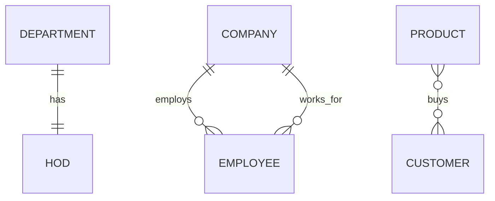
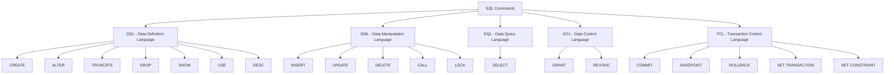
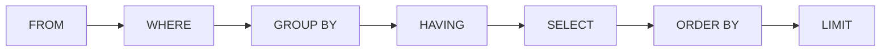
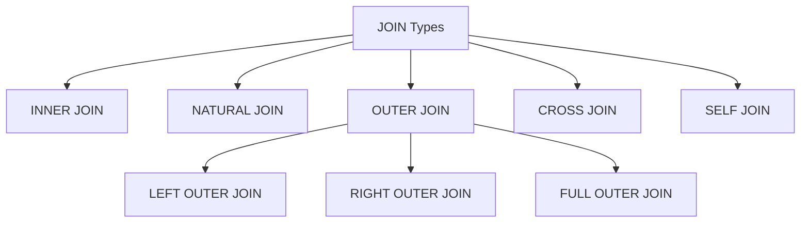
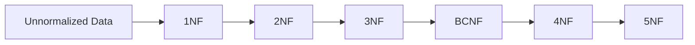

# SQL Interview Cheat Sheet

## DBMS / SQL Basics

- **Data**: small collection of facts and figures.
- **Database**: large collection of facts and figures.
- **DBMS**: software used to store, manage, fetch, and update data efficiently.
- **MySQL**: open-source RDBMS.
- **SQL**: Structured Query Language, used to communicate with a database.
- **SEQL**: Structured English Query Language, earlier name related to SQL.
- **Database objects**: objects created using `CREATE`, such as table, index, view, trigger, and stored procedure.

Basic commands:

```sql
SHOW DATABASES;
USE database_name;
DESC table_name;
```

Interview note:

- `;` terminates and executes an SQL statement.
- ER-to-relational mapping: entity becomes table, attribute becomes column.

## ER Model

ER diagram is a diagrammatic representation of data.

| ER Concept | Meaning | Symbol Idea |
|---|---|---|
| Entity | Real-world object | Rectangle |
| Attribute | Property of entity | Ellipse |
| Key attribute | Unique identifier | Underlined ellipse |
| Multivalued attribute | Stores multiple values | Double ellipse |
| Derived attribute | Can be derived from another attribute | Dotted ellipse |
| Weak entity | Cannot contain its own key attribute | Double rectangle |
| Relationship | Association between entities | Diamond |

Attribute types:

- **Simple**: cannot be divided, example `id`, `age`, `email`.
- **Composite**: can be divided, example `name -> first_name, last_name`.
- **Single-valued**: stores one value.
- **Multivalued**: stores more than one value, example multiple emails.
- **Derived**: derived from another attribute, example `age` from `DOB`.

Keys:

- **Primary key**: unique and not null.
- **Foreign key**: creates relationship between tables; duplicate values are allowed.
- **Composite primary key**: primary key made from multiple columns.

Steps to create ER diagram:

1. Identify entities.
2. Identify attributes.
3. Identify relationships.
4. Identify cardinality ratio.
5. Draw ER diagram.

### ER Relationship / Cardinality



Cardinality types:

- **1:1**: one-to-one.
- **1:M**: one-to-many.
- **M:1**: many-to-one.
- **M:N**: many-to-many.

## SQL Command Types



| Type | Purpose | Commands |
|---|---|---|
| DDL | Defines database structure | `CREATE`, `ALTER`, `TRUNCATE`, `DROP`, `SHOW`, `USE`, `DESC` |
| DML | Changes data | `INSERT`, `UPDATE`, `DELETE`, `CALL`, `LOCK` |
| DQL | Reads data | `SELECT` |
| DCL | Controls privileges | `GRANT`, `REVOKE` |
| TCL | Controls transactions | `COMMIT`, `SAVEPOINT`, `ROLLBACK` |

## Data Types

| Data Type | Use |
|---|---|
| `INT` | Integer numbers |
| `FLOAT` | Decimal numbers |
| `CHAR(n)` | Fixed-length string, up to 255 characters |
| `VARCHAR(n)` | Variable-length string |
| `DATE` | Date value, format `YYYY-MM-DD` |

Example:

```sql
CREATE TABLE student (
    id INT,
    name VARCHAR(15),
    sem1 INT,
    sem2 INT,
    avg FLOAT
);
```

## Constraints

Constraints are rules applied to columns while creating or modifying a table.

| Constraint | Meaning |
|---|---|
| `NOT NULL` | Column cannot store null values |
| `UNIQUE` | Column cannot contain duplicate values |
| `CHECK` | Value must satisfy a condition |
| `DEFAULT` | Sets a default value |
| `PRIMARY KEY` | Unique and not null |
| `FOREIGN KEY` | Links one table to another table |

Example:

```sql
CREATE TABLE employee (
    e_id INT PRIMARY KEY,
    e_name VARCHAR(30) NOT NULL,
    salary INT CHECK (salary > 0),
    d_id INT
);
```

## SELECT / WHERE / Operators

Basic syntax:

```sql
SELECT column1, column2
FROM table_name
WHERE condition;
```

Arithmetic operators:

```sql
SELECT e_id, e_name, salary + 3000 AS new_salary
FROM employee;

SELECT e_id, e_name, salary - 1000 AS reduced_salary
FROM employee;
```

Comparison operators:

| Operator | Meaning |
|---|---|
| `=` | Equal |
| `>` | Greater than |
| `<` | Less than |
| `>=` | Greater than or equal |
| `<=` | Less than or equal |
| `<>` | Not equal |

Examples:

```sql
SELECT product_name
FROM product
WHERE price = 15000;

SELECT e_id, e_name, salary
FROM employee
WHERE salary < 20000;

SELECT product_name
FROM product
WHERE price <> 15000;
```

Logical and special operators:

| Operator | Use |
|---|---|
| `AND` | All conditions must be true |
| `OR` | Any one condition must be true |
| `DISTINCT` | Returns unique values |
| `BETWEEN AND` | Checks range |
| `NOT BETWEEN AND` | Excludes range |
| `IN` | Checks values in a list |
| `NOT IN` | Excludes values in a list |
| `IS NULL` | Checks missing value |
| `IS NOT NULL` | Checks present value |
| `LIKE` | Pattern matching |

Examples:

```sql
SELECT *
FROM employee
WHERE d_id = 12 AND salary < 25000;

SELECT DISTINCT d_id
FROM employee;

SELECT *
FROM employee
WHERE salary BETWEEN 20000 AND 30000;

SELECT *
FROM department
WHERE d_id IN (22, 24, 26);

SELECT *
FROM employee
WHERE commission_pct IS NULL;
```

## LIKE

`LIKE` is used to search partial information.

| Pattern | Meaning |
|---|---|
| `'a%'` | Starts with `a` |
| `'%a'` | Ends with `a` |
| `'%us%'` | Contains `us` |
| `'_r%'` | Second character is `r` |
| `'%v__'` | Last third character is `v` |
| `'____'` | Exactly 4 characters |

Examples:

```sql
SELECT *
FROM employee
WHERE e_fname LIKE 'w%';

SELECT *
FROM employee
WHERE e_lname LIKE '%a';

SELECT *
FROM department
WHERE d_name LIKE '%in%';
```

## ORDER BY / LIMIT

`ORDER BY` sorts data. Default order is ascending.

```sql
SELECT *
FROM employee
ORDER BY e_fname ASC;

SELECT *
FROM employee
ORDER BY d_id DESC;
```

Combined with `WHERE`:

```sql
SELECT *
FROM employee
WHERE d_id > 20 AND salary > 10000
ORDER BY e_lname DESC;
```

`LIMIT` restricts number of rows. `OFFSET` skips rows.

```sql
-- 2nd highest salary
SELECT salary
FROM employee
ORDER BY salary DESC
LIMIT 1 OFFSET 1;
```

Interview note:

- `LIMIT 1 OFFSET 0` gives the first row.
- `LIMIT 1 OFFSET 1` gives the second row.

## Functions

### Single-Row Functions

Operate on one row and return one result per row.

| Function | Use | Example |
|---|---|---|
| `CONCAT()` | Joins strings | `CONCAT(e_fname, ' ', e_lname)` |
| `LENGTH()` | String length | `LENGTH(d_name)` |
| `SUBSTR()` | Part of string | `SUBSTR(e_fname, 2, 3)` |
| `INSTR()` | Position of character/string | `INSTR(d_name, 'a')` |

Examples:

```sql
SELECT CONCAT(e_fname, ' ', e_lname) AS full_name
FROM employee;

SELECT LENGTH(d_name)
FROM department;

SELECT SUBSTR(e_fname, 2, 3)
FROM employee
WHERE e_fname = 'William';

SELECT INSTR(d_name, 'a')
FROM department;
```

### Aggregate / Multi-Row Functions

Operate on many rows and return one output.

| Function | Use |
|---|---|
| `COUNT()` | Counts rows/values |
| `SUM()` | Total |
| `MIN()` | Minimum |
| `MAX()` | Maximum |
| `AVG()` | Average |

Examples:

```sql
SELECT COUNT(*)
FROM employee;

SELECT SUM(salary)
FROM employee;

SELECT MIN(salary), MAX(salary), AVG(salary)
FROM employee;
```

## GROUP BY / HAVING

`GROUP BY` groups rows and is commonly used with aggregate functions.

```sql
SELECT d_id, AVG(salary)
FROM employee
GROUP BY d_id;

SELECT d_id, SUM(salary)
FROM employee
GROUP BY d_id;

SELECT d_id, MIN(salary), MAX(salary)
FROM employee
GROUP BY d_id;
```

Rule:

- If normal columns and aggregate functions are used together, all normal columns in `SELECT` should usually appear in `GROUP BY`.

`HAVING` filters grouped/aggregated result.

```sql
SELECT d_id, MAX(salary)
FROM employee
WHERE d_id <= 25
GROUP BY d_id
HAVING MAX(salary) > 20000
ORDER BY d_id DESC;
```

Interview note:

- `WHERE` filters rows before grouping.
- `HAVING` filters groups after grouping.

### Query Execution Order



## Subqueries

A subquery is a query inside another query.

Types:

- **Single-row subquery**: returns one row.
- **Multi-row subquery**: returns multiple rows.
- **Correlated subquery**: inner query depends on outer query.

Examples:

```sql
-- Employees earning more than average salary
SELECT salary
FROM employee
WHERE salary > (
    SELECT AVG(salary)
    FROM employee
);
```

```sql
-- Employees in same department as Jennifer
SELECT d_id, e_fname
FROM employee
WHERE d_id = (
    SELECT d_id
    FROM employee
    WHERE e_fname = 'Jennifer'
);
```

```sql
-- Employees in same department as highest salary employee
SELECT e_fname, e_lname
FROM employee
WHERE d_id = (
    SELECT d_id
    FROM employee
    WHERE salary = (
        SELECT MAX(salary)
        FROM employee
    )
);
```

`ANY` and `ALL`:

```sql
-- Greater than any salary in department 21
SELECT e_fname, e_lname
FROM employee
WHERE salary > ANY (
    SELECT salary
    FROM employee
    WHERE d_id = 21
);

-- Greater than all salaries in department 24
SELECT e_fname, e_lname
FROM employee
WHERE salary > ALL (
    SELECT salary
    FROM employee
    WHERE d_id = 24
);
```

Correlated subquery:

```sql
-- Employees earning more than their department average
SELECT e1.e_fname, e1.e_lname
FROM employee e1
WHERE e1.salary > (
    SELECT AVG(e2.salary)
    FROM employee e2
    WHERE e1.d_id = e2.d_id
    GROUP BY e2.d_id
);
```

## Joins

A join combines rows from two or more tables based on related columns.



| Join | Returns |
|---|---|
| `INNER JOIN` | Matching records from both tables |
| `NATURAL JOIN` | Implicit join based on common column names |
| `LEFT JOIN` | All left table rows + matching right rows |
| `RIGHT JOIN` | All right table rows + matching left rows |
| `FULL OUTER JOIN` | All rows when matched in either table |
| `CROSS JOIN` | Cartesian product |
| `SELF JOIN` | Table joined with itself |

Examples:

```sql
-- Inner join: employees with assigned departments
SELECT *
FROM employee e
INNER JOIN department d
ON e.department_id = d.department_id;
```

```sql
-- Left join: include employees without assigned department
SELECT *
FROM employee e
LEFT JOIN department d
ON e.department_id = d.department_id;
```

```sql
-- Right join: include departments without employees
SELECT *
FROM employee e
RIGHT JOIN department d
ON e.department_id = d.department_id;
```

```sql
-- MySQL-style full outer join using UNION
SELECT *
FROM employee e
LEFT JOIN department d
ON e.department_id = d.department_id
UNION
SELECT *
FROM employee e
RIGHT JOIN department d
ON e.department_id = d.department_id;
```

```sql
-- Cross join
SELECT *
FROM colour
CROSS JOIN product;
```

```sql
-- Self join
SELECT *
FROM emp_manager_details t1, emp_manager_details t2
WHERE t1.e_id <> t2.e_id
  AND t1.m_id = t2.m_id;
```

Interview notes:

- `ON` is used to specify join condition.
- `CROSS JOIN` has no relationship condition and returns Cartesian product.
- `SELF JOIN` is a regular join where the same table is used twice with aliases.

## Indexes

Index improves searching on columns.

Notes:

- Primary key columns are indexed automatically.
- Use index on columns frequently used in `WHERE`.
- `EXPLAIN` shows how a query is executed.

Examples:

```sql
EXPLAIN SELECT *
FROM detail
WHERE salary = 2000;

CREATE INDEX idx_salary
ON detail(salary);

DROP INDEX idx_salary ON detail;
```

Interview note:

- Index can speed up search, but it should be created only where useful.

## Views

A view is a virtual table based on an original table.

Use:

- Show selected columns only.
- Hide sensitive information.
- Simplify repeated queries.

Example:

```sql
CREATE VIEW vtab AS
SELECT id, name
FROM detail;
```

Interview notes:

- A view does not store separate copied data like a normal table.
- Changes through simple views may affect the original table.
- With grouped/aggregate views, insertion and update may not be possible; deletion may be possible depending on DBMS rules.

## Triggers

A trigger runs automatically when an event happens on a table.

Events:

- `BEFORE INSERT`
- `AFTER INSERT`
- `BEFORE UPDATE`
- `AFTER UPDATE`
- `BEFORE DELETE`
- `AFTER DELETE`

Notes:

- `NEW` refers to new row values during insert/update.
- `OLD` refers to old row values during update/delete.
- Triggers are not manually called like normal queries.

Example:

```sql
DELIMITER //

CREATE TRIGGER t1
BEFORE INSERT ON student
FOR EACH ROW
BEGIN
    SET NEW.avg = (NEW.sem1 + NEW.sem2 + NEW.sem3) / 3;
END//

DELIMITER ;
```

## Stored Procedures

Stored procedure is a reusable routine/subprogram used for code reusability.

Parameter types:

| Parameter | Meaning |
|---|---|
| `IN` | Input parameter |
| `OUT` | Output parameter |
| `INOUT` | Input and output parameter |

Example:

```sql
DELIMITER //

CREATE PROCEDURE hike(IN sal INT, IN d_name VARCHAR(15))
BEGIN
    UPDATE increment
    SET salary = salary + sal
    WHERE dname = d_name;
END//

DELIMITER ;

CALL hike(1000, 'sales');
```

Interview note:

- Procedure is called manually using `CALL`.
- Trigger runs automatically on table events.

## Normalization

Normalization is the process of decomposing tables to reduce redundancy and remove anomalies.

Problems solved:

- **Data redundancy**: repeated data.
- **Insertion anomaly**: difficulty inserting data without unrelated data.
- **Update anomaly**: same data must be updated multiple times.
- **Deletion anomaly**: deleting one fact accidentally deletes another important fact.

Important terms:

- **Determinant**: attribute that identifies another attribute, example `id -> name`.
- **Partial dependency**: non-key attribute depends on part of a composite key.
- **Total dependency**: non-key attribute depends on the whole key.
- **Transitive dependency**: one non-key attribute depends on another non-key attribute.

### Normalization Flow



| Form | Rule |
|---|---|
| `1NF` | Every column should be atomic; every cell has a single value |
| `2NF` | Table is in 1NF and has no partial dependency |
| `3NF` | Table is in 2NF and has no transitive dependency |
| `BCNF` | Stronger form of 3NF |
| `4NF` | Table is in BCNF and has no multivalued dependency |
| `5NF` | Table is in 4NF and has no join dependency; decomposition should be lossless |

Advantages:

- Minimizes redundancy.
- Improves database organization.
- Improves data consistency.
- Makes database design more flexible.
- Helps enforce relational integrity.

## ACID + Transactions

A transaction is a group of SQL operations executed as one logical unit.

```sql
START TRANSACTION;

UPDATE account
SET balance = balance - 500
WHERE account_id = 1;

UPDATE account
SET balance = balance + 500
WHERE account_id = 2;

COMMIT;
```

Transaction commands:

| Command | Use |
|---|---|
| `START TRANSACTION` | Begins a transaction |
| `COMMIT` | Saves all changes permanently |
| `ROLLBACK` | Cancels changes since transaction started |
| `SAVEPOINT` | Creates a rollback point inside transaction |

ACID properties:

| Property | Meaning |
|---|---|
| Atomicity | All operations succeed or all fail |
| Consistency | Database moves from one valid state to another |
| Isolation | Transactions do not interfere with each other |
| Durability | Committed changes remain permanent |

Example with savepoint:

```sql
START TRANSACTION;

UPDATE employee SET salary = salary + 1000 WHERE d_id = 10;
SAVEPOINT sp1;

UPDATE employee SET salary = salary + 2000 WHERE d_id = 20;
ROLLBACK TO sp1;

COMMIT;
```

Interview notes:

- `COMMIT` makes changes permanent.
- `ROLLBACK` undo changes before commit.
- ACID is mainly about reliable transaction processing.
- Bank transfer is the most common ACID example.

## Indexes + Query Optimization

Index helps the database find rows faster without scanning the full table.

```sql
CREATE INDEX idx_employee_salary
ON employee(salary);

EXPLAIN SELECT *
FROM employee
WHERE salary > 30000;

DROP INDEX idx_employee_salary ON employee;
```

When indexes help:

- Columns used often in `WHERE`.
- Columns used in `JOIN` conditions.
- Columns used in `ORDER BY` or `GROUP BY`.
- Large tables with frequent searching.

When indexes may hurt:

- Too many indexes slow down `INSERT`, `UPDATE`, and `DELETE`.
- Indexes take extra storage.
- Low-cardinality columns like `gender` or `status` may not help much.

Query optimization quick notes:

| Tip | Why |
|---|---|
| Use `EXPLAIN` | Shows query execution plan |
| Select required columns | Avoid unnecessary `SELECT *` |
| Filter early with `WHERE` | Reduces rows processed |
| Index join/filter columns | Speeds lookup |
| Avoid functions on indexed columns in `WHERE` | May stop index usage |
| Prefer proper joins over unnecessary subqueries | Often easier to optimize |

Examples:

```sql
-- Less efficient: function applied on indexed column
SELECT *
FROM employee
WHERE YEAR(join_date) = 2025;

-- Better: range condition can use index
SELECT *
FROM employee
WHERE join_date >= '2025-01-01'
  AND join_date < '2026-01-01';
```

Interview notes:

- Primary key automatically creates an index.
- Index improves read performance but can reduce write performance.
- `EXPLAIN` is used to check whether indexes are being used.
