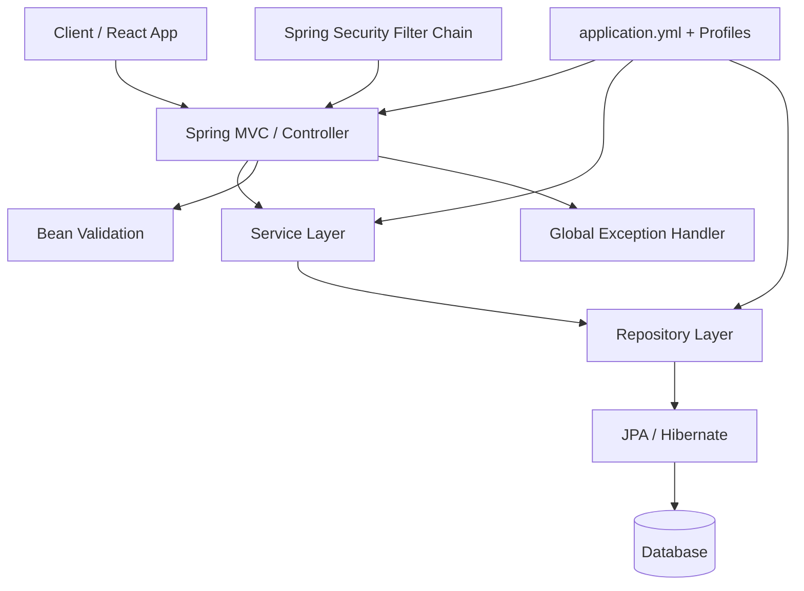
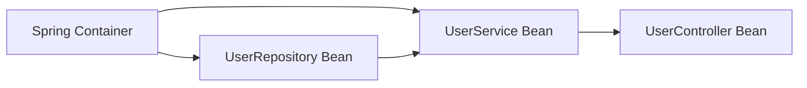
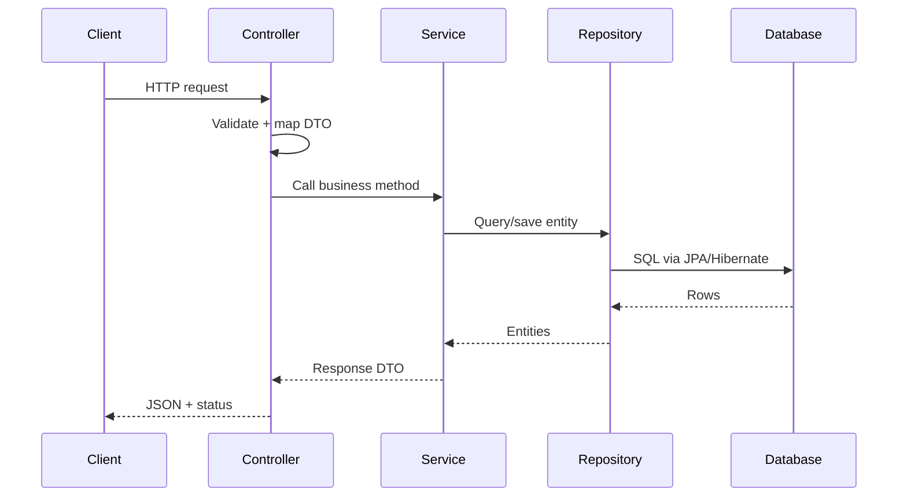
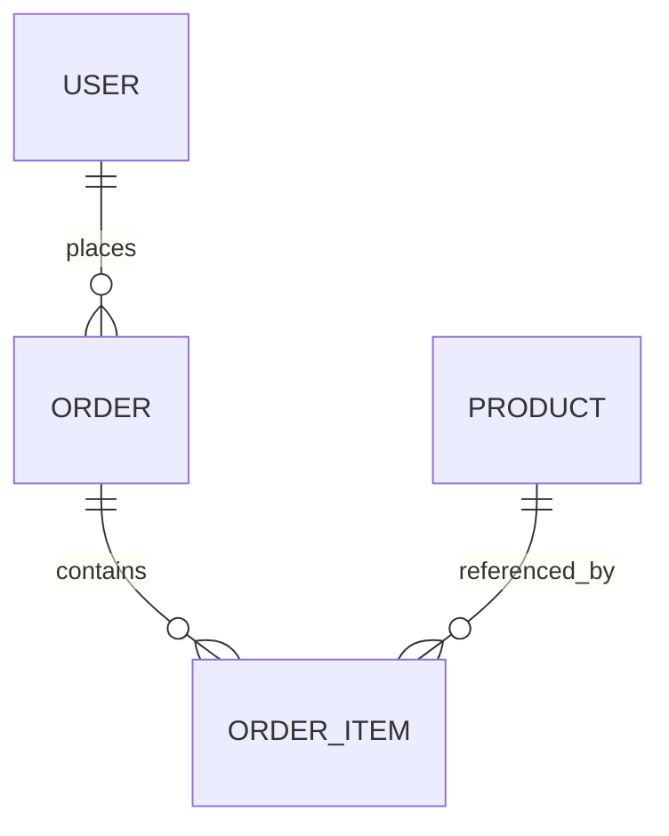
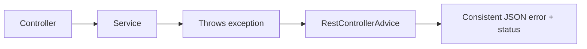
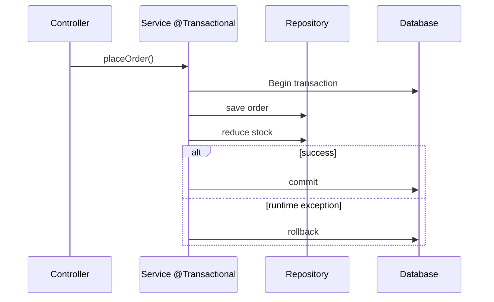
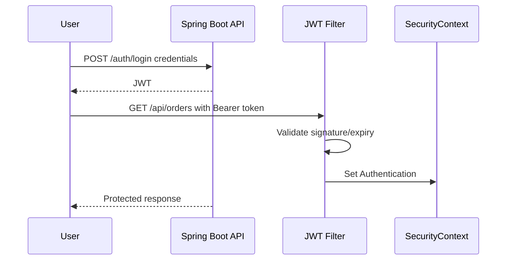

# Spring Boot Interview Cheat Sheet

For a 2-3 year Backend / Full-Stack Developer interview. Focus: practical Spring Boot used for REST APIs, JPA, validation, exception handling, transactions, security, and testing. This is not a full Spring ecosystem textbook.

## 1. Priority Map

| Level | Topics |
| --- | --- |
| MUST KNOW | Spring vs Spring Boot, auto-configuration, starters, embedded server, properties/profiles, IoC/DI, stereotypes, `@SpringBootApplication`, constructor injection, REST controllers, DTOs, layered architecture, Spring Data JPA, validation, global exceptions, `@Transactional`, Spring Security basics, JWT flow, testing slices |
| SHOULD KNOW | Lazy/eager loading, cascades, orphan removal, JPQL/native queries, pagination/sorting/filtering, N+1 problem, CORS, config management, `save()` vs `saveAndFlush()`, `@MockBean`/`@MockitoBean`, slow JPA query debugging |
| BASIC | HTTP status codes, CRUD API shape, roles/authorities, password hashing, unit vs integration tests, project structure |

## 2. Spring Boot Application Architecture



**Interview answer:** "A Spring Boot REST app usually has security filters first, then controllers for HTTP, services for business logic, repositories for persistence, JPA/Hibernate for ORM, and database transactions around service methods."

## 3. What Is Spring Boot?

**MUST KNOW**

**Definition:** Spring Boot is an opinionated way to build Spring applications quickly with auto-configuration, starter dependencies, embedded servers, and production-friendly defaults.

**Why used:** It reduces boilerplate and setup time for REST APIs and backend services.

**Interview-ready answer:** "Spring Boot builds on the Spring Framework. It simplifies configuration using starters, auto-configuration, and embedded servers so I can focus on business logic instead of XML/config setup."

```java
@SpringBootApplication
public class BookApiApplication {
    public static void main(String[] args) {
        SpringApplication.run(BookApiApplication.class, args);
    }
}
```

**Trap/follow-up:** Spring Boot does not replace Spring. It uses Spring and adds opinionated setup around it.

**When use it?** REST APIs, backend services, microservices, admin apps, batch services, and full-stack backends.

## 4. Spring vs Spring Boot

**MUST KNOW**

| Spring Framework | Spring Boot |
| --- | --- |
| Core framework for DI, MVC, transactions, data access | Opinionated setup on top of Spring |
| More manual configuration | Auto-configuration and sensible defaults |
| External server often configured separately | Embedded Tomcat/Jetty/Undertow support |
| Dependencies chosen manually | Starter dependencies group common libraries |
| Flexible but more setup | Faster project startup |

**Interview-ready answer:** "Spring is the base framework. Spring Boot makes Spring easier to use by auto-configuring common beans based on dependencies and properties."

```java
// Spring Boot entry point
@SpringBootApplication
class App { }
```

**Trap:** Saying Spring Boot is a different framework. It is built on Spring.

## 5. Advantages of Spring Boot

**MUST KNOW**

**Definition:** Spring Boot provides productivity features around Spring.

**Why used:** Faster setup, fewer config mistakes, easier deployment.

**Interview-ready answer:** "The main advantages are auto-configuration, starters, embedded server, externalized config, profiles, production-ready integrations, and less boilerplate."

```properties
server.port=8081
spring.datasource.url=jdbc:postgresql://localhost:5432/app
```

**Trap:** "No configuration" is wrong. Spring Boot reduces configuration but still allows overriding defaults.

## 6. Auto-Configuration

**MUST KNOW**

**Definition:** Auto-configuration creates Spring beans automatically based on classpath dependencies, existing beans, and properties.

**Why used:** It removes repetitive setup for MVC, JPA, Jackson, validation, security, and more.

**Interview-ready answer:** "Auto-configuration is conditional. If I add `spring-boot-starter-data-jpa`, Boot detects JPA libraries and configures common beans. If I define my own bean, Boot usually backs off."

```java
@SpringBootApplication(exclude = DataSourceAutoConfiguration.class)
public class App { }
```

**Trap:** Auto-configuration is not magic. It is condition-based configuration that can be inspected with debug logs.

**When use it?** Always in Boot apps; override only when defaults do not fit.

## 7. Starter Dependencies

**MUST KNOW**

**Definition:** Starters are dependency bundles for common features.

**Why used:** They avoid manually choosing many compatible library versions.

**Interview-ready answer:** "A starter pulls the libraries needed for a feature. For example, `spring-boot-starter-web` gives Spring MVC, Jackson, validation/web support, and an embedded server setup."

```xml
<dependency>
    <groupId>org.springframework.boot</groupId>
    <artifactId>spring-boot-starter-web</artifactId>
</dependency>

<dependency>
    <groupId>org.springframework.boot</groupId>
    <artifactId>spring-boot-starter-data-jpa</artifactId>
</dependency>
```

**Trap:** A starter is not one library; it is a curated dependency set.

## 8. Embedded Server

**MUST KNOW**

**Definition:** Spring Boot can package an application with an embedded servlet server such as Tomcat.

**Why used:** You can run the app as a jar without deploying a war to an external server.

**Interview-ready answer:** "Boot starts an embedded server when the web starter is present, so deployment is usually `java -jar app.jar` or a container image."

```bash
java -jar target/book-api.jar
```

**Trap:** Embedded server does not mean toy server. It is production-capable when configured properly.

## 9. `application.properties` / `application.yml`

**MUST KNOW**

**Definition:** Spring Boot externalizes configuration into properties or YAML files.

**Why used:** Environment-specific values should not be hardcoded.

**Interview-ready answer:** "`application.properties` or `application.yml` stores config like server port, datasource URL, logging, JWT settings, and feature flags. Environment variables can override file values."

```yaml
server:
  port: 8080

spring:
  datasource:
    url: jdbc:postgresql://localhost:5432/shop
    username: app_user
```

```java
@Value("${app.jwt.secret}")
private String jwtSecret;
```

**Trap:** Do not commit real secrets. Use environment variables or secret managers.

## 10. Profiles

**MUST KNOW**

**Definition:** Profiles activate different beans or configuration for environments like `dev`, `test`, and `prod`.

**Why used:** Local, test, and production environments need different config.

**Interview-ready answer:** "Profiles let me load environment-specific config and beans. For example, local can use H2 while prod uses PostgreSQL."

```yaml
spring:
  profiles:
    active: dev
```

```java
@Bean
@Profile("dev")
CommandLineRunner seedData(UserRepository repository) {
    return args -> repository.save(new User("dev@example.com"));
}
```

**Trap:** Hardcoding `spring.profiles.active=prod` inside a packaged app reduces deployment flexibility.

## 11. IoC / Dependency Injection

**MUST KNOW**

**Definition:** Inversion of Control means Spring creates and manages objects. Dependency Injection means Spring supplies required dependencies.

**Why used:** It reduces coupling and makes code easier to test.

**Interview-ready answer:** "Instead of classes creating dependencies with `new`, they declare what they need. Spring creates beans and injects them."



```java
@Service
public class UserService {
    private final UserRepository userRepository;

    public UserService(UserRepository userRepository) {
        this.userRepository = userRepository;
    }
}
```

**Trap:** DI is not only `@Autowired`; constructor injection is preferred.

## 12. Stereotype Annotations

**MUST KNOW**

| Annotation | Meaning | Typical layer |
| --- | --- | --- |
| `@Component` | Generic Spring bean | Utility/component |
| `@Service` | Business service bean | Service |
| `@Repository` | Persistence bean; translates data exceptions | Repository |
| `@Controller` | MVC controller returning views | Web MVC |
| `@RestController` | Controller returning response body | REST API |

**Interview-ready answer:** "`@Service`, `@Repository`, and `@Controller` are specialized components. They improve readability and may add behavior, like persistence exception translation for repositories."

```java
@Repository
public interface UserRepository extends JpaRepository<User, Long> { }

@Service
public class UserService { }

@RestController
public class UserController { }
```

**Trap:** Do not put business logic in controllers or repositories just because annotations work.

## 13. `@SpringBootApplication`

**MUST KNOW**

**Definition:** Convenience annotation combining `@SpringBootConfiguration`, `@EnableAutoConfiguration`, and component scanning.

**Why used:** It marks the main Boot application class.

**Interview-ready answer:** "`@SpringBootApplication` enables auto-configuration and component scanning from its package downward. I place it in the root package."

```java
package com.example.shop;

@SpringBootApplication
public class ShopApplication { }
```

**Trap:** Placing the main class in a nested package can prevent components from being scanned.

## 14. Constructor Injection

**MUST KNOW**

**Definition:** Dependencies are supplied through a constructor.

**Why used:** It makes required dependencies explicit, supports immutability, and improves tests.

**Interview-ready answer:** "I prefer constructor injection because the object cannot be created without its required dependencies. It is easier to test and avoids hidden field injection."

```java
@Service
public class OrderService {
    private final OrderRepository orderRepository;

    public OrderService(OrderRepository orderRepository) {
        this.orderRepository = orderRepository;
    }
}
```

**Trap:** Field injection makes dependencies harder to see and harder to unit test.

## 15. REST Controller Basics

**MUST KNOW**

**Definition:** `@RestController` exposes HTTP endpoints and writes return values directly to the response body.

**Why used:** It is the main annotation for JSON REST APIs.

**Interview-ready answer:** "`@RestController` is `@Controller` plus `@ResponseBody`, so methods return JSON/XML data rather than view names."

| `@Controller` | `@RestController` |
| --- | --- |
| Usually returns views | Returns response body |
| Needs `@ResponseBody` for JSON | `@ResponseBody` included |
| MVC pages | REST APIs |

```java
@RestController
@RequestMapping("/api/books")
public class BookController {
    @GetMapping("/{id}")
    public BookResponse getBook(@PathVariable Long id) {
        return new BookResponse(id, "Clean Code");
    }
}
```

**Trap:** Returning entities directly from controllers can cause security, lazy loading, and serialization issues.

## 16. Request Mapping Annotations

**MUST KNOW**

**Definition:** `@RequestMapping` maps requests by path, method, headers, params, and media types. `@GetMapping`, `@PostMapping`, etc. are shortcuts.

**Why used:** They connect HTTP routes to Java methods.

**Interview-ready answer:** "I use class-level `@RequestMapping` for a base path and method-specific mappings for each endpoint."

```java
@RestController
@RequestMapping("/api/users")
public class UserController {
    @GetMapping
    public List<UserResponse> findAll() { return List.of(); }

    @PostMapping
    public ResponseEntity<UserResponse> create(@RequestBody CreateUserRequest request) {
        return ResponseEntity.status(HttpStatus.CREATED).body(new UserResponse(1L, request.email()));
    }
}
```

**Trap:** Plain `@RequestMapping` without method can match more HTTP methods than intended.

## 17. Request Data: Path, Query, Body

**MUST KNOW**

| Annotation | Source | Example use |
| --- | --- | --- |
| `@PathVariable` | URL path | `/users/{id}` |
| `@RequestParam` | Query string | `/users?page=0` |
| `@RequestBody` | JSON body | POST/PUT/PATCH payload |

```java
@GetMapping("/{id}")
public UserResponse getUser(
        @PathVariable Long id,
        @RequestParam(defaultValue = "false") boolean includeOrders) {
    return userService.findById(id, includeOrders);
}

@PostMapping
public ResponseEntity<UserResponse> create(@Valid @RequestBody CreateUserRequest request) {
    return ResponseEntity.status(HttpStatus.CREATED).body(userService.create(request));
}
```

**Trap:** Do not send sensitive or complex request bodies through query params.

## 18. ResponseEntity and HTTP Status Codes

**MUST KNOW**

**Definition:** `ResponseEntity<T>` represents response body, headers, and status code.

**Why used:** It gives explicit control over API responses.

**Interview-ready answer:** "I use `ResponseEntity` when I need to set status codes like `201 Created`, `204 No Content`, headers, or error responses."

```java
@DeleteMapping("/{id}")
public ResponseEntity<Void> delete(@PathVariable Long id) {
    userService.delete(id);
    return ResponseEntity.noContent().build();
}
```

**Common statuses:** `200 OK`, `201 Created`, `204 No Content`, `400 Bad Request`, `401 Unauthorized`, `403 Forbidden`, `404 Not Found`, `409 Conflict`, `500 Internal Server Error`.

**Trap:** `401` means not authenticated; `403` means authenticated but not allowed.

## 19. PUT vs PATCH

**BASIC**

| Method | Meaning | Example |
| --- | --- | --- |
| `PUT` | Replace full resource | Update full profile |
| `PATCH` | Partial update | Change only phone number |

```java
@PatchMapping("/{id}")
public UserResponse updateEmail(@PathVariable Long id, @RequestBody UpdateEmailRequest request) {
    return userService.updateEmail(id, request.email());
}
```

**Trap:** Many APIs use them loosely, but in interviews explain full replace vs partial update.

## 20. Request/Response DTOs

**MUST KNOW**

**Definition:** DTOs are objects used for API input/output instead of exposing entities directly.

**Why used:** They protect internal models, control response shape, validate input, and avoid lazy-loading serialization problems.

**Interview-ready answer:** "I use DTOs because API contracts should not be tied directly to JPA entities."

| Entity | DTO |
| --- | --- |
| Persistence model | API contract |
| Has JPA annotations | Has validation/JSON fields |
| May contain relationships | Usually tailored to request/response |
| Internal structure | External structure |

```java
public record CreateUserRequest(
        @NotBlank String name,
        @Email @NotBlank String email
) { }

public record UserResponse(Long id, String name, String email) { }
```

**Trap:** Entity exposure can leak fields like password hashes or internal flags.

## 21. REST API Structure

**MUST KNOW**

**Definition:** A clean REST API separates HTTP handling, business logic, persistence, and DTO mapping.

**Why used:** It keeps controllers thin and makes code testable.

**Interview-ready answer:** "Controller handles HTTP, service handles business logic and transactions, repository handles data access, DTOs represent API input/output, and entities represent database rows."

```java
// controller -> service -> repository
@PostMapping
public ResponseEntity<UserResponse> create(@Valid @RequestBody CreateUserRequest request) {
    return ResponseEntity.status(HttpStatus.CREATED).body(userService.create(request));
}
```

**Trap:** Dumping all logic into controllers works for demos but fails in real apps.

## 22. Layered Architecture

**MUST KNOW**



| Layer | Responsibility |
| --- | --- |
| Controller | HTTP, validation trigger, request/response |
| Service | Business rules, transactions, orchestration |
| Repository | Data access |
| Entity | Database mapping |
| DTO | API contract |

**Trap:** Repository should not contain business decisions; service should not know HTTP details.

## 23. JPA vs Hibernate

**MUST KNOW**

| JPA | Hibernate |
| --- | --- |
| Specification/API | Implementation/provider |
| Defines annotations and behavior contracts | Actually performs ORM work |
| `jakarta.persistence.*` | Hibernate-specific features |
| Portable concept | Common provider in Spring Boot apps |

**Interview-ready answer:** "JPA is the standard specification. Hibernate is the most common implementation used by Spring Boot through Spring Data JPA."

```java
import jakarta.persistence.Entity;
import jakarta.persistence.Id;

@Entity
public class Product {
    @Id
    private Long id;
}
```

**Trap:** Spring Data JPA is not JPA itself. It is a repository abstraction on top of JPA.

## 24. Entity Mapping

**MUST KNOW**

**Definition:** An entity is a Java class mapped to a database table.

**Why used:** It lets JPA track and persist Java objects.

**Interview-ready answer:** "`@Entity` marks a class as persistent. `@Id` identifies the primary key, and `@GeneratedValue` can generate IDs."

```java
@Entity
@Table(name = "books")
public class Book {
    @Id
    @GeneratedValue(strategy = GenerationType.IDENTITY)
    private Long id;

    @Column(nullable = false)
    private String title;

    protected Book() { }

    public Book(String title) {
        this.title = title;
    }
}
```

**Trap:** JPA needs a no-args constructor, at least protected.

## 25. JPA Relationships

**MUST KNOW**

**Definition:** JPA relationship annotations map object references to database relationships.

**Why used:** They model associations like order-to-items or user-to-profile.



```java
@Entity
public class Order {
    @Id
    @GeneratedValue(strategy = GenerationType.IDENTITY)
    private Long id;

    @ManyToOne(fetch = FetchType.LAZY)
    @JoinColumn(name = "user_id", nullable = false)
    private User user;

    @OneToMany(mappedBy = "order", cascade = CascadeType.ALL, orphanRemoval = true)
    private List<OrderItem> items = new ArrayList<>();
}
```

**Interview-ready answer:** "`@ManyToOne` is common for the owning side with a foreign key. `@OneToMany(mappedBy=...)` is the inverse collection side."

**Trap:** Many-to-many often needs a join entity when the relationship has extra fields like role, quantity, or created date.

## 26. `@JoinColumn`

**SHOULD KNOW**

**Definition:** `@JoinColumn` defines the foreign key column for an association.

**Why used:** It makes database mapping explicit.

```java
@ManyToOne(fetch = FetchType.LAZY)
@JoinColumn(name = "customer_id", nullable = false)
private Customer customer;
```

**Interview-ready answer:** "`@JoinColumn` tells JPA which column stores the foreign key."

**Trap:** In bidirectional relationships, only one side owns the foreign key.

## 27. Lazy vs Eager Loading

**MUST KNOW**

| Lazy | Eager |
| --- | --- |
| Loads association when accessed | Loads association immediately |
| Better default for large relationships | Can create heavy queries |
| May cause LazyInitializationException | May cause unnecessary data fetching |

**Interview-ready answer:** "I generally prefer lazy loading for relationships and fetch what I need explicitly using join fetch, entity graphs, or DTO queries."

```java
@ManyToOne(fetch = FetchType.LAZY)
private User user;
```

**Trap:** Accessing lazy fields outside a transaction/session can fail or trigger N+1 queries.

## 28. Cascade Types and orphanRemoval

**SHOULD KNOW**

**Definition:** Cascade passes persistence operations from parent to child. `orphanRemoval` deletes child rows removed from the parent collection.

**Why used:** Useful for lifecycle-owned child entities.

**Interview-ready answer:** "Cascade is for propagating operations. `orphanRemoval=true` is for deleting children no longer referenced by the parent."

```java
@OneToMany(mappedBy = "order", cascade = CascadeType.ALL, orphanRemoval = true)
private List<OrderItem> items = new ArrayList<>();
```

**Trap:** Do not use `CascadeType.REMOVE` casually on shared relationships like many-to-many.

## 29. JpaRepository

**MUST KNOW**

**Definition:** `JpaRepository` provides CRUD, pagination, sorting, flushing, and JPA repository methods.

**Why used:** It avoids boilerplate DAO code.

**Interview-ready answer:** "I extend `JpaRepository<Entity, IdType>` to get standard CRUD methods and define query methods when needed."

```java
public interface UserRepository extends JpaRepository<User, Long> {
    Optional<User> findByEmail(String email);
    boolean existsByEmail(String email);
}
```

**Trap:** Repositories should stay focused on data access, not business workflows.

## 30. Derived Query Methods and `@Query`

**MUST KNOW**

**Definition:** Spring Data JPA can derive queries from method names or use explicit JPQL/native SQL with `@Query`.

**Why used:** Simple queries are fast to write; complex queries are clearer with `@Query`.

**Interview-ready answer:** "For simple filters I use derived methods like `findByEmail`. For complex joins or projections I use `@Query`."

```java
public interface OrderRepository extends JpaRepository<Order, Long> {
    List<Order> findByUserIdAndStatus(Long userId, OrderStatus status);

    @Query("select o from Order o join fetch o.items where o.id = :id")
    Optional<Order> findByIdWithItems(Long id);
}
```

**Trap:** Very long derived method names become unreadable. Use `@Query`.

## 31. JPQL vs Native Query

**SHOULD KNOW**

| JPQL | Native SQL |
| --- | --- |
| Uses entity names and fields | Uses table/column names |
| Portable across DBs | DB-specific power |
| Good default | Good for complex/vendor-specific queries |

```java
@Query("select u from User u where u.email = :email")
Optional<User> findByEmailJpql(String email);

@Query(value = "select * from users where email = :email", nativeQuery = true)
Optional<User> findByEmailNative(String email);
```

**Trap:** Native queries can reduce portability and need careful mapping/pagination.

## 32. Pagination and Sorting

**MUST KNOW**

**Definition:** Spring Data supports `Pageable`, `Page`, `Slice`, and `Sort`.

**Why used:** Large tables should not be loaded entirely.

**Interview-ready answer:** "I use `Pageable` for paginated endpoints and return metadata like total elements when needed. For infinite scroll, `Slice` can avoid a count query."

```java
@GetMapping
public Page<UserResponse> list(Pageable pageable) {
    return userRepository.findAll(pageable).map(UserResponse::from);
}

PageRequest page = PageRequest.of(0, 20, Sort.by("createdAt").descending());
```

**Trap:** Deep offset pagination can be slow on very large tables; keyset pagination may be better.

## 33. N+1 Query Problem

**MUST KNOW**

**Definition:** One query loads parent rows, then additional queries load each child association.

**Why used:** Interviewers ask it because it is a common JPA performance bug.

**Interview-ready answer:** "N+1 happens when lazy associations are accessed in a loop. I fix it with fetch joins, entity graphs, DTO projections, or batch fetching."

```java
@Query("select distinct o from Order o join fetch o.items where o.user.id = :userId")
List<Order> findOrdersWithItems(Long userId);
```

**Trap:** Switching everything to eager can make performance worse.

## 34. `save()` vs `saveAndFlush()`

**SHOULD KNOW**

| Method | Behavior |
| --- | --- |
| `save()` | Persists/merges entity; SQL may execute later at flush/commit |
| `saveAndFlush()` | Saves and immediately flushes changes to DB |

**Interview-ready answer:** "`save()` is enough for most cases. I use `saveAndFlush()` only when I need DB constraints/generated values visible before transaction commit."

```java
User saved = userRepository.save(user);
```

**Trap:** `flush` is not `commit`. Transaction can still roll back.

## 35. Bean Validation

**MUST KNOW**

**Definition:** Bean Validation uses annotations like `@NotNull`, `@NotBlank`, `@Size`, and `@Email` to validate input.

**Why used:** It keeps request validation declarative and consistent.

**Interview-ready answer:** "I put validation annotations on request DTOs and use `@Valid` in controller methods. Invalid requests produce validation errors before service logic."

```java
public record RegisterRequest(
        @NotBlank String name,
        @Email @NotBlank String email,
        @Size(min = 8, max = 72) String password
) { }

@PostMapping("/register")
public ResponseEntity<Void> register(@Valid @RequestBody RegisterRequest request) {
    authService.register(request);
    return ResponseEntity.status(HttpStatus.CREATED).build();
}
```

**Trap:** `@NotNull` allows empty strings. Use `@NotBlank` for required text.

## 36. `@Valid` vs `@Validated`

**SHOULD KNOW**

| `@Valid` | `@Validated` |
| --- | --- |
| Jakarta Bean Validation standard | Spring annotation |
| Common for request DTO validation | Supports validation groups and method validation |
| Simple and common | More advanced |

```java
@PostMapping
public UserResponse create(@Valid @RequestBody CreateUserRequest request) {
    return userService.create(request);
}
```

**Trap:** Validation annotations do nothing unless validation is triggered through Spring/Jakarta validation.

## 37. Validation Error Handling

**MUST KNOW**

**Definition:** Validation errors should be converted into a consistent API error response.

**Why used:** Clients need predictable field-level messages.

**Interview-ready answer:** "I handle `MethodArgumentNotValidException` globally and return a structured `400 Bad Request` with field errors."

```java
public record ApiError(String code, String message, Map<String, String> fields) { }

@RestControllerAdvice
public class GlobalExceptionHandler {
    @ExceptionHandler(MethodArgumentNotValidException.class)
    public ResponseEntity<ApiError> handleValidation(MethodArgumentNotValidException ex) {
        Map<String, String> fields = ex.getBindingResult().getFieldErrors().stream()
                .collect(Collectors.toMap(
                        FieldError::getField,
                        FieldError::getDefaultMessage,
                        (first, second) -> first
                ));

        return ResponseEntity.badRequest()
                .body(new ApiError("VALIDATION_ERROR", "Invalid request", fields));
    }
}
```

**Trap:** Returning raw stack traces or inconsistent error shapes makes APIs hard to consume.

## 38. Global Exception Handling

**MUST KNOW**

**Definition:** `@RestControllerAdvice` centralizes exception handling for controllers.

**Why used:** Keeps controllers clean and returns consistent error responses.



**Interview-ready answer:** "I use custom exceptions in services and map them to HTTP responses in a global advice class."

```java
public class UserNotFoundException extends RuntimeException {
    public UserNotFoundException(Long id) {
        super("User not found: " + id);
    }
}

@ExceptionHandler(UserNotFoundException.class)
public ResponseEntity<ApiError> handleNotFound(UserNotFoundException ex) {
    return ResponseEntity.status(HttpStatus.NOT_FOUND)
            .body(new ApiError("USER_NOT_FOUND", ex.getMessage(), Map.of()));
}
```

**Trap:** Do not catch every exception in every controller method.

## 39. `@Transactional`

**MUST KNOW**

**Definition:** `@Transactional` runs a method inside a database transaction.

**Why used:** It ensures related database changes commit together or roll back together.

**Interview-ready answer:** "I usually put `@Transactional` on service methods because the service defines business transaction boundaries."



```java
@Service
public class OrderService {
    @Transactional
    public OrderResponse placeOrder(CreateOrderRequest request) {
        Order order = orderRepository.save(new Order(request.userId()));
        inventoryService.reserve(request.items());
        return OrderResponse.from(order);
    }
}
```

**Trap:** By default, Spring rolls back on unchecked exceptions, not checked exceptions unless configured.

## 40. Transaction Boundaries and Read-Only

**MUST KNOW**

**Definition:** A transaction boundary is where a transaction starts and ends.

**Why used:** Correct boundaries keep business operations consistent and avoid long locks.

**Interview-ready answer:** "I keep transactions at service level, short, and around one business operation. For read-only queries, I can use `@Transactional(readOnly = true)`."

```java
@Transactional(readOnly = true)
public UserResponse getUser(Long id) {
    return userRepository.findById(id)
            .map(UserResponse::from)
            .orElseThrow(() -> new UserNotFoundException(id));
}
```

**Trap:** Calling a transactional method from another method in the same class may bypass Spring's proxy and not start a transaction.

## 41. Common `@Transactional` Mistakes

**MUST KNOW**

| Mistake | Better approach |
| --- | --- |
| Put transaction on controller | Put it on service |
| Keep transaction open during remote API call | Commit DB work separately where possible |
| Expect rollback for checked exception | Use `rollbackFor` if needed |
| Self-invocation | Call through another Spring bean |
| Use on private method | Use public/proxied service method |
| Assume `flush` means commit | Commit happens at transaction end |

```java
@Transactional(rollbackFor = PaymentException.class)
public void pay() throws PaymentException {
    // checked exception can trigger rollback with rollbackFor
}
```

**Trap:** Long transactions can hold locks and hurt performance.

## 42. Security Basics

**MUST KNOW**

**Definition:** Spring Security protects endpoints through a servlet filter chain and stores authentication in the security context.

**Why used:** It handles authentication, authorization, password encoding, CSRF/session protections, and common web security concerns.

**Interview-ready answer:** "Spring Security runs before controllers through filters. It authenticates the request, builds an `Authentication`, stores it in `SecurityContext`, and checks authorization rules."

| Authentication | Authorization |
| --- | --- |
| Verifies identity | Checks permissions |
| "Who are you?" | "What can you access?" |
| Login/JWT validation | Roles/authorities/policies |

```java
@Bean
SecurityFilterChain securityFilterChain(HttpSecurity http) throws Exception {
    return http
            .csrf(csrf -> csrf.disable())
            .authorizeHttpRequests(auth -> auth
                    .requestMatchers("/api/auth/**").permitAll()
                    .requestMatchers("/api/admin/**").hasRole("ADMIN")
                    .anyRequest().authenticated()
            )
            .build();
}
```

**Trap:** Disabling CSRF is common for stateless token APIs, but not automatically correct for browser session/form apps.

## 43. JWT Authentication Flow

**MUST KNOW**

**Definition:** JWT auth uses a signed token sent with each request, usually in the `Authorization: Bearer` header.

**Why used:** It enables stateless API authentication.



**Interview-ready answer:** "On login, the server verifies credentials and issues a signed JWT. For each request, a filter validates the token, extracts username/roles, and sets authentication in the security context."

```java
String header = request.getHeader(HttpHeaders.AUTHORIZATION);
if (header != null && header.startsWith("Bearer ")) {
    String token = header.substring(7);
    // validate token, load user, set SecurityContext
}
```

**Trap:** Do not store plaintext passwords or put sensitive secrets in JWT claims.

## 44. Password Hashing

**MUST KNOW**

**Definition:** Password hashing stores a one-way hash, not the raw password.

**Why used:** If the database leaks, raw passwords are not exposed.

**Interview-ready answer:** "I use `PasswordEncoder`, commonly BCrypt, to hash passwords. I never store plaintext passwords."

```java
@Bean
PasswordEncoder passwordEncoder() {
    return new BCryptPasswordEncoder();
}

String hash = passwordEncoder.encode(request.password());
boolean matches = passwordEncoder.matches(rawPassword, hash);
```

**Trap:** `User.withDefaultPasswordEncoder()` is for samples, not production.

## 45. Roles and Authorities

**SHOULD KNOW**

**Definition:** Authorities are granted permissions. Roles are usually authorities with a `ROLE_` prefix.

**Why used:** They decide which endpoints/actions a user can access.

**Interview-ready answer:** "Roles are high-level groups like ADMIN. Authorities can be fine-grained permissions like `ORDER_READ`. In Spring, `hasRole('ADMIN')` expects `ROLE_ADMIN`."

```java
.requestMatchers("/api/admin/**").hasRole("ADMIN")
.requestMatchers(HttpMethod.DELETE, "/api/orders/**").hasAuthority("ORDER_DELETE")
```

**Trap:** Mixing `ROLE_ADMIN`, `ADMIN`, `hasRole`, and `hasAuthority` incorrectly causes access bugs.

## 46. Protected Endpoints

**MUST KNOW**

**Definition:** Protected endpoints require authentication and/or authorization.

**Why used:** Prevents unauthorized access to APIs.

```java
@GetMapping("/me")
public UserResponse me(Authentication authentication) {
    return userService.findByEmail(authentication.getName());
}
```

**Interview-ready answer:** "I protect endpoints in `SecurityFilterChain` and use method/controller logic only after the request is authenticated."

**Trap:** Frontend route protection is not backend security.

## 47. API Features: Pagination, Sorting, Filtering, Search

**MUST KNOW**

**Definition:** API listing endpoints should support controlled data access.

**Why used:** Prevents loading too much data and improves UX.

**Interview-ready answer:** "For large tables, I use pagination and sorting with `Pageable`, filters with repository queries/specifications, and search using indexed fields or full-text tools when needed."

```java
@GetMapping
public Page<ProductResponse> search(
        @RequestParam(required = false) String keyword,
        Pageable pageable) {
    return productService.search(keyword, pageable);
}
```

**Trap:** Returning all rows from a large table is a production bug.

## 48. API Response and Error Structure

**SHOULD KNOW**

**Definition:** APIs should return predictable success and error structures.

**Why used:** Frontend clients handle responses more easily.

```java
public record ApiResponse<T>(T data, String message) { }
public record ApiError(String code, String message, Map<String, String> fields) { }
```

**Interview-ready answer:** "I keep success and error responses consistent, use proper status codes, and avoid leaking internal exception details."

**Trap:** Wrapping every response can be overkill; consistency matters more than one fixed style.

## 49. CORS Basics

**BASIC**

**Definition:** CORS controls whether browsers allow frontend origins to call your API.

**Why used:** React apps on a different domain/port need allowed origins.

**Interview-ready answer:** "CORS is a browser security mechanism. In Spring, I configure allowed origins, methods, and headers for trusted frontends."

```java
@Bean
CorsConfigurationSource corsConfigurationSource() {
    CorsConfiguration config = new CorsConfiguration();
    config.setAllowedOrigins(List.of("https://app.example.com"));
    config.setAllowedMethods(List.of("GET", "POST", "PUT", "PATCH", "DELETE"));
    config.setAllowedHeaders(List.of("Authorization", "Content-Type"));

    UrlBasedCorsConfigurationSource source = new UrlBasedCorsConfigurationSource();
    source.registerCorsConfiguration("/**", config);
    return source;
}
```

**Trap:** `allowedOrigins("*")` with credentials is unsafe and often invalid.

## 50. Configuration Management

**SHOULD KNOW**

**Definition:** Configuration management separates code from environment-specific settings.

**Why used:** Same build should run in dev/test/prod with different config.

**Interview-ready answer:** "I use profiles, environment variables, and typed `@ConfigurationProperties` for grouped config."

```java
@ConfigurationProperties(prefix = "app.jwt")
public record JwtProperties(String secret, long expiryMinutes) { }
```

**Trap:** `@Value` is fine for one-off values, but grouped config is cleaner with `@ConfigurationProperties`.

## 51. Testing Overview

**MUST KNOW**

| Test type | Purpose | Tools |
| --- | --- | --- |
| Unit test | Test one class in isolation | JUnit, Mockito |
| Integration test | Test multiple Spring components | `@SpringBootTest` |
| MVC slice | Test controller layer | `@WebMvcTest`, MockMvc |
| JPA slice | Test repositories/entities | `@DataJpaTest` |

**Interview-ready answer:** "I unit test services with Mockito, test controllers with MVC slice tests, repositories with JPA slice tests, and use full integration tests for end-to-end Spring context behavior."

**Trap:** Loading full Spring context for every test makes the suite slow.

## 52. JUnit and Mockito

**MUST KNOW**

**Definition:** JUnit runs tests. Mockito creates mocks and verifies interactions.

**Why used:** They test business logic without real databases or external services.

```java
@ExtendWith(MockitoExtension.class)
class UserServiceTest {
    @Mock
    UserRepository userRepository;

    @InjectMocks
    UserService userService;

    @Test
    void createsUser() {
        when(userRepository.existsByEmail("a@test.com")).thenReturn(false);
        userService.create(new CreateUserRequest("Asha", "a@test.com", "password123"));
        verify(userRepository).save(any(User.class));
    }
}
```

**Trap:** Unit tests should not need Spring context unless you are testing Spring integration.

## 53. `@Mock` vs `@MockBean` / `@MockitoBean`

**MUST KNOW**

| Annotation | Scope | Use case |
| --- | --- | --- |
| `@Mock` | Plain Mockito mock | Unit tests without Spring context |
| `@InjectMocks` | Creates class with mocks injected | Service unit tests |
| `@MockBean` | Legacy/common Boot test mock in Spring context | Replacing a bean in older Boot tests |
| `@MockitoBean` | Current Spring test bean mock style | Replacing a bean in Spring context |

**Interview-ready answer:** "`@Mock` is for plain unit tests. `@MockBean` or newer `@MockitoBean` replaces a Spring bean inside the application context, commonly in `@WebMvcTest`."

```java
@WebMvcTest(UserController.class)
class UserControllerTest {
    @MockitoBean
    UserService userService;

    @Autowired
    MockMvc mockMvc;
}
```

**Trap:** Using Spring context mocks for simple unit tests makes tests slower than needed.

## 54. Test Slices

**MUST KNOW**

| Annotation | Loads | Best for |
| --- | --- | --- |
| `@SpringBootTest` | Full application context | Integration tests |
| `@WebMvcTest` | MVC/controller slice | Controller tests |
| `@DataJpaTest` | JPA repositories/entities | Repository tests |

```java
@DataJpaTest
class UserRepositoryTest {
    @Autowired
    UserRepository userRepository;

    @Test
    void findsByEmail() {
        userRepository.save(new User("a@test.com"));
        assertTrue(userRepository.findByEmail("a@test.com").isPresent());
    }
}
```

**Trap:** `@WebMvcTest` does not load services/repositories unless imported or mocked.

## 55. Controller Testing Basics

**SHOULD KNOW**

**Definition:** Controller tests verify routing, validation, status codes, and JSON shape.

**Why used:** They catch API contract issues without full integration cost.

```java
@WebMvcTest(UserController.class)
class UserControllerTest {
    @Autowired
    MockMvc mockMvc;

    @MockitoBean
    UserService userService;

    @Test
    void returnsUser() throws Exception {
        when(userService.findById(1L)).thenReturn(new UserResponse(1L, "Asha", "a@test.com"));

        mockMvc.perform(get("/api/users/1"))
                .andExpect(status().isOk())
                .andExpect(jsonPath("$.email").value("a@test.com"));
    }
}
```

**Trap:** Controller tests should not verify repository behavior.

## 56. Designing a CRUD REST API

**MUST KNOW**

**Interview-ready answer:** "I define resource endpoints, DTOs, validation, service methods, repository methods, global errors, and tests. Controllers stay thin; services own business logic."

```java
@RestController
@RequestMapping("/api/products")
class ProductController {
    @GetMapping("/{id}")
    ProductResponse get(@PathVariable Long id) {
        return productService.get(id);
    }

    @PostMapping
    ResponseEntity<ProductResponse> create(@Valid @RequestBody CreateProductRequest request) {
        return ResponseEntity.status(HttpStatus.CREATED).body(productService.create(request));
    }
}
```

**Trap:** CRUD still needs validation, status codes, error handling, pagination, and security.

## 57. How to Optimize a Slow JPA Query

**MUST KNOW**

**Interview-ready answer:** "I enable SQL logging or use DB query plans, check N+1 queries, add proper indexes, fetch only needed columns with DTO projections, paginate results, and avoid unnecessary eager loading."

```java
@Query("""
    select new com.example.OrderSummary(o.id, o.status, o.createdAt)
    from Order o
    where o.user.id = :userId
    order by o.createdAt desc
""")
Page<OrderSummary> findSummaries(Long userId, Pageable pageable);
```

**Trap:** Solving every issue with `join fetch` can create huge result sets.

## 58. Production Project Structure

**SHOULD KNOW**

**Definition:** Project structure groups code by feature or technical layer.

**Why used:** Makes large projects navigable and testable.

```text
src/main/java/com/example/shop
  auth/
  user/
    UserController.java
    UserService.java
    UserRepository.java
    User.java
    dto/
  order/
  common/
    exception/
    config/
```

**Interview-ready answer:** "For production apps, I prefer feature-based packages with controller, service, repository, entity, and DTOs close together, plus common config and exception packages."

**Trap:** A giant `controller/service/repository` package across the whole app becomes hard to navigate.

## 59. Most-Asked Spring Boot Interview Questions

### A. What is Spring Boot?

Spring Boot is an opinionated way to build Spring apps quickly using starters, auto-configuration, embedded servers, and externalized config.

### B. What is auto-configuration?

Conditional bean configuration based on classpath, properties, and existing beans.

### C. Why constructor injection?

It makes dependencies explicit, supports immutability, and is easier to test.

### D. Explain request flow from controller to database.

Request enters security/filter chain, reaches controller, DTO is validated, service runs business logic/transaction, repository uses JPA/Hibernate, database returns data, response DTO is sent.

### E. Why use DTOs instead of entities?

DTOs decouple API contract from DB model and avoid leaking fields, lazy loading issues, and serialization loops.

### F. How handle validation errors?

Use validation annotations on DTOs, `@Valid` in controller, and a global exception handler for field-level error responses.

### G. How implement global exception handling?

Use `@RestControllerAdvice` with `@ExceptionHandler` methods mapping exceptions to consistent JSON and status codes.

### H. How implement JWT authentication?

Login validates credentials, server issues JWT, client sends Bearer token, JWT filter validates it, sets `Authentication`, and authorization rules protect endpoints.

### I. How paginate a large table?

Use `Pageable`/`Page` or `Slice`, sort by indexed columns, and consider keyset pagination for deep pages.

### J. What causes N+1 and how fix it?

Lazy associations accessed in a loop. Fix with fetch joins, entity graphs, DTO projections, or batch fetching.

### K. Where put `@Transactional`?

Usually on service methods that represent one business operation.

### L. How test service depending on repository?

Use JUnit + Mockito with `@Mock` repository and `@InjectMocks` service.

### M. `@SpringBootTest` vs `@WebMvcTest` vs `@DataJpaTest`?

Full context vs MVC slice vs JPA slice. Use the smallest test scope that proves the behavior.

## 60. Scenario-Based Questions

### A. How would you design a CRUD API?

Create DTOs, controller endpoints, service methods, repository, entity mapping, validation, global errors, pagination for list endpoints, and tests.

### B. User registration has duplicate emails. How handle?

Add a unique DB constraint, check in service for friendly error, and handle database conflicts globally as `409 Conflict`.

### C. Lazy loading fails during JSON serialization. Why?

The entity relationship is accessed outside the persistence context or exposed directly. Use DTOs and fetch needed data explicitly.

### D. Payment succeeds but order save fails. What now?

Avoid long DB transactions around external calls. Use clear transaction boundaries, idempotency, retries, and compensating actions.

### E. A protected endpoint returns 403 instead of 401. Why?

The user may be authenticated but lacks authority, or security config maps the error that way. Explain auth vs authorization.

### F. Tests are slow. What would you improve?

Use unit tests for services, slice tests for MVC/JPA, and reserve `@SpringBootTest` for true integration flows.

## 61. Common Mistakes and Interview Traps

| Mistake | Better answer |
| --- | --- |
| Field injection everywhere | Prefer constructor injection |
| Entity returned directly from API | Use DTOs |
| Business logic in controller | Move to service |
| Everything marked `@Transactional` | Put transactions at meaningful service boundaries |
| Assuming checked exceptions roll back | Configure `rollbackFor` if needed |
| Eager loading to fix N+1 | Use targeted fetch/projection |
| `@SpringBootTest` for all tests | Use smaller test slices |
| Plaintext passwords | Use `PasswordEncoder` |
| Old `WebSecurityConfigurerAdapter` | Use `SecurityFilterChain` |
| Hardcoded secrets | Use env/config/secret manager |

## 62. Final Rapid Revision

| Topic | One-line answer |
| --- | --- |
| Spring Boot | Opinionated Spring setup with starters and auto-config |
| Auto-config | Conditional beans based on classpath/properties |
| Starter | Curated dependency bundle |
| Embedded server | Run app as jar with server included |
| Profile | Environment-specific config/beans |
| IoC | Spring controls object creation |
| DI | Dependencies injected instead of manually created |
| Constructor injection | Preferred dependency style |
| `@RestController` | JSON REST controller |
| DTO | API request/response contract |
| Service layer | Business logic and transaction boundary |
| Repository | Data access abstraction |
| JPA | ORM specification |
| Hibernate | JPA implementation |
| Lazy loading | Load association when accessed |
| N+1 | One parent query plus many child queries |
| `@Valid` | Trigger DTO validation |
| `@RestControllerAdvice` | Global REST exception handling |
| `@Transactional` | Commit/rollback unit of work |
| JWT | Stateless signed auth token |
| SecurityFilterChain | Modern Spring Security config |
| `PasswordEncoder` | Safe password hashing |
| `Pageable` | Pagination and sorting input |
| `@Mock` | Unit test mock |
| `@MockitoBean` / `@MockBean` | Mock Spring context bean |
| `@WebMvcTest` | Controller slice test |
| `@DataJpaTest` | Repository/JPA slice test |

## 63. References

- Spring Boot Reference: Auto-configuration - https://docs.spring.io/spring-boot/reference/using/auto-configuration.html
- Spring Boot Reference: Properties and Configuration - https://docs.spring.io/spring-boot/how-to/properties-and-configuration.html
- Spring Boot Reference: Testing Spring Boot Applications - https://docs.spring.io/spring-boot/reference/testing/spring-boot-applications.html
- Spring Framework Reference: Dependency Injection - https://docs.spring.io/spring-framework/reference/core/beans/dependencies/factory-collaborators.html
- Spring Framework Reference: Spring Web MVC - https://docs.spring.io/spring-framework/reference/web/webmvc.html
- Spring Framework Reference: Request Mapping - https://docs.spring.io/spring-framework/reference/web/webmvc/mvc-controller/ann-requestmapping.html
- Spring Framework API: `@RestController` - https://docs.spring.io/spring-framework/docs/current/javadoc-api/org/springframework/web/bind/annotation/RestController.html
- Spring Framework Reference: Controller Advice - https://docs.spring.io/spring-framework/reference/web/webmvc/mvc-controller/ann-advice.html
- Spring Framework Reference: Declarative Transactions - https://docs.spring.io/spring-framework/reference/data-access/transaction/declarative.html
- Spring Framework Reference: Transaction Rollback - https://docs.spring.io/spring-framework/reference/data-access/transaction/declarative/rolling-back.html
- Spring Framework API: `@Validated` - https://docs.spring.io/spring-framework/docs/current/javadoc-api/org/springframework/validation/annotation/Validated.html
- Jakarta Bean Validation: Built-in constraints - https://jakarta.ee/learn/docs/jakartaee-tutorial/current/beanvalidation/bean-validation/bean-validation.html
- Spring Data JPA Reference: Query Methods - https://docs.spring.io/spring-data/jpa/reference/jpa/query-methods.html
- Spring Security Reference: Authentication - https://docs.spring.io/spring-security/reference/servlet/authentication/index.html
- Spring Security Reference: Servlet Authentication Architecture - https://docs.spring.io/spring-security/reference/servlet/authentication/architecture.html
- Spring Security Reference: Password Encoding - https://docs.spring.io/spring-security/reference/servlet/authentication/passwords/password-encoder.html
- Recent interview cross-checks: CodeBegun Spring Boot 2 Years Experience 2026, Techoral Spring Boot 2026, Interview Coder Spring Boot 2026, Verve AI Spring Boot/JPA 2026, SpringJavaLab 2-5 Years 2025.
