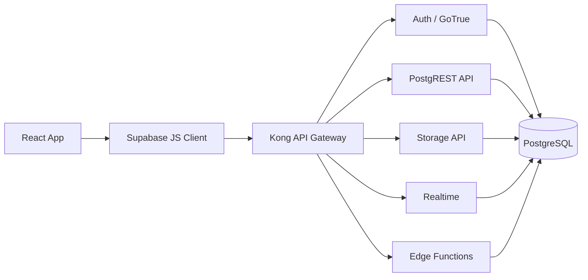
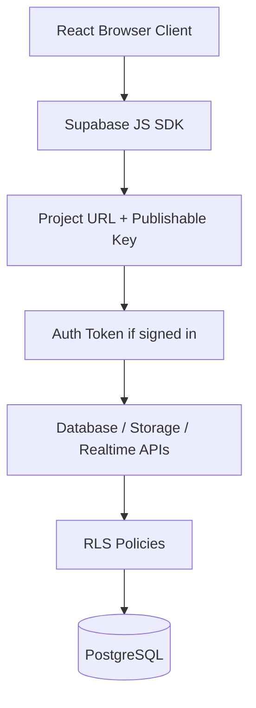
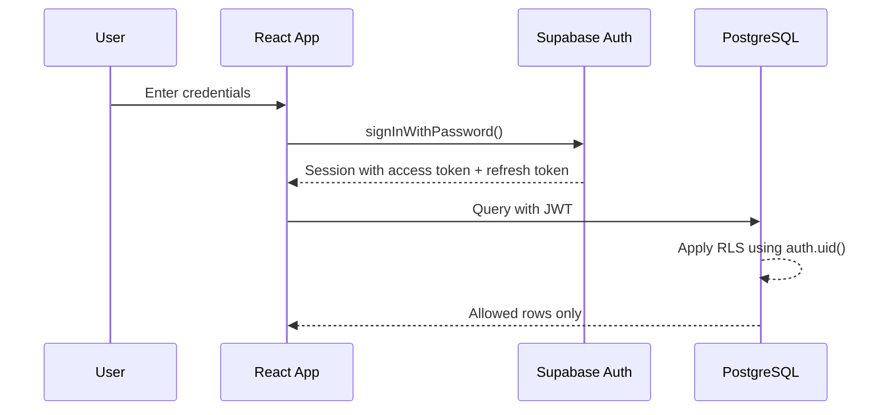
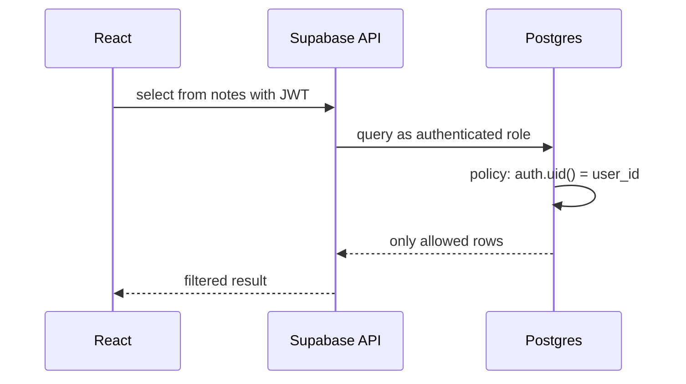
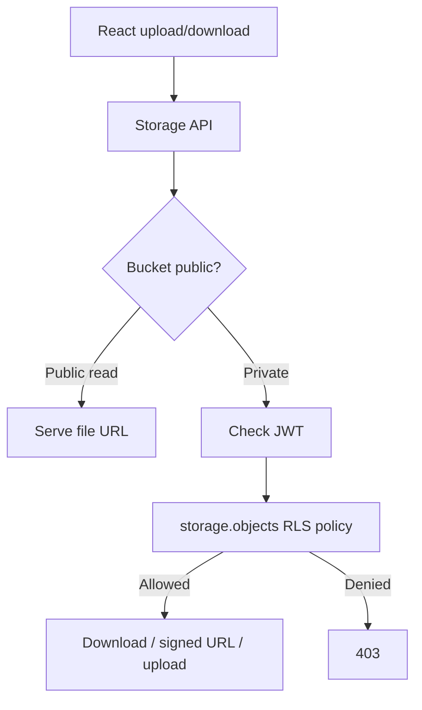
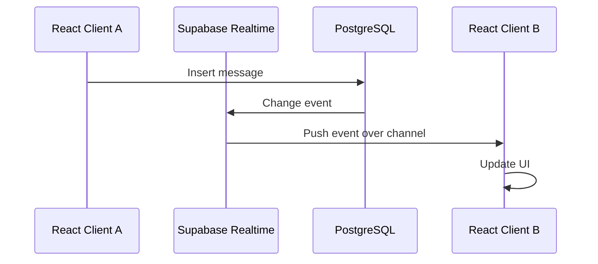
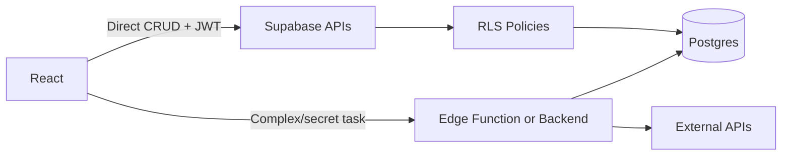
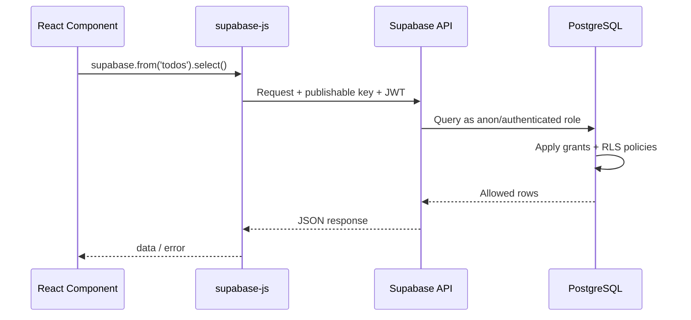

# Supabase Interview Cheat Sheet

For a 2-3 year React / Full-Stack Developer interview. Focus: how Supabase is used from React, with strong emphasis on Auth, RLS, policies, database relationships, Storage, Realtime, Edge Functions, and security.

## 1. Priority Map

| Level | Topics |
| --- | --- |
| MUST KNOW | What Supabase is, architecture, Auth, sessions/tokens, React client, Postgres tables, primary/foreign keys, RLS, policies, auth vs authorization, user-based access, Storage policies, security mistakes |
| SHOULD KNOW | OAuth basics, Realtime subscriptions, Edge Functions, Supabase vs custom backend, Supabase Auth vs custom JWT, Storage access flow, production security checklist |

## 2. Supabase in One Picture



**Interview answer:** "Supabase is a backend platform built around Postgres. From React, I use the Supabase client for auth, database queries, storage, realtime subscriptions, and function calls. The key security model is Auth plus Postgres Row Level Security."

## 3. What Is Supabase?

**MUST KNOW**

**Definition:** Supabase is an open-source backend-as-a-service built around PostgreSQL, with Auth, auto-generated APIs, Storage, Realtime, and Edge Functions.

**Why it is used:** It lets small teams build full-stack apps quickly without writing a full custom backend for common CRUD/auth/file/realtime needs.

**Interview-ready answer:** "Supabase is like a managed Postgres backend with batteries included. It gives me database, auth, storage, realtime, and serverless functions, while still letting me use SQL and Postgres RLS for security."

```ts
import { createClient } from "@supabase/supabase-js";

export const supabase = createClient(
  import.meta.env.VITE_SUPABASE_URL,
  import.meta.env.VITE_SUPABASE_PUBLISHABLE_KEY
);
```

**Trap/follow-up:** Supabase is not just "Firebase clone." It is Postgres-first, so relational modeling and RLS matter.

**When use it?** CRUD apps, dashboards, MVPs, SaaS apps, internal tools, auth-heavy apps, and apps needing Postgres with less backend boilerplate.

## 4. Supabase Architecture

**MUST KNOW**

**Definition:** Supabase exposes multiple services through an API gateway: Auth, PostgREST database API, Storage, Realtime, Edge Functions, and other services. Postgres is the core.

**Why it is used:** The frontend can call Supabase services directly while database policies enforce access rules.

**Interview-ready answer:** "The React app uses `supabase-js`. Requests go through Supabase APIs, carry the API key and user JWT, and Postgres RLS decides which rows the user can access."



```ts
const { data, error } = await supabase
  .from("todos")
  .select("id, title, is_done")
  .order("created_at", { ascending: false });
```

**Trap/follow-up:** The publishable key is safe to expose, but only if RLS and permissions are correctly configured. Secret keys must never be exposed in browser code.

## 5. Supabase Auth

**MUST KNOW**

**Definition:** Supabase Auth handles sign-up, sign-in, sessions, JWTs, OAuth providers, magic links, and user management.

**Why it is used:** It avoids building password storage, session refresh, OAuth, email confirmation, and token management from scratch.

**Interview-ready answer:** "Supabase Auth authenticates the user and issues JWT access tokens. Those tokens are sent with database requests, and RLS uses claims like `auth.uid()` to authorize row access."



```ts
const { data, error } = await supabase.auth.getUser();

if (data.user) {
  console.log(data.user.id);
}
```

**Trap/follow-up:** Authentication is not authorization. Login proves identity; RLS/policies decide access.

**When use it?** Almost every user-based Supabase app.

## 6. Email/Password Authentication

**MUST KNOW**

**Definition:** Users create accounts and sign in with email and password through Supabase Auth.

**Why it is used:** It is the simplest familiar auth flow for many apps.

**Interview-ready answer:** "For email/password, I call `signUp` and `signInWithPassword`. Supabase stores password hashes securely and returns a session after successful auth, depending on email confirmation settings."

```tsx
async function signIn(email: string, password: string) {
  const { data, error } = await supabase.auth.signInWithPassword({
    email,
    password,
  });

  if (error) throw error;
  return data.session;
}

async function signUp(email: string, password: string) {
  const { data, error } = await supabase.auth.signUp({ email, password });
  if (error) throw error;
  return data.user;
}
```

**Trap/follow-up:** With email confirmation enabled, a newly signed-up user may need to verify email before a usable session exists.

**When use it?** Standard SaaS/login apps where users manage credentials directly.

## 7. OAuth Basics

**SHOULD KNOW**

**Definition:** OAuth lets users sign in with providers like Google, GitHub, Discord, or Azure.

**Why it is used:** It reduces password friction and delegates identity verification to a trusted provider.

**Interview-ready answer:** "OAuth redirects the user to a provider, then Supabase handles the callback and creates a session in the app."

```ts
const { error } = await supabase.auth.signInWithOAuth({
  provider: "github",
  options: {
    redirectTo: `${window.location.origin}/auth/callback`,
  },
});

if (error) throw error;
```

**Trap/follow-up:** OAuth still needs redirect URL configuration in Supabase dashboard. OAuth identity does not automatically mean the user can access every row.

**When use it?** Consumer apps, internal tools, GitHub/Google login, and enterprise identity flows.

## 8. Sessions and Access Tokens

**MUST KNOW**

**Definition:** A session represents a signed-in user. Supabase sessions include a short-lived JWT access token and a refresh token.

**Why it is used:** The access token identifies the user in requests; the refresh token renews sessions.

**Interview-ready answer:** "The access token is a JWT sent with requests. Supabase clients refresh sessions automatically by default in browser apps. For authorization, the database reads JWT claims through helpers like `auth.uid()`."

```ts
const {
  data: { session },
} = await supabase.auth.getSession();

const accessToken = session?.access_token;
```

**Trap/follow-up:** Do not trust client-side session data alone for server authorization. Use verified tokens, `getUser`, `getClaims`, or RLS depending on the layer.

**When use it?** Authenticated queries, calling Edge Functions, forwarding identity to a backend, and checking login state.

## 9. Auth State in React

**MUST KNOW**

**Definition:** Auth state is the current signed-in/signed-out session tracked in React state.

**Why it is used:** UI must react to login/logout, token refresh, and page reloads.

**Interview-ready answer:** "I load the initial session and subscribe to auth changes with `onAuthStateChange`, then clean up the subscription in `useEffect`."

```tsx
import { useEffect, useState } from "react";
import type { Session } from "@supabase/supabase-js";

function App() {
  const [session, setSession] = useState<Session | null>(null);

  useEffect(() => {
    supabase.auth.getSession().then(({ data }) => {
      setSession(data.session);
    });

    const {
      data: { subscription },
    } = supabase.auth.onAuthStateChange((_event, nextSession) => {
      setSession(nextSession);
    });

    return () => subscription.unsubscribe();
  }, []);

  return session ? <Dashboard /> : <Login />;
}
```

**Trap/follow-up:** Forgetting unsubscribe can cause duplicate listeners during development and navigation.

**When use it?** App shell, protected routes, navbars, profile menus, and auth-gated screens.

## 10. Supabase Client Usage in React

**MUST KNOW**

**Definition:** `supabase-js` is the official JavaScript client for Auth, database, Storage, Realtime, and Functions.

**Why it is used:** It centralizes all Supabase calls and automatically attaches auth context.

**Interview-ready answer:** "I create one client using the project URL and publishable key. Then I use `.from()` for tables, `.auth` for auth, `.storage` for files, `.channel()` for realtime, and `.functions.invoke()` for Edge Functions."

```ts
const { data, error } = await supabase
  .from("projects")
  .select("id, name, owner_id")
  .eq("owner_id", userId);

if (error) throw error;
```

**Trap/follow-up:** Do not create a new client inside every render. Put it in a module or provider.

**When use it?** Browser CRUD, auth, uploads, subscriptions, and function calls.

## 11. PostgreSQL Database

**MUST KNOW**

**Definition:** Every Supabase project includes a real Postgres database.

**Why it is used:** It gives relational data modeling, SQL, constraints, transactions, indexes, views, functions, and RLS.

**Interview-ready answer:** "Supabase does not hide the database behind a proprietary document model. I design normal Postgres tables and access them through auto-generated APIs or SQL."

```sql
create table public.profiles (
  id uuid primary key references auth.users(id) on delete cascade,
  full_name text not null,
  avatar_url text,
  created_at timestamptz not null default now()
);
```

```ts
const { data } = await supabase
  .from("profiles")
  .select("id, full_name, avatar_url");
```

**Trap/follow-up:** Do not put application profile fields directly into `auth.users`. Create public app tables linked to `auth.users`.

## 12. Tables and Relationships

**MUST KNOW**

**Definition:** Tables store entities; relationships connect them using foreign keys.

**Why it is used:** React apps often need users, profiles, projects, tasks, comments, orders, etc. Relational structure keeps data consistent.

**Interview-ready answer:** "I model app data in Postgres tables and connect ownership or parent-child relationships with foreign keys. Then I protect rows using RLS."

```sql
create table public.projects (
  id uuid primary key default gen_random_uuid(),
  owner_id uuid not null references auth.users(id) on delete cascade,
  name text not null,
  created_at timestamptz not null default now()
);

create table public.tasks (
  id uuid primary key default gen_random_uuid(),
  project_id uuid not null references public.projects(id) on delete cascade,
  title text not null,
  is_done boolean not null default false,
  created_at timestamptz not null default now()
);
```

```ts
const { data } = await supabase
  .from("projects")
  .select("id, name, tasks(id, title, is_done)");
```

**Trap/follow-up:** Foreign keys enforce data integrity; they do not replace RLS authorization.

**When use it?** Any feature with ownership, parent-child data, or referential integrity.

## 13. Primary Keys and Foreign Keys

**MUST KNOW**

**Definition:** A primary key uniquely identifies a row. A foreign key points to another table's primary key.

**Why it is used:** They make relationships reliable and prevent orphaned or duplicated data.

**Interview-ready answer:** "Primary keys identify rows; foreign keys enforce valid relationships. For user-owned tables, I often store `user_id` or `owner_id` as a foreign key to `auth.users(id)`."

```sql
create table public.notes (
  id uuid primary key default gen_random_uuid(),
  user_id uuid not null references auth.users(id) on delete cascade,
  body text not null
);
```

```ts
await supabase.from("notes").insert({
  user_id: user.id,
  body: "Prepare Supabase interview notes",
});
```

**Trap/follow-up:** Never trust `user_id` sent from the frontend without an RLS `with check` policy.

## 14. Row Level Security (RLS)

**MUST KNOW**

**Definition:** RLS is a Postgres security feature that controls which rows a role can select, insert, update, or delete.

**Why it is used:** Supabase allows direct frontend-to-database access, so authorization must live in the database, not only in React.

**Interview-ready answer:** "RLS is the most important Supabase security feature. It applies rules at the database row level, usually using `auth.uid()` to compare the logged-in user with row ownership."



```sql
alter table public.notes enable row level security;

create policy "Users can read their own notes"
on public.notes
for select
to authenticated
using ((select auth.uid()) = user_id);
```

**Trap/follow-up:** RLS must be enabled on exposed tables. Without RLS, exposed tables may be accessible according to grants.

**When use it?** Any table accessed from frontend/mobile clients.

## 15. RLS Policies

**MUST KNOW**

**Definition:** Policies are SQL rules attached to a table for operations like `select`, `insert`, `update`, and `delete`.

**Why it is used:** They define exactly who can access or mutate which rows.

**Interview-ready answer:** "A `using` clause controls which existing rows are visible or affected. A `with check` clause controls whether new or updated row values are allowed."

```sql
alter table public.notes enable row level security;

create policy "Read own notes"
on public.notes
for select
to authenticated
using ((select auth.uid()) = user_id);

create policy "Create own notes"
on public.notes
for insert
to authenticated
with check ((select auth.uid()) = user_id);

create policy "Update own notes"
on public.notes
for update
to authenticated
using ((select auth.uid()) = user_id)
with check ((select auth.uid()) = user_id);

create policy "Delete own notes"
on public.notes
for delete
to authenticated
using ((select auth.uid()) = user_id);
```

```ts
await supabase.from("notes").insert({
  user_id: user.id,
  body: "Only I should create this",
});
```

**Trap/follow-up:** For `update`, you often need both a `select` policy and an `update` policy. Also index columns used in policies, such as `user_id`.

## 16. Authentication vs Authorization

**MUST KNOW**

| Concept | Meaning | Supabase example |
| --- | --- | --- |
| Authentication | Who are you? | Supabase Auth verifies user and issues JWT |
| Authorization | What can you access? | RLS policy checks `auth.uid() = user_id` |

**Definition:** Authentication verifies identity; authorization checks permissions.

**Why it is used:** A signed-in user should not automatically access all application data.

**Interview-ready answer:** "Auth gives me the user identity. RLS and policies enforce authorization at the database level."

```sql
create policy "Team members can read team projects"
on public.projects
for select
to authenticated
using (
  exists (
    select 1
    from public.team_members
    where team_members.team_id = projects.team_id
      and team_members.user_id = (select auth.uid())
  )
);
```

**Trap/follow-up:** Hiding buttons in React is not authorization. It is only UI behavior.

## 17. User-Based Access Control

**MUST KNOW**

**Definition:** User-based access control restricts data based on the current user's ID or role.

**Why it is used:** Most apps need "users can only access their own data" or "team members can access team data."

**Interview-ready answer:** "For simple ownership, I store `user_id` on the row and compare it with `auth.uid()` in RLS. For teams/RBAC, I check membership or custom claims."

```sql
create table public.todos (
  id uuid primary key default gen_random_uuid(),
  user_id uuid not null references auth.users(id) on delete cascade,
  title text not null,
  completed boolean not null default false
);

alter table public.todos enable row level security;

create policy "Users manage own todos"
on public.todos
for all
to authenticated
using ((select auth.uid()) = user_id)
with check ((select auth.uid()) = user_id);
```

```tsx
async function addTodo(title: string, userId: string) {
  const { error } = await supabase.from("todos").insert({
    title,
    user_id: userId,
  });

  if (error) throw error;
}
```

**Trap/follow-up:** A malicious user can change `user_id` in browser requests. The `with check` policy blocks inserting rows for another user.

**When use it?** Notes, tasks, profiles, orders, dashboards, private documents, and multi-tenant apps.

## 18. Storage

**MUST KNOW**

**Definition:** Supabase Storage stores files such as avatars, documents, images, and videos.

**Why it is used:** Files should usually live in object storage, while metadata and permissions live in Postgres.

**Interview-ready answer:** "Supabase Storage gives buckets and file APIs. Access is controlled by bucket visibility and RLS policies on `storage.objects`."

```tsx
async function uploadAvatar(userId: string, file: File) {
  const path = `${userId}/avatar.png`;

  const { data, error } = await supabase.storage
    .from("avatars")
    .upload(path, file, { upsert: true });

  if (error) throw error;
  return data.path;
}
```

**Trap/follow-up:** Storage ownership metadata alone is not access control. You still need policies.

**When use it?** Avatars, user documents, product images, attachments, and media uploads.

## 19. Storage Buckets and Policies

**MUST KNOW**

**Definition:** A bucket is a container for files. Public buckets allow public reads; private buckets require authenticated download or signed URLs. Policies control upload/read/update/delete.

**Why it is used:** Different files need different access rules.

**Interview-ready answer:** "I use public buckets only for truly public assets. For private files, I keep the bucket private and create Storage RLS policies on `storage.objects`."



```sql
create policy "Users upload own avatar"
on storage.objects
for insert
to authenticated
with check (
  bucket_id = 'avatars'
  and (storage.foldername(name))[1] = (select auth.uid())::text
);

create policy "Users read own avatar"
on storage.objects
for select
to authenticated
using (
  bucket_id = 'avatars'
  and (storage.foldername(name))[1] = (select auth.uid())::text
);
```

```ts
const { data, error } = await supabase.storage
  .from("private-documents")
  .createSignedUrl("user-123/report.pdf", 60);
```

**Trap/follow-up:** Public buckets bypass read access control for file URLs. Do not store private files in public buckets.

## 20. Realtime Subscriptions

**SHOULD KNOW**

**Definition:** Supabase Realtime lets clients receive live updates through channels. It supports Broadcast, Presence, and Postgres Changes.

**Why it is used:** It powers chat, notifications, collaborative UI, live dashboards, and instant updates.

**Interview-ready answer:** "For simple apps, I can subscribe to Postgres changes. For larger scale or more control, Broadcast is recommended because Postgres Changes authorizes events per subscriber."



```tsx
useEffect(() => {
  const channel = supabase
    .channel("messages-feed")
    .on(
      "postgres_changes",
      { event: "INSERT", schema: "public", table: "messages" },
      (payload) => {
        console.log("New message", payload.new);
      }
    )
    .subscribe();

  return () => {
    supabase.removeChannel(channel);
  };
}, []);
```

**Trap/follow-up:** Realtime is not a replacement for initial data fetch. Fetch current data first, then subscribe to changes.

**When use it?** Chat, notifications, live order status, collaborative features, dashboards.

## 21. Edge Functions

**SHOULD KNOW**

**Definition:** Supabase Edge Functions are serverless functions, typically written in TypeScript/Deno, deployed close to users.

**Why it is used:** They handle backend logic that should not run in the browser.

**Interview-ready answer:** "I use Edge Functions when I need server-side logic: webhooks, payment calls, secret API keys, custom validation, admin operations, or combining multiple Supabase/database operations."

```ts
const { data, error } = await supabase.functions.invoke("create-checkout", {
  body: { planId: "pro" },
});

if (error) throw error;
```

**Trap/follow-up:** Do not use Edge Functions for simple CRUD already protected by RLS. Use them when logic needs secrets, privileged access, external APIs, or orchestration.

**When use it?** Stripe webhooks, email sending, admin tasks, secure third-party API calls, scheduled jobs, complex backend validation.

## 22. When to Use Edge Functions

**SHOULD KNOW**

| Use direct Supabase client | Use Edge Function |
| --- | --- |
| Simple CRUD with RLS | Needs secret keys |
| User-owned data access | Payment/webhook handling |
| Normal file uploads | Server-side image processing |
| Simple query filters | Multi-step business transaction |
| Realtime subscriptions | Custom API endpoint |

```ts
// Good Edge Function use case from React
await supabase.functions.invoke("send-invite-email", {
  body: { teamId, email },
});
```

**Trap/follow-up:** If an Edge Function uses a secret/service key, it must implement authorization checks itself before privileged operations.

## 23. Supabase vs Traditional Backend

**MUST KNOW**

| Area | Supabase | Traditional backend/API |
| --- | --- | --- |
| CRUD API | Auto-generated from Postgres | You write endpoints |
| Auth | Built in | You build/integrate |
| Authorization | RLS policies | Middleware/service logic |
| Business logic | SQL/functions/Edge Functions | App server |
| Speed | Faster for common apps | More custom control |
| Best fit | CRUD/auth/realtime apps | Complex domain workflows |

**Definition:** Supabase can replace much of a traditional backend for common app features, but custom backend logic may still be needed.

**Why it is used:** It saves backend development time while preserving Postgres power.

**Interview-ready answer:** "Supabase is great when the data model maps well to Postgres and RLS. I still use Edge Functions or a traditional backend for complex workflows, secret integrations, queues, and business logic that should not be in the frontend."



**Trap/follow-up:** "No backend" does not mean "no backend security." The security moves to RLS, policies, grants, and functions.

## 24. Supabase Security Best Practices

**MUST KNOW**

**Definition:** Security best practices are the rules that keep client-exposed Supabase apps from leaking data.

**Why it is used:** Supabase clients often run in the browser, so the database must defend itself.

**Interview-ready answer:** "My main checklist is: enable RLS, write least-privilege policies, never expose secret keys, validate privileged function calls, keep private files in private buckets, and test policies as anon/authenticated users."

| Best practice | Why it matters |
| --- | --- |
| Enable RLS on exposed tables | Prevent broad table access |
| Use `to authenticated` / `to anon` in policies | Avoid unnecessary policy evaluation and accidental access |
| Use `with check` for inserts/updates | Prevent forged ownership |
| Index columns used in policies | Avoid slow RLS checks |
| Never expose secret/service keys | They bypass RLS / have elevated access |
| Prefer publishable key in browser | Intended for client apps |
| Keep private data in private buckets | Public bucket URLs are public |
| Validate Edge Function authorization | Privileged code must check caller |
| Do not trust frontend-only checks | Users can modify browser requests |

```sql
create index notes_user_id_idx on public.notes(user_id);
```

**Trap/follow-up:** The browser key being visible is expected. The real problem is missing RLS or exposing a secret key.

## 25. Common Mistakes and Interview Traps

**MUST KNOW**

| Mistake | Better answer |
| --- | --- |
| "I hide buttons in React, so data is safe" | Use RLS for real authorization |
| Exposing secret/service key in frontend | Use publishable key only in browser |
| Creating tables in SQL without enabling RLS | Enable RLS and policies before client access |
| Insert policy missing `with check` | Prevent users from inserting rows for others |
| Public bucket for private files | Use private bucket + policies/signed URLs |
| Relying on `user_metadata` for permissions | Use trusted app metadata/custom claims or DB membership tables |
| Realtime without initial fetch | Fetch first, then subscribe |
| Using Edge Functions for every query | Direct client + RLS is simpler for CRUD |
| Thinking Auth equals authorization | Auth identifies; policies authorize |
| Forgetting cleanup subscriptions | Unsubscribe/remove channels in React cleanup |

## 26. Supabase Auth vs Custom JWT Authentication

**MUST KNOW**

| Topic | Supabase Auth | Custom JWT Auth |
| --- | --- | --- |
| Setup | Built in | Build auth server yourself |
| Password handling | Managed | Your responsibility |
| OAuth | Built in providers | Implement provider flow |
| RLS integration | Native with `auth.uid()` | Requires correct JWT integration |
| Control | Less custom infra | Full control, more work |
| Risk | Misconfigured policies | Token/session/security bugs |

**Interview answer:** "I use Supabase Auth when I want managed authentication tightly integrated with RLS. I consider custom JWT only if the company already has identity infrastructure or needs very custom auth behavior."

**Trap/follow-up:** Custom JWT does not remove the need for authorization rules.

## 27. RLS vs Frontend Authorization

**MUST KNOW**

| Frontend authorization | RLS |
| --- | --- |
| Improves UX | Enforces security |
| Can hide/show UI | Controls actual row access |
| User can bypass it | Database enforces it |
| Still useful | Mandatory for exposed tables |

**Interview answer:** "Frontend checks are for user experience. RLS is the real security boundary."

```tsx
{canEdit && <button>Edit</button>}
```

```sql
create policy "Only owner can update project"
on public.projects
for update
to authenticated
using ((select auth.uid()) = owner_id)
with check ((select auth.uid()) = owner_id);
```

**Trap/follow-up:** A user can call the API directly even if the edit button is hidden.

## 28. React to Supabase to PostgreSQL Flow



**Interview answer:** "The frontend request includes app identity and, if logged in, user identity. Postgres policies decide what rows return."

## 29. Practical SQL Mini-Set

### A. Create User-Owned Tables

```sql
create table public.profiles (
  id uuid primary key references auth.users(id) on delete cascade,
  full_name text not null,
  created_at timestamptz not null default now()
);

create table public.notes (
  id uuid primary key default gen_random_uuid(),
  user_id uuid not null references auth.users(id) on delete cascade,
  title text not null,
  body text,
  created_at timestamptz not null default now()
);
```

### B. Add Foreign Keys

```sql
create table public.comments (
  id uuid primary key default gen_random_uuid(),
  note_id uuid not null references public.notes(id) on delete cascade,
  user_id uuid not null references auth.users(id) on delete cascade,
  body text not null,
  created_at timestamptz not null default now()
);
```

### C. Enable RLS

```sql
alter table public.profiles enable row level security;
alter table public.notes enable row level security;
alter table public.comments enable row level security;
```

### D. User-Specific Data Access

```sql
create policy "Users can read own profile"
on public.profiles
for select
to authenticated
using ((select auth.uid()) = id);

create policy "Users can update own profile"
on public.profiles
for update
to authenticated
using ((select auth.uid()) = id)
with check ((select auth.uid()) = id);

create policy "Users can manage own notes"
on public.notes
for all
to authenticated
using ((select auth.uid()) = user_id)
with check ((select auth.uid()) = user_id);
```

### E. Relationship-Based Access

```sql
create policy "Users can read comments on own notes"
on public.comments
for select
to authenticated
using (
  exists (
    select 1
    from public.notes
    where notes.id = comments.note_id
      and notes.user_id = (select auth.uid())
  )
);
```

## 30. Most-Asked Supabase Interview Questions

### A. What is Supabase?

Supabase is a Postgres-based backend platform with Auth, database APIs, Storage, Realtime, and Edge Functions.

### B. What is RLS?

RLS is Postgres row-level authorization. It controls which rows a user can read or modify.

### C. Why is RLS important in Supabase?

Because React clients can call the database API directly. RLS makes the database enforce security.

### D. What is `auth.uid()`?

It returns the authenticated user's ID from the JWT inside Postgres policies.

### E. Difference between `using` and `with check`?

`using` controls existing rows visible/affected. `with check` controls new row values for insert/update.

### F. Is the publishable/anon key safe in frontend code?

Yes, it is intended for browser/mobile use, but only with correct RLS and permissions. Secret/service keys are not safe in frontend code.

### G. How do you manage auth state in React?

Load initial session with `getSession()` and subscribe with `onAuthStateChange()`.

### H. When would you use Edge Functions?

For secrets, webhooks, payments, admin logic, external APIs, or backend-only workflows.

### I. Storage public vs private bucket?

Public buckets expose file URLs publicly. Private buckets require auth policies or signed URLs.

### J. Realtime best use cases?

Chat, notifications, live dashboards, collaborative UI, and real-time status updates.

## 31. Scenario-Based Questions

### A. User can see another user's notes. What do you check?

Check RLS is enabled, `select` policy compares `auth.uid()` to `user_id`, grants are not too broad, and no secret key is used from the client.

### B. User can insert a row with someone else's `user_id`. Why?

The insert policy probably lacks `with check ((select auth.uid()) = user_id)`.

### C. A profile image should be private. How do you design it?

Use a private bucket, store files under user-specific folders, create `storage.objects` policies, and use signed URLs when temporary access is needed.

### D. You need Stripe checkout. Direct client or Edge Function?

Edge Function, because Stripe secret keys must stay server-side and the function must verify the user before creating checkout.

### E. Realtime messages duplicate in React. Why?

The component probably creates multiple subscriptions without cleanup. Remove the channel in `useEffect` cleanup.

### F. Should every Supabase query go through Edge Functions?

No. Use direct client queries for normal CRUD protected by RLS. Use Edge Functions for secret or complex backend logic.

### G. How do you protect team data?

Use membership tables and RLS `exists` checks, not only frontend role checks.

```sql
create policy "Team members can read tasks"
on public.tasks
for select
to authenticated
using (
  exists (
    select 1
    from public.team_members
    where team_members.team_id = tasks.team_id
      and team_members.user_id = (select auth.uid())
  )
);
```

## 32. Final Rapid Revision

| Topic | One-line answer |
| --- | --- |
| Supabase | Postgres backend platform with Auth, APIs, Storage, Realtime, Functions |
| Architecture | React client calls Supabase APIs; Postgres + RLS enforce access |
| Auth | Identifies users and issues JWT sessions |
| Session | Access token + refresh token for signed-in user |
| OAuth | Provider login handled by Supabase redirect flow |
| React auth state | `getSession()` + `onAuthStateChange()` |
| Client setup | One `createClient(url, publishableKey)` module |
| Postgres | Real relational database, not a custom document store |
| Primary key | Unique row identifier |
| Foreign key | Relationship and integrity constraint |
| RLS | Row-level database authorization |
| Policy | SQL rule for select/insert/update/delete |
| `using` | Which existing rows are allowed |
| `with check` | Which new/updated rows are allowed |
| Auth vs authorization | Who you are vs what you can access |
| Storage | File storage with bucket and object policies |
| Public bucket | Public file reads |
| Private bucket | Auth/signed URL required |
| Realtime | Live channels for changes, broadcast, presence |
| Edge Functions | Server-side logic close to users |
| Security rule | Never expose secret keys; always use RLS for exposed tables |

## 33. References

- Supabase Auth overview - https://supabase.com/docs/guides/auth
- Supabase Auth architecture - https://supabase.com/docs/guides/auth/architecture
- Supabase Auth sessions - https://supabase.com/docs/guides/auth/sessions
- Supabase Auth with React - https://supabase.com/docs/guides/auth/quickstarts/react
- Supabase JavaScript client reference - https://supabase.com/docs/reference/javascript/auth
- Supabase Database overview - https://supabase.com/docs/guides/database/overview
- Supabase Row Level Security - https://supabase.com/docs/guides/database/postgres/row-level-security
- Supabase Securing your API - https://supabase.com/docs/guides/api/securing-your-api
- Supabase API keys - https://supabase.com/docs/guides/getting-started/api-keys
- Supabase Storage overview - https://supabase.com/docs/guides/storage
- Supabase Storage buckets - https://supabase.com/docs/guides/storage/buckets/fundamentals
- Supabase Storage access control - https://supabase.com/docs/guides/storage/security/access-control
- Supabase Realtime overview - https://supabase.com/docs/guides/realtime
- Supabase Postgres Changes - https://supabase.com/docs/guides/realtime/postgres-changes
- Supabase Edge Functions architecture - https://supabase.com/docs/guides/functions/architecture
- Recent interview cross-checks: TechInterview Supabase Interview Guide 2026, Adaface Supabase Interview Questions, recent Supabase React/Next.js implementation guides.
