# System Design / Application Architecture Interview Cheat Sheet

For a 2-3 year Software Developer / Full-Stack Developer interview. Focus: practical architecture explanation, design trade-offs, and clear spoken answers. This is not a senior distributed systems textbook.

## 1. Priority Map

| Level | Topics |
| --- | --- |
| MUST KNOW | Requirements clarification, high-level architecture, API/data flow, database choice, caching, scaling, load balancing, async processing, authentication/authorization, failure handling, trade-offs |
| SHOULD KNOW | Replication, partitioning, read replicas, rate limiting, message queues, Redis, API gateway, circuit breaker, observability |
| BASIC | Sharding, consistent hashing, CAP theorem, event-driven architecture, advanced distributed systems concepts |

## 2. What Is System Design?

**MUST KNOW**

**Definition:** System design is the process of designing components, data flow, APIs, storage, scaling, reliability, and trade-offs for an application.

**Why used:** It shows whether you can build beyond one function or one page and reason about real-world behavior.

**Interview-ready answer:** "System design is about turning requirements into an architecture: clients, APIs, services, data storage, caching, async jobs, security, monitoring, and scaling choices."

**Example:** For a file upload system, choose API, object storage, database metadata, background processing, and access control.

**Trade-off:** More components can improve scalability but increase complexity.

**Trap:** Jumping to tools before clarifying requirements.

## 3. Simple System Design Framework

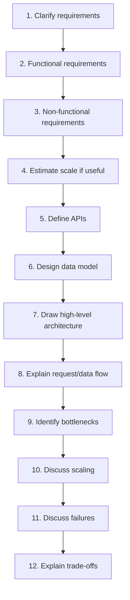

**Interview-ready answer:** "I start with requirements, then design APIs and data, draw the main components, explain flow, then discuss bottlenecks, scaling, failures, and trade-offs."

**Trap:** A good interview answer is a conversation, not a memorized final diagram.

## 4. Functional vs Non-Functional Requirements

**MUST KNOW**

| Functional | Non-functional |
| --- | --- |
| What the system does | How well it does it |
| User can upload file | Upload should be reliable and secure |
| User can send message | Message should deliver quickly |
| Admin can view reports | Reports should handle large data |

**Interview-ready answer:** "Functional requirements define features. Non-functional requirements define quality goals like latency, scale, reliability, security, and maintainability."

**Trap:** Ignoring non-functional requirements leads to weak architecture discussion.

## 5. Core Quality Attributes

**MUST KNOW**

| Attribute | Simple meaning | Example |
| --- | --- | --- |
| Scalability | Handle growth | Add more API servers |
| Availability | System is up when needed | Multi-instance app |
| Reliability | Works correctly over time | Retries and durable queues |
| Maintainability | Easy to change/debug | Clear layers/modules |
| Performance | Efficient response/resource use | Cache frequent reads |
| Latency | Time for one request | API responds in 100 ms |
| Throughput | Work per time | 1,000 requests/sec |

**Interview-ready answer:** "Latency is how fast one request is. Throughput is how many requests the system handles over time."

**Trap:** Optimizing everything at once is impossible; state which quality matters most.

## 6. Basic Web Application Architecture

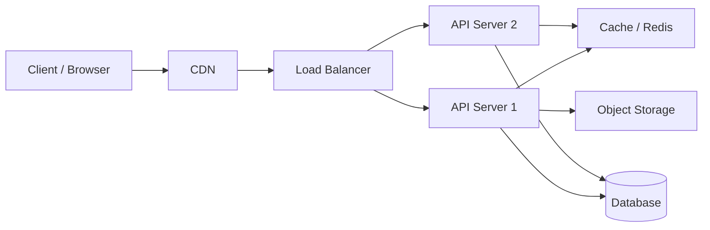

**Interview answer:** "A typical app has clients, CDN for static/cacheable content, load balancer, stateless API servers, cache, database, and object storage for files."

## 7. Common Components

**MUST KNOW**

| Component | What it does | Why it exists | Trade-off |
| --- | --- | --- | --- |
| Client | Sends requests/displays UI | User interaction | Can be untrusted |
| Frontend | Browser/app UI | Handles UX | Should not hold secrets |
| Backend/API server | Business logic/API | Central rules/security | Can bottleneck |
| Load balancer | Distributes traffic | Scale/availability | Adds routing complexity |
| Reverse proxy | Sits before app servers | TLS/routing/security/cache | Another config layer |
| Cache | Stores frequently used data | Lower latency/load | Stale data risk |
| Database | Persistent data | Source of truth | Scaling writes is harder |
| Object storage | Stores files/blobs | Better than DB for files | Metadata consistency needed |
| Message queue | Buffers async work | Decouples processing | Eventual consistency |
| Worker | Processes background jobs | Handles slow tasks | Needs retry/idempotency |
| External service | Payment/email/maps/etc. | Avoid building everything | Dependency failures |

**Trap:** Every component must answer "why". Do not add Redis/queue/LB just to sound advanced.

## 8. Vertical vs Horizontal Scaling

**MUST KNOW**

| Vertical scaling | Horizontal scaling |
| --- | --- |
| Bigger machine | More machines |
| Simpler | More scalable |
| Has hardware limits | Needs load balancing/statelessness |
| Good first step | Good for high traffic |

**Interview-ready answer:** "Vertical scaling means increasing server capacity. Horizontal scaling means adding more instances and distributing traffic."

**Example:** Upgrade DB CPU/RAM vertically; add more API servers horizontally.

**Trap:** Horizontal scaling a stateful app is harder if session/files live on one server.

## 9. Stateless vs Stateful Services

**MUST KNOW**

| Stateless | Stateful |
| --- | --- |
| No required local session state | Keeps local/session state |
| Easier to scale horizontally | Harder to move traffic |
| Request carries needed context | Server memory matters |
| Common for APIs | Common for DBs, caches, sessions |

**Interview-ready answer:** "Stateless API servers are easier to scale because any instance can handle any request. State should live in DB/cache/session store."

**Trap:** JWT/session handling choices affect statelessness.

## 10. Monolith vs Microservices

**MUST KNOW**

| Monolith | Microservices |
| --- | --- |
| One deployable app | Many independently deployable services |
| Simpler development/deployment | Independent scaling/ownership |
| Easier transactions | Distributed data/communication complexity |
| Good for small teams | Useful for large teams/domains |

**Interview-ready answer:** "For a 2-3 year interview, I would usually start with a modular monolith unless scale/team boundaries require microservices."

**Trap:** Microservices are not automatically better. They add operational complexity.

## 11. Modular Monolith vs Microservices

**SHOULD KNOW**

| Modular monolith | Microservices |
| --- | --- |
| One deployment, clear modules | Separate deployments |
| Easier debugging and transactions | More independent scaling |
| Good stepping stone | Needs mature DevOps/observability |

**Example:** Modules: `auth`, `orders`, `payments`, `notifications` in one app.

**Trap:** A messy monolith is not the same as a modular monolith.

## 12. Sync vs Async Communication

**MUST KNOW**

| Synchronous | Asynchronous |
| --- | --- |
| Caller waits for response | Caller sends message/job and continues |
| Simple request/response | Better for slow/background work |
| Immediate result | Eventual consistency |
| Coupled to service availability | Decouples producer/consumer |

**Interview-ready answer:** "Use sync when the user needs an immediate answer. Use async for slow, retryable, or background tasks like emails, reports, file processing."

**Trap:** Async improves resilience but makes status tracking and debugging more complex.

## 13. Load Balancer vs API Gateway

**SHOULD KNOW**

| Load balancer | API gateway |
| --- | --- |
| Distributes traffic across instances | Central API entry point |
| Health checks/routing | Auth, rate limits, routing, request policies |
| Lower-level traffic concern | API management concern |

**Interview-ready answer:** "A load balancer spreads traffic across healthy servers. An API gateway is an API entry layer that can handle routing, auth, rate limits, and policies."

**Trap:** They can overlap in products, but conceptually they solve different problems.

## 14. Load-Balanced Architecture

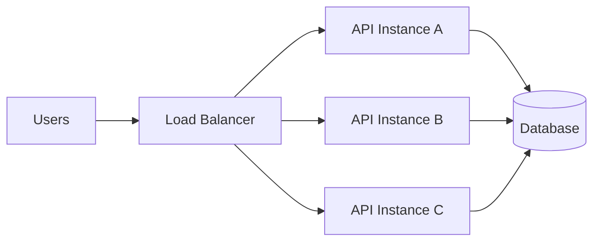

**Interview answer:** "A load balancer improves availability and scaling by routing users to healthy API instances."

**Trade-off:** Shared DB can become bottleneck after scaling API servers.

## 15. Reverse Proxy and CDN Basics

**BASIC**

**Reverse proxy:** Server in front of app servers that can handle TLS termination, routing, compression, caching, and security.

**CDN:** Globally distributed cache for static/cacheable content close to users.

**Interview-ready answer:** "A CDN reduces latency and origin load by serving cached assets near users. A reverse proxy sits in front of backend servers for routing/security/TLS."

**Example:** Static JS/CSS/images served from CDN; API routed to backend.

**Trap:** CDN is not for every private dynamic response unless caching rules are correct.

## 16. Database Selection Basics

**MUST KNOW**

| SQL | NoSQL |
| --- | --- |
| Relational tables/schema | Flexible/document/key-value models |
| Strong relationships/transactions | Flexible scale/data shape |
| Good for orders/users/payments | Good for logs, sessions, flexible documents |
| SQL queries | Store-specific query models |

**Interview-ready answer:** "I choose SQL when relationships, constraints, and transactions matter. I consider NoSQL when data is flexible, high-volume, or access patterns are key-value/document based."

**Trap:** Do not choose NoSQL only because the system is large; many large systems use SQL.

## 17. Database Data Concepts

**SHOULD KNOW**

| Concept | Simple answer | Trade-off |
| --- | --- | --- |
| Index | Speeds reads | Slower writes/storage |
| Read replica | Copy used for reads | Replication lag |
| Replication | Copies data to another DB node | Consistency/lag complexity |
| Partitioning | Split table/data into parts | Query/routing complexity |
| Sharding | Split data across DB servers | Hard joins/rebalancing |
| Transaction | Atomic group of changes | Locks/overhead |
| Consistency | All readers see correct/latest data | May reduce availability/latency |
| Connection pool | Reuses DB connections | Pool exhaustion if misconfigured |

**Interview-ready answer:** "At my level, I explain basic read/write patterns: add indexes for frequent filters, use read replicas for read-heavy systems, and consider partitioning/sharding only when one DB cannot handle scale."

**Trap:** Sharding is rarely the first solution.

## 18. Replication vs Sharding

**SHOULD KNOW**

| Replication | Sharding |
| --- | --- |
| Copies same data to other nodes | Splits different data across nodes |
| Helps reads/availability | Helps storage/write scale |
| May have lag | Complex routing and joins |
| Easier than sharding | Harder operationally |

**Interview-ready answer:** "Replication duplicates data. Sharding divides data."

## 19. Caching Basics

**MUST KNOW**

**Definition:** Caching stores frequently used data closer/faster than the source of truth.

**Why used:** Reduces latency, database load, and repeated expensive computation.

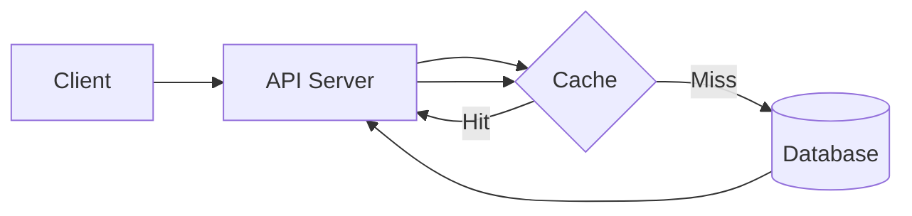

**Interview-ready answer:** "I cache data that is read often and changes less frequently, like product catalog, profiles, settings, or computed results."

**Trap:** Cache invalidation and stale data are the hard parts.

## 20. Cache vs Database

**MUST KNOW**

| Cache | Database |
| --- | --- |
| Fast temporary copy | Source of truth |
| Can be stale | Durable persistent data |
| Often key-value | Structured storage/query |
| Optimizes reads | Stores authoritative state |

**Do cache:** public/static config, product lists, expensive computed data.

**Avoid caching:** highly sensitive data, frequently changing balances, data requiring strict freshness unless carefully designed.

## 21. Cache Patterns

**SHOULD KNOW**

| Pattern | Meaning |
| --- | --- |
| Cache-aside | App checks cache, loads DB on miss, writes cache |
| Read-through | Cache layer loads from DB automatically |
| Write-through | Write goes to cache and DB together |
| TTL | Expiry time for cached item |

```text
GET product -> cache miss -> DB -> store cache with TTL -> return
```

**Interview-ready answer:** "Cache-aside is common: the app reads cache first, falls back to DB, then stores result with TTL."

**Trap:** Long TTL improves hit rate but increases stale data risk.

## 22. Redis Basics

**SHOULD KNOW**

**Definition:** Redis is an in-memory data store commonly used for caching, sessions, rate limiting, locks, and queues.

**Why used:** Very fast key-value access.

**Example:**

```text
key: product:123
value: serialized product JSON
ttl: 300 seconds
```

**Trap:** Redis is usually not the primary database for important relational data.

## 23. Async Queue Architecture

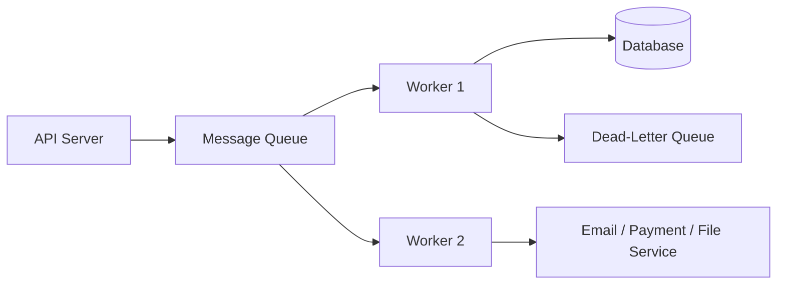

**Interview answer:** "Queues decouple request intake from slower processing. Workers consume jobs and can retry failures."

## 24. Message Queues and Background Jobs

**MUST KNOW**

**Definition:** A queue stores messages/jobs for consumers to process asynchronously.

**Why used:** It smooths spikes, improves reliability, and avoids making users wait for slow work.

**Examples:** Send notifications, process uploaded files, generate reports.

**Interview-ready answer:** "I use a queue when work is slow, retryable, or does not need to finish before responding to the user."

**Trade-offs:** Eventual consistency, duplicate messages, ordering complexity, monitoring queue depth.

**Trap:** Workers must be idempotent because messages may be delivered more than once.

## 25. Retry, Dead-Letter Queue, Idempotency

**SHOULD KNOW**

| Concept | Meaning |
| --- | --- |
| Retry | Try again after transient failure |
| Backoff | Wait longer between retries |
| Dead-letter queue | Store permanently failed messages |
| Idempotency | Reprocessing does not duplicate side effects |

**Example:** Email send fails -> retry 3 times -> DLQ if still failing.

**Trap:** Retrying bad data forever blocks progress and hides failures.

## 26. REST vs Message Queue

**MUST KNOW**

| REST API | Message queue |
| --- | --- |
| Synchronous request/response | Asynchronous job/event processing |
| Caller waits for result | Producer continues after enqueue |
| Good for immediate reads/actions | Good for slow/retryable work |
| Simpler debugging | Better decoupling/resilience |
| Failure affects caller directly | Failure can be retried by worker |

**Interview-ready answer:** "I use REST when the client needs an immediate response. I use a queue when work can happen in the background, like sending notifications or processing files."

**Trap:** A queue is not good when the user needs an immediate final answer.

## 27. Basic Advanced Terms

**BASIC**

| Term | Interview-level answer |
| --- | --- |
| Sharding | Split data across multiple database nodes |
| Consistent hashing | Distribute keys across nodes while reducing remapping when nodes change |
| CAP theorem | In network partitions, distributed systems trade off consistency and availability |
| Event-driven architecture | Services react to events instead of direct request chains |

**Interview-ready answer:** "For a 2-3 year role, I would mention these only at a high level and avoid designing around them unless scale requires it."

**Trap:** Bringing up CAP/sharding too early can make the design sound overcomplicated.

## 28. API / Backend Architecture Concepts

**MUST KNOW**

| Concept | Architecture role |
| --- | --- |
| REST APIs | Client-server contract |
| Authentication | Identify caller |
| Authorization | Check permission |
| Rate limiting | Protect API from abuse |
| Pagination | Avoid huge responses |
| Versioning | Evolve API safely |
| Error handling | Predictable failure responses |
| Idempotency | Safe retries |
| Validation | Reject invalid input early |

**Interview-ready answer:** "From an architecture view, API design protects the system boundary: validate input, authenticate, authorize, limit abuse, and return predictable responses."

**Trap:** Frontend checks are not backend security.

## 29. Authentication Flow

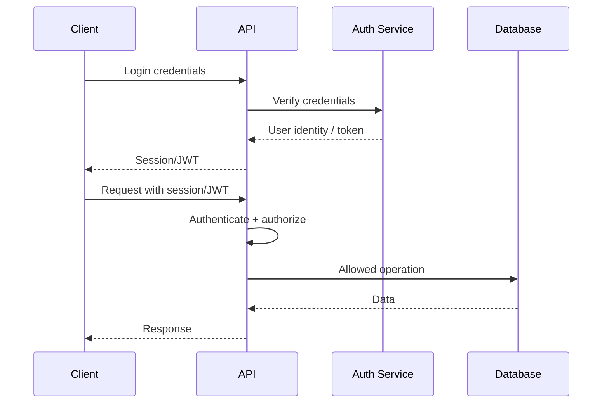

## 30. Security Basics

**MUST KNOW**

| Topic | Short answer |
| --- | --- |
| HTTPS | Encrypt traffic in transit |
| Auth vs authorization | Identity vs permission |
| JWT/session | Common login state mechanisms |
| Rate limiting | Prevent abuse/spikes |
| Input validation | Reject bad data |
| Secrets | Store outside code |
| Access control | Enforce on backend |

**Interview-ready answer:** "Security basics are HTTPS, authentication, server-side authorization, input validation, rate limits, safe secret handling, and least-privilege access."

**Trap:** CORS or hidden UI buttons are not authorization.

## 31. Observability and Reliability

**MUST KNOW**

| Concept | Why |
| --- | --- |
| Logging | Understand what happened |
| Metrics | Measure health/performance |
| Monitoring | Alert on problems |
| Health checks | Detect unhealthy instances |
| Timeouts | Avoid waiting forever |
| Retries | Handle transient failures |
| Circuit breaker | Stop calling failing dependency temporarily |
| Graceful degradation | Keep partial functionality working |
| Failure handling | Make failures expected and recoverable |

**Interview-ready answer:** "I design for failure by adding logs, metrics, health checks, timeouts, retries with backoff, and graceful fallback when dependencies are slow or down."

**Trap:** Retrying everything can overload a failing service.

## 32. Architecture Patterns

**SHOULD KNOW**

| Pattern | Simple meaning | Good for |
| --- | --- | --- |
| Layered architecture | Controller/service/repository layers | CRUD apps |
| MVC | Model, View, Controller separation | Web apps |
| Repository/service | Data access separate from business logic | Maintainability |
| Modular monolith | One app with clear modules | Small/medium teams |
| Microservices | Multiple independent services | Large domains/teams |
| Event-driven | Components react to events | Async workflows |

**Interview-ready answer:** "I focus on separation of concerns: API/controller handles requests, service handles business logic, repository handles data access, and background workers handle slow tasks."

**Trap:** Pattern names matter less than explaining why they help.

## 33. Project Architecture Explanation

**MUST KNOW**

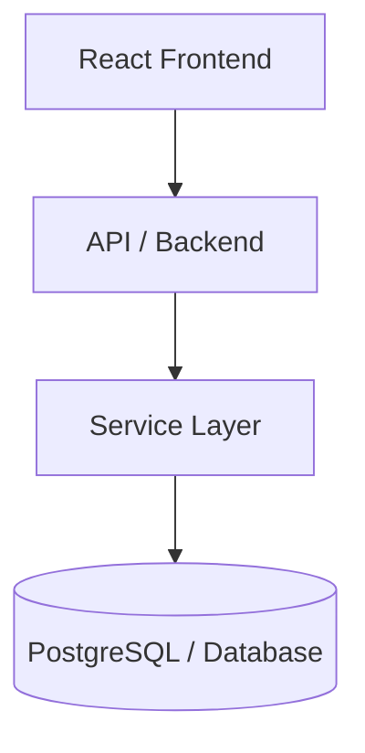

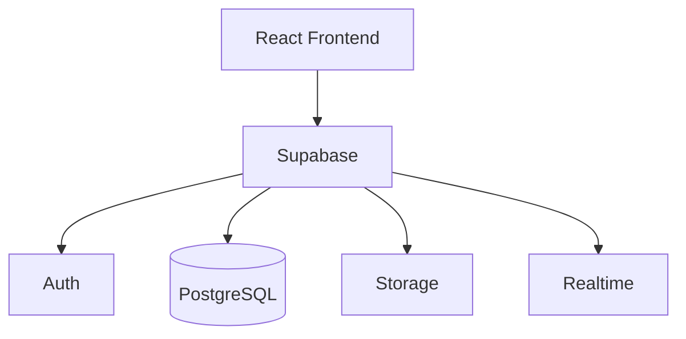

**Interview-ready answer:** "I explain my project from outside-in: frontend, backend/API or Supabase, service/business layer, database/storage, authentication, and any background or realtime flows. Then I explain one request from user action to data response."

**Trap:** Do not invent details. Use phrases like "in a typical setup" when describing generic architecture.

## 34. Design 1: URL Shortener

**Common 2-3 year question**

**Requirements:** Create short URL, redirect short URL, track basic clicks if needed.

**APIs:**

```http
POST /api/urls { "longUrl": "https://example.com/long" }
GET /{shortCode}
```

**Data model:**

```text
urls(id, short_code, long_url, user_id, created_at, expires_at)
clicks(id, short_code, clicked_at, user_agent)
```

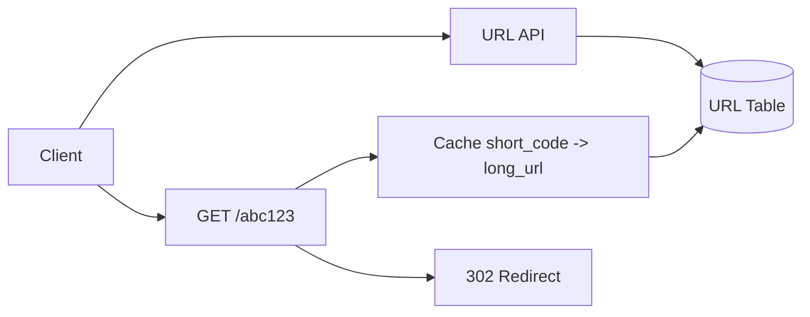

**Flow:** Create validates URL, generates unique short code, stores mapping. Redirect checks cache/DB and returns `301/302`.

**Scaling:** Cache popular short codes, index `short_code`, separate analytics async.

**Failures:** Short code collision, invalid URL, DB/cache down.

**Trade-off:** Random code is simple; custom aliases need conflict handling.

**Interview explanation:** "Core is a mapping from short code to long URL, optimized for fast reads."

## 35. Design 2: Notification System

**Requirements:** Send email/SMS/push notifications, retry failures, track status.

**APIs:**

```http
POST /api/notifications { "userId": "1", "type": "EMAIL", "message": "..." }
GET /api/notifications/{id}
```

**Data model:**

```text
notifications(id, user_id, type, status, payload, created_at, sent_at)
```

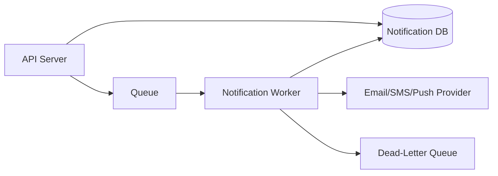

**Flow:** API stores notification, queues job, worker sends via provider, updates status.

**Scaling:** Add workers, rate limit provider calls, retry with backoff.

**Failures:** Provider down, duplicate sends, invalid recipient.

**Trade-off:** Async is reliable but user sees "queued" instead of immediate final result.

## 36. Design 3: File Upload / Storage System

**Requirements:** Upload files, store metadata, retrieve/download, control access.

**APIs:**

```http
POST /api/files
GET /api/files/{id}
GET /api/files/{id}/download
```

**Data model:**

```text
files(id, owner_id, filename, content_type, size, storage_key, status, created_at)
```

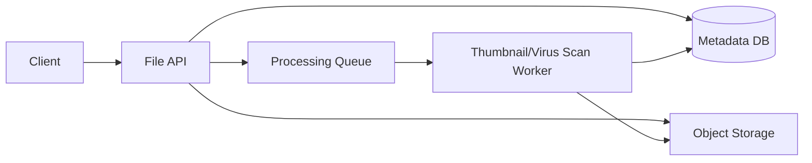

**Flow:** Validate file, upload to object storage, save metadata, optionally queue processing.

**Scaling:** Store files in object storage, not DB; CDN for public downloads; background processing.

**Failures:** Partial upload, large files, invalid type, storage outage.

**Trade-off:** Direct-to-storage upload reduces API load but needs signed URLs/access control.

## 37. Design 4: Simple Chat System

**Requirements:** Send messages, receive recent messages, near-real-time updates.

**APIs:**

```http
POST /api/chats/{chatId}/messages
GET /api/chats/{chatId}/messages?limit=50
```

**Data model:**

```text
chats(id, created_at)
chat_members(chat_id, user_id)
messages(id, chat_id, sender_id, body, created_at)
```

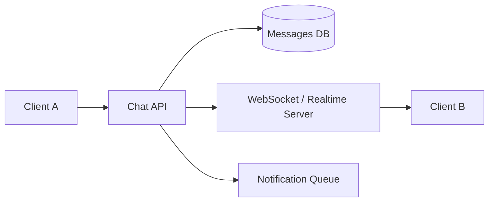

**Flow:** Sender posts message, API checks membership, saves message, publishes realtime event, queues notification.

**Scaling:** Partition by chat/user, paginate message history, scale realtime layer.

**Failures:** Duplicate messages, offline users, realtime disconnects.

**Trade-off:** Real-time delivery adds complexity; basic polling is simpler but less responsive.

## 38. Design 5: Rate Limiter

**Requirements:** Limit requests per user/IP/API key.

**API behavior:**

```http
HTTP/1.1 429 Too Many Requests
Retry-After: 60
```

**Data model/cache:**

```text
rate:user:123:minute -> count with TTL
```

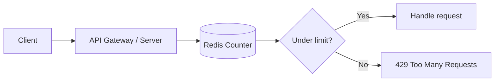

**Flow:** For each request, increment counter in Redis with TTL. Reject if limit exceeded.

**Scaling:** Use centralized Redis or gateway-level limiter.

**Failures:** Redis down, shared IPs, distributed counter consistency.

**Trade-off:** Simple fixed window is easy but can allow bursts at boundaries.

## 39. Design 6: Task / Job Processing System

**Requirements:** Submit jobs, process in background, check status.

**APIs:**

```http
POST /api/jobs { "type": "REPORT", "params": {} }
GET /api/jobs/{id}
```

**Data model:**

```text
jobs(id, type, status, payload, result_url, attempts, created_at, updated_at)
```

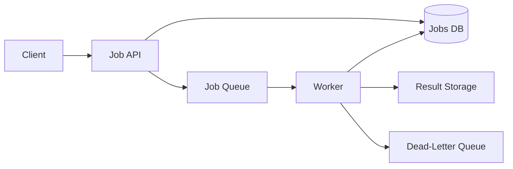

**Flow:** API stores job as queued, publishes message, worker processes, updates status/result.

**Scaling:** Add workers, monitor queue depth, split queues by priority.

**Failures:** Worker crash, duplicate processing, stuck jobs.

**Trade-off:** Async improves responsiveness but needs job status and retry design.

## 40. Design 7: Simple E-Commerce Backend

**Requirements:** Browse products, cart, place order, payment status.

**APIs:**

```http
GET /api/products?category=books
POST /api/cart/items
POST /api/orders
GET /api/orders/{id}
```

**Data model:**

```text
products(id, name, price, stock)
carts(id, user_id)
cart_items(cart_id, product_id, quantity)
orders(id, user_id, status, total)
order_items(order_id, product_id, quantity, price)
```

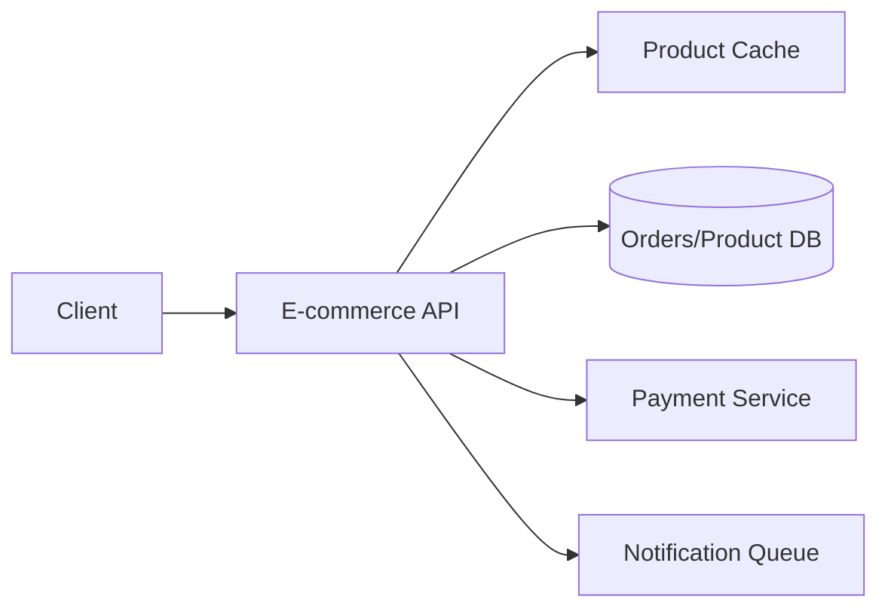

**Flow:** Product reads can be cached. Order creation validates stock, creates order, calls payment or starts payment flow, queues notifications.

**Scaling:** Cache product catalog, paginate products, separate order/payment reliability.

**Failures:** Payment timeout, stock race, duplicate order retry.

**Trade-off:** Strong consistency for orders/stock; eventual consistency acceptable for emails.

## 41. Design 8: Learning / Assessment Platform

**Requirements:** Users take assessments, submit answers, compute score, show progress.

**APIs:**

```http
GET /api/assessments/{id}
POST /api/attempts
POST /api/attempts/{id}/answers
GET /api/attempts/{id}/result
```

**Data model:**

```text
assessments(id, title)
questions(id, assessment_id, text)
attempts(id, user_id, assessment_id, status, score)
answers(id, attempt_id, question_id, selected_option)
```

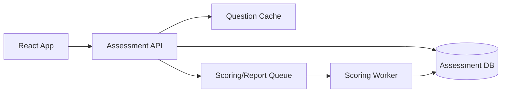

**Flow:** Load assessment, create attempt, submit answers, score immediately or asynchronously depending on complexity.

**Scaling:** Cache mostly static questions, paginate history, async reports.

**Failures:** Duplicate answer submit, timer/network issues, scoring job failure.

**Trade-off:** Immediate scoring is simpler; async scoring handles heavier evaluation.

## 42. Design 9: Simple News / Feed System

**Requirements:** Post content, follow users/topics, view feed.

**APIs:**

```http
POST /api/posts
GET /api/feed?cursor=...
POST /api/follows
```

**Data model:**

```text
users(id, name)
posts(id, author_id, body, created_at)
follows(follower_id, followee_id)
feed_items(user_id, post_id, created_at)
```

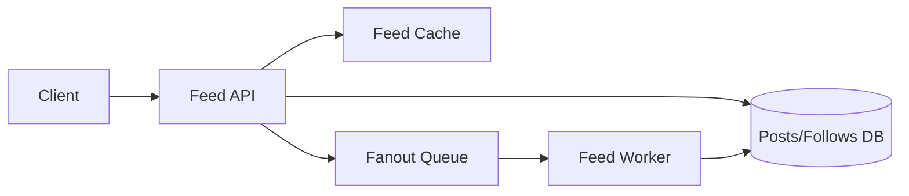

**Flow:** User creates post; system stores it and optionally fans out to followers via queue. Feed API returns paginated results.

**Scaling:** Cursor pagination, cache hot feeds, async fanout for many followers.

**Failures:** Feed stale, fanout delay, duplicate feed items.

**Trade-off:** Fanout-on-write speeds reads but makes writes heavier.

## 43. Common Interview Questions

### A. Monolith vs microservices?

Start with modular monolith for simplicity. Use microservices when independent scaling, deployment, or team ownership justifies complexity.

### B. Vertical vs horizontal scaling?

Vertical means bigger machine; horizontal means more machines behind a load balancer.

### C. Why use a load balancer?

To distribute traffic, route around unhealthy instances, and scale API servers horizontally.

### D. Why use Redis?

For fast cache/session/rate-limit access where data can be temporary or derived.

### E. SQL vs NoSQL?

SQL for relationships/transactions. NoSQL for flexible or access-pattern-specific data.

### F. What is replication/read replica?

Replication copies data to another DB node. A read replica serves read queries but may lag.

### G. What problems can caching create?

Stale data, invalidation complexity, cache stampede, memory pressure, and consistency issues.

### H. Why use a message queue?

To decouple slow/retryable work from user requests and smooth traffic spikes.

### I. How handle a slow API?

Add timeouts, measure bottleneck, cache if safe, optimize DB/query, use async processing, and degrade gracefully.

### J. How handle service failure?

Use retries with backoff for transient failures, circuit breaker for persistent failures, fallback if possible, and alerting/logging.

### K. How prevent duplicate requests?

Use idempotency keys, unique constraints, request IDs, and idempotent worker logic.

### L. How scale an application?

Make API stateless, add load balancer and instances, cache reads, optimize DB, use queues for slow work, and scale database carefully.

### M. How identify a bottleneck?

Use metrics/logs/traces, check latency by component, DB slow queries, cache hit rate, queue depth, CPU/memory, and error rates.

## 44. Common Traps

| Trap | Better answer |
| --- | --- |
| Start with microservices | Start simple, justify complexity |
| Add cache everywhere | Cache read-heavy safe data only |
| Ignore failures | Discuss timeouts/retries/fallbacks |
| Ignore data model | APIs depend on data shape |
| Shard too early | Index/optimize/replicate first |
| Retry everything | Retry only safe/transient operations |
| No idempotency | Required for retries/jobs/payments |
| No monitoring | Need logs/metrics/health checks |
| Frontend-only auth | Enforce backend authorization |

## 45. Final Rapid Revision

| Topic | One-line answer |
| --- | --- |
| System design | Requirements to architecture and trade-offs |
| Functional req | What system does |
| Non-functional req | Quality goals |
| Scalability | Handle growth |
| Availability | Stay up |
| Reliability | Work correctly over time |
| Latency | One request time |
| Throughput | Requests per time |
| Vertical scale | Bigger machine |
| Horizontal scale | More machines |
| Stateless | Easier to scale |
| Load balancer | Distributes traffic |
| CDN | Caches content near users |
| Cache | Fast temporary copy |
| SQL | Relationships/transactions |
| NoSQL | Flexible/access-pattern data |
| Queue | Async buffer |
| REST vs queue | Immediate response vs background processing |
| Worker | Background processor |
| Read replica | Read-only DB copy |
| Sharding | Split data across DBs |
| API gateway | API entry and policies |
| Rate limiting | Control request volume |
| Circuit breaker | Stop calling failing dependency |
| Observability | Logs, metrics, monitoring |
| Trade-off | Every benefit has cost |
| CAP theorem | Basic distributed consistency/availability trade-off |

## 46. References

- Google Cloud Architecture Framework - https://cloud.google.com/architecture/framework
- AWS Well-Architected Framework - https://docs.aws.amazon.com/wellarchitected/latest/framework/welcome.html
- Microsoft Azure Architecture Center: Queue-Based Load Leveling - https://learn.microsoft.com/en-us/azure/architecture/patterns/queue-based-load-leveling
- Microsoft Azure Architecture Center: Circuit Breaker - https://learn.microsoft.com/en-us/azure/architecture/patterns/circuit-breaker
- Microsoft Azure Architecture Center: Rate Limiting Pattern - https://learn.microsoft.com/en-us/azure/architecture/patterns/rate-limiting-pattern
- Cloudflare Reference Architecture: CDN - https://developers.cloudflare.com/reference-architecture/architectures/cdn/
- Cloudflare Learning Paths: Load Balancing - https://developers.cloudflare.com/learning-paths/load-balancing/planning/types-load-balancers/
- AWS Caching Overview - https://aws.amazon.com/caching/
- Redis docs: Use cases and data structures - https://redis.io/docs/latest/develop/data-types/
- Recent interview cross-checks: common system design interview guides from 2025-2026 for junior/mid full-stack developers, focusing on URL shortener, notifications, file upload, chat, rate limiter, feeds, and job processing.
