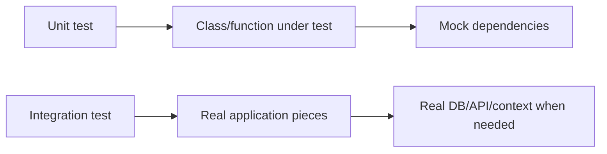
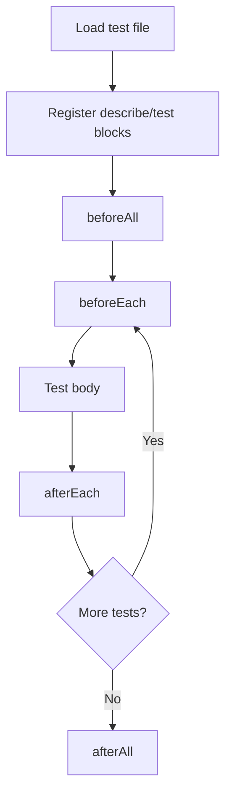
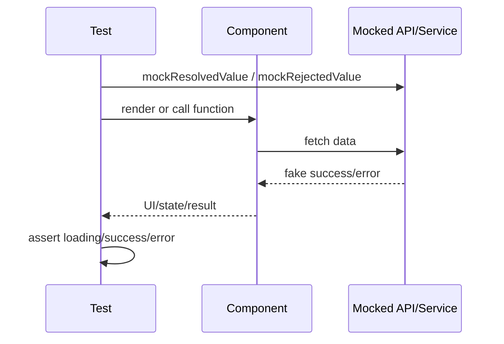
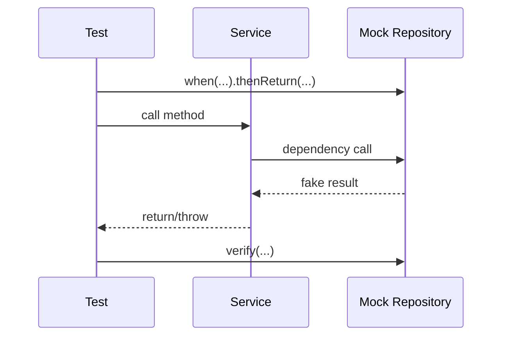

# Testing Interview Cheat Sheet: Jest + JUnit

For a 2-3 year Software Developer interview. Focus: practical Jest for frontend/React testing and JUnit 5 + Mockito for Java/backend testing. No Cypress, Playwright, Selenium, Mocha, Vitest, or unrelated frameworks.

## 1. Priority Map

| Level | Jest | JUnit / Mockito |
| --- | --- | --- |
| MUST KNOW | `describe`, `test`/`it`, `expect`, matchers, setup/teardown, async tests, component tests, user interactions, mocks, `jest.fn`, `jest.mock`, `jest.spyOn`, error/loading/success states, test isolation | `@Test`, assertions, lifecycle annotations, `assertThrows`, parameterized tests, Mockito `@Mock`, `@InjectMocks`, `when().thenReturn()`, `verify()`, service tests, exception tests, unit vs integration |
| SHOULD KNOW | fake timers, module mocks, custom hooks, context tests, API/service dependency mocks, coverage | `assertAll`, `assertDoesNotThrow`, `ArgumentCaptor`, `@WebMvcTest`, `@SpringBootTest`, testing multiple dependencies, coverage |
| BASIC | code coverage meaning, common naming, Arrange-Act-Assert | JUnit 4 vs JUnit 5 basics, `@Disabled`, edge cases |

## 2. Unit Test vs Integration Test

**MUST KNOW**

| Unit test | Integration test |
| --- | --- |
| Tests one function/class/component in isolation | Tests multiple parts working together |
| Uses mocks for dependencies | Uses real or near-real dependencies |
| Fast and focused | Slower but higher confidence |
| Good for business logic and edge cases | Good for wiring, database, HTTP, framework behavior |



**Interview answer:** "Unit tests are fast and isolated. Integration tests verify that components work together. I use both: unit tests for logic and integration tests for wiring or framework behavior."

**Trap:** Mocking everything gives low confidence; using full integration tests everywhere makes the suite slow.

## 3. Jest: What Is Jest?

**MUST KNOW**

**Definition:** Jest is a JavaScript/TypeScript test runner and assertion/mocking framework commonly used for React and frontend unit tests.

**Why used:** It provides test execution, assertions, mocks, fake timers, snapshots, and coverage in one tool.

**Interview-ready answer:** "Jest runs JavaScript tests, provides `expect` assertions, and has built-in mocking features like `jest.fn`, `jest.mock`, and fake timers."

```ts
test("adds numbers", () => {
  expect(2 + 3).toBe(5);
});
```

**Trap:** Jest is not React Testing Library. Jest runs/asserts tests; React Testing Library helps render and query React components.

## 4. Jest Test Structure

**MUST KNOW**

**Definition:** Jest tests are organized with `describe` blocks and `test` or `it` cases.

**Why used:** It keeps related behavior grouped and readable.

```ts
describe("formatPrice", () => {
  it("formats amount with currency symbol", () => {
    expect(formatPrice(100)).toBe("$100.00");
  });
});
```

**Interview-ready answer:** "`describe` groups related tests. `test` and `it` define individual test cases. I name tests by expected behavior, not implementation."

**Trap:** Too much nesting makes tests harder to read.

## 5. Jest `expect` and Common Matchers

**MUST KNOW**

| Matcher | Use |
| --- | --- |
| `toBe` | Primitive/exact identity |
| `toEqual` | Object/array deep equality |
| `toContain` | Array/string contains |
| `toMatch` | Regex/string match |
| `toHaveBeenCalled` | Mock was called |
| `toHaveBeenCalledWith` | Mock called with args |
| `toThrow` | Function throws error |
| `resolves` / `rejects` | Promise result/error |

```ts
expect(user).toEqual({ id: 1, name: "Asha" });
expect(sendEmail).toHaveBeenCalledWith("a@test.com");
await expect(fetchUser(1)).resolves.toEqual({ id: 1 });
```

**Interview-ready answer:** "`toBe` checks exact identity, while `toEqual` checks object content. For async code, I use `await expect(promise).resolves` or `.rejects`."

**Trap:** Using `toBe` for objects usually fails because object references differ.

## 6. Jest Setup and Teardown

**MUST KNOW**

**Definition:** `beforeEach`, `afterEach`, `beforeAll`, and `afterAll` run setup/cleanup code around tests.

**Why used:** They keep tests isolated and remove repeated setup.

```ts
beforeEach(() => {
  jest.clearAllMocks();
});

afterEach(() => {
  jest.useRealTimers();
});
```

**Interview-ready answer:** "`beforeEach` resets per-test state. `beforeAll` is for expensive one-time setup. Cleanup prevents one test from affecting another."

**Trap:** Shared mutable state in `beforeAll` can leak between tests.

## 7. Jest Test Execution Flow



**Interview answer:** "Jest registers tests, runs one-time setup, then repeats per-test setup, test body, and cleanup."

## 8. Testing Pure Functions

**MUST KNOW**

**Definition:** A pure function test checks inputs and outputs without external dependencies.

**Why used:** These are the simplest, fastest, and most reliable tests.

```ts
function calculateDiscount(price: number, percent: number) {
  return price - price * (percent / 100);
}

test("calculates discount", () => {
  expect(calculateDiscount(100, 10)).toBe(90);
});
```

**Interview-ready answer:** "For functions, I test normal cases, edge cases, and invalid inputs if the function handles them."

**Trap:** Only testing happy paths.

## 9. Testing React Components

**MUST KNOW**

**Definition:** Component tests render UI, interact like a user, and assert visible behavior.

**Why used:** They catch broken props, rendering, state changes, and user flows.

```tsx
import { render, screen } from "@testing-library/react";
import userEvent from "@testing-library/user-event";

test("calls onSave when user clicks save", async () => {
  const user = userEvent.setup();
  const onSave = jest.fn();

  render(<ProfileForm name="Asha" onSave={onSave} />);

  await user.click(screen.getByRole("button", { name: /save/i }));

  expect(onSave).toHaveBeenCalledTimes(1);
});
```

**Interview-ready answer:** "I test React components from the user's perspective: render the component, find elements by role/text/label, perform user interactions, then assert visible output or callback behavior."

**Trap:** Testing internal state or implementation details instead of user-visible behavior.

## 10. Testing Props and User Interactions

**MUST KNOW**

**Definition:** Props tests verify a component responds correctly to inputs and callbacks.

**Why used:** Components are reusable contracts; props are their API.

```tsx
test("renders disabled submit button", () => {
  render(<SubmitButton disabled />);

  expect(screen.getByRole("button", { name: /submit/i })).toBeDisabled();
});

test("updates input value", async () => {
  const user = userEvent.setup();
  render(<SearchBox />);

  await user.type(screen.getByRole("textbox", { name: /search/i }), "laptop");

  expect(screen.getByRole("textbox", { name: /search/i })).toHaveValue("laptop");
});
```

**Interview-ready answer:** "I pass props, interact with the UI, and assert what the user sees or what callback was called."

**Trap:** Prefer `userEvent` for realistic interactions; `fireEvent` is lower-level.

## 11. Testing Async Code in Jest

**MUST KNOW**

**Definition:** Async tests wait for promises, timers, or DOM changes before asserting.

**Why used:** API calls and UI updates usually happen asynchronously.

```ts
test("loads user", async () => {
  await expect(fetchUser(1)).resolves.toEqual({ id: 1, name: "Asha" });
});

test("throws when user is missing", async () => {
  await expect(fetchUser(999)).rejects.toThrow("User not found");
});
```

```tsx
test("shows loaded user", async () => {
  render(<UserProfile id="1" />);

  expect(screen.getByText(/loading/i)).toBeInTheDocument();
  expect(await screen.findByText("Asha")).toBeInTheDocument();
});
```

**Interview-ready answer:** "I return or await promises. For React DOM updates, I use `findBy...` or `waitFor`."

**Trap:** Forgetting `await` can make a test pass before assertions run.

## 12. Testing API Calls

**MUST KNOW**

**Definition:** Test API-consuming code by mocking the network/client dependency and asserting success/error/loading behavior.

**Why used:** Unit tests should not depend on real network calls.

```ts
import { getUser } from "./userApi";
import { loadUserName } from "./userService";

jest.mock("./userApi");

test("loads user name", async () => {
  jest.mocked(getUser).mockResolvedValue({ id: 1, name: "Asha" });

  await expect(loadUserName(1)).resolves.toBe("Asha");
});
```

**Interview-ready answer:** "I mock the API module or service, return success/error promises, and assert the function or component behavior."

**Trap:** Hitting real APIs in unit tests makes tests slow and flaky.

## 13. Mocked API Testing Flow



**Interview answer:** "The test controls the dependency response, then verifies how the unit behaves for each state."

## 14. `jest.fn()`

**MUST KNOW**

**Definition:** `jest.fn()` creates a mock function that records calls and can return configured values.

**Why used:** It tests callbacks and replaces dependencies.

```ts
const onSubmit = jest.fn();

onSubmit("email@test.com");

expect(onSubmit).toHaveBeenCalledWith("email@test.com");
expect(onSubmit).toHaveBeenCalledTimes(1);
```

**Interview-ready answer:** "`jest.fn()` creates a fake function. I can assert how it was called or define what it returns."

**Trap:** `jest.fn()` does not automatically replace imported modules; it is just a mock function.

## 15. `jest.mock()`

**MUST KNOW**

**Definition:** `jest.mock()` mocks an imported module.

**Why used:** It replaces API clients, services, utilities, or child modules during tests.

```ts
import { sendOtp } from "./authApi";
import { startLogin } from "./authService";

jest.mock("./authApi");

test("sends OTP", async () => {
  jest.mocked(sendOtp).mockResolvedValue({ success: true });

  await startLogin("a@test.com");

  expect(sendOtp).toHaveBeenCalledWith("a@test.com");
});
```

**Interview-ready answer:** "`jest.mock()` replaces a module dependency so the unit under test does not call the real implementation."

**Trap:** Module mock hoisting and import order can surprise you. Keep mocks at the top and reset them between tests.

## 16. `jest.spyOn()`

**MUST KNOW**

**Definition:** `jest.spyOn(object, method)` wraps an existing method so you can observe calls and optionally mock it.

**Why used:** It is useful when you want to track a real method or temporarily override it.

```ts
test("logs error", () => {
  const spy = jest.spyOn(console, "error").mockImplementation(() => {});

  reportError(new Error("failed"));

  expect(spy).toHaveBeenCalled();
  spy.mockRestore();
});
```

**Interview-ready answer:** "`spyOn` observes an existing method. By default it can call the original method unless I override it with `mockImplementation`."

**Trap:** Always restore spies on globals like `console`, `Date`, or `window`.

## 17. `jest.fn()` vs `jest.mock()` vs `jest.spyOn()`

**MUST KNOW**

| Tool | What it does | Use case |
| --- | --- | --- |
| `jest.fn()` | Creates standalone fake function | Callback prop, manual dependency |
| `jest.mock()` | Replaces an entire module | API/service module dependency |
| `jest.spyOn()` | Watches or overrides existing method | Console, Date, object method |

**Interview answer:** "`jest.fn` creates a mock function, `jest.mock` mocks a module, and `jest.spyOn` observes an existing method."

**Trap:** Using `spyOn` without restore can pollute later tests.

## 18. Jest Mock vs Spy

**SHOULD KNOW**

| Mock | Spy |
| --- | --- |
| Fake replacement | Wrapper around existing method |
| May not call real implementation | Can call real implementation by default |
| Good for external dependencies | Good for observing existing behavior |

```ts
const callback = jest.fn();
const spy = jest.spyOn(Math, "random").mockReturnValue(0.5);
```

**Trap:** Do not spy on implementation details unless there is no better behavioral assertion.

## 19. Testing Success, Error, Loading States

**MUST KNOW**

**Definition:** Async UI often has three states: loading, success, and error.

**Why used:** Interviewers commonly ask this for React API components.

```tsx
test("shows error message when API fails", async () => {
  jest.mocked(getUser).mockRejectedValue(new Error("Network error"));

  render(<UserProfile id="1" />);

  expect(screen.getByText(/loading/i)).toBeInTheDocument();
  expect(await screen.findByRole("alert")).toHaveTextContent(/failed/i);
});
```

**Interview-ready answer:** "I mock the API for each case: pending/loading UI, resolved success UI, and rejected error UI."

**Trap:** Only testing the success path leaves broken error/loading states unnoticed.

## 20. Testing Custom Hooks

**SHOULD KNOW**

**Definition:** Custom hooks can be tested by rendering them with `renderHook` or through a component that uses them.

**Why used:** Hooks often contain reusable stateful logic.

```tsx
import { renderHook, act } from "@testing-library/react";

test("increments counter", () => {
  const { result } = renderHook(() => useCounter());

  act(() => result.current.increment());

  expect(result.current.count).toBe(1);
});
```

**Interview-ready answer:** "For simple hooks, I use `renderHook`. For hooks tied to UI behavior, I prefer testing through a component."

**Trap:** State updates must be wrapped in `act` when needed.

## 21. Testing Context / State Behavior

**SHOULD KNOW**

**Definition:** Context-dependent components need provider setup in tests.

**Why used:** Many React apps use context for auth/theme/app state.

```tsx
function renderWithAuth(ui: React.ReactElement, user = { name: "Asha" }) {
  return render(<AuthContext.Provider value={user}>{ui}</AuthContext.Provider>);
}

test("shows logged-in user", () => {
  renderWithAuth(<Navbar />);

  expect(screen.getByText("Asha")).toBeInTheDocument();
});
```

**Interview-ready answer:** "I wrap the component with the needed provider or create a custom render helper."

**Trap:** Do not assert internal context implementation when visible behavior is enough.

## 22. Testing Thrown Errors

**MUST KNOW**

```ts
function parseAge(value: string) {
  const age = Number(value);
  if (Number.isNaN(age)) throw new Error("Invalid age");
  return age;
}

test("throws for invalid age", () => {
  expect(() => parseAge("abc")).toThrow("Invalid age");
});

test("rejects async error", async () => {
  await expect(saveUser({})).rejects.toThrow("Invalid user");
});
```

**Interview-ready answer:** "For sync errors, wrap the function call in another function and use `toThrow`. For async errors, use `await expect(promise).rejects`."

**Trap:** `expect(parseAge("abc")).toThrow()` is wrong because the error is thrown before Jest can assert it.

## 23. Fake Timers Basics

**SHOULD KNOW**

**Definition:** Fake timers let Jest control `setTimeout`, `setInterval`, and related timer behavior.

**Why used:** Timer tests become fast and deterministic.

```ts
test("calls callback after delay", () => {
  jest.useFakeTimers();
  const callback = jest.fn();

  startTimer(callback);

  jest.advanceTimersByTime(1000);

  expect(callback).toHaveBeenCalled();
});
```

**Interview-ready answer:** "I use fake timers to avoid waiting for real time. I restore real timers after the test."

**Trap:** Fake timers can interact awkwardly with promises and user-event; use them carefully and restore them.

## 24. Test Isolation and Coverage in Jest

**MUST KNOW**

**Definition:** Test isolation means each test can run independently. Coverage shows which lines/branches/functions were executed by tests.

**Why used:** Isolation prevents flaky tests; coverage helps find untested areas.

```ts
afterEach(() => {
  jest.clearAllMocks();
  jest.restoreAllMocks();
});
```

```bash
npm test -- --coverage
```

**Interview-ready answer:** "I reset mocks, avoid shared mutable state, mock external services, and keep tests deterministic. Coverage is useful, but high coverage does not guarantee good assertions."

**Trap:** Chasing 100% coverage can produce weak tests.

## 25. Common Jest Mistakes

**MUST KNOW**

| Mistake | Better approach |
| --- | --- |
| No `await` for async assertions | `await screen.findBy...` or `await expect(...).resolves` |
| Testing internal state | Test visible behavior |
| Real API calls in unit tests | Mock API/service dependency |
| Not clearing mocks | `clearAllMocks` / per-test setup |
| Using `toBe` for objects | Use `toEqual` |
| Snapshot everything | Prefer behavior assertions |
| Not restoring spies/timers | `mockRestore`, `useRealTimers` |
| Mocking too much | Mock boundaries, not every helper |

## 26. JUnit 5: What Is JUnit?

**MUST KNOW**

**Definition:** JUnit is the standard Java testing framework. JUnit 5 consists of JUnit Platform, JUnit Jupiter, and JUnit Vintage.

**Why used:** It runs Java unit tests and provides annotations/assertions.

**Interview-ready answer:** "JUnit 5 is the modern Java testing framework. I use Jupiter annotations like `@Test`, lifecycle methods, assertions, and parameterized tests."

```java
import org.junit.jupiter.api.Test;
import static org.junit.jupiter.api.Assertions.assertEquals;

class CalculatorTest {
    @Test
    void addsNumbers() {
        assertEquals(5, 2 + 3);
    }
}
```

**Trap:** JUnit tests should be small and deterministic, not dependent on test order.

## 27. JUnit 4 vs JUnit 5 Basics

**BASIC**

| JUnit 4 | JUnit 5 |
| --- | --- |
| `org.junit.Test` | `org.junit.jupiter.api.Test` |
| `@Before`, `@After` | `@BeforeEach`, `@AfterEach` |
| `@BeforeClass`, `@AfterClass` | `@BeforeAll`, `@AfterAll` |
| `@Ignore` | `@Disabled` |
| Runners/rules | Extension model |

**Interview-ready answer:** "JUnit 5 uses Jupiter annotations and a new extension model. The basic concepts are similar, but annotation packages and lifecycle names changed."

**Trap:** Importing JUnit 4 `@Test` accidentally in a JUnit 5 project.

## 28. JUnit Assertions

**MUST KNOW**

| Assertion | Use |
| --- | --- |
| `assertEquals(expected, actual)` | Value equality |
| `assertNotNull(value)` | Not null |
| `assertTrue(condition)` | Boolean true |
| `assertFalse(condition)` | Boolean false |
| `assertThrows(type, executable)` | Expected exception |
| `assertDoesNotThrow(executable)` | No exception |
| `assertAll(...)` | Group multiple assertions |

```java
@Test
void validatesUser() {
    User user = new User("Asha", "a@test.com");

    assertAll(
            () -> assertEquals("Asha", user.name()),
            () -> assertNotNull(user.email()),
            () -> assertTrue(user.email().contains("@"))
    );
}
```

**Interview-ready answer:** "JUnit assertions verify expected behavior. I use `assertThrows` for exceptions and `assertAll` when I want multiple related assertions reported together."

**Trap:** In JUnit, `assertEquals` order is expected first, actual second.

## 29. Testing Exceptions in JUnit

**MUST KNOW**

```java
@Test
void throwsWhenEmailInvalid() {
    IllegalArgumentException ex = assertThrows(
            IllegalArgumentException.class,
            () -> userService.register("bad-email")
    );

    assertEquals("Invalid email", ex.getMessage());
}

@Test
void doesNotThrowForValidEmail() {
    assertDoesNotThrow(() -> userService.register("a@test.com"));
}
```

**Interview-ready answer:** "I use `assertThrows` and then assert the exception message or fields when that matters."

**Trap:** Only checking that some exception was thrown can hide the wrong failure.

## 30. JUnit Lifecycle Annotations

**MUST KNOW**

**Definition:** Lifecycle methods run before/after each test or once per class.

```java
class UserServiceTest {
    private UserService userService;

    @BeforeEach
    void setUp() {
        userService = new UserService();
    }

    @AfterEach
    void tearDown() {
        // cleanup
    }
}
```

| Annotation | Runs |
| --- | --- |
| `@BeforeEach` | Before every test |
| `@AfterEach` | After every test |
| `@BeforeAll` | Once before all tests, usually static |
| `@AfterAll` | Once after all tests, usually static |
| `@Disabled` | Skips test/class |

**Interview-ready answer:** "`BeforeEach` gives clean setup per test. `BeforeAll` is for expensive one-time setup."

**Trap:** Shared state in `BeforeAll` can make tests depend on order.

## 31. Parameterized Tests

**MUST KNOW**

**Definition:** Parameterized tests run the same test with multiple inputs.

**Why used:** They are great for validation rules and edge cases.

```java
@ParameterizedTest
@ValueSource(strings = {"", " ", "bad-email"})
void rejectsInvalidEmails(String email) {
    assertThrows(IllegalArgumentException.class, () -> validator.validateEmail(email));
}

@ParameterizedTest
@CsvSource({
        "100, 10, 90",
        "200, 25, 150"
})
void calculatesDiscount(int price, int percent, int expected) {
    assertEquals(expected, discount(price, percent));
}
```

**Interview-ready answer:** "I use parameterized tests when the same behavior should be verified across many inputs."

**Trap:** Avoid hiding complex logic inside test data; keep cases readable.

## 32. Testing Service Classes with JUnit

**MUST KNOW**

**Definition:** A service unit test checks business logic with dependencies mocked.

**Why used:** Services often contain rules and transaction decisions.

```java
@ExtendWith(MockitoExtension.class)
class UserServiceTest {
    @Mock
    UserRepository userRepository;

    @InjectMocks
    UserService userService;

    @Test
    void createsUserWhenEmailIsUnique() {
        when(userRepository.existsByEmail("a@test.com")).thenReturn(false);

        userService.create("a@test.com");

        verify(userRepository).save(any(User.class));
    }
}
```

**Interview-ready answer:** "I mock repository dependencies, call the service method, assert returned values or exceptions, and verify important repository interactions."

**Trap:** Do not load Spring context for simple service unit tests.

## 33. JUnit Service to Mocked Repository Flow



**Interview answer:** "The mock controls repository behavior; the test verifies service logic and key interactions."

## 34. Mockito `@Mock` vs `@InjectMocks`

**MUST KNOW**

| Annotation | Meaning |
| --- | --- |
| `@Mock` | Creates a fake dependency |
| `@InjectMocks` | Creates the class under test and injects mocks into it |

```java
@Mock
PaymentGateway paymentGateway;

@InjectMocks
PaymentService paymentService;
```

**Interview-ready answer:** "`@Mock` is for dependencies. `@InjectMocks` is for the object being tested."

**Trap:** `@InjectMocks` does not make a Spring bean; it is Mockito object construction.

## 35. `when().thenReturn()` vs `verify()`

**MUST KNOW**

| `when().thenReturn()` | `verify()` |
| --- | --- |
| Stubs behavior before action | Checks interaction after action |
| "If dependency is called, return this" | "Was dependency called correctly?" |

```java
when(userRepository.findById(1L)).thenReturn(Optional.of(user));

User result = userService.getUser(1L);

verify(userRepository).findById(1L);
assertEquals(user, result);
```

**Interview-ready answer:** "`when().thenReturn()` sets up mock behavior. `verify()` checks that a mock was called."

**Trap:** Verifying every internal call makes tests brittle. Verify important side effects.

## 36. ArgumentCaptor Basics

**SHOULD KNOW**

**Definition:** `ArgumentCaptor` captures arguments passed to a mock.

**Why used:** Useful when the service creates an object internally and sends it to a dependency.

```java
@Captor
ArgumentCaptor<User> userCaptor;

@Test
void savesUserWithNormalizedEmail() {
    userService.create("ASHA@TEST.COM");

    verify(userRepository).save(userCaptor.capture());
    assertEquals("asha@test.com", userCaptor.getValue().getEmail());
}
```

**Interview-ready answer:** "I use `ArgumentCaptor` when I need to inspect the object passed to a mock."

**Trap:** If you can assert the returned result instead, that may be simpler.

## 37. Testing Edge Cases

**MUST KNOW**

**Definition:** Edge cases test boundary, invalid, empty, null, duplicate, and extreme inputs.

```java
@ParameterizedTest
@ValueSource(ints = {0, -1})
void rejectsInvalidQuantity(int quantity) {
    assertThrows(IllegalArgumentException.class, () -> orderService.create(quantity));
}
```

**Interview-ready answer:** "I test happy path plus boundary cases, invalid inputs, empty values, duplicates, and dependency failures."

**Trap:** Edge cases should reflect real requirements, not random inputs.

## 38. Unit Testing Spring Services

**MUST KNOW**

**Definition:** A Spring service can usually be unit tested as a plain Java class with Mockito.

**Why used:** It keeps business logic tests fast.

```java
@ExtendWith(MockitoExtension.class)
class OrderServiceTest {
    @Mock InventoryService inventoryService;
    @Mock OrderRepository orderRepository;
    @Mock PaymentClient paymentClient;

    @InjectMocks OrderService orderService;

    @Test
    void placesOrder() {
        when(paymentClient.charge(any())).thenReturn(new PaymentResult("paid"));

        orderService.placeOrder(new CreateOrderRequest());

        verify(inventoryService).reserve(any());
        verify(orderRepository).save(any(Order.class));
    }
}
```

**Interview-ready answer:** "For service tests, I usually do not need Spring Boot. I use Mockito to mock repositories or clients."

**Trap:** If your test needs Spring transactions, security, or bean wiring, it may be integration testing, not unit testing.

## 39. `@WebMvcTest` vs `@SpringBootTest`

**SHOULD KNOW**

| `@WebMvcTest` | `@SpringBootTest` |
| --- | --- |
| Loads MVC/controller slice | Loads full application context |
| Faster | Slower |
| Mock service dependencies | Can test full wiring |
| Good for routes/status/JSON/validation | Good for integration behavior |

```java
@WebMvcTest(UserController.class)
class UserControllerTest {
    @MockitoBean
    UserService userService;
}
```

```java
@SpringBootTest
class ApplicationIntegrationTest { }
```

**Interview-ready answer:** "`@WebMvcTest` is for controller slice tests. `@SpringBootTest` is for full context integration tests."

**Trap:** `@WebMvcTest` does not load all services/repositories; you mock or import collaborators.

## 40. Mock vs Real Dependency

**MUST KNOW**

| Use mock | Use real dependency |
| --- | --- |
| External API, repository in service unit test | Integration test |
| Failure hard to trigger | Database mapping behavior |
| Need fast isolated test | Need wiring/config confidence |
| Dependency is slow/flaky | Critical end-to-end flow |

**Interview-ready answer:** "I mock dependencies when testing isolated logic. I use real dependencies in integration tests when I need confidence in wiring, persistence, or HTTP behavior."

**Trap:** Mocking repositories in repository tests makes no sense; use real test DB/slice there.

## 41. Code Coverage

**SHOULD KNOW**

**Definition:** Coverage measures how much code was executed by tests: lines, branches, functions, classes.

**Why used:** It highlights untested areas but does not prove correctness.

```bash
npm test -- --coverage
mvn test
```

**Interview-ready answer:** "Coverage is a useful signal, but meaningful assertions and important scenarios matter more than a raw percentage."

**Trap:** 90% coverage with weak assertions can still miss bugs.

## 42. Common JUnit / Mockito Mistakes

**MUST KNOW**

| Mistake | Better approach |
| --- | --- |
| Importing JUnit 4 annotations | Use `org.junit.jupiter.*` |
| Full Spring context for unit tests | Use JUnit + Mockito |
| Over-verifying internal calls | Assert behavior and key side effects |
| Mocking value objects/entities | Use real simple objects |
| Forgetting Mockito extension | Add `@ExtendWith(MockitoExtension.class)` |
| Stubbing unused methods | Keep setup minimal |
| Testing implementation details | Test public behavior |
| Ignoring edge/error cases | Add boundary and exception tests |

## 43. Most-Asked Jest Interview Questions

### A. What is Jest?

Jest is a JavaScript test runner with assertions, mocks, timers, and coverage support.

### B. `test` vs `it`?

They are aliases. Use whichever your team prefers.

### C. `toBe` vs `toEqual`?

`toBe` checks exact identity/primitive values. `toEqual` checks object or array content.

### D. How do you test async code?

Return/await the promise, use `resolves`/`rejects`, or use React Testing Library `findBy`/`waitFor` for async UI.

### E. How would you test an API call?

Mock the API/service dependency, configure success/error responses, call the function or render the component, then assert behavior.

### F. `jest.fn` vs `jest.mock` vs `jest.spyOn`?

`jest.fn` creates a fake function, `jest.mock` replaces a module, and `jest.spyOn` observes or overrides an existing method.

### G. How do you test an error response?

Mock the dependency to reject or return an error response and assert the error UI/message or thrown exception.

### H. How do you ensure tests do not affect each other?

Reset mocks, restore spies/timers, avoid shared mutable state, and create fresh data per test.

### I. How test a React component?

Render it, query by accessible roles/text/labels, simulate user interactions, and assert visible output or callback calls.

## 44. Most-Asked JUnit / Mockito Interview Questions

### A. What is JUnit?

JUnit is the main Java testing framework used to write and run unit tests.

### B. JUnit 4 vs JUnit 5?

JUnit 5 uses Jupiter annotations, the JUnit Platform, and an extension model instead of JUnit 4 runners/rules.

### C. How unit test a service class?

Create the service with mocked dependencies, call the method, assert return/exception, and verify important interactions.

### D. How mock a repository?

Use `@Mock` for the repository and stub methods with `when(...).thenReturn(...)`.

### E. `@Mock` vs `@InjectMocks`?

`@Mock` creates fake dependencies. `@InjectMocks` creates the class under test and injects mocks.

### F. `when().thenReturn()` vs `verify()`?

`when` stubs behavior before the call. `verify` checks interactions after the call.

### G. How test an exception?

Use `assertThrows`, then assert message or error fields if important.

### H. How test different input cases?

Use parameterized tests with `@ValueSource` or `@CsvSource`.

### I. `@WebMvcTest` vs `@SpringBootTest`?

`@WebMvcTest` loads controller/MVC slice. `@SpringBootTest` loads the full Spring context.

### J. When use mock vs real dependency?

Use mocks for isolated unit tests. Use real dependencies for integration behavior.

## 45. Realistic Scenario Questions

### A. Function calls another service. How test it in Jest?

Mock the service module with `jest.mock`, set `mockResolvedValue` or `mockRejectedValue`, call the function, and assert result plus service call.

### B. React component has loading, success, and error states.

Mock the API three ways: pending/initial render, resolved promise, rejected promise. Assert loading text, success data, and error alert.

### C. User clicks submit button.

Render component, create `userEvent.setup()`, click the button, and assert callback/API call or changed UI.

### D. Java service has repository and email client.

Mock both dependencies. Stub repository checks. Call service. Verify saved entity and email client only when business rule says so.

### E. Service with multiple dependencies fails halfway.

Mock the failing dependency to throw. Assert exception and verify later side-effect dependencies were not called if required.

```java
verify(notificationClient, never()).send(any());
```

### F. Controller endpoint validation.

Use `@WebMvcTest`, send invalid JSON with MockMvc, expect `400`, and assert field error response.

## 46. Final Rapid Revision

| Topic | One-line answer |
| --- | --- |
| Jest | JS test runner with assertions/mocks |
| `describe` | Groups tests |
| `it` / `test` | Defines test case |
| `expect` | Starts assertion |
| `toBe` | Exact value/reference |
| `toEqual` | Deep object equality |
| Async Jest | Always return/await promise |
| `jest.fn` | Fake function |
| `jest.mock` | Mock module |
| `jest.spyOn` | Observe/override existing method |
| Fake timers | Control timer-based code |
| React test | Test user-visible behavior |
| Test isolation | Fresh state, clear mocks, restore spies |
| JUnit 5 | Modern Java testing framework |
| `@Test` | Test method |
| `assertThrows` | Verify exception |
| `assertAll` | Group assertions |
| `@BeforeEach` | Per-test setup |
| Parameterized test | Same test, many inputs |
| Mockito `@Mock` | Fake dependency |
| `@InjectMocks` | Class under test with mocks |
| `when` | Stub behavior |
| `verify` | Check interaction |
| ArgumentCaptor | Inspect passed argument |
| `@WebMvcTest` | Controller slice |
| `@SpringBootTest` | Full context integration |
| Coverage | Useful signal, not quality guarantee |

## 47. References

- Jest Docs: Getting Started - https://jestjs.io/docs/getting-started
- Jest Docs: Using Matchers - https://jestjs.io/docs/using-matchers
- Jest Docs: Testing Asynchronous Code - https://jestjs.io/docs/asynchronous
- Jest Docs: Setup and Teardown - https://jestjs.io/docs/setup-teardown
- Jest Docs: Mock Functions - https://jestjs.io/docs/mock-functions
- Jest Docs: Jest Object / `jest.fn`, `jest.mock`, `jest.spyOn` - https://jestjs.io/docs/jest-object
- Jest Docs: Timer Mocks - https://jestjs.io/docs/timer-mocks
- Testing Library: React example - https://testing-library.com/docs/react-testing-library/example-intro
- Testing Library: Queries - https://testing-library.com/docs/queries/about
- Testing Library user-event v14 - https://testing-library.com/docs/user-event/intro
- JUnit 5 User Guide - https://junit.org/junit5/docs/current/user-guide/
- Mockito JUnit Jupiter Extension - https://javadoc.io/doc/org.mockito/mockito-junit-jupiter/latest/org/mockito/junit/jupiter/MockitoExtension.html
- Mockito project documentation/wiki - https://github.com/mockito/mockito/wiki
- Spring Boot Testing Applications - https://docs.spring.io/spring-boot/reference/testing/spring-boot-applications.html
- Recent interview cross-checks: practical Jest/React and JUnit/Mockito interview guides from 2025-2026 backend/frontend prep resources.
