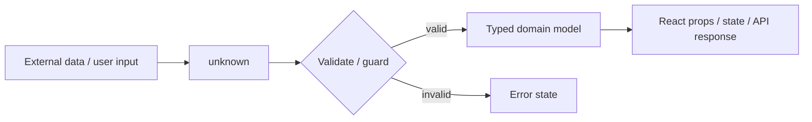
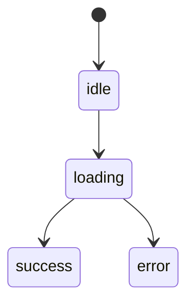

# TypeScript Interview Cheat Sheet

For a 2-3 year Software Developer / React Developer interview. Focus: practical TS used in React apps, API clients, forms, and day-to-day refactoring.

## 1. Priority Map

| Level | Topics |
| --- | --- |
| MUST KNOW | TS vs JS, inference, `interface` vs `type`, union/intersection, generics, constraints, utility types, narrowing, guards, discriminated unions, `any`/`unknown`/`never`/`void`, React props, API typing, strict mode, null handling |
| SHOULD KNOW | literal types, optional/readonly props, assertions, function typing, enums and alternatives, hooks typing, common mistakes |



## 2. TypeScript vs JavaScript

**MUST KNOW**

| Point | JavaScript | TypeScript |
| --- | --- | --- |
| Type checking | Runtime behavior only | Static checking during development/build |
| Runtime | Runs directly | Compiles to JavaScript |
| Types at runtime | No TS types | TS types are erased |
| Value | Flexible and simple | Safer refactors, autocomplete, earlier bug detection |

**Definition:** TypeScript is JavaScript plus optional static types.

**Why it matters:** It catches many mistakes before runtime and improves maintainability in large React apps.

**Interview answer:** "TypeScript is a typed superset of JavaScript. It does not add runtime validation by default; it checks code at compile time and emits JavaScript."

```ts
function formatPrice(price: number) {
  return price.toFixed(2);
}

formatPrice("100"); // compile-time error
```

**Trap:** Saying TypeScript prevents all runtime errors. It cannot validate API JSON unless you check it.

**Use it when:** A codebase has shared data models, many contributors, frequent refactors, or complex UI state.

## 3. Type Inference

**MUST KNOW**

**Definition:** TypeScript can infer types from assigned values, return statements, and usage context.

**Why it matters:** Good TS code is not fully annotated everywhere; it lets inference do obvious work.

**Interview answer:** "Inference means TypeScript figures out the type without explicit annotation. I annotate boundaries like function params, API DTOs, and public props, but avoid noisy annotations for obvious locals."

```ts
const count = 1; // number
const status = "loading"; // "loading" for const, string for let

const users = [{ id: 1, name: "Asha" }];
// inferred: { id: number; name: string }[]
```

**Trap:** Over-annotating and losing literal precision.

```ts
const role = "admin"; // type: "admin"
let mutableRole = "admin"; // type: string
```

**Use it when:** Local variables and simple derived values are clear from assignment.

## 4. Interfaces vs Type Aliases

**MUST KNOW**

| Feature | `interface` | `type` |
| --- | --- | --- |
| Object shape | Yes | Yes |
| Extending | `extends` | intersection `&` |
| Declaration merging | Yes | No |
| Unions / primitives / tuples | No | Yes |
| Common React props usage | Good | Good |

**Definition:** Both can name object shapes. `type` can name any type expression; `interface` is mainly for object contracts.

**Why it matters:** Interviewers check if you choose simple object contracts vs composed types sensibly.

**Interview answer:** "I use `interface` for extendable object shapes and public contracts. I use `type` for unions, intersections, tuples, and composed types."

```ts
interface User {
  id: string;
  name: string;
}

type Status = "idle" | "loading" | "success" | "error";
type AdminUser = User & { role: "admin" };
```

**Trap:** Claiming one is always better. In most app code, either works for object props.

**Use it when:** Use `interface` for props/models that may be extended; use `type` for unions and transformations.

## 5. Union and Intersection Types

**MUST KNOW**

| Concept | Meaning | Example |
| --- | --- | --- |
| Union `A \| B` | value can be one of several types | `string \| number` |
| Intersection `A & B` | value must satisfy all combined types | `User & Auditable` |

**Definition:** Union represents alternatives; intersection combines requirements.

**Why it matters:** They model real UI and API states better than broad objects with many optional fields.

**Interview answer:** "A union is either this or that. An intersection is this plus that."

```ts
type ApiStatus = "idle" | "loading" | "success" | "error";

type User = { id: string; name: string };
type Timestamped = { createdAt: string };
type UserRecord = User & Timestamped;
```

**Trap:** Accessing fields that exist only on one union member without narrowing.

```ts
function print(value: string | number) {
  if (typeof value === "string") return value.toUpperCase();
  return value.toFixed(2);
}
```

**Use it when:** Union for statuses, variants, optional API outcomes. Intersection for adding shared metadata or capabilities.

## 6. Generics

**MUST KNOW**

**Definition:** Generics let a function, type, or component work with different types while preserving type information.

**Why it matters:** They avoid `any` in reusable utilities, hooks, and API helpers.

**Interview answer:** "Generics are type parameters. They let me write reusable code while keeping the input and output types connected."

```ts
function first<T>(items: T[]): T | undefined {
  return items[0];
}

const user = first([{ id: 1, name: "Mira" }]);
// user: { id: number; name: string } | undefined
```

**Trap:** Using generics when a normal type is enough.

```ts
// Too generic
function getLength<T>(value: T) {
  return value.length; // error
}
```

**Use it when:** The same logic should work for many types and return a related type.

## 7. Generic Constraints

**MUST KNOW**

**Definition:** Constraints limit a generic type with `extends` so TypeScript knows what operations are safe.

**Why it matters:** Constraints keep functions reusable without losing safety.

**Interview answer:** "`T extends SomeShape` means T can be any type compatible with that shape. Then I can safely use fields from the constraint."

```ts
function getId<T extends { id: string }>(item: T): string {
  return item.id;
}

function getValue<T, K extends keyof T>(obj: T, key: K): T[K] {
  return obj[key];
}

const name = getValue({ id: 1, name: "Asha" }, "name"); // string
```

**Trap:** Writing `key: string` instead of `K extends keyof T`, which loses key safety.

**Use it when:** Building helpers like table accessors, form field readers, API clients, and reusable hooks.

## 8. Utility Types

**MUST KNOW**

**Definition:** Built-in generic types that transform existing types.

**Why it matters:** They reduce duplicated DTOs and keep forms/API types in sync.

| Utility | Meaning | Common use |
| --- | --- | --- |
| `Partial<T>` | all properties optional | PATCH/update payload |
| `Required<T>` | all properties required | validated complete object |
| `Pick<T, K>` | select keys | lightweight UI model |
| `Omit<T, K>` | remove keys | create request without server fields |
| `Record<K, V>` | object with key set K and value V | maps by status/id |
| `Readonly<T>` | properties cannot be reassigned | immutable config/props |

**Interview answer:** "Utility types transform an existing type instead of rewriting a new one. I use them for DTOs, form state, and component props."

```ts
type User = {
  id: string;
  name: string;
  email?: string;
  createdAt: string;
};

type UpdateUserBody = Partial<Pick<User, "name" | "email">>;
type CreateUserBody = Omit<User, "id" | "createdAt">;
type UserCardProps = Pick<User, "id" | "name">;
type UsersById = Record<string, User>;
type FrozenUser = Readonly<User>;
type CompleteUser = Required<User>;
```

**Trap:** `Partial<T>` is shallow, not deep.

**Use it when:** You need type variants that should stay tied to a source model.

## 9. Type Narrowing

**MUST KNOW**

**Definition:** Narrowing is TypeScript refining a broad type to a more specific type based on control flow checks.

**Why it matters:** Most safe TypeScript is "broad at boundary, narrow before use."

**Interview answer:** "Narrowing lets TypeScript understand runtime checks like `typeof`, `in`, `instanceof`, equality checks, and discriminant fields."

```ts
function renderId(id: string | number) {
  if (typeof id === "string") {
    return id.toUpperCase();
  }

  return id.toFixed(0);
}
```

**Trap:** Truthiness checks can accidentally reject valid values like `0` or `""`.

```ts
function showCount(count: number | null) {
  if (count !== null) return count.toFixed(0);
}
```

**Use it when:** Handling union types, optional values, and unknown API data.

## 10. Type Guards

**MUST KNOW**

**Definition:** A type guard is a runtime check that narrows a type. Custom guards use a type predicate like `value is User`.

**Why it matters:** API responses and `localStorage` values are not automatically trustworthy.

**Interview answer:** "A type guard checks runtime shape and tells TypeScript the narrowed type if the check passes."

```ts
type User = { id: string; name: string };

function isUser(value: unknown): value is User {
  return (
    typeof value === "object" &&
    value !== null &&
    "id" in value &&
    "name" in value
  );
}

function handle(data: unknown) {
  if (isUser(data)) {
    console.log(data.name);
  }
}
```

**Trap:** A guard that only checks one property may be too weak for real API data.

**Use it when:** Parsing external JSON, URL params, persisted storage, feature flags, and message events.

## 11. `typeof`, `instanceof`, and `in`

**MUST KNOW**

| Guard | Best for | Example |
| --- | --- | --- |
| `typeof` | primitives | `typeof x === "string"` |
| `instanceof` | class instances | `error instanceof Error` |
| `in` | object property presence | `"message" in result` |

```ts
function getMessage(error: unknown) {
  if (error instanceof Error) return error.message;
  if (typeof error === "string") return error;
  return "Unknown error";
}

type Success = { data: string[] };
type Failure = { error: string };

function render(result: Success | Failure) {
  if ("error" in result) return result.error;
  return result.data.join(", ");
}
```

**Trap:** `typeof null` is `"object"`, so always check `value !== null`.

**Use it when:** Narrowing unknown errors, browser APIs, and union object shapes.

## 12. Discriminated Unions

**MUST KNOW**

**Definition:** A union where every member has a common literal field, called a discriminant.

**Why it matters:** It models UI/API states without invalid combinations.

**Interview answer:** "Discriminated unions use a shared field like `status` or `type` to narrow each variant."

```ts
type QueryState<T> =
  | { status: "idle" }
  | { status: "loading" }
  | { status: "success"; data: T }
  | { status: "error"; error: string };

function UserList({ state }: { state: QueryState<string[]> }) {
  switch (state.status) {
    case "success":
      return <ul>{state.data.map((name) => <li key={name}>{name}</li>)}</ul>;
    case "error":
      return <p>{state.error}</p>;
    default:
      return <p>{state.status}</p>;
  }
}
```



**Trap:** Using `{ loading?: boolean; data?: T; error?: string }` allows invalid states like loading with data and error.

**Use it when:** API request state, component variants, reducer actions, and modal/form flows.

## 13. Literal Types

**SHOULD KNOW**

**Definition:** A literal type allows only exact values like `"primary"`, `404`, or `true`.

**Why it matters:** Literal unions make component APIs clear and safe.

**Interview answer:** "Literal types are exact values used as types. They are great for statuses, variants, roles, and modes."

```ts
type ButtonVariant = "primary" | "secondary" | "danger";

function Button({ variant }: { variant: ButtonVariant }) {
  return <button className={variant}>Save</button>;
}
```

**Trap:** Forgetting `as const` when deriving literal unions from arrays.

```ts
const roles = ["admin", "user"] as const;
type Role = (typeof roles)[number]; // "admin" | "user"
```

**Use it when:** A value must be one of a small known set.

## 14. Optional and Readonly Properties

**SHOULD KNOW**

**Definition:** `?` marks a property as optional. `readonly` prevents reassignment through that type.

**Why it matters:** They model incomplete input and immutable contracts.

**Interview answer:** "`optional` means the property may be missing. `readonly` means this reference cannot reassign the property, though it is not deep runtime immutability."

```ts
type Todo = {
  readonly id: string;
  title: string;
  description?: string;
};

const todo: Todo = { id: "1", title: "Learn TS" };
todo.title = "Revise TS";
// todo.id = "2"; // error
```

**Trap:** Optional is not the same as `null`; it usually means the property can be `undefined` or absent.

**Use it when:** Optional form fields, API fields that may be missing, and IDs/config that should not be reassigned.

## 15. `any` vs `unknown` vs `never` vs `void`

**MUST KNOW**

| Type | Meaning | Practical use |
| --- | --- | --- |
| `any` | disables type checking | temporary migration escape hatch |
| `unknown` | safe unknown value | external data before validation |
| `never` | impossible value | exhaustive checks |
| `void` | no useful return value | event handlers, side-effect functions |

**Interview answer:** "`any` opts out of safety. `unknown` forces me to narrow before use. `never` represents impossible code paths. `void` means the return value is intentionally ignored."

```ts
function parseUser(json: string): unknown {
  return JSON.parse(json);
}

function assertNever(value: never): never {
  throw new Error(`Unhandled case: ${String(value)}`);
}

function logClick(): void {
  console.log("clicked");
}
```

**Trap:** Treating `unknown` like `any`. You cannot access properties until narrowing.

**Use it when:** `unknown` for untrusted input, `never` for exhaustive unions, `void` for callbacks.

## 16. Type Assertions

**SHOULD KNOW**

**Definition:** A type assertion tells TypeScript to treat a value as a type without changing runtime behavior.

**Why it matters:** Sometimes TypeScript cannot know something you know, but assertions can hide real bugs.

**Interview answer:** "`as` is a compile-time assertion, not conversion or validation. I use it sparingly, after runtime checks or when working with DOM APIs."

```ts
const input = document.querySelector("input") as HTMLInputElement | null;

if (input) {
  input.value = "hello";
}
```

**Trap:** Using `as User` on raw API data without validation.

```ts
const user = await response.json() as User; // not runtime safe
```

**Use it when:** DOM queries, third-party libraries with incomplete types, or after a verified invariant.

## 17. Function Typing

**MUST KNOW**

**Definition:** Function typing describes parameter and return types, including callbacks.

**Why it matters:** React apps pass functions everywhere: events, render callbacks, async handlers, array methods.

**Interview answer:** "I type function boundaries, callbacks, and public APIs. Return types can often be inferred, but explicit returns help for exported functions."

```ts
type SubmitHandler = (values: FormValues) => Promise<void>;

type FormValues = {
  email: string;
  password: string;
};

const submit: SubmitHandler = async (values) => {
  await login(values);
};
```

**Trap:** Typing an async function as returning `void`; it actually returns `Promise<void>`.

**Use it when:** Component callbacks, services, utility functions, and async API operations.

## 18. Component Props Typing in React

**MUST KNOW**

**Definition:** Props typing defines the contract for a React component's inputs.

**Why it matters:** It prevents invalid component usage and improves autocomplete.

**Interview answer:** "I define props with `type` or `interface`, use literal unions for variants, and `React.ReactNode` for renderable children."

```tsx
import type { ReactNode } from "react";

type ButtonProps = {
  variant?: "primary" | "secondary";
  disabled?: boolean;
  children: ReactNode;
  onClick: () => void;
};

function Button({
  variant = "primary",
  disabled = false,
  children,
  onClick,
}: ButtonProps) {
  return (
    <button className={variant} disabled={disabled} onClick={onClick}>
      {children}
    </button>
  );
}
```

**Trap:** Using `React.FC` by default just to type children. Modern React typing works well with plain functions and explicit props.

**Use it when:** Every reusable component, especially design-system and shared UI components.

## 19. API Request/Response Typing

**MUST KNOW**

**Definition:** Request/response typing describes payloads sent to and received from APIs.

**Why it matters:** It keeps frontend code aligned with backend contracts, but still needs runtime validation for untrusted JSON.

**Interview answer:** "I type request bodies and response DTOs, keep server-generated fields separate from create/update payloads, and validate unknown data at boundaries when needed."

```ts
type UserDto = {
  id: string;
  name: string;
  email: string;
};

type CreateUserRequest = Omit<UserDto, "id">;
type UpdateUserRequest = Partial<CreateUserRequest>;

async function createUser(body: CreateUserRequest): Promise<UserDto> {
  const res = await fetch("/api/users", {
    method: "POST",
    body: JSON.stringify(body),
  });

  return res.json() as Promise<UserDto>;
}
```

**Trap:** `res.json()` returns data from runtime. A TypeScript type does not prove the server sent that shape.

**Use it when:** Service layers, API hooks, generated clients, and DTO sharing.

## 20. Generic API Response Types

**MUST KNOW**

**Definition:** A reusable response wrapper where the data type changes per endpoint.

**Why it matters:** It keeps API patterns consistent while preserving endpoint-specific data types.

**Interview answer:** "I use a generic wrapper when the response envelope is common but `data` varies by endpoint."

```ts
type ApiResponse<T> =
  | { ok: true; data: T }
  | { ok: false; error: string };

async function request<T>(url: string): Promise<ApiResponse<T>> {
  const res = await fetch(url);

  if (!res.ok) {
    return { ok: false, error: "Request failed" };
  }

  const data = (await res.json()) as T;
  return { ok: true, data };
}

const usersResult = await request<UserDto[]>("/api/users");
```

**Trap:** Generic `<T>` does not validate JSON. It only tells TypeScript what you expect.

**Use it when:** Common API envelopes like `{ data, error, meta }` or success/error results.

## 21. Strict TypeScript / Strict Mode

**MUST KNOW**

**Definition:** `"strict": true` enables a family of stricter type-checking rules.

**Why it matters:** It catches implicit `any`, unsafe null access, and weak assumptions.

**Interview answer:** "Strict mode makes TypeScript more valuable. The big interview flags are `noImplicitAny` and `strictNullChecks`."

```json
{
  "compilerOptions": {
    "strict": true
  }
}
```

**Trap:** Thinking strict mode changes runtime behavior. It only affects type checking.

**Use it when:** New projects by default; migrate older projects gradually.

## 22. `null`, `undefined`, and `strictNullChecks`

**MUST KNOW**

**Definition:** With `strictNullChecks`, `null` and `undefined` must be handled explicitly.

**Why it matters:** Many real production bugs come from accessing missing values.

**Interview answer:** "`strictNullChecks` prevents treating nullable values as always present. I use unions like `User | null` and narrow before access."

```ts
type Profile = {
  name: string;
  avatarUrl?: string;
};

function Avatar({ profile }: { profile: Profile | null }) {
  if (!profile) return <span>Guest</span>;

  return ;
}
```

**Trap:** Using non-null assertion `!` to silence errors everywhere.

```ts
user!.name; // only use when the invariant is truly guaranteed
```

**Use it when:** Optional API fields, async loaded state, refs, form defaults, and route params.

## 23. Enums: When to Use and Alternatives

**SHOULD KNOW**

**Definition:** TypeScript enums define named constants and emit runtime JavaScript.

**Why it matters:** Unlike most TS types, enums affect runtime output. Many React teams prefer literal unions or `as const` objects.

**Interview answer:** "I use enums when I need a runtime named set shared across code. For simple component variants and statuses, I usually prefer string literal unions."

```ts
type Status = "draft" | "published" | "archived";

const STATUS_LABEL: Record<Status, string> = {
  draft: "Draft",
  published: "Published",
  archived: "Archived",
};
```

```ts
enum Direction {
  Up = "UP",
  Down = "DOWN",
}
```

**Trap:** Forgetting that regular enums emit JavaScript and can be awkward across bundlers/configs. Literal unions are often simpler.

**Use it when:** You need runtime constants and enum semantics. Use literal unions for UI variants, statuses, and API string values.

## 24. TypeScript with React Hooks

**MUST KNOW**

**Definition:** React hook types are usually inferred, but you add generics or explicit types when initial values are ambiguous.

**Why it matters:** Incorrect hook typing causes `never[]`, nullable state mistakes, and unsafe refs.

**Interview answer:** "I let hooks infer simple values, but type empty arrays, nullable state, refs, reducer actions, and context values explicitly."

```tsx
type User = { id: string; name: string };

const [count, setCount] = useState(0); // inferred number
const [users, setUsers] = useState<User[]>([]);
const [selectedUser, setSelectedUser] = useState<User | null>(null);

const inputRef = useRef<HTMLInputElement | null>(null);

type Action =
  | { type: "add"; payload: User }
  | { type: "remove"; id: string };

function reducer(state: User[], action: Action): User[] {
  switch (action.type) {
    case "add":
      return [...state, action.payload];
    case "remove":
      return state.filter((user) => user.id !== action.id);
  }
}
```

**Trap:** `useState([])` can infer `never[]` in strict setups because TS has no element type.

**Use it when:** Empty arrays, nullable async data, refs, reducers, contexts, and custom hooks.

## 25. Common TypeScript Mistakes

**MUST KNOW**

| Mistake | Better approach |
| --- | --- |
| Using `any` for API data | Use `unknown`, validate/narrow, then type |
| Overusing `as` | Fix the type or add a guard |
| Optional everything in state | Use discriminated unions |
| Duplicating DTO variants | Use `Pick`, `Omit`, `Partial` |
| Ignoring `null` | Enable `strictNullChecks` and narrow |
| Generic for no reason | Use a concrete type |
| `key: string` for object access | Use `K extends keyof T` |
| Typing React state too late | Type empty arrays/null initial state upfront |
| Believing TS validates runtime JSON | Add runtime validation for untrusted data |

## 26. Most-Asked Interview Questions

### A. What is TypeScript?

TypeScript is JavaScript with optional static types. It catches many errors during development and compiles to JavaScript.

### B. Does TypeScript run in the browser?

Browsers run JavaScript. TypeScript is compiled/transpiled to JavaScript first.

### C. `interface` vs `type`?

Both can describe object shapes. `interface` is good for extendable contracts and supports declaration merging. `type` is better for unions, intersections, tuples, primitives, and composed types.

### D. `any` vs `unknown`?

`any` disables type checking. `unknown` accepts any value but forces narrowing before use.

### E. What is narrowing?

Narrowing is refining a broad type to a specific type using runtime checks like `typeof`, `in`, `instanceof`, equality checks, or custom guards.

### F. Why use generics?

Generics make reusable code type-safe by keeping relationships between inputs and outputs.

### G. What does `Partial<T>` do?

It makes all properties of `T` optional. Common use: update/PATCH payloads.

### H. How do you type React props?

Use a `type` or `interface` for the props object, literal unions for variants, and `ReactNode` for renderable children.

### I. What is a discriminated union?

A union where each variant has a shared literal property, such as `status`, allowing safe narrowing.

### J. What does `strictNullChecks` do?

It makes `null` and `undefined` explicit, so you must handle them before using a value.

## 27. Scenario-Based Questions

### A. Scenario 1: You fetch `/api/users`. How do you type it safely?

Use a DTO type for expected data, keep response handling in a service, and validate unknown JSON if the source is untrusted.

```ts
type UserDto = { id: string; name: string };

async function getUsers(): Promise<UserDto[]> {
  const res = await fetch("/api/users");
  if (!res.ok) throw new Error("Failed to load users");
  return res.json() as Promise<UserDto[]>;
}
```

Follow-up: The assertion does not validate runtime data. Use a guard or schema validator for stronger safety.

### B. Scenario 2: A component has loading, success, and error UI. How do you type state?

Use a discriminated union.

```ts
type UsersState =
  | { status: "loading" }
  | { status: "success"; users: UserDto[] }
  | { status: "error"; message: string };
```

This prevents invalid combinations like `{ loading: true, users: [], error: "x" }`.

### C. Scenario 3: You need an update user API body.

Reuse the source type with utility types.

```ts
type UpdateUserBody = Partial<Pick<UserDto, "name" | "email">>;
```

### D. Scenario 4: You need a reusable dropdown component.

Use generics if options are not always strings.

```tsx
type SelectProps<T> = {
  options: T[];
  value: T;
  getLabel: (option: T) => string;
  onChange: (option: T) => void;
};

function Select<T>({ options, value, getLabel, onChange }: SelectProps<T>) {
  return (
    <select
      value={getLabel(value)}
      onChange={(event) => {
        const next = options.find((option) => getLabel(option) === event.target.value);
        if (next) onChange(next);
      }}
    >
      {options.map((option) => (
        <option key={getLabel(option)}>{getLabel(option)}</option>
      ))}
    </select>
  );
}
```

### E. Scenario 5: You read a value from `localStorage`.

Treat it as unknown after parsing and narrow it.

```ts
const raw = localStorage.getItem("user");
const parsed: unknown = raw ? JSON.parse(raw) : null;

if (isUser(parsed)) {
  console.log(parsed.name);
}
```

## 28. Final Rapid Revision

| Topic | One-line answer |
| --- | --- |
| TypeScript | Static types for JavaScript; emits JS |
| Inference | TS figures out obvious types automatically |
| Interface | Extendable object contract |
| Type alias | Name for any type expression |
| Union | One of several types |
| Intersection | Combination of multiple types |
| Generic | Reusable type parameter |
| Constraint | `T extends X` limits generic shape |
| Utility type | Built-in type transformer |
| Narrowing | Refining a type with control flow |
| Type guard | Runtime check that narrows type |
| Discriminated union | Union narrowed by shared literal field |
| Literal type | Exact allowed value |
| Optional prop | May be missing / undefined |
| Readonly prop | Cannot be reassigned through that type |
| `any` | Turns off type safety |
| `unknown` | Safe input until narrowed |
| `never` | Impossible value |
| `void` | No useful return value |
| Assertion | Trust-me compile-time cast |
| Strict mode | Stronger type checking |
| `strictNullChecks` | Must handle null/undefined explicitly |
| Enums | Runtime named constants; often use unions instead |
| React hooks | Infer simple state; type empty/null/ref/reducer cases |

## 29. References

- TypeScript Handbook: Everyday Types - https://www.typescriptlang.org/docs/handbook/2/everyday-types.html
- TypeScript Handbook: Narrowing - https://www.typescriptlang.org/docs/handbook/2/narrowing.html
- TypeScript Handbook: Generics - https://www.typescriptlang.org/docs/handbook/2/generics.html
- TypeScript Handbook: Utility Types - https://www.typescriptlang.org/docs/handbook/utility-types.html
- TypeScript Handbook: Unions and Intersections - https://www.typescriptlang.org/docs/handbook/unions-and-intersections.html
- TypeScript Handbook: Basic Types / strict flags - https://www.typescriptlang.org/docs/handbook/2/basic-types.html
- React Docs: Using TypeScript - https://react.dev/learn/typescript
- React Docs: Built-in Hooks - https://react.dev/reference/react/hooks
- Recent interview topic cross-checks: GoLinuxCloud TypeScript Interview Questions 2026, HackerX TypeScript Interview Questions 2026, GreatFrontEnd TypeScript Interview Questions for Frontend Developers 2026, MockIF TypeScript Coding Interview 2026
